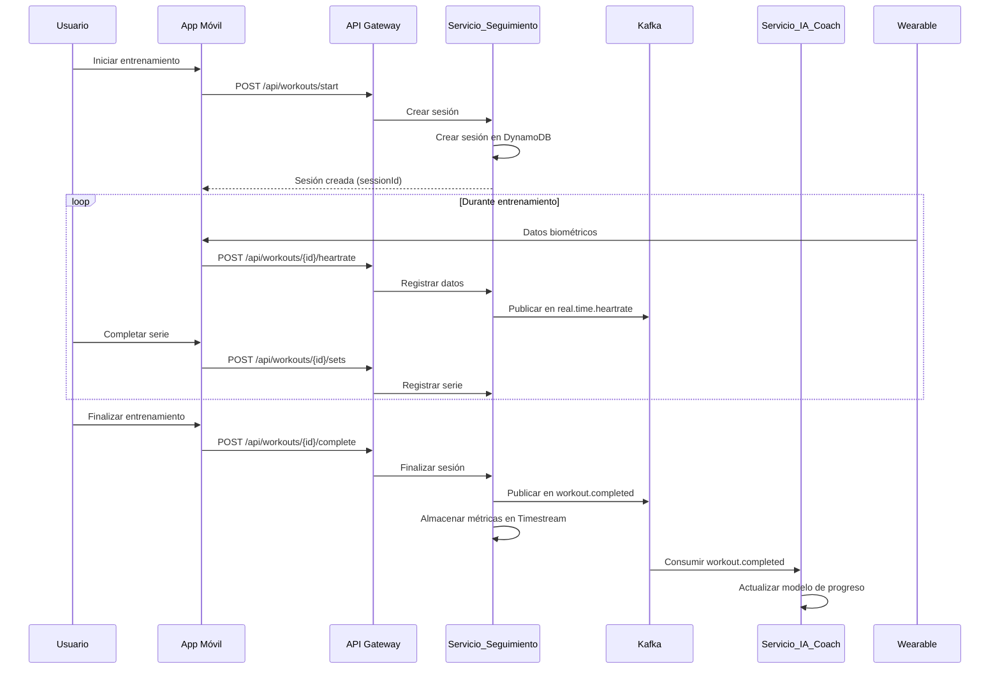

# Documento de Diseño — Spartan Golden Gym

## Visión General

Spartan Golden Gym es una plataforma integral de fitness que abarca gestión de gimnasios, entrenamiento personalizado con IA, nutrición, comunidad social, pagos y analíticas. La arquitectura se basa en microservicios desplegados en AWS EKS, comunicados mediante Kafka (Amazon MSK) para eventos asíncronos y REST/WebSocket para comunicación síncrona. El frontend se compone de una aplicación web (React 18 + TypeScript + Vite) y una aplicación móvil (React Native) con soporte offline de 72 horas.

### Decisiones de Diseño Clave

1. **Microservicios independientes**: Cada dominio de negocio (usuarios, gimnasios, entrenamiento, nutrición, pagos, social, etc.) se implementa como un microservicio Spring Boot independiente, desplegado en su propio pod de EKS.
2. **Event-driven con Kafka**: La comunicación asíncrona entre servicios se realiza mediante tópicos Kafka, permitiendo desacoplamiento y escalabilidad independiente.
3. **Base de datos por servicio (Database-per-service)**: Cada microservicio posee su propia base de datos, seleccionada según el tipo de dato (Aurora PostgreSQL para datos relacionales, DynamoDB para datos de alta velocidad, Timestream para series temporales, Neptune para grafos).
4. **API Gateway centralizado**: Todas las solicitudes pasan por un API Gateway que aplica autenticación JWT, rate limiting y enrutamiento.
5. **Offline-first en móvil**: La App_Movil almacena datos localmente y sincroniza con estrategia last-write-wins al recuperar conexión.
6. **ML como servicio**: Los modelos de IA se despliegan en SageMaker con endpoints de inferencia independientes del backend principal.

---

## Arquitectura

### Diagrama de Arquitectura de Alto Nivel

```mermaid
graph TB
    subgraph Clientes
        WEB[App Web<br/>React 18 + TS + Vite]
        MOV[App Móvil<br/>React Native]
    end

    subgraph API Layer
        GW[API Gateway<br/>Spring Cloud Gateway]
        WS[WebSocket Server<br/>Socket.io]
    end

    subgraph Microservicios
        SU[Servicio_Usuarios]
        SG[Servicio_Gimnasio]
        SE[Servicio_Entrenamiento]
        SS[Servicio_Seguimiento]
        SN[Servicio_Nutricion]
        SIA[Servicio_IA_Coach]
        SSO[Servicio_Social]
        SP[Servicio_Pagos]
        SA[Servicio_Analiticas]
        SNOT[Servicio_Notificaciones]
        SR[Servicio_Reservas]
        SM[Servicio_Mensajeria]
        SC[Servicio_Calendario]
    end

    subgraph Streaming
        KAFKA[Amazon MSK<br/>Kafka]
    end

    subgraph Bases de Datos
        PG[(Aurora PostgreSQL)]
        DDB[(DynamoDB)]
        TS[(Timestream)]
        NEP[(Neptune)]
        REDIS[(ElastiCache Redis)]
        S3[(S3 + CloudFront)]
        RS[(Redshift)]
    end

    subgraph ML
        SM_EP[SageMaker Endpoints]
        TF[TensorFlow Serving]
    end

    WEB --> GW
    MOV --> GW
    WEB --> WS
    MOV --> WS

    GW --> SU
    GW --> SG
    GW --> SE
    GW --> SS
    GW --> SN
    GW --> SIA
    GW --> SSO
    GW --> SP
    GW --> SA
    GW --> SNOT
    GW --> SR
    GW --> SM
    GW --> SC

    SU --> PG
    SU --> REDIS
    SG --> PG
    SG --> REDIS
    SE --> PG
    SS --> DDB
    SS --> TS
    SN --> PG
    SIA --> SM_EP
    SSO --> NEP
    SSO --> REDIS
    SP --> PG
    SA --> RS
    SNOT --> DDB
    SR --> PG
    SM --> DDB
    SC --> PG

    SU --> KAFKA
    SS --> KAFKA
    SN --> KAFKA
    SIA --> KAFKA
    SSO --> KAFKA
    SP --> KAFKA
    SR --> KAFKA
    SNOT --> KAFKA
```



### Diagrama de Flujo de Entrenamiento



---

## Componentes e Interfaces

### Microservicios Backend (Java 8 + Spring Boot 2.7.x)

Cada microservicio sigue la estructura estándar:
- **Controller**: Endpoints REST (Spring MVC)
- **Service**: Lógica de negocio
- **Repository**: Acceso a datos (Spring Data)
- **Event Publisher/Consumer**: Integración con Kafka (Spring Kafka)
- **DTO/Model**: Objetos de transferencia y entidades

#### 1. Servicio_Usuarios

**Responsabilidad**: Registro, autenticación, perfiles, roles y cumplimiento GDPR/LGPD.

| Endpoint | Método | Descripción |
|---|---|---|
| `/api/users/register` | POST | Registro de nuevo usuario |
| `/api/users/login` | POST | Autenticación, retorna JWT |
| `/api/users/profile` | GET/PUT | Consulta/actualización de perfil |
| `/api/users/profile/delete` | DELETE | Solicitud de eliminación GDPR |
| `/api/users/data-export` | POST | Exportación de datos (portabilidad) |
| `/api/users/mfa/setup` | POST | Configuración de MFA |
| `/api/users/onboarding` | GET/POST | Flujo de onboarding y evaluación |

**Dependencias**: Aurora PostgreSQL, Cache_Redis (sesiones JWT, bloqueo de cuentas), Kafka (eventos de usuario), Amazon SES (correo verificación).

#### 2. Servicio_Gimnasio

**Responsabilidad**: Gestión de gimnasios, ubicaciones, equipamiento y ocupación.

| Endpoint | Método | Descripción |
|---|---|---|
| `/api/gyms` | POST/GET | Crear/listar gimnasios |
| `/api/gyms/{id}` | GET/PUT | Detalle/actualización de gimnasio |
| `/api/gyms/nearby` | GET | Búsqueda por geolocalización |
| `/api/gyms/{id}/checkin` | POST | Check-in por QR |
| `/api/gyms/{id}/occupancy` | GET | Ocupación actual |
| `/api/gyms/{id}/equipment` | GET/PUT | Inventario de equipamiento |

**Dependencias**: Aurora PostgreSQL, Cache_Redis (geofences, ocupación), Kafka (gym.occupancy).

#### 3. Servicio_Entrenamiento

**Responsabilidad**: Planes de entrenamiento, rutinas, ejercicios y asignación por entrenadores.

| Endpoint | Método | Descripción |
|---|---|---|
| `/api/training/plans` | POST/GET | Crear/listar planes |
| `/api/training/plans/{id}` | GET/PUT/DELETE | CRUD de plan |
| `/api/training/plans/{id}/assign` | POST | Asignar plan a cliente |
| `/api/training/exercises` | GET | Catálogo de ejercicios |
| `/api/training/routines` | POST/GET | Gestión de rutinas |

**Dependencias**: Aurora PostgreSQL, Servicio_IA_Coach (generación de planes).

#### 4. Servicio_Seguimiento

**Responsabilidad**: Seguimiento en tiempo real de entrenamientos, datos biométricos y wearables.

| Endpoint | Método | Descripción |
|---|---|---|
| `/api/workouts/start` | POST | Iniciar sesión de entrenamiento |
| `/api/workouts/{id}/sets` | POST | Registrar serie completada |
| `/api/workouts/{id}/heartrate` | POST | Registrar frecuencia cardíaca |
| `/api/workouts/{id}/complete` | POST | Finalizar entrenamiento |
| `/api/workouts/history` | GET | Historial de entrenamientos |
| `/api/workouts/progress` | GET | Métricas de progreso |
| `/api/wearables/connect` | POST | Conectar wearable |
| `/api/wearables/sync` | POST | Sincronizar datos pendientes |

**Dependencias**: DynamoDB (sesiones), Timestream (métricas), Kafka (workout.completed, real.time.heartrate), Cache_Redis (sesiones activas).

#### 5. Servicio_Nutricion

**Responsabilidad**: Planes nutricionales, base de datos de alimentos, seguimiento de macros y recetas.

| Endpoint | Método | Descripción |
|---|---|---|
| `/api/nutrition/plans` | POST/GET | Planes nutricionales |
| `/api/nutrition/meals` | POST | Registrar comida |
| `/api/nutrition/daily-balance` | GET | Balance diario de macros |
| `/api/nutrition/foods` | GET | Base de datos de alimentos |
| `/api/nutrition/foods/barcode/{code}` | GET | Búsqueda por código de barras |
| `/api/nutrition/recipes` | GET | Recetas recomendadas |
| `/api/nutrition/supplements` | GET | Información de suplementos |

**Dependencias**: Aurora PostgreSQL, Kafka (nutrition.logs).

#### 6. Servicio_IA_Coach

**Responsabilidad**: Generación de planes personalizados, recomendaciones de ejercicios, detección de sobreentrenamiento.

| Endpoint | Método | Descripción |
|---|---|---|
| `/api/ai/plans/generate` | POST | Generar plan personalizado |
| `/api/ai/recommendations` | POST | Recomendación de ejercicio |
| `/api/ai/overtraining/check` | POST | Verificar sobreentrenamiento |
| `/api/ai/alternatives` | POST | Ejercicios alternativos |
| `/api/ai/warmup` | POST | Recomendación de calentamiento |
| `/api/ai/adherence/predict` | POST | Predicción de adherencia |

**Dependencias**: SageMaker Endpoints, Neptune (grafo de ejercicios), Kafka (ai.recommendations.request), Timestream (datos biométricos).

#### 7. Servicio_Social

**Responsabilidad**: Comunidad, desafíos, rankings, logros e interacciones sociales.

| Endpoint | Método | Descripción |
|---|---|---|
| `/api/social/challenges` | POST/GET | Crear/listar desafíos |
| `/api/social/achievements` | GET | Logros del usuario |
| `/api/social/rankings` | GET | Rankings por categoría |
| `/api/social/share` | POST | Compartir logro |
| `/api/social/groups` | POST/GET | Grupos de entrenamiento |
| `/api/social/interactions` | POST | Registrar interacción |

**Dependencias**: Neptune (relaciones sociales), Cache_Redis (rankings), Kafka (user.achievements, social.interactions), WebSocket (sincronización en vivo).

#### 8. Servicio_Pagos

**Responsabilidad**: Suscripciones, membresías, pagos y donaciones.

| Endpoint | Método | Descripción |
|---|---|---|
| `/api/payments/subscribe` | POST | Suscribirse a plan |
| `/api/payments/transactions` | GET | Historial de transacciones |
| `/api/payments/refund` | POST | Solicitar reembolso |
| `/api/payments/donations` | POST | Realizar donación |
| `/api/payments/methods` | GET/POST/DELETE | Métodos de pago |

**Dependencias**: Aurora PostgreSQL, Stripe SDK, Adyen SDK, PayPal SDK, Kafka (eventos de pago).

#### 9. Servicio_Notificaciones

**Responsabilidad**: Envío multicanal (push, email, SMS), preferencias y programación.

| Endpoint | Método | Descripción |
|---|---|---|
| `/api/notifications/preferences` | GET/PUT | Preferencias del usuario |
| `/api/notifications/history` | GET | Historial de notificaciones |
| `/api/notifications/schedule` | POST | Programar notificación |

**Dependencias**: Firebase Cloud Messaging, Amazon SES, Amazon SNS, DynamoDB (estado de entrega), Kafka (consumidor de múltiples tópicos).

#### 10. Servicio_Reservas

**Responsabilidad**: Clases grupales, listas de espera, disponibilidad de entrenadores.

| Endpoint | Método | Descripción |
|---|---|---|
| `/api/bookings/classes` | GET | Listar clases disponibles |
| `/api/bookings/classes/{id}/reserve` | POST | Reservar clase |
| `/api/bookings/classes/{id}/cancel` | POST | Cancelar reserva |
| `/api/bookings/classes` | POST | Crear clase (admin) |
| `/api/bookings/trainers/{id}/availability` | GET/PUT | Disponibilidad del entrenador |
| `/api/bookings/waitlist/{classId}` | GET | Estado de lista de espera |

**Dependencias**: Aurora PostgreSQL, Kafka (bookings.events), Servicio_Notificaciones.

#### 11. Servicio_Mensajeria

**Responsabilidad**: Chat directo, chat grupal, entrega de mensajes en tiempo real.

| Endpoint | Método | Descripción |
|---|---|---|
| `/api/messages/conversations` | GET | Listar conversaciones |
| `/api/messages/conversations/{id}` | GET | Historial de conversación |
| `/api/messages/send` | POST | Enviar mensaje |
| `/ws/chat` | WebSocket | Canal de chat en tiempo real |

**Dependencias**: DynamoDB (historial), WebSocket (entrega en tiempo real), Servicio_Notificaciones (push offline), S3 (archivos multimedia).

#### 12. Servicio_Calendario

**Responsabilidad**: Consolidación de horarios, sincronización con calendarios externos.

| Endpoint | Método | Descripción |
|---|---|---|
| `/api/calendar/events` | GET/POST | Eventos del usuario |
| `/api/calendar/events/{id}` | PUT/DELETE | Modificar/eliminar evento |
| `/api/calendar/sync` | POST | Sincronizar con calendario externo |
| `/api/calendar/conflicts` | GET | Detectar conflictos |

**Dependencias**: Aurora PostgreSQL, Google Calendar API, Apple Calendar API, Outlook Calendar API, Servicio_Notificaciones.

#### 13. Servicio_Analiticas

**Responsabilidad**: Métricas de negocio, dashboards, reportes automáticos.

| Endpoint | Método | Descripción |
|---|---|---|
| `/api/analytics/dashboard` | GET | Datos del dashboard |
| `/api/analytics/reports` | GET | Reportes generados |
| `/api/analytics/metrics` | GET | Métricas en tiempo real |

**Dependencias**: Amazon Redshift, Amazon QuickSight, Amazon CloudWatch, Kafka (consumidor de múltiples tópicos).

### API Gateway

**Tecnología**: Spring Cloud Gateway

**Funcionalidades**:
- Enrutamiento a microservicios por prefijo de ruta
- Validación de JWT en cada solicitud
- Rate limiting: 1000 req/min por usuario autenticado, 100 req/min por IP no autenticada (implementado con Redis)
- Circuit breaker (Resilience4j) para tolerancia a fallos
- Trazabilidad distribuida con AWS X-Ray

### Frontend Web (React 18 + TypeScript + Vite)

**Estructura de módulos**:
- `auth/` — Login, registro, MFA
- `dashboard/` — Dashboard personalizado
- `training/` — Planes, rutinas, seguimiento
- `nutrition/` — Planes nutricionales, registro de comidas
- `social/` — Comunidad, desafíos, rankings
- `gym/` — Mapa de gimnasios, ocupación
- `payments/` — Suscripciones, donaciones
- `calendar/` — Calendario unificado
- `messages/` — Chat y mensajería
- `trainer/` — Panel de entrenador
- `analytics/` — Panel de analíticas (admin)
- `settings/` — Configuración, preferencias, i18n

**Librerías clave**: Material-UI, Tailwind CSS, Redux Toolkit, RTK Query, Socket.io-client, Recharts, Victory, Mapbox GL JS, Video.js, react-i18next.

### Frontend Móvil (React Native)

**Estructura similar a la web** con módulos adicionales:
- `offline/` — Almacenamiento local y sincronización
- `wearables/` — Integración HealthKit/Google Fit/Huawei Health
- `camera/` — Escaneo QR, fotos de progreso, análisis de forma
- `barcode/` — Escaneo de códigos de barras de alimentos

**Librerías clave**: AsyncStorage/SQLite (offline), react-native-health, react-native-camera, react-native-maps (Mapbox), Firebase Cloud Messaging.

---

## Modelos de Datos

### Aurora PostgreSQL (Datos Relacionales)

```sql
-- Servicio_Usuarios
CREATE TABLE users (
    id UUID PRIMARY KEY DEFAULT gen_random_uuid(),
    email VARCHAR(255) UNIQUE NOT NULL,
    password_hash VARCHAR(255) NOT NULL,
    name VARCHAR(255) NOT NULL,
    date_of_birth DATE NOT NULL,
    role VARCHAR(20) NOT NULL CHECK (role IN ('client', 'trainer', 'admin')),
    locale VARCHAR(10) DEFAULT 'es',
    mfa_enabled BOOLEAN DEFAULT FALSE,
    mfa_secret VARCHAR(255),
    account_locked_until TIMESTAMP,
    failed_login_attempts INT DEFAULT 0,
    onboarding_completed BOOLEAN DEFAULT FALSE,
    profile_photo_url VARCHAR(500),
    fitness_goals JSONB,
    medical_conditions JSONB,
    created_at TIMESTAMP DEFAULT NOW(),
    updated_at TIMESTAMP DEFAULT NOW(),
    deleted_at TIMESTAMP -- soft delete para GDPR
);

-- Servicio_Gimnasio
CREATE TABLE gyms (
    id UUID PRIMARY KEY DEFAULT gen_random_uuid(),
    chain_id UUID REFERENCES gym_chains(id),
    name VARCHAR(255) NOT NULL,
    address TEXT NOT NULL,
    latitude DECIMAL(10, 8) NOT NULL,
    longitude DECIMAL(11, 8) NOT NULL,
    operating_hours JSONB NOT NULL,
    max_capacity INT NOT NULL,
    created_at TIMESTAMP DEFAULT NOW()
);

CREATE TABLE gym_equipment (
    id UUID PRIMARY KEY DEFAULT gen_random_uuid(),
    gym_id UUID REFERENCES gyms(id),
    name VARCHAR(255) NOT NULL,
    category VARCHAR(100) NOT NULL,
    quantity INT NOT NULL,
    status VARCHAR(20) DEFAULT 'available'
);

CREATE TABLE gym_checkins (
    id UUID PRIMARY KEY DEFAULT gen_random_uuid(),
    gym_id UUID REFERENCES gyms(id),
    user_id UUID NOT NULL,
    checked_in_at TIMESTAMP DEFAULT NOW(),
    checked_out_at TIMESTAMP
);

-- Servicio_Entrenamiento
CREATE TABLE training_plans (
    id UUID PRIMARY KEY DEFAULT gen_random_uuid(),
    user_id UUID NOT NULL,
    trainer_id UUID,
    name VARCHAR(255) NOT NULL,
    description TEXT,
    ai_generated BOOLEAN DEFAULT FALSE,
    status VARCHAR(20) DEFAULT 'active',
    created_at TIMESTAMP DEFAULT NOW()
);

CREATE TABLE routines (
    id UUID PRIMARY KEY DEFAULT gen_random_uuid(),
    plan_id UUID REFERENCES training_plans(id),
    name VARCHAR(255) NOT NULL,
    day_of_week INT,
    sort_order INT
);

CREATE TABLE exercises (
    id UUID PRIMARY KEY DEFAULT gen_random_uuid(),
    name VARCHAR(255) NOT NULL,
    muscle_groups JSONB NOT NULL,
    equipment_required JSONB,
    difficulty VARCHAR(20),
    video_url VARCHAR(500),
    instructions TEXT
);

CREATE TABLE routine_exercises (
    id UUID PRIMARY KEY DEFAULT gen_random_uuid(),
    routine_id UUID REFERENCES routines(id),
    exercise_id UUID REFERENCES exercises(id),
    sets INT NOT NULL,
    reps VARCHAR(50),
    rest_seconds INT,
    sort_order INT
);

-- Servicio_Nutricion
CREATE TABLE nutrition_plans (
    id UUID PRIMARY KEY DEFAULT gen_random_uuid(),
    user_id UUID NOT NULL,
    goal VARCHAR(50) NOT NULL,
    daily_calories INT,
    protein_grams INT,
    carbs_grams INT,
    fat_grams INT,
    created_at TIMESTAMP DEFAULT NOW()
);

CREATE TABLE foods (
    id UUID PRIMARY KEY DEFAULT gen_random_uuid(),
    name VARCHAR(255) NOT NULL,
    barcode VARCHAR(50),
    calories_per_100g DECIMAL(8,2),
    protein_per_100g DECIMAL(8,2),
    carbs_per_100g DECIMAL(8,2),
    fat_per_100g DECIMAL(8,2),
    micronutrients JSONB,
    region VARCHAR(50)
);

CREATE TABLE meal_logs (
    id UUID PRIMARY KEY DEFAULT gen_random_uuid(),
    user_id UUID NOT NULL,
    food_id UUID REFERENCES foods(id),
    quantity_grams DECIMAL(8,2) NOT NULL,
    meal_type VARCHAR(20) NOT NULL,
    logged_at TIMESTAMP DEFAULT NOW()
);

-- Servicio_Pagos
CREATE TABLE subscriptions (
    id UUID PRIMARY KEY DEFAULT gen_random_uuid(),
    user_id UUID NOT NULL,
    plan_type VARCHAR(50) NOT NULL,
    status VARCHAR(20) NOT NULL,
    payment_provider VARCHAR(20) NOT NULL,
    external_subscription_id VARCHAR(255),
    started_at TIMESTAMP NOT NULL,
    expires_at TIMESTAMP,
    retry_count INT DEFAULT 0
);

CREATE TABLE transactions (
    id UUID PRIMARY KEY DEFAULT gen_random_uuid(),
    user_id UUID NOT NULL,
    subscription_id UUID REFERENCES subscriptions(id),
    amount DECIMAL(10,2) NOT NULL,
    currency VARCHAR(3) NOT NULL,
    type VARCHAR(20) NOT NULL,
    status VARCHAR(20) NOT NULL,
    payment_provider VARCHAR(20) NOT NULL,
    external_transaction_id VARCHAR(255),
    created_at TIMESTAMP DEFAULT NOW()
);

CREATE TABLE donations (
    id UUID PRIMARY KEY DEFAULT gen_random_uuid(),
    donor_id UUID NOT NULL,
    creator_id UUID NOT NULL,
    amount DECIMAL(10,2) NOT NULL,
    currency VARCHAR(3) NOT NULL,
    message TEXT,
    paypal_transaction_id VARCHAR(255),
    created_at TIMESTAMP DEFAULT NOW()
);

-- Servicio_Reservas
CREATE TABLE group_classes (
    id UUID PRIMARY KEY DEFAULT gen_random_uuid(),
    gym_id UUID NOT NULL,
    instructor_id UUID NOT NULL,
    name VARCHAR(255) NOT NULL,
    room VARCHAR(100),
    max_capacity INT NOT NULL,
    current_capacity INT DEFAULT 0,
    difficulty_level VARCHAR(20),
    scheduled_at TIMESTAMP NOT NULL,
    duration_minutes INT NOT NULL
);

CREATE TABLE class_reservations (
    id UUID PRIMARY KEY DEFAULT gen_random_uuid(),
    class_id UUID REFERENCES group_classes(id),
    user_id UUID NOT NULL,
    status VARCHAR(20) DEFAULT 'confirmed',
    penalty_count INT DEFAULT 0,
    reserved_at TIMESTAMP DEFAULT NOW(),
    cancelled_at TIMESTAMP
);

CREATE TABLE waitlist (
    id UUID PRIMARY KEY DEFAULT gen_random_uuid(),
    class_id UUID REFERENCES group_classes(id),
    user_id UUID NOT NULL,
    position INT NOT NULL,
    added_at TIMESTAMP DEFAULT NOW()
);

CREATE TABLE trainer_availability (
    id UUID PRIMARY KEY DEFAULT gen_random_uuid(),
    trainer_id UUID NOT NULL,
    day_of_week INT NOT NULL,
    start_time TIME NOT NULL,
    end_time TIME NOT NULL
);

-- Servicio_Calendario
CREATE TABLE calendar_events (
    id UUID PRIMARY KEY DEFAULT gen_random_uuid(),
    user_id UUID NOT NULL,
    event_type VARCHAR(30) NOT NULL,
    reference_id UUID,
    title VARCHAR(255) NOT NULL,
    starts_at TIMESTAMP NOT NULL,
    ends_at TIMESTAMP NOT NULL,
    reminder_minutes INT DEFAULT 30,
    external_calendar_id VARCHAR(255),
    created_at TIMESTAMP DEFAULT NOW()
);

-- Auditoría
CREATE TABLE audit_log (
    id BIGSERIAL PRIMARY KEY,
    user_id UUID,
    action VARCHAR(100) NOT NULL,
    resource_type VARCHAR(100) NOT NULL,
    resource_id VARCHAR(255),
    details JSONB,
    ip_address VARCHAR(45),
    created_at TIMESTAMP DEFAULT NOW()
);
```

### DynamoDB (Datos de Alta Velocidad)

```
Tabla: workout_sessions
  PK: userId (String)
  SK: sessionId (String)
  Atributos: startedAt, completedAt, exercises[], totalDuration, caloriesBurned, status

Tabla: workout_sets
  PK: sessionId (String)
  SK: setId (String)
  Atributos: exerciseId, weight, reps, restSeconds, timestamp

Tabla: user_achievements
  PK: userId (String)
  SK: achievementId (String)
  Atributos: type, name, earnedAt, metadata

Tabla: user_preferences
  PK: userId (String)
  SK: preferenceKey (String)
  Atributos: value, updatedAt

Tabla: messages
  PK: conversationId (String)
  SK: messageId (String)
  Atributos: senderId, content, contentType, status, sentAt, readAt

Tabla: conversations
  PK: userId (String)
  SK: conversationId (String)
  Atributos: participantIds, type, lastMessageAt, unreadCount

Tabla: notification_delivery
  PK: userId (String)
  SK: notificationId (String)
  Atributos: channel, status, content, sentAt, readAt, retryCount
```

### Timestream (Series Temporales)

```
Base de datos: spartan_metrics

Tabla: heartrate_data
  Dimensiones: userId, sessionId, deviceType
  Medidas: bpm (BIGINT), timestamp

Tabla: workout_metrics
  Dimensiones: userId, exerciseId, muscleGroup
  Medidas: weight, reps, volume, duration, timestamp

Tabla: biometric_data
  Dimensiones: userId, dataType, source
  Medidas: value (DOUBLE), timestamp

Tabla: performance_metrics
  Dimensiones: serviceId, endpoint, method
  Medidas: latency, statusCode, timestamp
```

### Neptune (Grafo)

```
Nodos:
  - User (id, name)
  - Exercise (id, name, muscleGroups)
  - MuscleGroup (id, name)
  - Challenge (id, name)
  - Group (id, name)

Aristas:
  - User -[FOLLOWS]-> User
  - User -[FRIEND_OF]-> User
  - User -[MEMBER_OF]-> Group
  - User -[COMPLETED]-> Exercise (weight, reps, date)
  - User -[PARTICIPATES_IN]-> Challenge
  - Exercise -[TARGETS]-> MuscleGroup
  - Exercise -[ALTERNATIVE_TO]-> Exercise
```

### Redis (Cache)

```
Claves:
  session:{userId}          -> JWT token data (TTL: configurable)
  lockout:{email}           -> intentos fallidos (TTL: 15 min)
  ranking:{category}        -> Sorted Set con scores
  geofence:gyms             -> GeoSet con coordenadas de gimnasios
  occupancy:{gymId}         -> INT con ocupación actual
  ratelimit:{userId}        -> Contador de solicitudes (TTL: 60s)
  ratelimit:ip:{ip}         -> Contador de solicitudes IP (TTL: 60s)
  plan:active:{userId}      -> Plan de entrenamiento activo en caché
  class:capacity:{classId}  -> Capacidad disponible de clase
```

### Tópicos Kafka

| Tópico | Particiones | Retención | Productores | Consumidores |
|---|---|---|---|---|
| workout.completed | 20 | 7d | Servicio_Seguimiento | Servicio_IA_Coach, Servicio_Social, Servicio_Analiticas |
| user.achievements | 10 | 7d | Servicio_Social | Servicio_Notificaciones, Servicio_Analiticas |
| real.time.heartrate | 50 | 24h | Servicio_Seguimiento | Servicio_IA_Coach (sobreentrenamiento) |
| ai.recommendations.request | 15 | 7d | Servicio_IA_Coach | Servicio_Analiticas |
| social.interactions | 20 | 7d | Servicio_Social | Servicio_Analiticas |
| nutrition.logs | 20 | 7d | Servicio_Nutricion | Servicio_IA_Coach, Servicio_Analiticas |
| gym.occupancy | 10 | 24h | Servicio_Gimnasio | App_Web, App_Movil (vía WebSocket) |
| bookings.events | 10 | 7d | Servicio_Reservas | Servicio_Calendario, Servicio_Notificaciones |

---

## Propiedades de Corrección

*Una propiedad es una característica o comportamiento que debe mantenerse verdadero en todas las ejecuciones válidas de un sistema — esencialmente, una declaración formal sobre lo que el sistema debe hacer. Las propiedades sirven como puente entre especificaciones legibles por humanos y garantías de corrección verificables por máquinas.*

### Propiedad 1: Round-trip de registro y autenticación

*Para cualquier* conjunto válido de datos de usuario (nombre, email, contraseña, fecha de nacimiento), registrar al usuario y luego autenticarse con las mismas credenciales debe retornar un token JWT válido, y el perfil recuperado debe contener los mismos datos proporcionados en el registro.

**Valida: Requisitos 1.1, 1.4**

### Propiedad 2: Unicidad de email en registro

*Para cualquier* email ya registrado en el sistema, un intento de registro con el mismo email debe ser rechazado y el número total de usuarios no debe cambiar.

**Valida: Requisito 1.2**

### Propiedad 3: Bloqueo de cuenta por intentos fallidos

*Para cualquier* usuario registrado, después de exactamente 5 intentos de login con contraseña incorrecta, el siguiente intento (incluso con credenciales correctas) debe ser rechazado durante 15 minutos.

**Valida: Requisito 1.5**

### Propiedad 4: Round-trip de actualización de perfil

*Para cualquier* usuario y cualquier conjunto válido de datos de perfil (foto, datos personales, objetivos, condiciones médicas), actualizar el perfil y luego consultarlo debe retornar los mismos datos actualizados.

**Valida: Requisito 1.6**

### Propiedad 5: Cifrado de contraseñas con bcrypt

*Para cualquier* contraseña almacenada en el sistema, el hash debe ser un hash bcrypt válido con un factor de coste mínimo de 12.

**Valida: Requisito 1.7**

### Propiedad 6: Eliminación de datos personales (GDPR)

*Para cualquier* usuario que solicite la eliminación de su cuenta, después de procesar la solicitud, los datos personales y biométricos del usuario no deben ser recuperables mediante ninguna consulta al sistema.

**Valida: Requisito 1.8**

### Propiedad 7: Round-trip de registro de gimnasio

*Para cualquier* conjunto válido de datos de gimnasio (nombre, dirección, coordenadas, horarios, equipamiento), registrar el gimnasio y luego consultarlo debe retornar los mismos datos, incluyendo la asociación correcta a su cadena.

**Valida: Requisitos 2.1, 2.2**

### Propiedad 8: Ordenamiento por distancia en búsqueda de gimnasios cercanos

*Para cualquier* ubicación de usuario y conjunto de gimnasios registrados, la consulta de gimnasios cercanos debe retornar resultados ordenados de menor a mayor distancia desde la ubicación del usuario.

**Valida: Requisito 2.3**

### Propiedad 9: Check-in verifica membresía activa

*Para cualquier* usuario con membresía activa, el check-in por QR debe ser exitoso. *Para cualquier* usuario sin membresía activa, el check-in debe ser rechazado.

**Valida: Requisito 2.4**

### Propiedad 10: Round-trip de inventario de equipamiento

*Para cualquier* actualización de inventario de equipamiento de un gimnasio, consultar el catálogo después de la actualización debe reflejar los cambios realizados.

**Valida: Requisito 2.6**

### Propiedad 11: Plan de entrenamiento respeta condiciones médicas

*Para cualquier* usuario con condiciones médicas declaradas (problemas de espalda, trombosis, diabetes, etc.), el plan generado por el Servicio_IA_Coach no debe incluir ejercicios contraindicados para esas condiciones.

**Valida: Requisitos 3.1, 3.2**

### Propiedad 12: Calentamiento incluido en rutinas

*Para cualquier* rutina generada por el Servicio_IA_Coach, debe incluir ejercicios de calentamiento previos apropiados al tipo de ejercicio planificado.

**Valida: Requisito 3.5**

### Propiedad 13: Ejercicios alternativos para mismo grupo muscular

*Para cualquier* ejercicio que requiere equipamiento no disponible, las alternativas sugeridas por el Servicio_IA_Coach deben trabajar los mismos grupos musculares que el ejercicio original.

**Valida: Requisito 3.6**

### Propiedad 14: Rutinas sin equipamiento cuando no hay acceso

*Para cualquier* usuario que indica no tener acceso a equipamiento, todos los ejercicios en el plan generado deben tener `equipment_required` vacío o nulo.

**Valida: Requisito 3.9**

### Propiedad 15: Detección de sobreentrenamiento genera alerta

*Para cualquier* conjunto de datos biométricos que indique sobreentrenamiento (frecuencia cardíaca en reposo elevada, disminución de rendimiento, fatiga acumulada), el Servicio_IA_Coach debe generar una recomendación de descanso.

**Valida: Requisitos 3.3, 18.3**

### Propiedad 16: Progresión automática de carga

*Para cualquier* usuario con historial de rendimiento consistente (completando series con el peso asignado), el siguiente plan generado debe incluir un incremento en carga o volumen respecto al plan anterior.

**Valida: Requisito 3.8**

### Propiedad 17: Round-trip de sesión de entrenamiento

*Para cualquier* usuario que inicia un entrenamiento, registra series (peso, repeticiones, descanso) y finaliza la sesión, el historial debe contener la sesión completa con todos los datos registrados.

**Valida: Requisitos 4.1, 4.3, 4.6**

### Propiedad 18: Métricas de rendimiento almacenadas en Timestream

*Para cualquier* sesión de entrenamiento completada, las métricas de rendimiento deben ser consultables en Timestream con los valores correctos.

**Valida: Requisito 4.9**

### Propiedad 19: Balance diario de macronutrientes es suma de comidas

*Para cualquier* secuencia de comidas registradas en un día, el balance diario de calorías y macronutrientes debe ser igual a la suma de los valores nutricionales de todas las comidas registradas.

**Valida: Requisito 5.4**

### Propiedad 20: Alimentos en base de datos tienen información nutricional completa

*Para cualquier* alimento en la base de datos, debe tener valores no nulos para calorías, proteínas, carbohidratos y grasas.

**Valida: Requisito 5.2**

### Propiedad 21: Round-trip de búsqueda por código de barras

*Para cualquier* alimento con código de barras registrado, escanear ese código debe retornar la información nutricional correcta del producto.

**Valida: Requisito 5.3**

### Propiedad 22: Recetas recomendadas respetan objetivos y preferencias

*Para cualquier* usuario con objetivos nutricionales y preferencias alimentarias, las recetas recomendadas deben estar dentro de los rangos de macronutrientes del plan y no contener ingredientes excluidos por las preferencias.

**Valida: Requisito 5.5**

### Propiedad 23: Notificación por déficit/exceso de macros tras 3 días

*Para cualquier* usuario con 3 días consecutivos de déficit o exceso significativo de macronutrientes, el sistema debe generar una notificación con recomendaciones de ajuste.

**Valida: Requisito 5.7**

### Propiedad 24: Rankings ordenados correctamente por categoría

*Para cualquier* categoría de ranking (fuerza, resistencia, consistencia, nutrición) y conjunto de puntuaciones de usuarios, el ranking debe estar ordenado de mayor a menor puntuación.

**Valida: Requisito 6.3**

### Propiedad 25: Insignia otorgada al completar desafío

*Para cualquier* usuario que cumple todos los objetivos de un desafío, debe recibir la insignia correspondiente y el evento debe ser publicado.

**Valida: Requisito 6.2**

### Propiedad 26: Relaciones sociales persistidas en grafo

*Para cualquier* relación social creada (seguir, amistad, membresía de grupo), la relación debe ser consultable en el grafo de Neptune.

**Valida: Requisito 6.7**

### Propiedad 27: Suscripción activada tras pago exitoso

*Para cualquier* pago de suscripción procesado exitosamente, la membresía del usuario debe estar activa y la transacción registrada con auditoría completa.

**Valida: Requisitos 7.2, 7.5**

### Propiedad 28: Reintento de pago fallido y suspensión

*Para cualquier* pago recurrente que falla, el sistema debe reintentar hasta 3 veces. Si los 3 reintentos fallan, la membresía debe ser suspendida.

**Valida: Requisitos 7.3, 7.4**

### Propiedad 29: Reembolso dentro del período de garantía

*Para cualquier* solicitud de reembolso dentro del período de garantía, el reembolso debe ser procesado y la membresía actualizada. *Para cualquier* solicitud fuera del período, debe ser rechazada.

**Valida: Requisito 7.7**

### Propiedad 30: Round-trip de datos de wearable

*Para cualquier* dato biométrico sincronizado desde un wearable (frecuencia cardíaca, pasos, calorías, sueño), los datos deben ser almacenados y consultables con los valores correctos.

**Valida: Requisitos 8.2, 8.3**

### Propiedad 31: Sincronización offline preserva datos

*Para cualquier* conjunto de datos registrados offline (entrenamientos, series, repeticiones), al recuperar conexión y sincronizar, todos los datos deben estar presentes en el backend en orden cronológico.

**Valida: Requisitos 9.1, 9.2, 9.4**

### Propiedad 32: Resolución de conflictos last-write-wins

*Para cualquier* par de escrituras conflictivas (una offline y una online) sobre el mismo recurso, la sincronización debe preservar la escritura con timestamp más reciente.

**Valida: Requisito 9.4**

### Propiedad 33: Entrenador asigna y modifica planes de clientes

*Para cualquier* entrenador y cliente asignado, el entrenador debe poder crear un plan, asignarlo al cliente, y el cliente debe poder consultar el plan asignado con todos los datos correctos.

**Valida: Requisitos 10.2, 10.5**

### Propiedad 34: Notificación al entrenador cuando cliente completa entrenamiento

*Para cualquier* cliente con entrenador asignado que completa un entrenamiento, el entrenador debe recibir una notificación con el resumen de la sesión.

**Valida: Requisito 10.3**

### Propiedad 35: API Gateway aplica rate limiting

*Para cualquier* usuario autenticado que excede 1000 solicitudes por minuto, las solicitudes adicionales deben ser rechazadas con código 429. *Para cualquier* IP no autenticada que excede 100 solicitudes por minuto, las solicitudes deben ser rechazadas.

**Valida: Requisitos 11.1, 13.6**

### Propiedad 36: Circuit breaker activa ante fallo de microservicio

*Para cualquier* microservicio que falla, el circuit breaker debe activarse y las solicitudes deben ser redirigidas a instancias saludables sin pérdida de datos.

**Valida: Requisito 11.6**

### Propiedad 37: MFA requerido cuando está habilitado

*Para cualquier* usuario con MFA habilitado, el login con solo usuario y contraseña debe ser insuficiente — se debe requerir el segundo factor para completar la autenticación.

**Valida: Requisito 13.2**

### Propiedad 38: Exportación de datos del usuario (portabilidad)

*Para cualquier* usuario que solicita exportación de datos, el archivo generado debe contener todos los datos personales, entrenamientos, nutrición y datos biométricos del usuario.

**Valida: Requisito 13.4**

### Propiedad 39: Log de auditoría inmutable para datos sensibles

*Para cualquier* acceso o modificación a datos sensibles, debe existir una entrada en el log de auditoría con usuario, acción, recurso, timestamp e IP.

**Valida: Requisito 13.5**

### Propiedad 40: Traducciones completas para todos los idiomas soportados

*Para cualquier* clave de traducción en el idioma base, debe existir una traducción correspondiente en cada uno de los 5 idiomas soportados (inglés, español, francés, alemán, japonés).

**Valida: Requisitos 14.1, 14.2**

### Propiedad 41: Formato de fecha, hora, moneda y unidades según locale

*Para cualquier* locale configurado, las fechas, horas, monedas y unidades de medida deben formatearse según las convenciones de esa región.

**Valida: Requisito 14.3**

### Propiedad 42: Videos de ejercicios vinculados a planes

*Para cualquier* ejercicio en un plan de entrenamiento que tiene video tutorial, la URL del video debe estar presente y ser accesible.

**Valida: Requisito 15.2**

### Propiedad 43: Notificaciones respetan preferencias del usuario

*Para cualquier* evento que genera una notificación, el sistema debe respetar las preferencias del usuario por categoría y canal. Si el usuario ha deshabilitado una categoría o canal, la notificación no debe ser enviada por ese medio.

**Valida: Requisitos 22.1, 22.3, 22.5**

### Propiedad 44: Retención de notificaciones durante horas silenciosas

*Para cualquier* notificación no urgente generada durante las horas silenciosas del usuario, la notificación debe ser retenida y entregada al finalizar el período silencioso.

**Valida: Requisito 22.4**

### Propiedad 45: Round-trip de estado de entrega de notificaciones

*Para cualquier* notificación enviada, su estado de entrega (enviada, recibida, leída, fallida) debe ser rastreable y consultable.

**Valida: Requisito 22.6**

### Propiedad 46: Reintento de notificación push fallida

*Para cualquier* notificación push que falla en la entrega, el sistema debe reintentar hasta 3 veces con intervalos exponenciales.

**Valida: Requisito 22.7**

### Propiedad 47: Reserva de clase decrementa capacidad

*Para cualquier* clase grupal con disponibilidad, al confirmar una reserva, la capacidad disponible debe decrementarse en exactamente 1. La capacidad nunca debe ser negativa.

**Valida: Requisito 23.2**

### Propiedad 48: Lista de espera cuando clase está llena

*Para cualquier* clase grupal que ha alcanzado su capacidad máxima, un intento de reserva debe agregar al usuario a la lista de espera con la posición correcta.

**Valida: Requisito 23.3**

### Propiedad 49: Cancelación con anticipación libera cupo para lista de espera

*Para cualquier* cancelación de reserva con al menos 2 horas de anticipación, el cupo debe liberarse y ofrecerse al primer usuario en la lista de espera.

**Valida: Requisito 23.4**

### Propiedad 50: Penalización por cancelación tardía

*Para cualquier* cancelación de reserva con menos de 2 horas de anticipación, se debe registrar una penalización en el perfil del usuario.

**Valida: Requisito 23.5**

### Propiedad 51: Filtrado de clases respeta todos los criterios

*Para cualquier* combinación de filtros (tipo, instructor, horario, dificultad, ubicación), todas las clases retornadas deben cumplir con todos los filtros aplicados simultáneamente.

**Valida: Requisito 23.7**

### Propiedad 52: Alerta de baja ocupación 24h antes de clase

*Para cualquier* clase grupal con menos del 50% de ocupación a 24 horas de su inicio, el sistema debe generar una alerta al administrador del gimnasio.

**Valida: Requisito 23.9**

### Propiedad 53: Onboarding completo genera perfil activo y primer plan

*Para cualquier* usuario que completa el flujo de onboarding (cuestionario, evaluación), el perfil debe marcarse como activo y debe existir un Plan_Entrenamiento personalizado generado.

**Valida: Requisitos 24.1, 24.2, 24.3, 24.6**

### Propiedad 54: Onboarding parcial se guarda y es reanudable

*Para cualquier* usuario que abandona el onboarding antes de completarlo, el progreso parcial debe ser guardado. Al retomar, los datos previamente ingresados deben estar presentes. Omitir pasos opcionales no debe impedir la generación del plan.

**Valida: Requisitos 24.7, 24.8**

### Propiedad 55: Round-trip de mensajería directa

*Para cualquier* mensaje enviado entre dos usuarios, el mensaje debe ser almacenado y recuperable en el historial de conversación con contenido, remitente y timestamp correctos.

**Valida: Requisitos 25.1, 25.4, 25.5**

### Propiedad 56: Límite de participantes en chat grupal

*Para cualquier* chat grupal, debe soportar hasta 100 participantes. Intentar agregar el participante 101 debe ser rechazado.

**Valida: Requisito 25.2**

### Propiedad 57: Acuse de lectura actualiza estado del mensaje

*Para cualquier* mensaje leído por el destinatario, el estado del mensaje debe actualizarse a "leído".

**Valida: Requisito 25.6**

### Propiedad 58: Mensaje a usuario offline se almacena y genera push

*Para cualquier* mensaje enviado a un usuario no conectado, el mensaje debe almacenarse y una notificación push debe ser generada.

**Valida: Requisito 25.7**

### Propiedad 59: Calendario unificado consolida todas las actividades

*Para cualquier* usuario con entrenamientos programados, reservas de clases, sesiones con entrenador y recordatorios de nutrición, la vista de calendario debe incluir todos estos eventos.

**Valida: Requisito 26.1**

### Propiedad 60: Detección de conflictos en calendario

*Para cualquier* par de eventos que se solapan en tiempo, el sistema debe detectar el conflicto y alertar al usuario al intentar programar el segundo evento.

**Valida: Requisito 26.2**

### Propiedad 61: Recordatorios configurables generados correctamente

*Para cualquier* evento con recordatorio configurado (15, 30 o 60 minutos antes), el sistema debe generar el recordatorio en el momento correcto.

**Valida: Requisito 26.6**

### Propiedad 62: Round-trip de donación a creador

*Para cualquier* donación realizada, la transacción debe registrarse con donante, creador, monto y mensaje, y el creador debe recibir una notificación.

**Valida: Requisitos 19.2, 19.4**

### Propiedad 63: Recomendaciones de ejercicios basadas en grafo

*Para cualquier* perfil de usuario, las recomendaciones de ejercicios generadas usando el grafo de Neptune deben incluir ejercicios conectados al historial y objetivos del usuario.

**Valida: Requisito 18.2**

### Propiedad 64: Feedback de recomendaciones registrado

*Para cualquier* recomendación generada por el Servicio_IA_Coach, la respuesta del usuario (aceptada, rechazada, modificada) debe ser registrada para retroalimentar el modelo.

**Valida: Requisito 18.6**

### Propiedad 65: Contraste de color cumple ratio mínimo

*Para cualquier* componente de interfaz, el ratio de contraste debe ser al menos 4.5:1 para texto normal y 3:1 para texto grande.

**Valida: Requisito 29.3**

### Propiedad 66: Etiquetas descriptivas en elementos interactivos

*Para cualquier* elemento interactivo (botón, campo de formulario, icono de acción) en la interfaz, debe tener una etiqueta descriptiva (aria-label en web, contentDescription en móvil).

**Valida: Requisito 29.7**

### Propiedad 67: Publicación de eventos en Kafka

*Para cualquier* acción que genera un evento de dominio (entrenamiento completado, logro obtenido, interacción social, comida registrada, reserva realizada, recomendación generada), el evento debe ser publicado en el tópico Kafka correspondiente con los datos completos.

**Valida: Requisitos 3.11, 4.5, 5.4, 6.2, 6.8, 23.8**

---

## Manejo de Errores

### Estrategia General

Cada microservicio implementa un manejo de errores consistente basado en:

1. **Excepciones de dominio tipadas**: Cada servicio define excepciones específicas (ej. `UserNotFoundException`, `MembershipExpiredException`, `ClassFullException`).
2. **Global Exception Handler**: Un `@ControllerAdvice` en cada microservicio traduce excepciones a respuestas HTTP estandarizadas.
3. **Formato de error uniforme**:
```json
{
  "error": "MEMBERSHIP_EXPIRED",
  "message": "La membresía del usuario ha expirado",
  "timestamp": "2024-01-15T10:30:00Z",
  "traceId": "abc-123-def"
}
```

### Códigos HTTP Estándar

| Código | Uso |
|---|---|
| 400 | Datos de entrada inválidos, validación fallida |
| 401 | Token JWT ausente, expirado o inválido |
| 403 | Permisos insuficientes para la operación |
| 404 | Recurso no encontrado |
| 409 | Conflicto (email duplicado, reserva duplicada) |
| 429 | Rate limit excedido |
| 500 | Error interno del servidor |
| 503 | Servicio no disponible (circuit breaker abierto) |

### Manejo por Servicio

- **Servicio_Usuarios**: Bloqueo de cuenta (5 intentos), validación de MFA, expiración de tokens.
- **Servicio_Pagos**: Reintentos de pago (3 intentos, 24h), suspensión de membresía, rollback de transacciones fallidas.
- **Servicio_Reservas**: Clase llena → lista de espera, cancelación tardía → penalización, conflictos de horario.
- **Servicio_Mensajeria**: Destinatario offline → almacenar + push, fallo de entrega → reintento.
- **Servicio_Notificaciones**: Fallo de push → 3 reintentos exponenciales, horas silenciosas → retención.
- **Servicio_Seguimiento**: Desconexión de wearable → almacenamiento local, sincronización posterior.
- **API Gateway**: Circuit breaker (Resilience4j) con estados closed/open/half-open, fallback a respuestas degradadas.

### Resiliencia

- **Circuit Breaker**: Resilience4j con umbral de 50% de fallos en ventana de 10 solicitudes, tiempo de espera en estado abierto de 30 segundos.
- **Retry**: Reintentos con backoff exponencial para operaciones idempotentes.
- **Timeout**: Timeouts configurables por servicio (default 5s para operaciones síncronas).
- **Dead Letter Queue**: Mensajes Kafka que fallan después de 3 reintentos se envían a DLQ para análisis.

---

## Estrategia de Testing

### Enfoque Dual: Tests Unitarios + Tests Basados en Propiedades

La estrategia de testing combina tests unitarios para casos específicos y edge cases con tests basados en propiedades para verificar invariantes universales.

### Tests Unitarios

**Framework**: JUnit 5 + Mockito (backend), Jest + React Testing Library (frontend)

**Cobertura**:
- Casos específicos de cada endpoint (happy path y error path)
- Edge cases: strings vacíos, valores nulos, límites numéricos, fechas inválidas
- Integración entre servicios con mocks de Kafka y bases de datos
- Validación de DTOs y mapeo de entidades

### Tests Basados en Propiedades

**Framework**: jqwik (Java) para backend, fast-check (TypeScript) para frontend

**Configuración**:
- Mínimo 100 iteraciones por test de propiedad
- Cada test debe referenciar la propiedad del documento de diseño
- Formato de tag: **Feature: spartan-golden-gym, Property {número}: {título}**

**Propiedades a implementar**:

Cada propiedad definida en la sección de Propiedades de Corrección (1-67) debe ser implementada como un único test basado en propiedades. Los generadores deben cubrir:
- Datos de usuario con variaciones de roles, locales y condiciones médicas
- Datos de gimnasio con coordenadas GPS aleatorias
- Ejercicios con diferentes grupos musculares y requisitos de equipamiento
- Datos nutricionales con rangos realistas de macronutrientes
- Transacciones de pago con diferentes monedas y montos
- Mensajes con diferentes tipos de contenido
- Eventos de calendario con solapamientos aleatorios

### Tests de Integración

**Framework**: Spring Boot Test + Testcontainers

- Tests de integración con contenedores Docker para PostgreSQL, DynamoDB Local, Redis y Kafka
- Verificación de flujos end-to-end: registro → onboarding → plan → entrenamiento → progreso
- Tests de sincronización offline con simulación de desconexión

### Tests de Accesibilidad

- axe-core integrado en pipeline CI/CD para web
- Accessibility Scanner para Android
- Accessibility Inspector para iOS

### Tests de Rendimiento

- k6 o Gatling para pruebas de carga antes de cada release
- Simulación de 100,000 usuarios concurrentes
- Umbrales: p95 < 300ms, p99 < 1s
