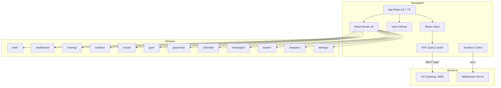
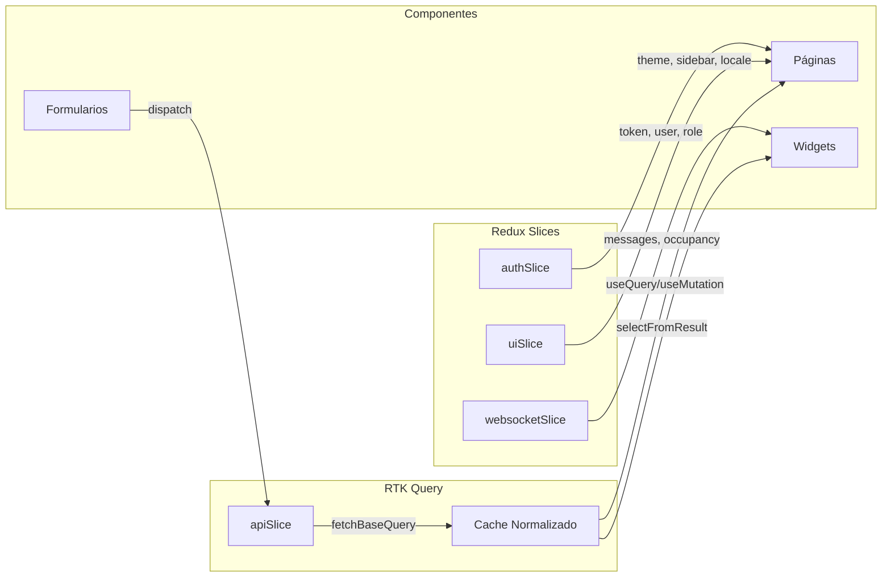
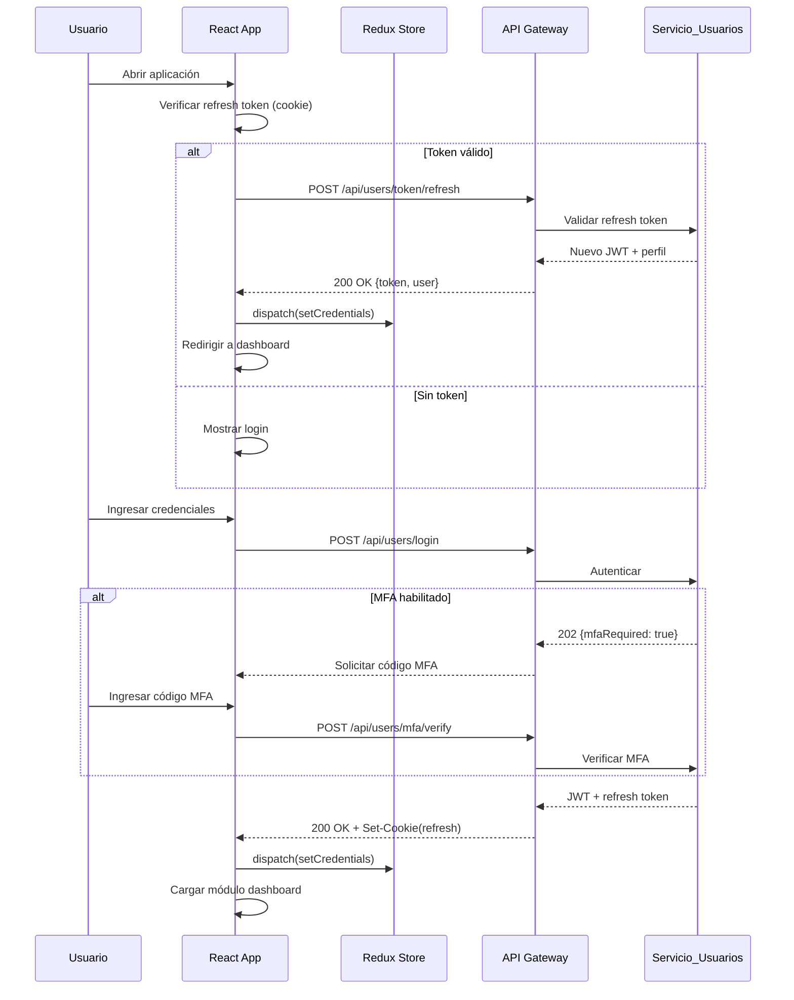
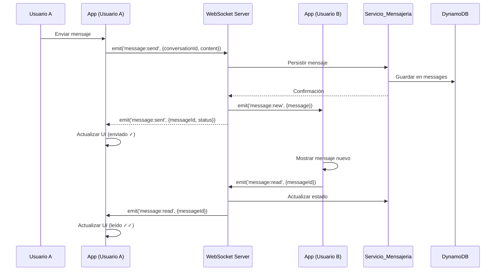
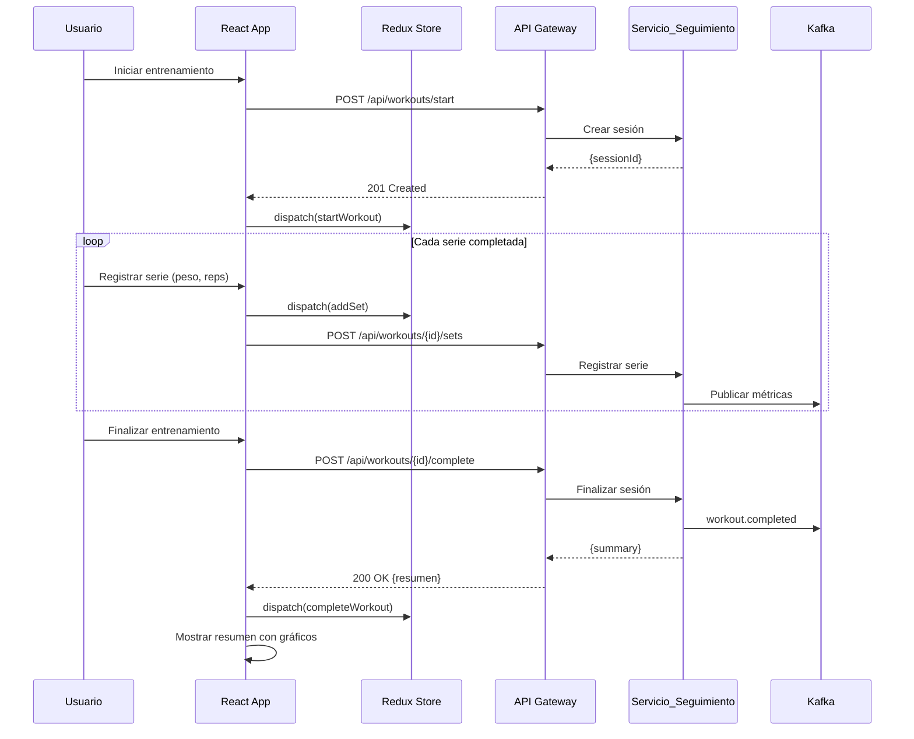

# Documento de Diseño — Spartan Golden Gym Frontend Web

## Visión General

Spartan Golden Gym Frontend es la aplicación web construida con React 18 + TypeScript + Vite que sirve como interfaz visual para la plataforma integral de fitness Spartan Golden Gym. La aplicación se comunica con 13 microservicios backend a través de un API Gateway centralizado (Spring Cloud Gateway) mediante REST y WebSocket. Cubre 12 módulos funcionales: autenticación, dashboard, entrenamiento, nutrición, social, gimnasios, pagos, calendario, mensajería, panel de entrenador, analíticas y configuración.

La arquitectura frontend sigue un patrón modular con Redux Toolkit para estado global, RTK Query para caché y sincronización con APIs, Socket.io-client para comunicación en tiempo real (chat, ocupación de gimnasios, entrenamientos en vivo), y react-i18next para internacionalización en 5 idiomas (en, es, fr, de, ja). El diseño visual combina Material-UI como sistema de componentes base con Tailwind CSS para utilidades de estilo, garantizando una experiencia responsiva y accesible.

### Decisiones de Diseño Clave

1. **RTK Query como capa de datos**: Toda comunicación con el API Gateway se realiza mediante RTK Query, proporcionando caché automático, invalidación, polling y manejo de estados de carga/error de forma declarativa.
2. **WebSocket centralizado**: Un único servicio de WebSocket (Socket.io-client) gestiona todas las conexiones en tiempo real (chat, ocupación, entrenamientos en vivo), multiplexando por namespaces.
3. **Lazy loading por módulo**: Cada módulo funcional se carga bajo demanda con `React.lazy()` y `Suspense`, reduciendo el bundle inicial.
4. **Autenticación con JWT**: Los tokens JWT se almacenan en memoria (no localStorage) con refresh token en httpOnly cookie para máxima seguridad.
5. **i18n con namespaces**: Cada módulo tiene su propio namespace de traducciones, cargados bajo demanda.
6. **Role-Based Access Control (RBAC)**: Rutas y componentes protegidos según rol (client, trainer, admin) con guards declarativos.

---

## Arquitectura

### Diagrama de Arquitectura del Frontend



### Diagrama de Flujo de Datos (Estado Global)



### Diagrama de Secuencia: Autenticación y Carga Inicial



### Diagrama de Secuencia: Chat en Tiempo Real



### Diagrama de Secuencia: Seguimiento de Entrenamiento en Vivo



---

## Componentes e Interfaces

### Estructura de Directorios del Proyecto

```
spartan-gym-frontend/
├── public/
│   ├── locales/           # Archivos de traducción i18n
│   │   ├── en/
│   │   ├── es/
│   │   ├── fr/
│   │   ├── de/
│   │   └── ja/
│   └── index.html
├── src/
│   ├── app/
│   │   ├── store.ts       # Configuración Redux Store
│   │   ├── rootReducer.ts
│   │   └── hooks.ts       # useAppDispatch, useAppSelector tipados
│   ├── api/
│   │   ├── baseApi.ts     # RTK Query base con fetchBaseQuery
│   │   ├── usersApi.ts
│   │   ├── gymsApi.ts
│   │   ├── trainingApi.ts
│   │   ├── workoutsApi.ts
│   │   ├── nutritionApi.ts
│   │   ├── aiCoachApi.ts
│   │   ├── socialApi.ts
│   │   ├── paymentsApi.ts
│   │   ├── bookingsApi.ts
│   │   ├── messagesApi.ts
│   │   ├── calendarApi.ts
│   │   ├── analyticsApi.ts
│   │   └── notificationsApi.ts
│   ├── features/
│   │   ├── auth/
│   │   ├── dashboard/
│   │   ├── training/
│   │   ├── nutrition/
│   │   ├── social/
│   │   ├── gym/
│   │   ├── payments/
│   │   ├── calendar/
│   │   ├── messages/
│   │   ├── trainer/
│   │   ├── analytics/
│   │   └── settings/
│   ├── components/        # Componentes compartidos
│   │   ├── Layout/
│   │   ├── Navigation/
│   │   ├── Guards/
│   │   ├── Charts/
│   │   ├── VideoPlayer/
│   │   └── Map/
│   ├── hooks/             # Hooks compartidos
│   ├── types/             # Tipos TypeScript globales
│   ├── utils/             # Utilidades
│   ├── i18n/              # Configuración i18n
│   ├── websocket/         # Servicio WebSocket
│   ├── theme/             # Tema MUI + Tailwind
│   ├── routes/            # Configuración de rutas
│   └── main.tsx
├── vite.config.ts
├── tailwind.config.ts
├── tsconfig.json
└── package.json
```


### Interfaces y Tipos Core

```typescript
// src/types/auth.ts
interface User {
  id: string;
  email: string;
  name: string;
  dateOfBirth: string;
  role: 'client' | 'trainer' | 'admin';
  locale: string;
  mfaEnabled: boolean;
  onboardingCompleted: boolean;
  profilePhotoUrl?: string;
  fitnessGoals?: FitnessGoals;
  medicalConditions?: string[];
}

interface AuthState {
  user: User | null;
  token: string | null;
  isAuthenticated: boolean;
  mfaPending: boolean;
}

interface LoginRequest {
  email: string;
  password: string;
}

interface LoginResponse {
  token: string;
  user: User;
  mfaRequired?: boolean;
}

interface RegisterRequest {
  name: string;
  email: string;
  password: string;
  dateOfBirth: string;
}

// src/types/training.ts
interface TrainingPlan {
  id: string;
  userId: string;
  trainerId?: string;
  name: string;
  description?: string;
  aiGenerated: boolean;
  status: 'active' | 'completed' | 'paused';
  routines: Routine[];
  createdAt: string;
}

interface Routine {
  id: string;
  planId: string;
  name: string;
  dayOfWeek?: number;
  sortOrder: number;
  exercises: RoutineExercise[];
}

interface Exercise {
  id: string;
  name: string;
  muscleGroups: string[];
  equipmentRequired?: string[];
  difficulty: 'beginner' | 'intermediate' | 'advanced';
  videoUrl?: string;
  instructions?: string;
}

interface RoutineExercise {
  id: string;
  exercise: Exercise;
  sets: number;
  reps: string;
  restSeconds: number;
  sortOrder: number;
}

// src/types/workout.ts
interface WorkoutSession {
  id: string;
  userId: string;
  startedAt: string;
  completedAt?: string;
  exercises: WorkoutSet[];
  totalDuration?: number;
  caloriesBurned?: number;
  status: 'active' | 'completed' | 'cancelled';
}

interface WorkoutSet {
  id: string;
  exerciseId: string;
  weight: number;
  reps: number;
  restSeconds: number;
  timestamp: string;
}

interface WorkoutProgress {
  period: 'day' | 'week' | 'month' | 'year' | 'custom';
  data: ProgressDataPoint[];
}

interface ProgressDataPoint {
  date: string;
  volume: number;
  duration: number;
  caloriesBurned: number;
}

// src/types/nutrition.ts
interface NutritionPlan {
  id: string;
  userId: string;
  goal: 'weight_loss' | 'muscle_gain' | 'maintenance';
  dailyCalories: number;
  proteinGrams: number;
  carbsGrams: number;
  fatGrams: number;
}

interface Food {
  id: string;
  name: string;
  barcode?: string;
  caloriesPer100g: number;
  proteinPer100g: number;
  carbsPer100g: number;
  fatPer100g: number;
  micronutrients?: Record<string, number>;
  region?: string;
}

interface MealLog {
  id: string;
  userId: string;
  food: Food;
  quantityGrams: number;
  mealType: 'breakfast' | 'lunch' | 'dinner' | 'snack';
  loggedAt: string;
}

interface DailyBalance {
  date: string;
  totalCalories: number;
  totalProtein: number;
  totalCarbs: number;
  totalFat: number;
  targetCalories: number;
  targetProtein: number;
  targetCarbs: number;
  targetFat: number;
}

// src/types/gym.ts
interface Gym {
  id: string;
  chainId?: string;
  name: string;
  address: string;
  latitude: number;
  longitude: number;
  operatingHours: Record<string, { open: string; close: string }>;
  maxCapacity: number;
  currentOccupancy?: number;
}

interface GymEquipment {
  id: string;
  gymId: string;
  name: string;
  category: string;
  quantity: number;
  status: 'available' | 'maintenance' | 'out_of_order';
}

// src/types/social.ts
interface Challenge {
  id: string;
  name: string;
  description: string;
  type: 'weekly' | 'monthly';
  metric: 'distance' | 'weight_lifted' | 'workouts_completed';
  targetValue: number;
  startDate: string;
  endDate: string;
  participantCount: number;
}

interface Achievement {
  id: string;
  type: string;
  name: string;
  description: string;
  earnedAt: string;
  iconUrl: string;
}

interface RankingEntry {
  userId: string;
  userName: string;
  profilePhotoUrl?: string;
  score: number;
  rank: number;
}

// src/types/payments.ts
interface Subscription {
  id: string;
  userId: string;
  planType: string;
  status: 'active' | 'suspended' | 'cancelled' | 'expired';
  paymentProvider: 'stripe' | 'adyen';
  startedAt: string;
  expiresAt?: string;
}

interface Transaction {
  id: string;
  userId: string;
  amount: number;
  currency: string;
  type: 'subscription' | 'donation' | 'refund';
  status: 'completed' | 'pending' | 'failed' | 'refunded';
  createdAt: string;
}

interface Donation {
  id: string;
  donorId: string;
  creatorId: string;
  amount: number;
  currency: string;
  message?: string;
  createdAt: string;
}

// src/types/messages.ts
interface Conversation {
  id: string;
  participantIds: string[];
  type: 'direct' | 'group';
  lastMessageAt: string;
  unreadCount: number;
  participants: ConversationParticipant[];
}

interface ConversationParticipant {
  userId: string;
  name: string;
  profilePhotoUrl?: string;
  online: boolean;
}

interface Message {
  id: string;
  conversationId: string;
  senderId: string;
  content: string;
  contentType: 'text' | 'image' | 'file';
  status: 'sending' | 'sent' | 'delivered' | 'read';
  sentAt: string;
  readAt?: string;
}

// src/types/calendar.ts
interface CalendarEvent {
  id: string;
  userId: string;
  eventType: 'workout' | 'class' | 'trainer_session' | 'nutrition_reminder' | 'custom';
  referenceId?: string;
  title: string;
  startsAt: string;
  endsAt: string;
  reminderMinutes: number;
}

// src/types/bookings.ts
interface GroupClass {
  id: string;
  gymId: string;
  instructorId: string;
  instructorName: string;
  name: string;
  room?: string;
  maxCapacity: number;
  currentCapacity: number;
  difficultyLevel: 'beginner' | 'intermediate' | 'advanced';
  scheduledAt: string;
  durationMinutes: number;
}

interface ClassReservation {
  id: string;
  classId: string;
  userId: string;
  status: 'confirmed' | 'cancelled' | 'waitlisted';
  reservedAt: string;
}

// src/types/analytics.ts
interface DashboardMetrics {
  totalUsers: number;
  activeSubscriptions: number;
  monthlyRevenue: number;
  averageOccupancy: number;
  retentionRate: number;
  workoutsThisMonth: number;
}

interface AnalyticsReport {
  id: string;
  type: 'weekly' | 'monthly';
  generatedAt: string;
  metrics: Record<string, number>;
  downloadUrl: string;
}

// src/types/common.ts
interface PagedResponse<T> {
  content: T[];
  page: number;
  size: number;
  totalElements: number;
  totalPages: number;
}

interface ErrorResponse {
  error: string;
  message: string;
  timestamp: string;
  traceId: string;
}
```


### Capa de API (RTK Query)

#### Configuración Base

```typescript
// src/api/baseApi.ts
import { createApi, fetchBaseQuery } from '@reduxjs/toolkit/query/react';
import type { RootState } from '../app/store';

const baseQuery = fetchBaseQuery({
  baseUrl: import.meta.env.VITE_API_BASE_URL || 'http://localhost:8080',
  credentials: 'include', // Para httpOnly cookies (refresh token)
  prepareHeaders: (headers, { getState }) => {
    const token = (getState() as RootState).auth.token;
    if (token) {
      headers.set('Authorization', `Bearer ${token}`);
    }
    headers.set('Accept-Language', (getState() as RootState).ui.locale);
    return headers;
  },
});

// Wrapper con refresco automático de token
const baseQueryWithReauth: BaseQueryFn = async (args, api, extraOptions) => {
  let result = await baseQuery(args, api, extraOptions);
  if (result.error?.status === 401) {
    const refreshResult = await baseQuery(
      { url: '/api/users/token/refresh', method: 'POST' },
      api,
      extraOptions
    );
    if (refreshResult.data) {
      api.dispatch(setCredentials(refreshResult.data));
      result = await baseQuery(args, api, extraOptions);
    } else {
      api.dispatch(logout());
    }
  }
  return result;
};

export const baseApi = createApi({
  reducerPath: 'api',
  baseQuery: baseQueryWithReauth,
  tagTypes: [
    'User', 'Gym', 'TrainingPlan', 'Workout', 'NutritionPlan',
    'MealLog', 'Challenge', 'Achievement', 'Ranking', 'Subscription',
    'Transaction', 'Conversation', 'Message', 'CalendarEvent',
    'GroupClass', 'Reservation', 'Analytics', 'Notification',
  ],
  endpoints: () => ({}),
});
```

#### API de Usuarios

```typescript
// src/api/usersApi.ts
export const usersApi = baseApi.injectEndpoints({
  endpoints: (builder) => ({
    login: builder.mutation<LoginResponse, LoginRequest>({
      query: (credentials) => ({
        url: '/api/users/login',
        method: 'POST',
        body: credentials,
      }),
    }),
    register: builder.mutation<User, RegisterRequest>({
      query: (data) => ({
        url: '/api/users/register',
        method: 'POST',
        body: data,
      }),
    }),
    getProfile: builder.query<User, void>({
      query: () => '/api/users/profile',
      providesTags: ['User'],
    }),
    updateProfile: builder.mutation<User, Partial<User>>({
      query: (data) => ({
        url: '/api/users/profile',
        method: 'PUT',
        body: data,
      }),
      invalidatesTags: ['User'],
    }),
    setupMfa: builder.mutation<{ qrCodeUrl: string; secret: string }, void>({
      query: () => ({ url: '/api/users/mfa/setup', method: 'POST' }),
    }),
    verifyMfa: builder.mutation<LoginResponse, { code: string; sessionToken: string }>({
      query: (data) => ({
        url: '/api/users/mfa/verify',
        method: 'POST',
        body: data,
      }),
    }),
    getOnboarding: builder.query<OnboardingState, void>({
      query: () => '/api/users/onboarding',
    }),
    submitOnboarding: builder.mutation<User, OnboardingData>({
      query: (data) => ({
        url: '/api/users/onboarding',
        method: 'POST',
        body: data,
      }),
      invalidatesTags: ['User'],
    }),
    requestDataExport: builder.mutation<{ requestId: string }, void>({
      query: () => ({ url: '/api/users/data-export', method: 'POST' }),
    }),
    deleteAccount: builder.mutation<void, void>({
      query: () => ({ url: '/api/users/profile/delete', method: 'DELETE' }),
    }),
  }),
});
```

#### API de Entrenamiento

```typescript
// src/api/trainingApi.ts
export const trainingApi = baseApi.injectEndpoints({
  endpoints: (builder) => ({
    getPlans: builder.query<PagedResponse<TrainingPlan>, { page?: number; size?: number }>({
      query: ({ page = 0, size = 10 }) => `/api/training/plans?page=${page}&size=${size}`,
      providesTags: (result) =>
        result
          ? [...result.content.map(({ id }) => ({ type: 'TrainingPlan' as const, id })), 'TrainingPlan']
          : ['TrainingPlan'],
    }),
    getPlanById: builder.query<TrainingPlan, string>({
      query: (id) => `/api/training/plans/${id}`,
      providesTags: (_, __, id) => [{ type: 'TrainingPlan', id }],
    }),
    createPlan: builder.mutation<TrainingPlan, Partial<TrainingPlan>>({
      query: (data) => ({ url: '/api/training/plans', method: 'POST', body: data }),
      invalidatesTags: ['TrainingPlan'],
    }),
    updatePlan: builder.mutation<TrainingPlan, { id: string; data: Partial<TrainingPlan> }>({
      query: ({ id, data }) => ({ url: `/api/training/plans/${id}`, method: 'PUT', body: data }),
      invalidatesTags: (_, __, { id }) => [{ type: 'TrainingPlan', id }],
    }),
    assignPlan: builder.mutation<void, { planId: string; clientId: string }>({
      query: ({ planId, ...body }) => ({
        url: `/api/training/plans/${planId}/assign`,
        method: 'POST',
        body,
      }),
      invalidatesTags: ['TrainingPlan'],
    }),
    getExercises: builder.query<PagedResponse<Exercise>, { muscleGroup?: string; difficulty?: string }>({
      query: (params) => ({
        url: '/api/training/exercises',
        params,
      }),
    }),
  }),
});
```

#### API de Seguimiento (Workouts)

```typescript
// src/api/workoutsApi.ts
export const workoutsApi = baseApi.injectEndpoints({
  endpoints: (builder) => ({
    startWorkout: builder.mutation<WorkoutSession, { planId?: string; routineId?: string }>({
      query: (data) => ({ url: '/api/workouts/start', method: 'POST', body: data }),
    }),
    addSet: builder.mutation<WorkoutSet, { sessionId: string; set: Omit<WorkoutSet, 'id' | 'timestamp'> }>({
      query: ({ sessionId, set }) => ({
        url: `/api/workouts/${sessionId}/sets`,
        method: 'POST',
        body: set,
      }),
    }),
    completeWorkout: builder.mutation<WorkoutSession, string>({
      query: (sessionId) => ({
        url: `/api/workouts/${sessionId}/complete`,
        method: 'POST',
      }),
      invalidatesTags: ['Workout'],
    }),
    getWorkoutHistory: builder.query<PagedResponse<WorkoutSession>, { page?: number; from?: string; to?: string }>({
      query: (params) => ({ url: '/api/workouts/history', params }),
      providesTags: ['Workout'],
    }),
    getProgress: builder.query<WorkoutProgress, { period: string; from?: string; to?: string }>({
      query: (params) => ({ url: '/api/workouts/progress', params }),
    }),
  }),
});
```

#### API de Nutrición

```typescript
// src/api/nutritionApi.ts
export const nutritionApi = baseApi.injectEndpoints({
  endpoints: (builder) => ({
    getNutritionPlan: builder.query<NutritionPlan, void>({
      query: () => '/api/nutrition/plans',
      providesTags: ['NutritionPlan'],
    }),
    createNutritionPlan: builder.mutation<NutritionPlan, Partial<NutritionPlan>>({
      query: (data) => ({ url: '/api/nutrition/plans', method: 'POST', body: data }),
      invalidatesTags: ['NutritionPlan'],
    }),
    logMeal: builder.mutation<MealLog, { foodId: string; quantityGrams: number; mealType: string }>({
      query: (data) => ({ url: '/api/nutrition/meals', method: 'POST', body: data }),
      invalidatesTags: ['MealLog'],
    }),
    getDailyBalance: builder.query<DailyBalance, { date?: string }>({
      query: ({ date } = {}) => `/api/nutrition/daily-balance${date ? `?date=${date}` : ''}`,
      providesTags: ['MealLog'],
    }),
    searchFoods: builder.query<PagedResponse<Food>, { query: string; region?: string }>({
      query: (params) => ({ url: '/api/nutrition/foods', params }),
    }),
    getRecipes: builder.query<PagedResponse<Recipe>, { goal?: string }>({
      query: (params) => ({ url: '/api/nutrition/recipes', params }),
    }),
    getSupplements: builder.query<Supplement[], void>({
      query: () => '/api/nutrition/supplements',
    }),
  }),
});
```

#### API de Gimnasios

```typescript
// src/api/gymsApi.ts
export const gymsApi = baseApi.injectEndpoints({
  endpoints: (builder) => ({
    getNearbyGyms: builder.query<Gym[], { lat: number; lng: number; radius?: number }>({
      query: (params) => ({ url: '/api/gyms/nearby', params }),
      providesTags: ['Gym'],
    }),
    getGymById: builder.query<Gym, string>({
      query: (id) => `/api/gyms/${id}`,
      providesTags: (_, __, id) => [{ type: 'Gym', id }],
    }),
    getGymEquipment: builder.query<GymEquipment[], string>({
      query: (gymId) => `/api/gyms/${gymId}/equipment`,
    }),
    getGymOccupancy: builder.query<{ current: number; max: number }, string>({
      query: (gymId) => `/api/gyms/${gymId}/occupancy`,
    }),
    checkin: builder.mutation<{ success: boolean }, { gymId: string; qrCode: string }>({
      query: ({ gymId, ...body }) => ({
        url: `/api/gyms/${gymId}/checkin`,
        method: 'POST',
        body,
      }),
    }),
    // Admin endpoints
    createGym: builder.mutation<Gym, Partial<Gym>>({
      query: (data) => ({ url: '/api/gyms', method: 'POST', body: data }),
      invalidatesTags: ['Gym'],
    }),
    updateGymEquipment: builder.mutation<GymEquipment, { gymId: string; equipment: Partial<GymEquipment> }>({
      query: ({ gymId, equipment }) => ({
        url: `/api/gyms/${gymId}/equipment`,
        method: 'PUT',
        body: equipment,
      }),
    }),
  }),
});
```

#### API de Social, Pagos, Mensajería, Calendario, Reservas, IA Coach, Analíticas y Notificaciones

```typescript
// src/api/socialApi.ts
export const socialApi = baseApi.injectEndpoints({
  endpoints: (builder) => ({
    getChallenges: builder.query<PagedResponse<Challenge>, { type?: string; active?: boolean }>({
      query: (params) => ({ url: '/api/social/challenges', params }),
      providesTags: ['Challenge'],
    }),
    getAchievements: builder.query<Achievement[], void>({
      query: () => '/api/social/achievements',
      providesTags: ['Achievement'],
    }),
    getRankings: builder.query<RankingEntry[], { category: string }>({
      query: ({ category }) => `/api/social/rankings?category=${category}`,
      providesTags: ['Ranking'],
    }),
    shareAchievement: builder.mutation<{ shareUrl: string }, string>({
      query: (achievementId) => ({
        url: '/api/social/share',
        method: 'POST',
        body: { achievementId },
      }),
    }),
    getGroups: builder.query<PagedResponse<SocialGroup>, void>({
      query: () => '/api/social/groups',
    }),
  }),
});

// src/api/paymentsApi.ts
export const paymentsApi = baseApi.injectEndpoints({
  endpoints: (builder) => ({
    getSubscription: builder.query<Subscription, void>({
      query: () => '/api/payments/subscribe',
      providesTags: ['Subscription'],
    }),
    subscribe: builder.mutation<Subscription, { planType: string; paymentMethodId: string }>({
      query: (data) => ({ url: '/api/payments/subscribe', method: 'POST', body: data }),
      invalidatesTags: ['Subscription'],
    }),
    getTransactions: builder.query<PagedResponse<Transaction>, { page?: number }>({
      query: (params) => ({ url: '/api/payments/transactions', params }),
      providesTags: ['Transaction'],
    }),
    requestRefund: builder.mutation<Transaction, { transactionId: string; reason: string }>({
      query: (data) => ({ url: '/api/payments/refund', method: 'POST', body: data }),
      invalidatesTags: ['Transaction', 'Subscription'],
    }),
    donate: builder.mutation<Donation, { creatorId: string; amount: number; currency: string; message?: string }>({
      query: (data) => ({ url: '/api/payments/donations', method: 'POST', body: data }),
    }),
    getPaymentMethods: builder.query<PaymentMethod[], void>({
      query: () => '/api/payments/methods',
    }),
    addPaymentMethod: builder.mutation<PaymentMethod, { token: string; provider: string }>({
      query: (data) => ({ url: '/api/payments/methods', method: 'POST', body: data }),
    }),
  }),
});

// src/api/messagesApi.ts
export const messagesApi = baseApi.injectEndpoints({
  endpoints: (builder) => ({
    getConversations: builder.query<Conversation[], void>({
      query: () => '/api/messages/conversations',
      providesTags: ['Conversation'],
    }),
    getMessages: builder.query<PagedResponse<Message>, { conversationId: string; page?: number }>({
      query: ({ conversationId, ...params }) => ({
        url: `/api/messages/conversations/${conversationId}`,
        params,
      }),
      providesTags: (_, __, { conversationId }) => [{ type: 'Message', id: conversationId }],
    }),
    sendMessage: builder.mutation<Message, { conversationId: string; content: string; contentType?: string }>({
      query: (data) => ({ url: '/api/messages/send', method: 'POST', body: data }),
      invalidatesTags: (_, __, { conversationId }) => [
        { type: 'Message', id: conversationId },
        'Conversation',
      ],
    }),
  }),
});

// src/api/calendarApi.ts
export const calendarApi = baseApi.injectEndpoints({
  endpoints: (builder) => ({
    getEvents: builder.query<CalendarEvent[], { from: string; to: string }>({
      query: (params) => ({ url: '/api/calendar/events', params }),
      providesTags: ['CalendarEvent'],
    }),
    createEvent: builder.mutation<CalendarEvent, Partial<CalendarEvent>>({
      query: (data) => ({ url: '/api/calendar/events', method: 'POST', body: data }),
      invalidatesTags: ['CalendarEvent'],
    }),
    updateEvent: builder.mutation<CalendarEvent, { id: string; data: Partial<CalendarEvent> }>({
      query: ({ id, data }) => ({ url: `/api/calendar/events/${id}`, method: 'PUT', body: data }),
      invalidatesTags: ['CalendarEvent'],
    }),
    deleteEvent: builder.mutation<void, string>({
      query: (id) => ({ url: `/api/calendar/events/${id}`, method: 'DELETE' }),
      invalidatesTags: ['CalendarEvent'],
    }),
    syncExternalCalendar: builder.mutation<void, { provider: string; token: string }>({
      query: (data) => ({ url: '/api/calendar/sync', method: 'POST', body: data }),
      invalidatesTags: ['CalendarEvent'],
    }),
    getConflicts: builder.query<CalendarEvent[][], { from: string; to: string }>({
      query: (params) => ({ url: '/api/calendar/conflicts', params }),
    }),
  }),
});

// src/api/bookingsApi.ts
export const bookingsApi = baseApi.injectEndpoints({
  endpoints: (builder) => ({
    getClasses: builder.query<PagedResponse<GroupClass>, {
      gymId?: string; type?: string; difficulty?: string; from?: string; to?: string;
    }>({
      query: (params) => ({ url: '/api/bookings/classes', params }),
      providesTags: ['GroupClass'],
    }),
    reserveClass: builder.mutation<ClassReservation, string>({
      query: (classId) => ({
        url: `/api/bookings/classes/${classId}/reserve`,
        method: 'POST',
      }),
      invalidatesTags: ['GroupClass', 'Reservation'],
    }),
    cancelReservation: builder.mutation<void, string>({
      query: (classId) => ({
        url: `/api/bookings/classes/${classId}/cancel`,
        method: 'POST',
      }),
      invalidatesTags: ['GroupClass', 'Reservation'],
    }),
    getTrainerAvailability: builder.query<TrainerAvailability[], string>({
      query: (trainerId) => `/api/bookings/trainers/${trainerId}/availability`,
    }),
  }),
});

// src/api/aiCoachApi.ts
export const aiCoachApi = baseApi.injectEndpoints({
  endpoints: (builder) => ({
    generatePlan: builder.mutation<TrainingPlan, {
      fitnessLevel: string; goals: string[]; medicalConditions?: string[]; availableEquipment?: string[];
    }>({
      query: (data) => ({ url: '/api/ai/plans/generate', method: 'POST', body: data }),
      invalidatesTags: ['TrainingPlan'],
    }),
    getRecommendation: builder.query<ExerciseRecommendation, { context: string }>({
      query: (params) => ({ url: '/api/ai/recommendations', params }),
    }),
    checkOvertraining: builder.query<OvertrainingResult, void>({
      query: () => '/api/ai/overtraining/check',
    }),
    getAlternatives: builder.query<Exercise[], { exerciseId: string; availableEquipment?: string[] }>({
      query: (params) => ({ url: '/api/ai/alternatives', params }),
    }),
    getWarmup: builder.query<Exercise[], { routineId: string }>({
      query: ({ routineId }) => `/api/ai/warmup?routineId=${routineId}`,
    }),
  }),
});

// src/api/analyticsApi.ts
export const analyticsApi = baseApi.injectEndpoints({
  endpoints: (builder) => ({
    getDashboardMetrics: builder.query<DashboardMetrics, { gymId?: string; period?: string }>({
      query: (params) => ({ url: '/api/analytics/dashboard', params }),
      providesTags: ['Analytics'],
    }),
    getReports: builder.query<PagedResponse<AnalyticsReport>, { type?: string }>({
      query: (params) => ({ url: '/api/analytics/reports', params }),
    }),
    getMetrics: builder.query<Record<string, number>, { metric: string; from: string; to: string }>({
      query: (params) => ({ url: '/api/analytics/metrics', params }),
    }),
  }),
});

// src/api/notificationsApi.ts
export const notificationsApi = baseApi.injectEndpoints({
  endpoints: (builder) => ({
    getPreferences: builder.query<NotificationPreferences, void>({
      query: () => '/api/notifications/preferences',
      providesTags: ['Notification'],
    }),
    updatePreferences: builder.mutation<NotificationPreferences, Partial<NotificationPreferences>>({
      query: (data) => ({ url: '/api/notifications/preferences', method: 'PUT', body: data }),
      invalidatesTags: ['Notification'],
    }),
    getHistory: builder.query<PagedResponse<Notification>, { page?: number }>({
      query: (params) => ({ url: '/api/notifications/history', params }),
    }),
  }),
});
```


### Estado Global (Redux Slices)

```typescript
// src/features/auth/authSlice.ts
interface AuthState {
  user: User | null;
  token: string | null;
  isAuthenticated: boolean;
  mfaPending: boolean;
  mfaSessionToken: string | null;
}

const authSlice = createSlice({
  name: 'auth',
  initialState: { user: null, token: null, isAuthenticated: false, mfaPending: false, mfaSessionToken: null },
  reducers: {
    setCredentials: (state, action: PayloadAction<{ user: User; token: string }>) => {
      state.user = action.payload.user;
      state.token = action.payload.token;
      state.isAuthenticated = true;
      state.mfaPending = false;
    },
    setMfaPending: (state, action: PayloadAction<string>) => {
      state.mfaPending = true;
      state.mfaSessionToken = action.payload;
    },
    logout: (state) => {
      state.user = null;
      state.token = null;
      state.isAuthenticated = false;
      state.mfaPending = false;
    },
  },
});

// src/features/ui/uiSlice.ts
interface UiState {
  locale: string;
  theme: 'light' | 'dark';
  sidebarOpen: boolean;
  measurementUnit: 'metric' | 'imperial';
}

const uiSlice = createSlice({
  name: 'ui',
  initialState: { locale: 'es', theme: 'light', sidebarOpen: true, measurementUnit: 'metric' },
  reducers: {
    setLocale: (state, action: PayloadAction<string>) => { state.locale = action.payload; },
    toggleTheme: (state) => { state.theme = state.theme === 'light' ? 'dark' : 'light'; },
    toggleSidebar: (state) => { state.sidebarOpen = !state.sidebarOpen; },
    setMeasurementUnit: (state, action: PayloadAction<'metric' | 'imperial'>) => {
      state.measurementUnit = action.payload;
    },
  },
});

// src/features/websocket/websocketSlice.ts
interface WebSocketState {
  connected: boolean;
  activeConversation: string | null;
  incomingMessages: Message[];
  occupancyUpdates: Record<string, number>;
  typingUsers: Record<string, string[]>;
}

const websocketSlice = createSlice({
  name: 'websocket',
  initialState: {
    connected: false,
    activeConversation: null,
    incomingMessages: [],
    occupancyUpdates: {},
    typingUsers: {},
  },
  reducers: {
    setConnected: (state, action: PayloadAction<boolean>) => { state.connected = action.payload; },
    addIncomingMessage: (state, action: PayloadAction<Message>) => {
      state.incomingMessages.push(action.payload);
    },
    updateOccupancy: (state, action: PayloadAction<{ gymId: string; occupancy: number }>) => {
      state.occupancyUpdates[action.payload.gymId] = action.payload.occupancy;
    },
    setTypingUsers: (state, action: PayloadAction<{ conversationId: string; users: string[] }>) => {
      state.typingUsers[action.payload.conversationId] = action.payload.users;
    },
    clearIncomingMessages: (state) => { state.incomingMessages = []; },
  },
});
```

### Servicio WebSocket

```typescript
// src/websocket/socketService.ts
import { io, Socket } from 'socket.io-client';
import type { AppDispatch } from '../app/store';

class SocketService {
  private socket: Socket | null = null;
  private dispatch: AppDispatch | null = null;

  connect(token: string, dispatch: AppDispatch): void {
    this.dispatch = dispatch;
    this.socket = io(import.meta.env.VITE_WS_URL || 'http://localhost:8092', {
      auth: { token },
      transports: ['websocket'],
      reconnection: true,
      reconnectionAttempts: 10,
      reconnectionDelay: 1000,
    });

    this.socket.on('connect', () => dispatch(setConnected(true)));
    this.socket.on('disconnect', () => dispatch(setConnected(false)));

    // Chat
    this.socket.on('message:new', (message: Message) => {
      dispatch(addIncomingMessage(message));
      dispatch(messagesApi.util.invalidateTags([
        { type: 'Message', id: message.conversationId },
        'Conversation',
      ]));
    });
    this.socket.on('message:read', ({ messageId, conversationId }) => {
      dispatch(messagesApi.util.invalidateTags([{ type: 'Message', id: conversationId }]));
    });
    this.socket.on('message:typing', ({ conversationId, userId }) => {
      dispatch(setTypingUsers({ conversationId, users: [userId] }));
    });

    // Ocupación de gimnasios
    this.socket.on('gym:occupancy', ({ gymId, occupancy }) => {
      dispatch(updateOccupancy({ gymId, occupancy }));
    });

    // Notificaciones en tiempo real
    this.socket.on('notification:new', (notification) => {
      dispatch(notificationsApi.util.invalidateTags(['Notification']));
    });
  }

  sendMessage(conversationId: string, content: string, contentType = 'text'): void {
    this.socket?.emit('message:send', { conversationId, content, contentType });
  }

  markAsRead(messageId: string, conversationId: string): void {
    this.socket?.emit('message:read', { messageId, conversationId });
  }

  startTyping(conversationId: string): void {
    this.socket?.emit('message:typing', { conversationId });
  }

  joinGymOccupancy(gymId: string): void {
    this.socket?.emit('gym:subscribe', { gymId });
  }

  leaveGymOccupancy(gymId: string): void {
    this.socket?.emit('gym:unsubscribe', { gymId });
  }

  disconnect(): void {
    this.socket?.disconnect();
    this.socket = null;
  }
}

export const socketService = new SocketService();
```

### Hooks Personalizados

```typescript
// src/hooks/useAuth.ts
function useAuth() {
  const { user, isAuthenticated, token } = useAppSelector((state) => state.auth);
  const dispatch = useAppDispatch();
  const [loginMutation] = usersApi.useLoginMutation();
  const [registerMutation] = usersApi.useRegisterMutation();

  const login = async (credentials: LoginRequest) => {
    const result = await loginMutation(credentials).unwrap();
    if (result.mfaRequired) {
      dispatch(setMfaPending(result.sessionToken));
      return { mfaRequired: true };
    }
    dispatch(setCredentials(result));
    socketService.connect(result.token, dispatch);
    return { mfaRequired: false };
  };

  const handleLogout = () => {
    socketService.disconnect();
    dispatch(logout());
    dispatch(baseApi.util.resetApiState());
  };

  return { user, isAuthenticated, token, login, register: registerMutation, logout: handleLogout };
}

// src/hooks/useWorkout.ts
function useWorkout() {
  const [startMutation] = workoutsApi.useStartWorkoutMutation();
  const [addSetMutation] = workoutsApi.useAddSetMutation();
  const [completeMutation] = workoutsApi.useCompleteWorkoutMutation();
  const [activeSession, setActiveSession] = useState<WorkoutSession | null>(null);

  const startWorkout = async (planId?: string, routineId?: string) => {
    const session = await startMutation({ planId, routineId }).unwrap();
    setActiveSession(session);
    return session;
  };

  const addSet = async (set: Omit<WorkoutSet, 'id' | 'timestamp'>) => {
    if (!activeSession) throw new Error('No hay sesión activa');
    return addSetMutation({ sessionId: activeSession.id, set }).unwrap();
  };

  const completeWorkout = async () => {
    if (!activeSession) throw new Error('No hay sesión activa');
    const result = await completeMutation(activeSession.id).unwrap();
    setActiveSession(null);
    return result;
  };

  return { activeSession, startWorkout, addSet, completeWorkout };
}

// src/hooks/useI18n.ts
function useLocale() {
  const { locale, measurementUnit } = useAppSelector((state) => state.ui);
  const dispatch = useAppDispatch();
  const { i18n } = useTranslation();

  const changeLocale = (newLocale: string) => {
    i18n.changeLanguage(newLocale);
    dispatch(setLocale(newLocale));
  };

  const formatDate = (date: string) => new Intl.DateTimeFormat(locale).format(new Date(date));
  const formatCurrency = (amount: number, currency: string) =>
    new Intl.NumberFormat(locale, { style: 'currency', currency }).format(amount);
  const formatWeight = (kg: number) =>
    measurementUnit === 'imperial' ? `${(kg * 2.20462).toFixed(1)} lbs` : `${kg} kg`;
  const formatDistance = (km: number) =>
    measurementUnit === 'imperial' ? `${(km * 0.621371).toFixed(1)} mi` : `${km} km`;

  return { locale, changeLocale, formatDate, formatCurrency, formatWeight, formatDistance };
}

// src/hooks/useRoleGuard.ts
function useRoleGuard(allowedRoles: Array<'client' | 'trainer' | 'admin'>) {
  const { user, isAuthenticated } = useAuth();
  const hasAccess = isAuthenticated && user && allowedRoles.includes(user.role);
  return { hasAccess, userRole: user?.role };
}
```

### Componentes de Guardia y Layout

```typescript
// src/components/Guards/ProtectedRoute.tsx
interface ProtectedRouteProps {
  allowedRoles?: Array<'client' | 'trainer' | 'admin'>;
  children: React.ReactNode;
}

function ProtectedRoute({ allowedRoles, children }: ProtectedRouteProps): JSX.Element {
  const { isAuthenticated, user } = useAuth();
  const location = useLocation();

  if (!isAuthenticated) {
    return <Navigate to="/login" state={{ from: location }} replace />;
  }
  if (allowedRoles && user && !allowedRoles.includes(user.role)) {
    return <Navigate to="/unauthorized" replace />;
  }
  return <>{children}</>;
}

// src/components/Layout/AppLayout.tsx
function AppLayout(): JSX.Element {
  const { sidebarOpen } = useAppSelector((state) => state.ui);
  const { user } = useAuth();

  return (
    <div className="flex h-screen">
      <Sidebar open={sidebarOpen} role={user?.role} />
      <main className="flex-1 overflow-auto">
        <TopBar />
        <Suspense fallback={<LoadingSpinner />}>
          <Outlet />
        </Suspense>
      </main>
    </div>
  );
}
```

### Configuración de Rutas

```typescript
// src/routes/AppRoutes.tsx
const AuthModule = lazy(() => import('../features/auth'));
const DashboardModule = lazy(() => import('../features/dashboard'));
const TrainingModule = lazy(() => import('../features/training'));
const NutritionModule = lazy(() => import('../features/nutrition'));
const SocialModule = lazy(() => import('../features/social'));
const GymModule = lazy(() => import('../features/gym'));
const PaymentsModule = lazy(() => import('../features/payments'));
const CalendarModule = lazy(() => import('../features/calendar'));
const MessagesModule = lazy(() => import('../features/messages'));
const TrainerModule = lazy(() => import('../features/trainer'));
const AnalyticsModule = lazy(() => import('../features/analytics'));
const SettingsModule = lazy(() => import('../features/settings'));

const routes: RouteObject[] = [
  // Rutas públicas
  { path: '/login', element: <AuthModule.LoginPage /> },
  { path: '/register', element: <AuthModule.RegisterPage /> },
  { path: '/mfa', element: <AuthModule.MfaPage /> },

  // Rutas protegidas
  {
    element: <ProtectedRoute><AppLayout /></ProtectedRoute>,
    children: [
      { path: '/', element: <Navigate to="/dashboard" replace /> },
      { path: '/dashboard', element: <DashboardModule /> },
      { path: '/training/*', element: <TrainingModule /> },
      { path: '/nutrition/*', element: <NutritionModule /> },
      { path: '/social/*', element: <SocialModule /> },
      { path: '/gym/*', element: <GymModule /> },
      { path: '/payments/*', element: <PaymentsModule /> },
      { path: '/calendar', element: <CalendarModule /> },
      { path: '/messages/*', element: <MessagesModule /> },
      { path: '/settings/*', element: <SettingsModule /> },

      // Solo entrenadores
      {
        path: '/trainer/*',
        element: <ProtectedRoute allowedRoles={['trainer']}><TrainerModule /></ProtectedRoute>,
      },

      // Solo administradores
      {
        path: '/analytics/*',
        element: <ProtectedRoute allowedRoles={['admin']}><AnalyticsModule /></ProtectedRoute>,
      },
    ],
  },
];
```


### Componentes Clave por Módulo

#### Módulo auth/

```typescript
// features/auth/pages/LoginPage.tsx
// Formulario de login con email/password, enlace a registro, soporte MFA
// Usa: usersApi.useLoginMutation, authSlice.setCredentials

// features/auth/pages/RegisterPage.tsx
// Formulario de registro: nombre, email, contraseña, fecha de nacimiento
// Validación client-side con react-hook-form + zod
// Usa: usersApi.useRegisterMutation

// features/auth/pages/MfaPage.tsx
// Input de código TOTP de 6 dígitos, botón verificar
// Usa: usersApi.useVerifyMfaMutation

// features/auth/pages/OnboardingPage.tsx
// Wizard multi-paso: nivel fitness, objetivos, condiciones médicas, equipamiento
// Progreso guardado parcialmente, pasos opcionales omitibles
// Usa: usersApi.useSubmitOnboardingMutation, aiCoachApi.useGeneratePlanMutation
```

#### Módulo dashboard/

```typescript
// features/dashboard/pages/DashboardPage.tsx
// Vista personalizada según rol:
//   - Client: resumen de entrenamiento, próximas clases, balance nutricional, logros recientes
//   - Trainer: lista de clientes, sesiones del día, alertas
//   - Admin: métricas clave, ocupación, ingresos
// Widgets: <WorkoutSummaryCard>, <NutritionBalanceWidget>, <UpcomingClassesWidget>,
//          <AchievementsWidget>, <OccupancyWidget>
// Usa: workoutsApi, nutritionApi, bookingsApi, socialApi, analyticsApi
```

#### Módulo training/

```typescript
// features/training/pages/PlansListPage.tsx
// Lista de planes de entrenamiento del usuario con filtros (activo, completado, pausado)
// Usa: trainingApi.useGetPlansQuery

// features/training/pages/PlanDetailPage.tsx
// Detalle del plan con rutinas y ejercicios, botón "Iniciar entrenamiento"
// Video tutorial por ejercicio con <VideoPlayer> (Video.js + HLS)
// Usa: trainingApi.useGetPlanByIdQuery, aiCoachApi.useGetWarmupQuery

// features/training/pages/WorkoutLivePage.tsx
// Pantalla de entrenamiento en vivo: temporizador, registro de series, descanso
// Muestra ejercicio actual, series completadas, próximo ejercicio
// Usa: useWorkout hook, workoutsApi

// features/training/pages/ProgressPage.tsx
// Gráficos de progreso: volumen, duración, calorías por período
// Usa: workoutsApi.useGetProgressQuery, Recharts
// Comparativas de objetivos semanales/mensuales

// features/training/components/ExerciseCard.tsx
// Tarjeta de ejercicio con nombre, grupos musculares, dificultad, miniatura de video
// Botón para ver alternativas si equipamiento no disponible

// features/training/components/VideoPlayer.tsx
// Wrapper de Video.js con soporte HLS, controles de velocidad y repetición
// Props: { src: string; poster?: string; }
```

#### Módulo nutrition/

```typescript
// features/nutrition/pages/NutritionDashboardPage.tsx
// Balance diario de macros (gráfico circular), historial de comidas del día
// Usa: nutritionApi.useGetDailyBalanceQuery, nutritionApi.useGetNutritionPlanQuery

// features/nutrition/pages/MealLogPage.tsx
// Formulario para registrar comida: búsqueda de alimento, cantidad, tipo de comida
// Usa: nutritionApi.useSearchFoodsQuery, nutritionApi.useLogMealMutation

// features/nutrition/pages/RecipesPage.tsx
// Lista de recetas recomendadas según objetivos y preferencias
// Usa: nutritionApi.useGetRecipesQuery

// features/nutrition/pages/SupplementsPage.tsx
// Información de suplementos: dosificación, beneficios
// Usa: nutritionApi.useGetSupplementsQuery

// features/nutrition/components/MacroChart.tsx
// Gráfico circular de macronutrientes (proteínas, carbohidratos, grasas)
// Props: { current: DailyBalance; target: NutritionPlan; }
// Usa: Recharts PieChart
```

#### Módulo gym/

```typescript
// features/gym/pages/GymMapPage.tsx
// Mapa interactivo con Mapbox GL JS mostrando gimnasios cercanos
// Marcadores con nivel de ocupación en tiempo real (WebSocket)
// Usa: gymsApi.useGetNearbyGymsQuery, socketService.joinGymOccupancy

// features/gym/pages/GymDetailPage.tsx
// Detalle del gimnasio: horarios, equipamiento, ocupación actual, check-in QR
// Usa: gymsApi.useGetGymByIdQuery, gymsApi.useGetGymEquipmentQuery

// features/gym/components/OccupancyIndicator.tsx
// Indicador visual de ocupación (barra de progreso con colores)
// Props: { current: number; max: number; }

// features/gym/components/QrCheckin.tsx
// Componente para escaneo QR (usando cámara web) o input manual de código
// Usa: gymsApi.useCheckinMutation
```

#### Módulo social/

```typescript
// features/social/pages/CommunityPage.tsx
// Feed de actividad social, desafíos activos, rankings
// Usa: socialApi.useGetChallengesQuery, socialApi.useGetRankingsQuery

// features/social/pages/ChallengeDetailPage.tsx
// Detalle del desafío: progreso, participantes, ranking del desafío
// Usa: socialApi

// features/social/pages/AchievementsPage.tsx
// Galería de logros/insignias del usuario, botón compartir en redes
// Usa: socialApi.useGetAchievementsQuery, socialApi.useShareAchievementMutation

// features/social/pages/RankingsPage.tsx
// Rankings por categoría (fuerza, resistencia, consistencia, nutrición)
// Tabs por categoría, tabla con posición, nombre, score
// Usa: socialApi.useGetRankingsQuery

// features/social/components/RankingTable.tsx
// Tabla de ranking con avatar, nombre, posición, score
// Props: { entries: RankingEntry[]; category: string; }
```

#### Módulo payments/

```typescript
// features/payments/pages/SubscriptionPage.tsx
// Plan actual, opciones de upgrade/downgrade, métodos de pago
// Usa: paymentsApi.useGetSubscriptionQuery, paymentsApi.useSubscribeMutation

// features/payments/pages/TransactionsPage.tsx
// Historial de transacciones con filtros, botón de reembolso
// Usa: paymentsApi.useGetTransactionsQuery, paymentsApi.useRequestRefundMutation

// features/payments/pages/DonationPage.tsx
// Perfil del creador con botón de donación, montos sugeridos y personalizado
// Integración PayPal
// Usa: paymentsApi.useDonateMutation

// features/payments/components/PaymentMethodForm.tsx
// Formulario para agregar método de pago (Stripe Elements / Adyen Drop-in)
// Usa: paymentsApi.useAddPaymentMethodMutation
```

#### Módulo messages/

```typescript
// features/messages/pages/MessagesPage.tsx
// Layout split: lista de conversaciones (izquierda) + chat activo (derecha)
// Usa: messagesApi.useGetConversationsQuery, socketService

// features/messages/components/ConversationList.tsx
// Lista de conversaciones con último mensaje, unread count, indicador online
// Props: { conversations: Conversation[]; activeId?: string; onSelect: (id) => void; }

// features/messages/components/ChatWindow.tsx
// Ventana de chat: historial de mensajes, input, indicador de escritura
// Scroll infinito para historial, envío via WebSocket
// Usa: messagesApi.useGetMessagesQuery, socketService.sendMessage

// features/messages/components/MessageBubble.tsx
// Burbuja de mensaje con contenido, hora, estado (enviado/leído)
// Props: { message: Message; isMine: boolean; }
```

#### Módulo trainer/

```typescript
// features/trainer/pages/TrainerDashboardPage.tsx
// Panel principal: lista de clientes, planes activos, métricas de progreso
// Usa: trainingApi, workoutsApi

// features/trainer/pages/ClientDetailPage.tsx
// Detalle del cliente: perfil, plan actual, historial, gráficos de progreso
// Gráficos comparativos con Victory Charts
// Usa: workoutsApi.useGetProgressQuery, Victory VictoryChart/VictoryLine/VictoryBar

// features/trainer/pages/PlanEditorPage.tsx
// Editor de plan de entrenamiento: drag & drop de ejercicios, configuración de series/reps
// Asignación a cliente
// Usa: trainingApi.useCreatePlanMutation, trainingApi.useAssignPlanMutation

// features/trainer/components/ClientProgressChart.tsx
// Gráfico comparativo de progreso del cliente (Victory Charts)
// Props: { clientId: string; metric: string; period: string; }
```

#### Módulo analytics/ (Admin)

```typescript
// features/analytics/pages/AnalyticsDashboardPage.tsx
// Dashboard con métricas de negocio: usuarios, ingresos, retención, ocupación
// Integración con Amazon QuickSight (iframe embebido)
// Filtros por gimnasio, período, segmento
// Usa: analyticsApi.useGetDashboardMetricsQuery

// features/analytics/pages/ReportsPage.tsx
// Lista de reportes generados (semanales/mensuales), descarga
// Usa: analyticsApi.useGetReportsQuery

// features/analytics/components/MetricCard.tsx
// Tarjeta de métrica con valor, tendencia, icono
// Props: { title: string; value: number; trend: number; icon: ReactNode; }

// features/analytics/components/QuickSightEmbed.tsx
// Componente para embeber dashboard de QuickSight
// Props: { dashboardId: string; filters?: Record<string, string>; }
```

#### Módulo calendar/

```typescript
// features/calendar/pages/CalendarPage.tsx
// Calendario unificado: entrenamientos, clases, sesiones con entrenador, nutrición
// Vista mensual/semanal/diaria
// Detección de conflictos visual
// Usa: calendarApi.useGetEventsQuery, calendarApi.useGetConflictsQuery

// features/calendar/components/CalendarView.tsx
// Componente de calendario con eventos coloreados por tipo
// Props: { events: CalendarEvent[]; view: 'month' | 'week' | 'day'; onEventClick: (e) => void; }

// features/calendar/components/EventForm.tsx
// Formulario para crear/editar evento con selector de recordatorio
// Usa: calendarApi.useCreateEventMutation, calendarApi.useUpdateEventMutation

// features/calendar/components/SyncButton.tsx
// Botón para sincronizar con Google Calendar / Apple Calendar / Outlook
// Usa: calendarApi.useSyncExternalCalendarMutation
```

#### Módulo settings/

```typescript
// features/settings/pages/SettingsPage.tsx
// Configuración general: perfil, idioma, tema, unidades, notificaciones, privacidad

// features/settings/pages/ProfileSettingsPage.tsx
// Edición de perfil: foto, datos personales, objetivos, condiciones médicas
// Usa: usersApi.useUpdateProfileMutation

// features/settings/pages/LanguageSettingsPage.tsx
// Selector de idioma (en, es, fr, de, ja), preview de formato de fecha/moneda
// Usa: useLocale hook

// features/settings/pages/NotificationSettingsPage.tsx
// Preferencias de notificación por categoría y canal
// Usa: notificationsApi.useGetPreferencesQuery, notificationsApi.useUpdatePreferencesMutation

// features/settings/pages/PrivacySettingsPage.tsx
// MFA setup, exportación de datos, eliminación de cuenta
// Usa: usersApi.useSetupMfaMutation, usersApi.useRequestDataExportMutation, usersApi.useDeleteAccountMutation
```


### Configuración de Internacionalización (i18n)

```typescript
// src/i18n/config.ts
import i18n from 'i18next';
import { initReactI18next } from 'react-i18next';
import HttpBackend from 'i18next-http-backend';
import LanguageDetector from 'i18next-browser-languagedetector';

i18n
  .use(HttpBackend)
  .use(LanguageDetector)
  .use(initReactI18next)
  .init({
    fallbackLng: 'en',
    supportedLngs: ['en', 'es', 'fr', 'de', 'ja'],
    ns: ['common', 'auth', 'dashboard', 'training', 'nutrition', 'social',
         'gym', 'payments', 'calendar', 'messages', 'trainer', 'analytics', 'settings'],
    defaultNS: 'common',
    backend: {
      loadPath: '/locales/{{lng}}/{{ns}}.json',
    },
    interpolation: { escapeValue: false },
  });
```

### Configuración del Tema (MUI + Tailwind)

```typescript
// src/theme/muiTheme.ts
import { createTheme } from '@mui/material/styles';

export const lightTheme = createTheme({
  palette: {
    mode: 'light',
    primary: { main: '#D4AF37' },    // Dorado Spartan
    secondary: { main: '#8B0000' },   // Rojo oscuro
    background: { default: '#F5F5F5', paper: '#FFFFFF' },
  },
  typography: {
    fontFamily: '"Inter", "Roboto", sans-serif',
  },
});

export const darkTheme = createTheme({
  palette: {
    mode: 'dark',
    primary: { main: '#FFD700' },
    secondary: { main: '#FF4444' },
    background: { default: '#121212', paper: '#1E1E1E' },
  },
  typography: {
    fontFamily: '"Inter", "Roboto", sans-serif',
  },
});
```


---

## Pseudocódigo Algorítmico

### Algoritmo: Refresco Automático de Token JWT

```typescript
/**
 * Precondiciones:
 *   - El usuario tiene un refresh token válido en httpOnly cookie
 *   - La petición original falló con 401
 *
 * Postcondiciones:
 *   - Si el refresh es exitoso: la petición original se reintenta con nuevo token
 *   - Si el refresh falla: el usuario es redirigido a login
 *   - No se producen peticiones de refresh concurrentes (mutex)
 *
 * Invariante de bucle: N/A (no hay bucle)
 */
async function baseQueryWithReauth(args, api, extraOptions) {
  let result = await baseQuery(args, api, extraOptions);

  if (result.error?.status === 401) {
    // Mutex: evitar múltiples refreshes concurrentes
    if (!refreshPromise) {
      refreshPromise = baseQuery(
        { url: '/api/users/token/refresh', method: 'POST' },
        api,
        extraOptions
      );
    }

    const refreshResult = await refreshPromise;
    refreshPromise = null;

    if (refreshResult.data) {
      api.dispatch(setCredentials(refreshResult.data));
      // Reintentar petición original con nuevo token
      result = await baseQuery(args, api, extraOptions);
    } else {
      api.dispatch(logout());
    }
  }

  return result;
}
```

### Algoritmo: Gestión de Sesión de Entrenamiento en Vivo

```typescript
/**
 * Precondiciones:
 *   - El usuario está autenticado
 *   - No hay otra sesión de entrenamiento activa
 *   - El plan/rutina referenciado existe (si se proporciona)
 *
 * Postcondiciones:
 *   - Al completar: la sesión contiene todas las series registradas
 *   - El resumen incluye duración total, volumen total y calorías estimadas
 *   - El evento workout.completed se publica en Kafka (backend)
 *
 * Invariante de bucle:
 *   - Durante el entrenamiento: activeSession.status === 'active'
 *   - Cada serie añadida incrementa el contador de series en exactamente 1
 *   - El temporizador de descanso nunca es negativo
 */
function useWorkoutSession() {
  // Estado local de la sesión
  const [session, setSession] = useState<WorkoutSession | null>(null);
  const [currentExerciseIndex, setCurrentExerciseIndex] = useState(0);
  const [restTimer, setRestTimer] = useState(0);

  const startWorkout = async (planId?: string, routineId?: string) => {
    assert(!session, 'No debe haber sesión activa');
    const newSession = await api.startWorkout({ planId, routineId });
    assert(newSession.status === 'active');
    setSession(newSession);
    return newSession;
  };

  const recordSet = async (weight: number, reps: number) => {
    assert(session?.status === 'active', 'Sesión debe estar activa');
    assert(weight >= 0, 'Peso no puede ser negativo');
    assert(reps > 0, 'Repeticiones deben ser positivas');

    const previousSetCount = session.exercises.length;
    const set = await api.addSet({
      sessionId: session.id,
      set: { exerciseId: currentExercise.id, weight, reps, restSeconds: 0 },
    });

    setSession(prev => ({
      ...prev,
      exercises: [...prev.exercises, set],
    }));
    assert(session.exercises.length === previousSetCount + 1);

    // Iniciar temporizador de descanso
    setRestTimer(currentExercise.restSeconds);
  };

  const finishWorkout = async () => {
    assert(session?.status === 'active');
    const summary = await api.completeWorkout(session.id);
    assert(summary.status === 'completed');
    assert(summary.completedAt != null);
    setSession(null);
    return summary;
  };

  return { session, startWorkout, recordSet, finishWorkout, restTimer, currentExerciseIndex };
}
```

### Algoritmo: Sincronización de Ocupación en Tiempo Real

```typescript
/**
 * Precondiciones:
 *   - Conexión WebSocket establecida
 *   - El usuario está visualizando el mapa de gimnasios
 *
 * Postcondiciones:
 *   - Los marcadores del mapa reflejan la ocupación actual de cada gimnasio
 *   - Al salir de la vista, se cancela la suscripción
 *
 * Invariante:
 *   - occupancy[gymId] >= 0 para todo gymId suscrito
 *   - occupancy[gymId] <= gym.maxCapacity
 */
function useGymOccupancy(gymIds: string[]) {
  const occupancy = useAppSelector(state => state.websocket.occupancyUpdates);

  useEffect(() => {
    // Suscribirse a actualizaciones de ocupación
    gymIds.forEach(id => socketService.joinGymOccupancy(id));

    return () => {
      // Cleanup: cancelar suscripciones al desmontar
      gymIds.forEach(id => socketService.leaveGymOccupancy(id));
    };
  }, [gymIds]);

  return occupancy;
}
```

### Algoritmo: Resolución de Conflictos en Calendario

```typescript
/**
 * Precondiciones:
 *   - events es un array de CalendarEvent ordenado por startsAt
 *
 * Postcondiciones:
 *   - Retorna un array de pares de eventos que se solapan
 *   - Dos eventos se solapan si event1.endsAt > event2.startsAt
 *
 * Invariante de bucle:
 *   - Para todo i procesado: todos los conflictos con eventos anteriores han sido detectados
 */
function detectConflicts(events: CalendarEvent[]): [CalendarEvent, CalendarEvent][] {
  const sorted = [...events].sort((a, b) =>
    new Date(a.startsAt).getTime() - new Date(b.startsAt).getTime()
  );
  const conflicts: [CalendarEvent, CalendarEvent][] = [];

  for (let i = 0; i < sorted.length; i++) {
    for (let j = i + 1; j < sorted.length; j++) {
      const endI = new Date(sorted[i].endsAt).getTime();
      const startJ = new Date(sorted[j].startsAt).getTime();

      if (endI <= startJ) break; // No más solapamientos posibles (lista ordenada)
      conflicts.push([sorted[i], sorted[j]]);
    }
  }

  return conflicts;
}
```


---

## Ejemplo de Uso

```typescript
// Ejemplo 1: Login completo con MFA
const LoginPage = () => {
  const { login } = useAuth();
  const navigate = useNavigate();
  const { t } = useTranslation('auth');

  const onSubmit = async (data: LoginRequest) => {
    const result = await login(data);
    if (result.mfaRequired) {
      navigate('/mfa');
    } else {
      navigate('/dashboard');
    }
  };

  return (
    <form onSubmit={handleSubmit(onSubmit)}>
      <TextField label={t('email')} {...register('email')} />
      <TextField label={t('password')} type="password" {...register('password')} />
      <Button type="submit">{t('login')}</Button>
    </form>
  );
};

// Ejemplo 2: Dashboard del entrenador con gráficos Victory
const ClientProgressChart = ({ clientId }: { clientId: string }) => {
  const { data: progress } = workoutsApi.useGetProgressQuery({
    period: 'month',
    userId: clientId,
  });
  const { formatWeight } = useLocale();

  return (
    <VictoryChart theme={VictoryTheme.material}>
      <VictoryLine
        data={progress?.data}
        x="date"
        y="volume"
        labels={({ datum }) => formatWeight(datum.volume)}
      />
      <VictoryAxis dependentAxis label="Volumen" />
      <VictoryAxis label="Fecha" />
    </VictoryChart>
  );
};

// Ejemplo 3: Chat en tiempo real
const ChatWindow = ({ conversationId }: { conversationId: string }) => {
  const { data: messages } = messagesApi.useGetMessagesQuery({ conversationId });
  const { user } = useAuth();
  const [input, setInput] = useState('');

  const handleSend = () => {
    if (input.trim()) {
      socketService.sendMessage(conversationId, input);
      setInput('');
    }
  };

  return (
    <div className="flex flex-col h-full">
      <div className="flex-1 overflow-y-auto p-4">
        {messages?.content.map(msg => (
          <MessageBubble key={msg.id} message={msg} isMine={msg.senderId === user?.id} />
        ))}
      </div>
      <div className="flex p-2 border-t">
        <input
          value={input}
          onChange={e => setInput(e.target.value)}
          onKeyDown={e => e.key === 'Enter' && handleSend()}
          className="flex-1 p-2 border rounded"
          aria-label="Escribir mensaje"
        />
        <Button onClick={handleSend} aria-label="Enviar mensaje">Enviar</Button>
      </div>
    </div>
  );
};

// Ejemplo 4: Mapa de gimnasios con ocupación en tiempo real
const GymMapPage = () => {
  const { data: gyms } = gymsApi.useGetNearbyGymsQuery({ lat: 40.4168, lng: -3.7038 });
  const gymIds = gyms?.map(g => g.id) ?? [];
  const occupancy = useGymOccupancy(gymIds);

  return (
    <Map initialViewState={{ latitude: 40.4168, longitude: -3.7038, zoom: 12 }}>
      {gyms?.map(gym => (
        <Marker key={gym.id} latitude={gym.latitude} longitude={gym.longitude}>
          <OccupancyIndicator
            current={occupancy[gym.id] ?? gym.currentOccupancy ?? 0}
            max={gym.maxCapacity}
          />
        </Marker>
      ))}
    </Map>
  );
};
```

---

## Propiedades de Corrección

### Propiedad 1: Round-trip de autenticación

*Para cualquier* credenciales válidas (email, contraseña), el flujo login → obtener perfil debe retornar un usuario con el mismo email, y el token JWT debe estar presente en el estado de Redux.

**Valida: Módulo auth, API /api/users/login, /api/users/profile**

### Propiedad 2: Protección de rutas por rol

*Para cualquier* ruta protegida con `allowedRoles`, un usuario con rol no incluido en la lista debe ser redirigido a `/unauthorized`, y un usuario no autenticado debe ser redirigido a `/login`.

**Valida: ProtectedRoute, RBAC**

### Propiedad 3: Refresco automático de token

*Para cualquier* petición que recibe 401, el sistema debe intentar refrescar el token exactamente una vez. Si el refresh es exitoso, la petición original debe reintentarse. Si falla, el usuario debe ser deslogueado.

**Valida: baseQueryWithReauth**

### Propiedad 4: Caché de RTK Query con invalidación

*Para cualquier* mutación que invalida tags, las queries que proveen esos tags deben re-ejecutarse automáticamente, y los datos mostrados deben reflejar el estado actualizado.

**Valida: Todas las APIs con providesTags/invalidatesTags**

### Propiedad 5: Consistencia de sesión de entrenamiento

*Para cualquier* sesión de entrenamiento iniciada, el número de series en el estado local debe ser igual al número de series registradas exitosamente en el backend. Al completar, el resumen debe contener todas las series.

**Valida: useWorkout hook, workoutsApi**

### Propiedad 6: Balance nutricional es suma de comidas

*Para cualquier* conjunto de comidas registradas en un día, el balance diario mostrado en la UI debe coincidir con la suma de los valores nutricionales de cada comida (calorías, proteínas, carbohidratos, grasas).

**Valida: Módulo nutrition, nutritionApi.getDailyBalance**

### Propiedad 7: Ocupación de gimnasios en rango válido

*Para cualquier* actualización de ocupación recibida por WebSocket, el valor debe ser >= 0 y <= maxCapacity del gimnasio. El indicador visual debe reflejar el valor actualizado.

**Valida: useGymOccupancy, OccupancyIndicator**

### Propiedad 8: Rankings ordenados correctamente

*Para cualquier* categoría de ranking consultada, los resultados mostrados deben estar ordenados de mayor a menor score, y cada entrada debe tener un rank consecutivo empezando en 1.

**Valida: Módulo social, socialApi.getRankings, RankingTable**

### Propiedad 9: Mensajes en orden cronológico

*Para cualquier* conversación, los mensajes mostrados deben estar ordenados cronológicamente por sentAt. Los mensajes nuevos recibidos por WebSocket deben insertarse en la posición correcta.

**Valida: Módulo messages, ChatWindow**

### Propiedad 10: Detección de conflictos en calendario

*Para cualquier* par de eventos donde event1.endsAt > event2.startsAt y event1.startsAt < event2.endsAt, el algoritmo de detección debe identificarlos como conflicto. Eventos sin solapamiento no deben ser reportados como conflicto.

**Valida: detectConflicts, CalendarPage**

### Propiedad 11: Traducciones completas por idioma

*Para cualquier* clave de traducción en el namespace base y *para cualquier* idioma soportado (en, es, fr, de, ja), debe existir una traducción no vacía. Cambiar de idioma debe actualizar toda la interfaz visible.

**Valida: i18n config, useLocale**

### Propiedad 12: Formato de unidades según configuración regional

*Para cualquier* valor de peso mostrado, si el usuario tiene configuración imperial debe mostrarse en libras (kg × 2.20462), y si tiene configuración métrica debe mostrarse en kilogramos. Lo mismo aplica para distancias (km/millas).

**Valida: useLocale.formatWeight, useLocale.formatDistance**

### Propiedad 13: Estado de mensajes consistente

*Para cualquier* mensaje enviado, su estado debe progresar en orden: sending → sent → delivered → read. Un mensaje nunca debe retroceder de estado.

**Valida: MessageBubble, websocketSlice**

### Propiedad 14: Lazy loading no rompe navegación

*Para cualquier* ruta definida en el router, navegar a ella debe cargar el módulo correspondiente y renderizar el componente correcto. Durante la carga, debe mostrarse el fallback de Suspense.

**Valida: AppRoutes, React.lazy**

### Propiedad 15: Logout limpia todo el estado

*Para cualquier* sesión activa, al ejecutar logout: el token debe ser null, el usuario debe ser null, el caché de RTK Query debe estar vacío, la conexión WebSocket debe estar cerrada, y el usuario debe ser redirigido a /login.

**Valida: useAuth.logout, authSlice, baseApi.util.resetApiState**


---

## Manejo de Errores

### Estrategia General del Frontend

El frontend implementa manejo de errores en tres niveles:

1. **Nivel de API (RTK Query)**: Cada endpoint maneja errores automáticamente. Los estados `isError`, `error` están disponibles en cada hook de query/mutation.
2. **Nivel de componente**: Error boundaries de React capturan errores de renderizado.
3. **Nivel global**: Un middleware de Redux intercepta errores 401 (refresco de token) y 429 (rate limiting).

### Escenarios de Error

| Escenario | Código HTTP | Respuesta del Frontend |
|---|---|---|
| Token expirado | 401 | Refresco automático, reintento transparente |
| Refresh token expirado | 401 | Logout, redirigir a /login |
| Permisos insuficientes | 403 | Mostrar página /unauthorized |
| Recurso no encontrado | 404 | Mostrar componente NotFound |
| Email duplicado (registro) | 409 | Mostrar error en formulario |
| Rate limit excedido | 429 | Mostrar toast "Demasiadas solicitudes, intenta más tarde" |
| Error del servidor | 500 | Mostrar error genérico con opción de reintentar |
| Servicio no disponible | 503 | Mostrar banner "Servicio temporalmente no disponible" |
| Sin conexión a internet | — | Mostrar banner offline, deshabilitar acciones que requieren red |
| WebSocket desconectado | — | Reconexión automática (10 intentos), indicador visual |

### Componente ErrorBoundary

```typescript
// src/components/ErrorBoundary.tsx
class ErrorBoundary extends React.Component<Props, { hasError: boolean; error?: Error }> {
  state = { hasError: false, error: undefined };

  static getDerivedStateFromError(error: Error) {
    return { hasError: true, error };
  }

  componentDidCatch(error: Error, errorInfo: React.ErrorInfo) {
    console.error('ErrorBoundary caught:', error, errorInfo);
    // Enviar a servicio de monitoreo (CloudWatch RUM, Sentry, etc.)
  }

  render() {
    if (this.state.hasError) {
      return (
        <div role="alert" className="p-8 text-center">
          <h2>{t('error.unexpected')}</h2>
          <Button onClick={() => this.setState({ hasError: false })}>
            {t('error.retry')}
          </Button>
        </div>
      );
    }
    return this.props.children;
  }
}
```

### Toast de Notificaciones de Error

```typescript
// src/hooks/useErrorToast.ts
// Middleware que escucha errores de RTK Query y muestra toasts
function useErrorToast() {
  const { enqueueSnackbar } = useSnackbar();

  useEffect(() => {
    // Listener global para errores de API
    const unsubscribe = store.subscribe(() => {
      const state = store.getState();
      // Detectar errores 429 y mostrar toast
      // Detectar errores 503 y mostrar banner
    });
    return unsubscribe;
  }, []);
}
```

---

## Estrategia de Testing

### Tests Unitarios

**Framework**: Vitest + React Testing Library + MSW (Mock Service Worker)

**Cobertura por módulo**:
- Componentes: renderizado correcto, interacciones de usuario, estados de carga/error
- Hooks: lógica de negocio, manejo de estado
- Slices de Redux: reducers, acciones
- Utilidades: formateo, validación, detección de conflictos

**Ejemplo**:
```typescript
// features/auth/__tests__/LoginPage.test.tsx
describe('LoginPage', () => {
  it('muestra formulario de login con campos email y password', () => {
    render(<LoginPage />);
    expect(screen.getByLabelText(/email/i)).toBeInTheDocument();
    expect(screen.getByLabelText(/password/i)).toBeInTheDocument();
  });

  it('redirige a /mfa cuando MFA es requerido', async () => {
    server.use(
      rest.post('/api/users/login', (req, res, ctx) =>
        res(ctx.json({ mfaRequired: true, sessionToken: 'abc' }))
      )
    );
    // ...
  });
});
```

### Tests Basados en Propiedades

**Framework**: fast-check (TypeScript)

**Configuración**: Mínimo 100 iteraciones por test

**Propiedades a implementar**: Cada propiedad definida en la sección de Propiedades de Corrección (1-15) debe ser implementada como un test basado en propiedades.

**Ejemplo**:
```typescript
// features/calendar/__tests__/detectConflicts.property.test.ts
import fc from 'fast-check';

describe('Property 10: Detección de conflictos en calendario', () => {
  it('detecta todos los pares de eventos solapados', () => {
    fc.assert(
      fc.property(
        fc.array(
          fc.record({
            id: fc.uuid(),
            startsAt: fc.date({ min: new Date('2024-01-01'), max: new Date('2024-12-31') }),
            endsAt: fc.date({ min: new Date('2024-01-01'), max: new Date('2024-12-31') }),
          }).filter(e => e.endsAt > e.startsAt),
          { minLength: 0, maxLength: 20 }
        ),
        (events) => {
          const conflicts = detectConflicts(events);
          // Verificar que todos los conflictos reportados son reales
          for (const [a, b] of conflicts) {
            expect(new Date(a.endsAt).getTime()).toBeGreaterThan(new Date(b.startsAt).getTime());
            expect(new Date(a.startsAt).getTime()).toBeLessThan(new Date(b.endsAt).getTime());
          }
          // Verificar que no se omiten conflictos
          for (let i = 0; i < events.length; i++) {
            for (let j = i + 1; j < events.length; j++) {
              const overlap = new Date(events[i].endsAt) > new Date(events[j].startsAt)
                && new Date(events[i].startsAt) < new Date(events[j].endsAt);
              if (overlap) {
                expect(conflicts.some(([a, b]) =>
                  (a.id === events[i].id && b.id === events[j].id) ||
                  (a.id === events[j].id && b.id === events[i].id)
                )).toBe(true);
              }
            }
          }
        }
      ),
      { numRuns: 100 }
    );
  });
});
```

### Tests de Integración

- MSW para simular respuestas del API Gateway
- Tests end-to-end de flujos completos: login → dashboard → iniciar entrenamiento → completar
- Tests de WebSocket con mock de Socket.io

### Tests de Accesibilidad

- axe-core integrado en Vitest para validación automática
- Verificación de aria-labels, roles, contraste de color
- Navegación por teclado en todos los componentes interactivos

---

## Consideraciones de Rendimiento

- **Code splitting**: Cada módulo se carga bajo demanda (~12 chunks separados)
- **RTK Query cache**: Evita peticiones duplicadas, configurable por endpoint (pollingInterval, refetchOnMountOrArgChange)
- **Virtualización de listas**: react-window para listas largas (historial de entrenamientos, mensajes, transacciones)
- **Optimistic updates**: Mutaciones de chat y registro de series usan actualizaciones optimistas para UX instantánea
- **Image optimization**: Lazy loading de imágenes con `loading="lazy"`, formatos WebP/AVIF
- **Bundle size**: Tree-shaking de MUI (importaciones nombradas), Tailwind CSS purge en producción
- **Service Worker**: Caché de assets estáticos y archivos de traducción para carga rápida

---

## Consideraciones de Seguridad

- **JWT en memoria**: El access token se almacena solo en memoria de Redux (no localStorage/sessionStorage), eliminando riesgo de XSS
- **Refresh token en httpOnly cookie**: No accesible desde JavaScript, protegido contra XSS
- **CSRF protection**: SameSite=Strict en cookies, token CSRF para mutaciones
- **Content Security Policy**: Headers CSP configurados para prevenir inyección de scripts
- **Input sanitization**: Todas las entradas de usuario se sanitizan antes de renderizar (React escapa por defecto)
- **Rate limiting visual**: Feedback al usuario cuando se acerca al límite de solicitudes
- **Datos sensibles**: Contraseñas nunca se almacenan en estado; datos de pago manejados por Stripe/Adyen (PCI DSS compliance)

---

## Dependencias

| Librería | Versión | Propósito |
|---|---|---|
| react | 18.x | Framework UI |
| react-dom | 18.x | Renderizado DOM |
| typescript | 5.x | Tipado estático |
| vite | 5.x | Bundler y dev server |
| @reduxjs/toolkit | 2.x | Estado global + RTK Query |
| react-redux | 9.x | Bindings React-Redux |
| react-router-dom | 6.x | Enrutamiento |
| @mui/material | 5.x | Componentes UI |
| tailwindcss | 3.x | Utilidades CSS |
| socket.io-client | 4.x | WebSocket client |
| recharts | 2.x | Gráficos de progreso |
| victory | 37.x | Gráficos del panel de entrenador |
| mapbox-gl | 3.x | Mapas interactivos |
| react-map-gl | 7.x | Wrapper React para Mapbox |
| video.js | 8.x | Reproductor de video (HLS) |
| react-i18next | 14.x | Internacionalización |
| i18next | 23.x | Core i18n |
| react-hook-form | 7.x | Formularios |
| zod | 3.x | Validación de esquemas |
| @notistack/notistack | 3.x | Toasts/Snackbars |
| react-window | 1.x | Virtualización de listas |
| fast-check | 3.x | Tests basados en propiedades |
| vitest | 1.x | Framework de testing |
| @testing-library/react | 14.x | Testing de componentes |
| msw | 2.x | Mock de APIs para tests |
| axe-core | 4.x | Tests de accesibilidad |

---

## Documentación Técnica por Microservicio (Perspectiva Frontend)

### Referencia de Integración API

Cada microservicio se accede a través del API Gateway (`http://gateway:8080`). A continuación se documenta la integración desde el frontend para cada servicio:

| Microservicio | Prefijo de Ruta | Archivo RTK Query | Módulos Frontend |
|---|---|---|---|
| servicio-usuarios | `/api/users/**` | `usersApi.ts` | auth, settings |
| servicio-gimnasio | `/api/gyms/**` | `gymsApi.ts` | gym, dashboard |
| servicio-entrenamiento | `/api/training/**` | `trainingApi.ts` | training, trainer |
| servicio-seguimiento | `/api/workouts/**`, `/api/wearables/**` | `workoutsApi.ts` | training, dashboard, trainer |
| servicio-nutricion | `/api/nutrition/**` | `nutritionApi.ts` | nutrition, dashboard |
| servicio-ia-coach | `/api/ai/**` | `aiCoachApi.ts` | training, dashboard |
| servicio-social | `/api/social/**` | `socialApi.ts` | social, dashboard |
| servicio-pagos | `/api/payments/**` | `paymentsApi.ts` | payments |
| servicio-analiticas | `/api/analytics/**` | `analyticsApi.ts` | analytics |
| servicio-notificaciones | `/api/notifications/**` | `notificationsApi.ts` | settings, (global) |
| servicio-reservas | `/api/bookings/**` | `bookingsApi.ts` | gym, calendar |
| servicio-mensajeria | `/api/messages/**`, `ws://chat` | `messagesApi.ts` + WebSocket | messages |
| servicio-calendario | `/api/calendar/**` | `calendarApi.ts` | calendar |

### Autenticación y Headers

Todas las peticiones autenticadas incluyen:
- `Authorization: Bearer <jwt_token>` — Inyectado automáticamente por `baseApi.prepareHeaders`
- `Accept-Language: <locale>` — Para respuestas localizadas del backend
- `Content-Type: application/json` — Default para todas las peticiones

### Rutas Públicas (sin JWT)

- `POST /api/users/register`
- `POST /api/users/login`
- `POST /api/users/token/refresh` (usa httpOnly cookie)

### Comunicación en Tiempo Real

| Canal WebSocket | Eventos | Módulo Frontend |
|---|---|---|
| `message:send` / `message:new` | Envío y recepción de mensajes | messages |
| `message:read` | Acuse de lectura | messages |
| `message:typing` | Indicador de escritura | messages |
| `gym:occupancy` | Actualización de ocupación | gym |
| `notification:new` | Notificación en tiempo real | global |
