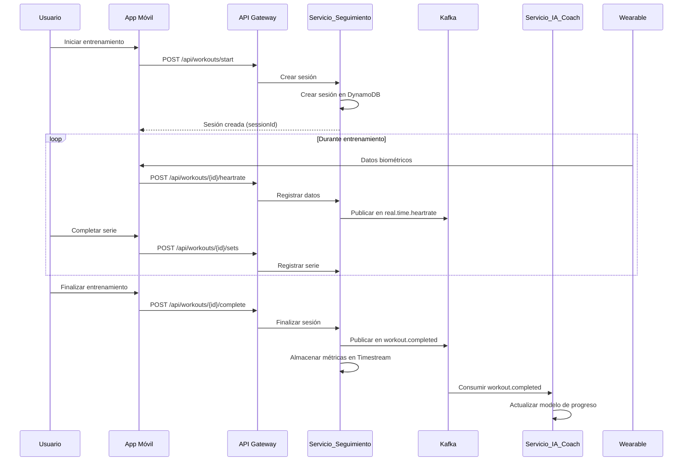
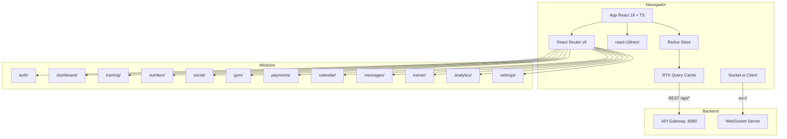
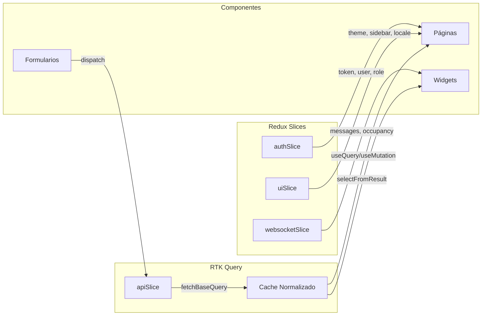
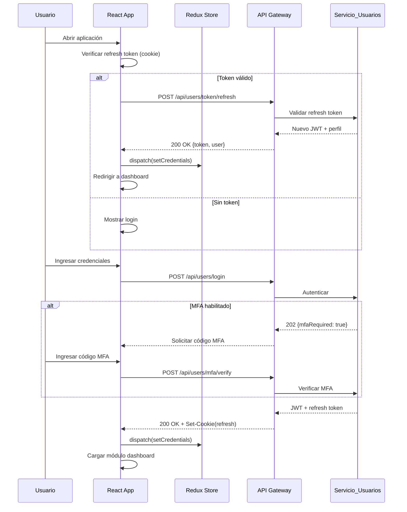
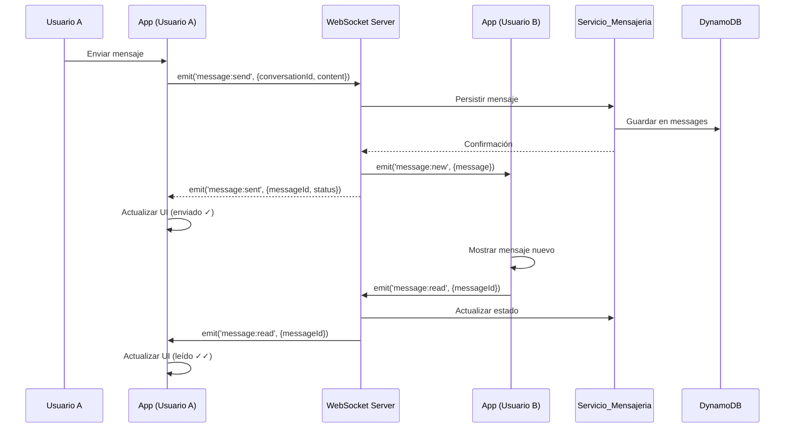
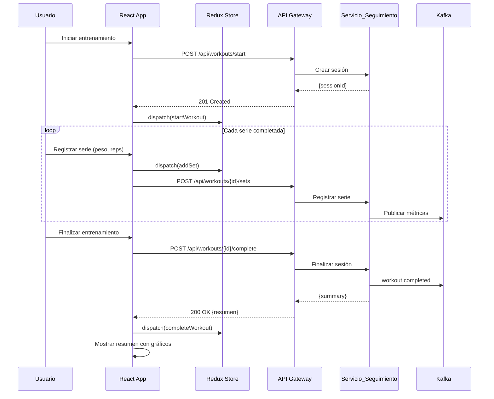

# Documento de Diseño — Spartan Golden Gym

## Visión General

Spartan Golden Gym es una plataforma integral de fitness que abarca gestión de gimnasios, entrenamiento personalizado con IA, nutrición, comunidad social, pagos y analíticas. La arquitectura se basa en microservicios desplegados en AWS EKS, comunicados mediante Kafka (Amazon MSK) para eventos asíncronos y REST/WebSocket para comunicación síncrona. El frontend se compone de una aplicación web (React 18 + TypeScript + Vite) y una aplicación móvil (React Native) con soporte offline de 72 horas.

### Decisiones de Diseño Clave

1. **Microservicios independientes**: Cada dominio de negocio (usuarios, gimnasios, entrenamiento, nutrición, pagos, social, etc.) se implementa como un microservicio Spring Boot independiente, desplegado en su propio pod de EKS.
2. **Event-driven con Kafka**: La comunicación asíncrona entre servicios se realiza mediante tópicos Kafka, permitiendo desacoplamiento y escalabilidad independiente.
3. **Base de datos por servicio (Database-per-service)**: Cada microservicio posee su propia base de datos, seleccionada según el tipo de dato (Aurora PostgreSQL para datos relacionales, DynamoDB para datos de alta velocidad, Timestream para series temporales, Neptune para grafos).
4. **API Gateway centralizado**: Todas las solicitudes pasan por un API Gateway que aplica autenticación JWT, rate limiting y enrutamiento.
5. **Offline-first en móvil**: La App_Movil almacena datos localmente y sincroniza con estrategia last-write-wins al recuperar conexión.
6. **ML como servicio**: Los modelos de IA se despliegan en SageMaker con endpoints de inferencia independientes del backend principal.

---

## Arquitectura

### Diagrama de Arquitectura de Alto Nivel

```mermaid
graph TB
    subgraph Clientes
        WEB[App Web<br/>React 18 + TS + Vite]
        MOV[App Móvil<br/>React Native]
    end

    subgraph API Layer
        GW[API Gateway<br/>Spring Cloud Gateway]
        WS[WebSocket Server<br/>Socket.io]
    end

    subgraph Microservicios
        SU[Servicio_Usuarios]
        SG[Servicio_Gimnasio]
        SE[Servicio_Entrenamiento]
        SS[Servicio_Seguimiento]
        SN[Servicio_Nutricion]
        SIA[Servicio_IA_Coach]
        SSO[Servicio_Social]
        SP[Servicio_Pagos]
        SA[Servicio_Analiticas]
        SNOT[Servicio_Notificaciones]
        SR[Servicio_Reservas]
        SM[Servicio_Mensajeria]
        SC[Servicio_Calendario]
    end

    subgraph Streaming
        KAFKA[Amazon MSK<br/>Kafka]
    end

    subgraph Bases de Datos
        PG[(Aurora PostgreSQL)]
        DDB[(DynamoDB)]
        TS[(Timestream)]
        NEP[(Neptune)]
        REDIS[(ElastiCache Redis)]
        S3[(S3 + CloudFront)]
        RS[(Redshift)]
    end

    subgraph ML
        SM_EP[SageMaker Endpoints]
        TF[TensorFlow Serving]
    end

    WEB --> GW
    MOV --> GW
    WEB --> WS
    MOV --> WS

    GW --> SU
    GW --> SG
    GW --> SE
    GW --> SS
    GW --> SN
    GW --> SIA
    GW --> SSO
    GW --> SP
    GW --> SA
    GW --> SNOT
    GW --> SR
    GW --> SM
    GW --> SC

    SU --> PG
    SU --> REDIS
    SG --> PG
    SG --> REDIS
    SE --> PG
    SS --> DDB
    SS --> TS
    SN --> PG
    SIA --> SM_EP
    SSO --> NEP
    SSO --> REDIS
    SP --> PG
    SA --> RS
    SNOT --> DDB
    SR --> PG
    SM --> DDB
    SC --> PG

    SU --> KAFKA
    SS --> KAFKA
    SN --> KAFKA
    SIA --> KAFKA
    SSO --> KAFKA
    SP --> KAFKA
    SR --> KAFKA
    SNOT --> KAFKA
```



### Diagrama de Flujo de Entrenamiento



---

## Componentes e Interfaces

### Microservicios Backend (Java 8 + Spring Boot 2.7.x)

Cada microservicio sigue la estructura estándar:
- **Controller**: Endpoints REST (Spring MVC)
- **Service**: Lógica de negocio
- **Repository**: Acceso a datos (Spring Data)
- **Event Publisher/Consumer**: Integración con Kafka (Spring Kafka)
- **DTO/Model**: Objetos de transferencia y entidades

#### 1. Servicio_Usuarios

**Responsabilidad**: Registro, autenticación, perfiles, roles y cumplimiento GDPR/LGPD.

| Endpoint | Método | Descripción |
|---|---|---|
| `/api/users/register` | POST | Registro de nuevo usuario |
| `/api/users/login` | POST | Autenticación, retorna JWT |
| `/api/users/profile` | GET/PUT | Consulta/actualización de perfil |
| `/api/users/profile/delete` | DELETE | Solicitud de eliminación GDPR |
| `/api/users/data-export` | POST | Exportación de datos (portabilidad) |
| `/api/users/mfa/setup` | POST | Configuración de MFA |
| `/api/users/onboarding` | GET/POST | Flujo de onboarding y evaluación |

**Dependencias**: Aurora PostgreSQL, Cache_Redis (sesiones JWT, bloqueo de cuentas), Kafka (eventos de usuario), Amazon SES (correo verificación).

#### 2. Servicio_Gimnasio

**Responsabilidad**: Gestión de gimnasios, ubicaciones, equipamiento y ocupación.

| Endpoint | Método | Descripción |
|---|---|---|
| `/api/gyms` | POST/GET | Crear/listar gimnasios |
| `/api/gyms/{id}` | GET/PUT | Detalle/actualización de gimnasio |
| `/api/gyms/nearby` | GET | Búsqueda por geolocalización |
| `/api/gyms/{id}/checkin` | POST | Check-in por QR |
| `/api/gyms/{id}/occupancy` | GET | Ocupación actual |
| `/api/gyms/{id}/equipment` | GET/PUT | Inventario de equipamiento |

**Dependencias**: Aurora PostgreSQL, Cache_Redis (geofences, ocupación), Kafka (gym.occupancy).

#### 3. Servicio_Entrenamiento

**Responsabilidad**: Planes de entrenamiento, rutinas, ejercicios y asignación por entrenadores.

| Endpoint | Método | Descripción |
|---|---|---|
| `/api/training/plans` | POST/GET | Crear/listar planes |
| `/api/training/plans/{id}` | GET/PUT/DELETE | CRUD de plan |
| `/api/training/plans/{id}/assign` | POST | Asignar plan a cliente |
| `/api/training/exercises` | GET | Catálogo de ejercicios |
| `/api/training/routines` | POST/GET | Gestión de rutinas |

**Dependencias**: Aurora PostgreSQL, Servicio_IA_Coach (generación de planes).

#### 4. Servicio_Seguimiento

**Responsabilidad**: Seguimiento en tiempo real de entrenamientos, datos biométricos y wearables.

| Endpoint | Método | Descripción |
|---|---|---|
| `/api/workouts/start` | POST | Iniciar sesión de entrenamiento |
| `/api/workouts/{id}/sets` | POST | Registrar serie completada |
| `/api/workouts/{id}/heartrate` | POST | Registrar frecuencia cardíaca |
| `/api/workouts/{id}/complete` | POST | Finalizar entrenamiento |
| `/api/workouts/history` | GET | Historial de entrenamientos |
| `/api/workouts/progress` | GET | Métricas de progreso |
| `/api/wearables/connect` | POST | Conectar wearable |
| `/api/wearables/sync` | POST | Sincronizar datos pendientes |

**Dependencias**: DynamoDB (sesiones), Timestream (métricas), Kafka (workout.completed, real.time.heartrate), Cache_Redis (sesiones activas).

#### 5. Servicio_Nutricion

**Responsabilidad**: Planes nutricionales, base de datos de alimentos, seguimiento de macros y recetas.

| Endpoint | Método | Descripción |
|---|---|---|
| `/api/nutrition/plans` | POST/GET | Planes nutricionales |
| `/api/nutrition/meals` | POST | Registrar comida |
| `/api/nutrition/daily-balance` | GET | Balance diario de macros |
| `/api/nutrition/foods` | GET | Base de datos de alimentos |
| `/api/nutrition/foods/barcode/{code}` | GET | Búsqueda por código de barras |
| `/api/nutrition/recipes` | GET | Recetas recomendadas |
| `/api/nutrition/supplements` | GET | Información de suplementos |

**Dependencias**: Aurora PostgreSQL, Kafka (nutrition.logs).

#### 6. Servicio_IA_Coach

**Responsabilidad**: Generación de planes personalizados, recomendaciones de ejercicios, detección de sobreentrenamiento.

| Endpoint | Método | Descripción |
|---|---|---|
| `/api/ai/plans/generate` | POST | Generar plan personalizado |
| `/api/ai/recommendations` | POST | Recomendación de ejercicio |
| `/api/ai/overtraining/check` | POST | Verificar sobreentrenamiento |
| `/api/ai/alternatives` | POST | Ejercicios alternativos |
| `/api/ai/warmup` | POST | Recomendación de calentamiento |
| `/api/ai/adherence/predict` | POST | Predicción de adherencia |

**Dependencias**: SageMaker Endpoints, Neptune (grafo de ejercicios), Kafka (ai.recommendations.request), Timestream (datos biométricos).

#### 7. Servicio_Social

**Responsabilidad**: Comunidad, desafíos, rankings, logros e interacciones sociales.

| Endpoint | Método | Descripción |
|---|---|---|
| `/api/social/challenges` | POST/GET | Crear/listar desafíos |
| `/api/social/achievements` | GET | Logros del usuario |
| `/api/social/rankings` | GET | Rankings por categoría |
| `/api/social/share` | POST | Compartir logro |
| `/api/social/groups` | POST/GET | Grupos de entrenamiento |
| `/api/social/interactions` | POST | Registrar interacción |

**Dependencias**: Neptune (relaciones sociales), Cache_Redis (rankings), Kafka (user.achievements, social.interactions), WebSocket (sincronización en vivo).

#### 8. Servicio_Pagos

**Responsabilidad**: Suscripciones, membresías, pagos y donaciones.

| Endpoint | Método | Descripción |
|---|---|---|
| `/api/payments/subscribe` | POST | Suscribirse a plan |
| `/api/payments/transactions` | GET | Historial de transacciones |
| `/api/payments/refund` | POST | Solicitar reembolso |
| `/api/payments/donations` | POST | Realizar donación |
| `/api/payments/methods` | GET/POST/DELETE | Métodos de pago |

**Dependencias**: Aurora PostgreSQL, Stripe SDK, Adyen SDK, PayPal SDK, Kafka (eventos de pago).

#### 9. Servicio_Notificaciones

**Responsabilidad**: Envío multicanal (push, email, SMS), preferencias y programación.

| Endpoint | Método | Descripción |
|---|---|---|
| `/api/notifications/preferences` | GET/PUT | Preferencias del usuario |
| `/api/notifications/history` | GET | Historial de notificaciones |
| `/api/notifications/schedule` | POST | Programar notificación |

**Dependencias**: Firebase Cloud Messaging, Amazon SES, Amazon SNS, DynamoDB (estado de entrega), Kafka (consumidor de múltiples tópicos).

#### 10. Servicio_Reservas

**Responsabilidad**: Clases grupales, listas de espera, disponibilidad de entrenadores.

| Endpoint | Método | Descripción |
|---|---|---|
| `/api/bookings/classes` | GET | Listar clases disponibles |
| `/api/bookings/classes/{id}/reserve` | POST | Reservar clase |
| `/api/bookings/classes/{id}/cancel` | POST | Cancelar reserva |
| `/api/bookings/classes` | POST | Crear clase (admin) |
| `/api/bookings/trainers/{id}/availability` | GET/PUT | Disponibilidad del entrenador |
| `/api/bookings/waitlist/{classId}` | GET | Estado de lista de espera |

**Dependencias**: Aurora PostgreSQL, Kafka (bookings.events), Servicio_Notificaciones.

#### 11. Servicio_Mensajeria

**Responsabilidad**: Chat directo, chat grupal, entrega de mensajes en tiempo real.

| Endpoint | Método | Descripción |
|---|---|---|
| `/api/messages/conversations` | GET | Listar conversaciones |
| `/api/messages/conversations/{id}` | GET | Historial de conversación |
| `/api/messages/send` | POST | Enviar mensaje |
| `/ws/chat` | WebSocket | Canal de chat en tiempo real |

**Dependencias**: DynamoDB (historial), WebSocket (entrega en tiempo real), Servicio_Notificaciones (push offline), S3 (archivos multimedia).

#### 12. Servicio_Calendario

**Responsabilidad**: Consolidación de horarios, sincronización con calendarios externos.

| Endpoint | Método | Descripción |
|---|---|---|
| `/api/calendar/events` | GET/POST | Eventos del usuario |
| `/api/calendar/events/{id}` | PUT/DELETE | Modificar/eliminar evento |
| `/api/calendar/sync` | POST | Sincronizar con calendario externo |
| `/api/calendar/conflicts` | GET | Detectar conflictos |

**Dependencias**: Aurora PostgreSQL, Google Calendar API, Apple Calendar API, Outlook Calendar API, Servicio_Notificaciones.

#### 13. Servicio_Analiticas

**Responsabilidad**: Métricas de negocio, dashboards, reportes automáticos.

| Endpoint | Método | Descripción |
|---|---|---|
| `/api/analytics/dashboard` | GET | Datos del dashboard |
| `/api/analytics/reports` | GET | Reportes generados |
| `/api/analytics/metrics` | GET | Métricas en tiempo real |

**Dependencias**: Amazon Redshift, Amazon QuickSight, Amazon CloudWatch, Kafka (consumidor de múltiples tópicos).

### API Gateway

**Tecnología**: Spring Cloud Gateway

**Funcionalidades**:
- Enrutamiento a microservicios por prefijo de ruta
- Validación de JWT en cada solicitud
- Rate limiting: 1000 req/min por usuario autenticado, 100 req/min por IP no autenticada (implementado con Redis)
- Circuit breaker (Resilience4j) para tolerancia a fallos
- Trazabilidad distribuida con AWS X-Ray

### Frontend Web (React 18 + TypeScript + Vite)

**Estructura de módulos**:
- `auth/` — Login, registro, MFA
- `dashboard/` — Dashboard personalizado
- `training/` — Planes, rutinas, seguimiento
- `nutrition/` — Planes nutricionales, registro de comidas
- `social/` — Comunidad, desafíos, rankings
- `gym/` — Mapa de gimnasios, ocupación
- `payments/` — Suscripciones, donaciones
- `calendar/` — Calendario unificado
- `messages/` — Chat y mensajería
- `trainer/` — Panel de entrenador
- `analytics/` — Panel de analíticas (admin)
- `settings/` — Configuración, preferencias, i18n

**Librerías clave**: Material-UI, Tailwind CSS, Redux Toolkit, RTK Query, Socket.io-client, Recharts, Victory, Mapbox GL JS, Video.js, react-i18next.

### Frontend Móvil (React Native)

**Estructura similar a la web** con módulos adicionales:
- `offline/` — Almacenamiento local y sincronización
- `wearables/` — Integración HealthKit/Google Fit/Huawei Health
- `camera/` — Escaneo QR, fotos de progreso, análisis de forma
- `barcode/` — Escaneo de códigos de barras de alimentos

**Librerías clave**: AsyncStorage/SQLite (offline), react-native-health, react-native-camera, react-native-maps (Mapbox), Firebase Cloud Messaging.

---

## Modelos de Datos

### Aurora PostgreSQL (Datos Relacionales)

```sql
-- Servicio_Usuarios
CREATE TABLE users (
    id UUID PRIMARY KEY DEFAULT gen_random_uuid(),
    email VARCHAR(255) UNIQUE NOT NULL,
    password_hash VARCHAR(255) NOT NULL,
    name VARCHAR(255) NOT NULL,
    date_of_birth DATE NOT NULL,
    role VARCHAR(20) NOT NULL CHECK (role IN ('client', 'trainer', 'admin')),
    locale VARCHAR(10) DEFAULT 'es',
    mfa_enabled BOOLEAN DEFAULT FALSE,
    mfa_secret VARCHAR(255),
    account_locked_until TIMESTAMP,
    failed_login_attempts INT DEFAULT 0,
    onboarding_completed BOOLEAN DEFAULT FALSE,
    profile_photo_url VARCHAR(500),
    fitness_goals JSONB,
    medical_conditions JSONB,
    created_at TIMESTAMP DEFAULT NOW(),
    updated_at TIMESTAMP DEFAULT NOW(),
    deleted_at TIMESTAMP -- soft delete para GDPR
);

-- Servicio_Gimnasio
CREATE TABLE gyms (
    id UUID PRIMARY KEY DEFAULT gen_random_uuid(),
    chain_id UUID REFERENCES gym_chains(id),
    name VARCHAR(255) NOT NULL,
    address TEXT NOT NULL,
    latitude DECIMAL(10, 8) NOT NULL,
    longitude DECIMAL(11, 8) NOT NULL,
    operating_hours JSONB NOT NULL,
    max_capacity INT NOT NULL,
    created_at TIMESTAMP DEFAULT NOW()
);

CREATE TABLE gym_equipment (
    id UUID PRIMARY KEY DEFAULT gen_random_uuid(),
    gym_id UUID REFERENCES gyms(id),
    name VARCHAR(255) NOT NULL,
    category VARCHAR(100) NOT NULL,
    quantity INT NOT NULL,
    status VARCHAR(20) DEFAULT 'available'
);

CREATE TABLE gym_checkins (
    id UUID PRIMARY KEY DEFAULT gen_random_uuid(),
    gym_id UUID REFERENCES gyms(id),
    user_id UUID NOT NULL,
    checked_in_at TIMESTAMP DEFAULT NOW(),
    checked_out_at TIMESTAMP
);

-- Servicio_Entrenamiento
CREATE TABLE training_plans (
    id UUID PRIMARY KEY DEFAULT gen_random_uuid(),
    user_id UUID NOT NULL,
    trainer_id UUID,
    name VARCHAR(255) NOT NULL,
    description TEXT,
    ai_generated BOOLEAN DEFAULT FALSE,
    status VARCHAR(20) DEFAULT 'active',
    created_at TIMESTAMP DEFAULT NOW()
);

CREATE TABLE routines (
    id UUID PRIMARY KEY DEFAULT gen_random_uuid(),
    plan_id UUID REFERENCES training_plans(id),
    name VARCHAR(255) NOT NULL,
    day_of_week INT,
    sort_order INT
);

CREATE TABLE exercises (
    id UUID PRIMARY KEY DEFAULT gen_random_uuid(),
    name VARCHAR(255) NOT NULL,
    muscle_groups JSONB NOT NULL,
    equipment_required JSONB,
    difficulty VARCHAR(20),
    video_url VARCHAR(500),
    instructions TEXT
);

CREATE TABLE routine_exercises (
    id UUID PRIMARY KEY DEFAULT gen_random_uuid(),
    routine_id UUID REFERENCES routines(id),
    exercise_id UUID REFERENCES exercises(id),
    sets INT NOT NULL,
    reps VARCHAR(50),
    rest_seconds INT,
    sort_order INT
);

-- Servicio_Nutricion
CREATE TABLE nutrition_plans (
    id UUID PRIMARY KEY DEFAULT gen_random_uuid(),
    user_id UUID NOT NULL,
    goal VARCHAR(50) NOT NULL,
    daily_calories INT,
    protein_grams INT,
    carbs_grams INT,
    fat_grams INT,
    created_at TIMESTAMP DEFAULT NOW()
);

CREATE TABLE foods (
    id UUID PRIMARY KEY DEFAULT gen_random_uuid(),
    name VARCHAR(255) NOT NULL,
    barcode VARCHAR(50),
    calories_per_100g DECIMAL(8,2),
    protein_per_100g DECIMAL(8,2),
    carbs_per_100g DECIMAL(8,2),
    fat_per_100g DECIMAL(8,2),
    micronutrients JSONB,
    region VARCHAR(50)
);

CREATE TABLE meal_logs (
    id UUID PRIMARY KEY DEFAULT gen_random_uuid(),
    user_id UUID NOT NULL,
    food_id UUID REFERENCES foods(id),
    quantity_grams DECIMAL(8,2) NOT NULL,
    meal_type VARCHAR(20) NOT NULL,
    logged_at TIMESTAMP DEFAULT NOW()
);

-- Servicio_Pagos
CREATE TABLE subscriptions (
    id UUID PRIMARY KEY DEFAULT gen_random_uuid(),
    user_id UUID NOT NULL,
    plan_type VARCHAR(50) NOT NULL,
    status VARCHAR(20) NOT NULL,
    payment_provider VARCHAR(20) NOT NULL,
    external_subscription_id VARCHAR(255),
    started_at TIMESTAMP NOT NULL,
    expires_at TIMESTAMP,
    retry_count INT DEFAULT 0
);

CREATE TABLE transactions (
    id UUID PRIMARY KEY DEFAULT gen_random_uuid(),
    user_id UUID NOT NULL,
    subscription_id UUID REFERENCES subscriptions(id),
    amount DECIMAL(10,2) NOT NULL,
    currency VARCHAR(3) NOT NULL,
    type VARCHAR(20) NOT NULL,
    status VARCHAR(20) NOT NULL,
    payment_provider VARCHAR(20) NOT NULL,
    external_transaction_id VARCHAR(255),
    created_at TIMESTAMP DEFAULT NOW()
);

CREATE TABLE donations (
    id UUID PRIMARY KEY DEFAULT gen_random_uuid(),
    donor_id UUID NOT NULL,
    creator_id UUID NOT NULL,
    amount DECIMAL(10,2) NOT NULL,
    currency VARCHAR(3) NOT NULL,
    message TEXT,
    paypal_transaction_id VARCHAR(255),
    created_at TIMESTAMP DEFAULT NOW()
);

-- Servicio_Reservas
CREATE TABLE group_classes (
    id UUID PRIMARY KEY DEFAULT gen_random_uuid(),
    gym_id UUID NOT NULL,
    instructor_id UUID NOT NULL,
    name VARCHAR(255) NOT NULL,
    room VARCHAR(100),
    max_capacity INT NOT NULL,
    current_capacity INT DEFAULT 0,
    difficulty_level VARCHAR(20),
    scheduled_at TIMESTAMP NOT NULL,
    duration_minutes INT NOT NULL
);

CREATE TABLE class_reservations (
    id UUID PRIMARY KEY DEFAULT gen_random_uuid(),
    class_id UUID REFERENCES group_classes(id),
    user_id UUID NOT NULL,
    status VARCHAR(20) DEFAULT 'confirmed',
    penalty_count INT DEFAULT 0,
    reserved_at TIMESTAMP DEFAULT NOW(),
    cancelled_at TIMESTAMP
);

CREATE TABLE waitlist (
    id UUID PRIMARY KEY DEFAULT gen_random_uuid(),
    class_id UUID REFERENCES group_classes(id),
    user_id UUID NOT NULL,
    position INT NOT NULL,
    added_at TIMESTAMP DEFAULT NOW()
);

CREATE TABLE trainer_availability (
    id UUID PRIMARY KEY DEFAULT gen_random_uuid(),
    trainer_id UUID NOT NULL,
    day_of_week INT NOT NULL,
    start_time TIME NOT NULL,
    end_time TIME NOT NULL
);

-- Servicio_Calendario
CREATE TABLE calendar_events (
    id UUID PRIMARY KEY DEFAULT gen_random_uuid(),
    user_id UUID NOT NULL,
    event_type VARCHAR(30) NOT NULL,
    reference_id UUID,
    title VARCHAR(255) NOT NULL,
    starts_at TIMESTAMP NOT NULL,
    ends_at TIMESTAMP NOT NULL,
    reminder_minutes INT DEFAULT 30,
    external_calendar_id VARCHAR(255),
    created_at TIMESTAMP DEFAULT NOW()
);

-- Auditoría
CREATE TABLE audit_log (
    id BIGSERIAL PRIMARY KEY,
    user_id UUID,
    action VARCHAR(100) NOT NULL,
    resource_type VARCHAR(100) NOT NULL,
    resource_id VARCHAR(255),
    details JSONB,
    ip_address VARCHAR(45),
    created_at TIMESTAMP DEFAULT NOW()
);
```

### DynamoDB (Datos de Alta Velocidad)

```
Tabla: workout_sessions
  PK: userId (String)
  SK: sessionId (String)
  Atributos: startedAt, completedAt, exercises[], totalDuration, caloriesBurned, status

Tabla: workout_sets
  PK: sessionId (String)
  SK: setId (String)
  Atributos: exerciseId, weight, reps, restSeconds, timestamp

Tabla: user_achievements
  PK: userId (String)
  SK: achievementId (String)
  Atributos: type, name, earnedAt, metadata

Tabla: user_preferences
  PK: userId (String)
  SK: preferenceKey (String)
  Atributos: value, updatedAt

Tabla: messages
  PK: conversationId (String)
  SK: messageId (String)
  Atributos: senderId, content, contentType, status, sentAt, readAt

Tabla: conversations
  PK: userId (String)
  SK: conversationId (String)
  Atributos: participantIds, type, lastMessageAt, unreadCount

Tabla: notification_delivery
  PK: userId (String)
  SK: notificationId (String)
  Atributos: channel, status, content, sentAt, readAt, retryCount
```

### Timestream (Series Temporales)

```
Base de datos: spartan_metrics

Tabla: heartrate_data
  Dimensiones: userId, sessionId, deviceType
  Medidas: bpm (BIGINT), timestamp

Tabla: workout_metrics
  Dimensiones: userId, exerciseId, muscleGroup
  Medidas: weight, reps, volume, duration, timestamp

Tabla: biometric_data
  Dimensiones: userId, dataType, source
  Medidas: value (DOUBLE), timestamp

Tabla: performance_metrics
  Dimensiones: serviceId, endpoint, method
  Medidas: latency, statusCode, timestamp
```

### Neptune (Grafo)

```
Nodos:
  - User (id, name)
  - Exercise (id, name, muscleGroups)
  - MuscleGroup (id, name)
  - Challenge (id, name)
  - Group (id, name)

Aristas:
  - User -[FOLLOWS]-> User
  - User -[FRIEND_OF]-> User
  - User -[MEMBER_OF]-> Group
  - User -[COMPLETED]-> Exercise (weight, reps, date)
  - User -[PARTICIPATES_IN]-> Challenge
  - Exercise -[TARGETS]-> MuscleGroup
  - Exercise -[ALTERNATIVE_TO]-> Exercise
```

### Redis (Cache)

```
Claves:
  session:{userId}          -> JWT token data (TTL: configurable)
  lockout:{email}           -> intentos fallidos (TTL: 15 min)
  ranking:{category}        -> Sorted Set con scores
  geofence:gyms             -> GeoSet con coordenadas de gimnasios
  occupancy:{gymId}         -> INT con ocupación actual
  ratelimit:{userId}        -> Contador de solicitudes (TTL: 60s)
  ratelimit:ip:{ip}         -> Contador de solicitudes IP (TTL: 60s)
  plan:active:{userId}      -> Plan de entrenamiento activo en caché
  class:capacity:{classId}  -> Capacidad disponible de clase
```

### Tópicos Kafka

| Tópico | Particiones | Retención | Productores | Consumidores |
|---|---|---|---|---|
| workout.completed | 20 | 7d | Servicio_Seguimiento | Servicio_IA_Coach, Servicio_Social, Servicio_Analiticas |
| user.achievements | 10 | 7d | Servicio_Social | Servicio_Notificaciones, Servicio_Analiticas |
| real.time.heartrate | 50 | 24h | Servicio_Seguimiento | Servicio_IA_Coach (sobreentrenamiento) |
| ai.recommendations.request | 15 | 7d | Servicio_IA_Coach | Servicio_Analiticas |
| social.interactions | 20 | 7d | Servicio_Social | Servicio_Analiticas |
| nutrition.logs | 20 | 7d | Servicio_Nutricion | Servicio_IA_Coach, Servicio_Analiticas |
| gym.occupancy | 10 | 24h | Servicio_Gimnasio | App_Web, App_Movil (vía WebSocket) |
| bookings.events | 10 | 7d | Servicio_Reservas | Servicio_Calendario, Servicio_Notificaciones |

---

## Propiedades de Corrección

*Una propiedad es una característica o comportamiento que debe mantenerse verdadero en todas las ejecuciones válidas de un sistema — esencialmente, una declaración formal sobre lo que el sistema debe hacer. Las propiedades sirven como puente entre especificaciones legibles por humanos y garantías de corrección verificables por máquinas.*

### Propiedad 1: Round-trip de registro y autenticación

*Para cualquier* conjunto válido de datos de usuario (nombre, email, contraseña, fecha de nacimiento), registrar al usuario y luego autenticarse con las mismas credenciales debe retornar un token JWT válido, y el perfil recuperado debe contener los mismos datos proporcionados en el registro.

**Valida: Requisitos 1.1, 1.4**

### Propiedad 2: Unicidad de email en registro

*Para cualquier* email ya registrado en el sistema, un intento de registro con el mismo email debe ser rechazado y el número total de usuarios no debe cambiar.

**Valida: Requisito 1.2**

### Propiedad 3: Bloqueo de cuenta por intentos fallidos

*Para cualquier* usuario registrado, después de exactamente 5 intentos de login con contraseña incorrecta, el siguiente intento (incluso con credenciales correctas) debe ser rechazado durante 15 minutos.

**Valida: Requisito 1.5**

### Propiedad 4: Round-trip de actualización de perfil

*Para cualquier* usuario y cualquier conjunto válido de datos de perfil (foto, datos personales, objetivos, condiciones médicas), actualizar el perfil y luego consultarlo debe retornar los mismos datos actualizados.

**Valida: Requisito 1.6**

### Propiedad 5: Cifrado de contraseñas con bcrypt

*Para cualquier* contraseña almacenada en el sistema, el hash debe ser un hash bcrypt válido con un factor de coste mínimo de 12.

**Valida: Requisito 1.7**

### Propiedad 6: Eliminación de datos personales (GDPR)

*Para cualquier* usuario que solicite la eliminación de su cuenta, después de procesar la solicitud, los datos personales y biométricos del usuario no deben ser recuperables mediante ninguna consulta al sistema.

**Valida: Requisito 1.8**

### Propiedad 7: Round-trip de registro de gimnasio

*Para cualquier* conjunto válido de datos de gimnasio (nombre, dirección, coordenadas, horarios, equipamiento), registrar el gimnasio y luego consultarlo debe retornar los mismos datos, incluyendo la asociación correcta a su cadena.

**Valida: Requisitos 2.1, 2.2**

### Propiedad 8: Ordenamiento por distancia en búsqueda de gimnasios cercanos

*Para cualquier* ubicación de usuario y conjunto de gimnasios registrados, la consulta de gimnasios cercanos debe retornar resultados ordenados de menor a mayor distancia desde la ubicación del usuario.

**Valida: Requisito 2.3**

### Propiedad 9: Check-in verifica membresía activa

*Para cualquier* usuario con membresía activa, el check-in por QR debe ser exitoso. *Para cualquier* usuario sin membresía activa, el check-in debe ser rechazado.

**Valida: Requisito 2.4**

### Propiedad 10: Round-trip de inventario de equipamiento

*Para cualquier* actualización de inventario de equipamiento de un gimnasio, consultar el catálogo después de la actualización debe reflejar los cambios realizados.

**Valida: Requisito 2.6**

### Propiedad 11: Plan de entrenamiento respeta condiciones médicas

*Para cualquier* usuario con condiciones médicas declaradas (problemas de espalda, trombosis, diabetes, etc.), el plan generado por el Servicio_IA_Coach no debe incluir ejercicios contraindicados para esas condiciones.

**Valida: Requisitos 3.1, 3.2**

### Propiedad 12: Calentamiento incluido en rutinas

*Para cualquier* rutina generada por el Servicio_IA_Coach, debe incluir ejercicios de calentamiento previos apropiados al tipo de ejercicio planificado.

**Valida: Requisito 3.5**

### Propiedad 13: Ejercicios alternativos para mismo grupo muscular

*Para cualquier* ejercicio que requiere equipamiento no disponible, las alternativas sugeridas por el Servicio_IA_Coach deben trabajar los mismos grupos musculares que el ejercicio original.

**Valida: Requisito 3.6**

### Propiedad 14: Rutinas sin equipamiento cuando no hay acceso

*Para cualquier* usuario que indica no tener acceso a equipamiento, todos los ejercicios en el plan generado deben tener `equipment_required` vacío o nulo.

**Valida: Requisito 3.9**

### Propiedad 15: Detección de sobreentrenamiento genera alerta

*Para cualquier* conjunto de datos biométricos que indique sobreentrenamiento (frecuencia cardíaca en reposo elevada, disminución de rendimiento, fatiga acumulada), el Servicio_IA_Coach debe generar una recomendación de descanso.

**Valida: Requisitos 3.3, 18.3**

### Propiedad 16: Progresión automática de carga

*Para cualquier* usuario con historial de rendimiento consistente (completando series con el peso asignado), el siguiente plan generado debe incluir un incremento en carga o volumen respecto al plan anterior.

**Valida: Requisito 3.8**

### Propiedad 17: Round-trip de sesión de entrenamiento

*Para cualquier* usuario que inicia un entrenamiento, registra series (peso, repeticiones, descanso) y finaliza la sesión, el historial debe contener la sesión completa con todos los datos registrados.

**Valida: Requisitos 4.1, 4.3, 4.6**

### Propiedad 18: Métricas de rendimiento almacenadas en Timestream

*Para cualquier* sesión de entrenamiento completada, las métricas de rendimiento deben ser consultables en Timestream con los valores correctos.

**Valida: Requisito 4.9**

### Propiedad 19: Balance diario de macronutrientes es suma de comidas

*Para cualquier* secuencia de comidas registradas en un día, el balance diario de calorías y macronutrientes debe ser igual a la suma de los valores nutricionales de todas las comidas registradas.

**Valida: Requisito 5.4**

### Propiedad 20: Alimentos en base de datos tienen información nutricional completa

*Para cualquier* alimento en la base de datos, debe tener valores no nulos para calorías, proteínas, carbohidratos y grasas.

**Valida: Requisito 5.2**

### Propiedad 21: Round-trip de búsqueda por código de barras

*Para cualquier* alimento con código de barras registrado, escanear ese código debe retornar la información nutricional correcta del producto.

**Valida: Requisito 5.3**

### Propiedad 22: Recetas recomendadas respetan objetivos y preferencias

*Para cualquier* usuario con objetivos nutricionales y preferencias alimentarias, las recetas recomendadas deben estar dentro de los rangos de macronutrientes del plan y no contener ingredientes excluidos por las preferencias.

**Valida: Requisito 5.5**

### Propiedad 23: Notificación por déficit/exceso de macros tras 3 días

*Para cualquier* usuario con 3 días consecutivos de déficit o exceso significativo de macronutrientes, el sistema debe generar una notificación con recomendaciones de ajuste.

**Valida: Requisito 5.7**

### Propiedad 24: Rankings ordenados correctamente por categoría

*Para cualquier* categoría de ranking (fuerza, resistencia, consistencia, nutrición) y conjunto de puntuaciones de usuarios, el ranking debe estar ordenado de mayor a menor puntuación.

**Valida: Requisito 6.3**

### Propiedad 25: Insignia otorgada al completar desafío

*Para cualquier* usuario que cumple todos los objetivos de un desafío, debe recibir la insignia correspondiente y el evento debe ser publicado.

**Valida: Requisito 6.2**

### Propiedad 26: Relaciones sociales persistidas en grafo

*Para cualquier* relación social creada (seguir, amistad, membresía de grupo), la relación debe ser consultable en el grafo de Neptune.

**Valida: Requisito 6.7**

### Propiedad 27: Suscripción activada tras pago exitoso

*Para cualquier* pago de suscripción procesado exitosamente, la membresía del usuario debe estar activa y la transacción registrada con auditoría completa.

**Valida: Requisitos 7.2, 7.5**

### Propiedad 28: Reintento de pago fallido y suspensión

*Para cualquier* pago recurrente que falla, el sistema debe reintentar hasta 3 veces. Si los 3 reintentos fallan, la membresía debe ser suspendida.

**Valida: Requisitos 7.3, 7.4**

### Propiedad 29: Reembolso dentro del período de garantía

*Para cualquier* solicitud de reembolso dentro del período de garantía, el reembolso debe ser procesado y la membresía actualizada. *Para cualquier* solicitud fuera del período, debe ser rechazada.

**Valida: Requisito 7.7**

### Propiedad 30: Round-trip de datos de wearable

*Para cualquier* dato biométrico sincronizado desde un wearable (frecuencia cardíaca, pasos, calorías, sueño), los datos deben ser almacenados y consultables con los valores correctos.

**Valida: Requisitos 8.2, 8.3**

### Propiedad 31: Sincronización offline preserva datos

*Para cualquier* conjunto de datos registrados offline (entrenamientos, series, repeticiones), al recuperar conexión y sincronizar, todos los datos deben estar presentes en el backend en orden cronológico.

**Valida: Requisitos 9.1, 9.2, 9.4**

### Propiedad 32: Resolución de conflictos last-write-wins

*Para cualquier* par de escrituras conflictivas (una offline y una online) sobre el mismo recurso, la sincronización debe preservar la escritura con timestamp más reciente.

**Valida: Requisito 9.4**

### Propiedad 33: Entrenador asigna y modifica planes de clientes

*Para cualquier* entrenador y cliente asignado, el entrenador debe poder crear un plan, asignarlo al cliente, y el cliente debe poder consultar el plan asignado con todos los datos correctos.

**Valida: Requisitos 10.2, 10.5**

### Propiedad 34: Notificación al entrenador cuando cliente completa entrenamiento

*Para cualquier* cliente con entrenador asignado que completa un entrenamiento, el entrenador debe recibir una notificación con el resumen de la sesión.

**Valida: Requisito 10.3**

### Propiedad 35: API Gateway aplica rate limiting

*Para cualquier* usuario autenticado que excede 1000 solicitudes por minuto, las solicitudes adicionales deben ser rechazadas con código 429. *Para cualquier* IP no autenticada que excede 100 solicitudes por minuto, las solicitudes deben ser rechazadas.

**Valida: Requisitos 11.1, 13.6**

### Propiedad 36: Circuit breaker activa ante fallo de microservicio

*Para cualquier* microservicio que falla, el circuit breaker debe activarse y las solicitudes deben ser redirigidas a instancias saludables sin pérdida de datos.

**Valida: Requisito 11.6**

### Propiedad 37: MFA requerido cuando está habilitado

*Para cualquier* usuario con MFA habilitado, el login con solo usuario y contraseña debe ser insuficiente — se debe requerir el segundo factor para completar la autenticación.

**Valida: Requisito 13.2**

### Propiedad 38: Exportación de datos del usuario (portabilidad)

*Para cualquier* usuario que solicita exportación de datos, el archivo generado debe contener todos los datos personales, entrenamientos, nutrición y datos biométricos del usuario.

**Valida: Requisito 13.4**

### Propiedad 39: Log de auditoría inmutable para datos sensibles

*Para cualquier* acceso o modificación a datos sensibles, debe existir una entrada en el log de auditoría con usuario, acción, recurso, timestamp e IP.

**Valida: Requisito 13.5**

### Propiedad 40: Traducciones completas para todos los idiomas soportados

*Para cualquier* clave de traducción en el idioma base, debe existir una traducción correspondiente en cada uno de los 5 idiomas soportados (inglés, español, francés, alemán, japonés).

**Valida: Requisitos 14.1, 14.2**

### Propiedad 41: Formato de fecha, hora, moneda y unidades según locale

*Para cualquier* locale configurado, las fechas, horas, monedas y unidades de medida deben formatearse según las convenciones de esa región.

**Valida: Requisito 14.3**

### Propiedad 42: Videos de ejercicios vinculados a planes

*Para cualquier* ejercicio en un plan de entrenamiento que tiene video tutorial, la URL del video debe estar presente y ser accesible.

**Valida: Requisito 15.2**

### Propiedad 43: Notificaciones respetan preferencias del usuario

*Para cualquier* evento que genera una notificación, el sistema debe respetar las preferencias del usuario por categoría y canal. Si el usuario ha deshabilitado una categoría o canal, la notificación no debe ser enviada por ese medio.

**Valida: Requisitos 22.1, 22.3, 22.5**

### Propiedad 44: Retención de notificaciones durante horas silenciosas

*Para cualquier* notificación no urgente generada durante las horas silenciosas del usuario, la notificación debe ser retenida y entregada al finalizar el período silencioso.

**Valida: Requisito 22.4**

### Propiedad 45: Round-trip de estado de entrega de notificaciones

*Para cualquier* notificación enviada, su estado de entrega (enviada, recibida, leída, fallida) debe ser rastreable y consultable.

**Valida: Requisito 22.6**

### Propiedad 46: Reintento de notificación push fallida

*Para cualquier* notificación push que falla en la entrega, el sistema debe reintentar hasta 3 veces con intervalos exponenciales.

**Valida: Requisito 22.7**

### Propiedad 47: Reserva de clase decrementa capacidad

*Para cualquier* clase grupal con disponibilidad, al confirmar una reserva, la capacidad disponible debe decrementarse en exactamente 1. La capacidad nunca debe ser negativa.

**Valida: Requisito 23.2**

### Propiedad 48: Lista de espera cuando clase está llena

*Para cualquier* clase grupal que ha alcanzado su capacidad máxima, un intento de reserva debe agregar al usuario a la lista de espera con la posición correcta.

**Valida: Requisito 23.3**

### Propiedad 49: Cancelación con anticipación libera cupo para lista de espera

*Para cualquier* cancelación de reserva con al menos 2 horas de anticipación, el cupo debe liberarse y ofrecerse al primer usuario en la lista de espera.

**Valida: Requisito 23.4**

### Propiedad 50: Penalización por cancelación tardía

*Para cualquier* cancelación de reserva con menos de 2 horas de anticipación, se debe registrar una penalización en el perfil del usuario.

**Valida: Requisito 23.5**

### Propiedad 51: Filtrado de clases respeta todos los criterios

*Para cualquier* combinación de filtros (tipo, instructor, horario, dificultad, ubicación), todas las clases retornadas deben cumplir con todos los filtros aplicados simultáneamente.

**Valida: Requisito 23.7**

### Propiedad 52: Alerta de baja ocupación 24h antes de clase

*Para cualquier* clase grupal con menos del 50% de ocupación a 24 horas de su inicio, el sistema debe generar una alerta al administrador del gimnasio.

**Valida: Requisito 23.9**

### Propiedad 53: Onboarding completo genera perfil activo y primer plan

*Para cualquier* usuario que completa el flujo de onboarding (cuestionario, evaluación), el perfil debe marcarse como activo y debe existir un Plan_Entrenamiento personalizado generado.

**Valida: Requisitos 24.1, 24.2, 24.3, 24.6**

### Propiedad 54: Onboarding parcial se guarda y es reanudable

*Para cualquier* usuario que abandona el onboarding antes de completarlo, el progreso parcial debe ser guardado. Al retomar, los datos previamente ingresados deben estar presentes. Omitir pasos opcionales no debe impedir la generación del plan.

**Valida: Requisitos 24.7, 24.8**

### Propiedad 55: Round-trip de mensajería directa

*Para cualquier* mensaje enviado entre dos usuarios, el mensaje debe ser almacenado y recuperable en el historial de conversación con contenido, remitente y timestamp correctos.

**Valida: Requisitos 25.1, 25.4, 25.5**

### Propiedad 56: Límite de participantes en chat grupal

*Para cualquier* chat grupal, debe soportar hasta 100 participantes. Intentar agregar el participante 101 debe ser rechazado.

**Valida: Requisito 25.2**

### Propiedad 57: Acuse de lectura actualiza estado del mensaje

*Para cualquier* mensaje leído por el destinatario, el estado del mensaje debe actualizarse a "leído".

**Valida: Requisito 25.6**

### Propiedad 58: Mensaje a usuario offline se almacena y genera push

*Para cualquier* mensaje enviado a un usuario no conectado, el mensaje debe almacenarse y una notificación push debe ser generada.

**Valida: Requisito 25.7**

### Propiedad 59: Calendario unificado consolida todas las actividades

*Para cualquier* usuario con entrenamientos programados, reservas de clases, sesiones con entrenador y recordatorios de nutrición, la vista de calendario debe incluir todos estos eventos.

**Valida: Requisito 26.1**

### Propiedad 60: Detección de conflictos en calendario

*Para cualquier* par de eventos que se solapan en tiempo, el sistema debe detectar el conflicto y alertar al usuario al intentar programar el segundo evento.

**Valida: Requisito 26.2**

### Propiedad 61: Recordatorios configurables generados correctamente

*Para cualquier* evento con recordatorio configurado (15, 30 o 60 minutos antes), el sistema debe generar el recordatorio en el momento correcto.

**Valida: Requisito 26.6**

### Propiedad 62: Round-trip de donación a creador

*Para cualquier* donación realizada, la transacción debe registrarse con donante, creador, monto y mensaje, y el creador debe recibir una notificación.

**Valida: Requisitos 19.2, 19.4**

### Propiedad 63: Recomendaciones de ejercicios basadas en grafo

*Para cualquier* perfil de usuario, las recomendaciones de ejercicios generadas usando el grafo de Neptune deben incluir ejercicios conectados al historial y objetivos del usuario.

**Valida: Requisito 18.2**

### Propiedad 64: Feedback de recomendaciones registrado

*Para cualquier* recomendación generada por el Servicio_IA_Coach, la respuesta del usuario (aceptada, rechazada, modificada) debe ser registrada para retroalimentar el modelo.

**Valida: Requisito 18.6**

### Propiedad 65: Contraste de color cumple ratio mínimo

*Para cualquier* componente de interfaz, el ratio de contraste debe ser al menos 4.5:1 para texto normal y 3:1 para texto grande.

**Valida: Requisito 29.3**

### Propiedad 66: Etiquetas descriptivas en elementos interactivos

*Para cualquier* elemento interactivo (botón, campo de formulario, icono de acción) en la interfaz, debe tener una etiqueta descriptiva (aria-label en web, contentDescription en móvil).

**Valida: Requisito 29.7**

### Propiedad 67: Publicación de eventos en Kafka

*Para cualquier* acción que genera un evento de dominio (entrenamiento completado, logro obtenido, interacción social, comida registrada, reserva realizada, recomendación generada), el evento debe ser publicado en el tópico Kafka correspondiente con los datos completos.

**Valida: Requisitos 3.11, 4.5, 5.4, 6.2, 6.8, 23.8**

---

## Manejo de Errores

### Estrategia General

Cada microservicio implementa un manejo de errores consistente basado en:

1. **Excepciones de dominio tipadas**: Cada servicio define excepciones específicas (ej. `UserNotFoundException`, `MembershipExpiredException`, `ClassFullException`).
2. **Global Exception Handler**: Un `@ControllerAdvice` en cada microservicio traduce excepciones a respuestas HTTP estandarizadas.
3. **Formato de error uniforme**:
```json
{
  "error": "MEMBERSHIP_EXPIRED",
  "message": "La membresía del usuario ha expirado",
  "timestamp": "2024-01-15T10:30:00Z",
  "traceId": "abc-123-def"
}
```

### Códigos HTTP Estándar

| Código | Uso |
|---|---|
| 400 | Datos de entrada inválidos, validación fallida |
| 401 | Token JWT ausente, expirado o inválido |
| 403 | Permisos insuficientes para la operación |
| 404 | Recurso no encontrado |
| 409 | Conflicto (email duplicado, reserva duplicada) |
| 429 | Rate limit excedido |
| 500 | Error interno del servidor |
| 503 | Servicio no disponible (circuit breaker abierto) |

### Manejo por Servicio

- **Servicio_Usuarios**: Bloqueo de cuenta (5 intentos), validación de MFA, expiración de tokens.
- **Servicio_Pagos**: Reintentos de pago (3 intentos, 24h), suspensión de membresía, rollback de transacciones fallidas.
- **Servicio_Reservas**: Clase llena → lista de espera, cancelación tardía → penalización, conflictos de horario.
- **Servicio_Mensajeria**: Destinatario offline → almacenar + push, fallo de entrega → reintento.
- **Servicio_Notificaciones**: Fallo de push → 3 reintentos exponenciales, horas silenciosas → retención.
- **Servicio_Seguimiento**: Desconexión de wearable → almacenamiento local, sincronización posterior.
- **API Gateway**: Circuit breaker (Resilience4j) con estados closed/open/half-open, fallback a respuestas degradadas.

### Resiliencia

- **Circuit Breaker**: Resilience4j con umbral de 50% de fallos en ventana de 10 solicitudes, tiempo de espera en estado abierto de 30 segundos.
- **Retry**: Reintentos con backoff exponencial para operaciones idempotentes.
- **Timeout**: Timeouts configurables por servicio (default 5s para operaciones síncronas).
- **Dead Letter Queue**: Mensajes Kafka que fallan después de 3 reintentos se envían a DLQ para análisis.

---

## Estrategia de Testing

### Enfoque Dual: Tests Unitarios + Tests Basados en Propiedades

La estrategia de testing combina tests unitarios para casos específicos y edge cases con tests basados en propiedades para verificar invariantes universales.

### Tests Unitarios

**Framework**: JUnit 5 + Mockito (backend), Jest + React Testing Library (frontend)

**Cobertura**:
- Casos específicos de cada endpoint (happy path y error path)
- Edge cases: strings vacíos, valores nulos, límites numéricos, fechas inválidas
- Integración entre servicios con mocks de Kafka y bases de datos
- Validación de DTOs y mapeo de entidades

### Tests Basados en Propiedades

**Framework**: jqwik (Java) para backend, fast-check (TypeScript) para frontend

**Configuración**:
- Mínimo 100 iteraciones por test de propiedad
- Cada test debe referenciar la propiedad del documento de diseño
- Formato de tag: **Feature: spartan-golden-gym, Property {número}: {título}**

**Propiedades a implementar**:

Cada propiedad definida en la sección de Propiedades de Corrección (1-67) debe ser implementada como un único test basado en propiedades. Los generadores deben cubrir:
- Datos de usuario con variaciones de roles, locales y condiciones médicas
- Datos de gimnasio con coordenadas GPS aleatorias
- Ejercicios con diferentes grupos musculares y requisitos de equipamiento
- Datos nutricionales con rangos realistas de macronutrientes
- Transacciones de pago con diferentes monedas y montos
- Mensajes con diferentes tipos de contenido
- Eventos de calendario con solapamientos aleatorios

### Tests de Integración

**Framework**: Spring Boot Test + Testcontainers

- Tests de integración con contenedores Docker para PostgreSQL, DynamoDB Local, Redis y Kafka
- Verificación de flujos end-to-end: registro → onboarding → plan → entrenamiento → progreso
- Tests de sincronización offline con simulación de desconexión

### Tests de Accesibilidad

- axe-core integrado en pipeline CI/CD para web
- Accessibility Scanner para Android
- Accessibility Inspector para iOS

### Tests de Rendimiento

- k6 o Gatling para pruebas de carga antes de cada release
- Simulación de 100,000 usuarios concurrentes
- Umbrales: p95 < 300ms, p99 < 1s


# Documento de Requisitos — Spartan Golden Gym

## Introducción

Spartan Golden Gym es una plataforma integral de entrenamiento físico que combina gestión de gimnasios, planes personalizados por inteligencia artificial, seguimiento de entrenamientos en tiempo real, nutrición integrada y comunidad social. La plataforma está dirigida a usuarios individuales y cadenas de gimnasios con múltiples ubicaciones. Se desplegará como aplicación móvil (Android/iOS vía React Native), aplicación web (React + TypeScript) y backend basado en microservicios (Java 8, Spring Boot). La infraestructura se alojará en AWS con soporte para 100,000 usuarios concurrentes.

## Glosario

- **Plataforma**: El sistema completo de Spartan Golden Gym, incluyendo backend, frontend web y aplicación móvil.
- **Servicio_Usuarios**: Microservicio responsable de la gestión de perfiles de clientes, entrenadores y administradores.
- **Servicio_Gimnasio**: Microservicio responsable de la gestión de gimnasios, ubicaciones y equipamiento.
- **Servicio_Entrenamiento**: Microservicio responsable de planes de entrenamiento, rutinas y ejercicios.
- **Servicio_Seguimiento**: Microservicio responsable del seguimiento de entrenamientos en tiempo real.
- **Servicio_Nutricion**: Microservicio responsable de planes nutricionales, recetas y seguimiento de comidas.
- **Servicio_IA_Coach**: Microservicio con motor de inteligencia artificial para recomendaciones personalizadas.
- **Servicio_Social**: Microservicio responsable de la comunidad, desafíos y rankings.
- **Servicio_Pagos**: Microservicio responsable de suscripciones, membresías y pagos.
- **Servicio_Analiticas**: Microservicio responsable de métricas de rendimiento, retención y engagement.
- **API_Gateway**: Punto de entrada único para todas las solicitudes de los clientes hacia los microservicios.
- **App_Movil**: Aplicación móvil desarrollada en React Native para Android e iOS.
- **App_Web**: Aplicación web desarrollada en React 18 + TypeScript + Vite.
- **Usuario**: Persona registrada en la Plataforma con rol de cliente.
- **Entrenador**: Persona registrada en la Plataforma con rol de entrenador personal.
- **Administrador**: Persona registrada en la Plataforma con rol de gestión de gimnasio o sistema.
- **Plan_Entrenamiento**: Conjunto estructurado de rutinas y ejercicios generado o personalizado por el Servicio_IA_Coach.
- **Wearable**: Dispositivo portátil de monitoreo biométrico (Apple Watch, Fitbit, Garmin, etc.).
- **Modelo_ML**: Modelo de aprendizaje automático desplegado en TensorFlow Serving o SageMaker.
- **Kafka**: Sistema de streaming de eventos para comunicación asíncrona entre microservicios.
- **Cache_Redis**: Clúster de Redis utilizado para sesiones, rankings en tiempo real y geofences.
- **Servicio_Notificaciones**: Microservicio responsable del envío, programación y gestión de notificaciones push, correo electrónico y SMS.
- **Servicio_Reservas**: Microservicio responsable de la gestión de reservas de clases grupales, horarios de entrenadores y capacidad de salas.
- **Servicio_Mensajeria**: Microservicio responsable del sistema de mensajería directa y chat grupal entre usuarios y entrenadores.
- **Servicio_Calendario**: Microservicio responsable de la gestión de horarios, programación de sesiones y sincronización con calendarios externos.
- **Clase_Grupal**: Sesión de entrenamiento dirigida por un instructor con capacidad limitada y horario definido.
- **Lista_Espera**: Cola de usuarios que desean inscribirse en una Clase_Grupal que ha alcanzado su capacidad máxima.
- **RTO**: Recovery Time Objective — tiempo máximo aceptable para restaurar el servicio después de una interrupción.
- **RPO**: Recovery Point Objective — cantidad máxima aceptable de pérdida de datos medida en tiempo.

## Requisitos

### Requisito 1: Registro y Gestión de Usuarios

**Historia de Usuario:** Como usuario, quiero registrarme y gestionar mi perfil en la plataforma, para poder acceder a todas las funcionalidades de entrenamiento y comunidad.

#### Criterios de Aceptación

1. WHEN un usuario completa el formulario de registro con datos válidos (nombre, correo electrónico, contraseña, fecha de nacimiento), THE Servicio_Usuarios SHALL crear una cuenta y enviar un correo de verificación en un máximo de 5 segundos.
2. WHEN un usuario intenta registrarse con un correo electrónico ya existente, THE Servicio_Usuarios SHALL rechazar el registro y mostrar un mensaje indicando que el correo ya está en uso.
3. THE Servicio_Usuarios SHALL soportar tres roles de usuario: cliente, entrenador y administrador.
4. WHEN un usuario inicia sesión con credenciales válidas, THE Servicio_Usuarios SHALL generar un token JWT con expiración configurable y almacenar la sesión en Cache_Redis.
5. IF un usuario introduce credenciales incorrectas 5 veces consecutivas, THEN THE Servicio_Usuarios SHALL bloquear la cuenta temporalmente durante 15 minutos.
6. WHEN un usuario actualiza su perfil (foto, datos personales, objetivos de fitness, condiciones médicas), THE Servicio_Usuarios SHALL persistir los cambios en Aurora PostgreSQL en un máximo de 2 segundos.
7. THE Servicio_Usuarios SHALL cifrar todas las contraseñas utilizando bcrypt con un factor de coste mínimo de 12.
8. WHEN un usuario solicita la eliminación de su cuenta, THE Servicio_Usuarios SHALL eliminar todos los datos personales y biométricos en cumplimiento con GDPR y LGPD en un plazo máximo de 30 días.

---

### Requisito 2: Gestión de Gimnasios y Ubicaciones

**Historia de Usuario:** Como administrador de gimnasio, quiero gestionar las ubicaciones, equipamiento y ocupación de mis gimnasios, para optimizar la operación y la experiencia de los usuarios.

#### Criterios de Aceptación

1. WHEN un administrador registra un nuevo gimnasio, THE Servicio_Gimnasio SHALL almacenar la información (nombre, dirección, coordenadas GPS, horarios, equipamiento) en Aurora PostgreSQL.
2. THE Servicio_Gimnasio SHALL soportar la gestión de múltiples ubicaciones bajo una misma cadena de gimnasios.
3. WHEN un usuario consulta gimnasios cercanos, THE Servicio_Gimnasio SHALL utilizar las geofences almacenadas en Cache_Redis y devolver los resultados ordenados por distancia en un máximo de 1 segundo.
4. WHEN un usuario escanea un código QR en la entrada del gimnasio, THE Servicio_Gimnasio SHALL verificar la membresía activa y registrar el ingreso.
5. WHILE un gimnasio tiene usuarios registrados en su interior, THE Servicio_Gimnasio SHALL publicar la ocupación actual en el tópico Kafka gym.occupancy cada 60 segundos.
6. WHEN un administrador actualiza el inventario de equipamiento, THE Servicio_Gimnasio SHALL reflejar los cambios en el catálogo de equipos disponibles en un máximo de 5 segundos.
7. THE App_Movil SHALL mostrar un mapa interactivo de gimnasios utilizando Mapbox GL con marcadores de ubicación y nivel de ocupación.

---

### Requisito 3: Planes de Entrenamiento Inteligentes con IA

**Historia de Usuario:** Como usuario, quiero recibir planes de entrenamiento personalizados generados por inteligencia artificial, para alcanzar mis objetivos de fitness de forma segura y eficiente.

#### Criterios de Aceptación

1. WHEN un usuario completa la evaluación inicial (nivel de condición física, objetivos, limitaciones médicas, equipamiento disponible), THE Servicio_IA_Coach SHALL generar un Plan_Entrenamiento personalizado en un máximo de 5 segundos.
2. THE Servicio_IA_Coach SHALL adaptar el Plan_Entrenamiento según el progreso del usuario, edad, y condiciones médicas (problemas de espalda, trombosis, diabetes, entre otras).
3. WHEN el Modelo_ML detecta indicadores de sobreentrenamiento (frecuencia cardíaca elevada en reposo, disminución de rendimiento, fatiga acumulada), THE Servicio_IA_Coach SHALL generar una recomendación de descanso y notificar al usuario.
4. WHEN un usuario solicita una recomendación de ejercicio, THE Servicio_IA_Coach SHALL responder en un máximo de 500 milisegundos.
5. THE Servicio_IA_Coach SHALL recomendar ejercicios de calentamiento previos a cada rutina, incluyendo un análisis de si el calentamiento es recomendable según el tipo de ejercicio planificado.
6. WHEN un equipo específico no está disponible en el gimnasio del usuario, THE Servicio_IA_Coach SHALL sugerir ejercicios alternativos que trabajen los mismos grupos musculares.
7. THE Servicio_IA_Coach SHALL detectar duplicación de equipamiento en las rutinas y sugerir redistribución para optimizar el uso del tiempo.
8. THE Servicio_IA_Coach SHALL aplicar progresión automática de carga y volumen basada en el historial de rendimiento del usuario.
9. WHEN un usuario indica que no tiene acceso a equipamiento, THE Servicio_IA_Coach SHALL generar rutinas de ejercicios por sección corporal sin equipamiento.
10. THE Modelo_ML de predicción de adherencia SHALL alcanzar una precisión superior al 85% medida mediante validación cruzada en el conjunto de datos de entrenamiento.
11. WHEN el Servicio_IA_Coach genera una recomendación, THE Servicio_IA_Coach SHALL publicar el evento en el tópico Kafka ai.recommendations.request.

---

### Requisito 4: Seguimiento de Entrenamientos en Tiempo Real

**Historia de Usuario:** Como usuario, quiero registrar y monitorear mis entrenamientos en tiempo real, para visualizar mi progreso y mantener la motivación.

#### Criterios de Aceptación

1. WHEN un usuario inicia un entrenamiento, THE Servicio_Seguimiento SHALL crear una sesión de seguimiento y almacenar los datos en DynamoDB.
2. WHILE un usuario tiene un entrenamiento activo, THE Servicio_Seguimiento SHALL recibir datos de frecuencia cardíaca del Wearable y publicarlos en el tópico Kafka real.time.heartrate.
3. WHEN un usuario completa una serie, THE Servicio_Seguimiento SHALL registrar el peso, repeticiones y tiempo de descanso.
4. THE Servicio_Seguimiento SHALL detectar automáticamente series y repeticiones cuando el usuario tiene un Wearable compatible conectado.
5. WHEN un usuario finaliza un entrenamiento, THE Servicio_Seguimiento SHALL publicar un evento en el tópico Kafka workout.completed con el resumen de la sesión.
6. THE Servicio_Seguimiento SHALL almacenar el historial completo de entrenamientos accesible para consulta posterior.
7. WHEN un usuario consulta su progreso, THE App_Web SHALL mostrar gráficos de progreso por día, mes, año o rango de tiempo personalizado utilizando Recharts.
8. THE App_Movil SHALL mostrar comparativas de objetivos semanales, diarios y mensuales con indicadores visuales de cumplimiento.
9. THE Servicio_Seguimiento SHALL almacenar métricas de rendimiento en Timestream para análisis de series temporales.
10. WHERE la funcionalidad de visión por computadora está habilitada, THE Servicio_Seguimiento SHALL analizar la forma correcta del ejercicio mediante la cámara del dispositivo.

---

### Requisito 5: Nutrición Integrada

**Historia de Usuario:** Como usuario, quiero gestionar mi alimentación con planes nutricionales personalizados y seguimiento de macronutrientes, para complementar mi entrenamiento de forma integral.

#### Criterios de Aceptación

1. WHEN un usuario configura sus objetivos nutricionales (pérdida de peso, ganancia muscular, mantenimiento), THE Servicio_Nutricion SHALL generar un plan nutricional personalizado alineado con el Plan_Entrenamiento activo.
2. THE Servicio_Nutricion SHALL mantener una base de datos de alimentos con información de calorías, proteínas, carbohidratos, grasas y micronutrientes.
3. WHEN un usuario escanea el código de barras de un producto alimenticio, THE App_Movil SHALL consultar la base de datos y mostrar la información nutricional del producto.
4. WHEN un usuario registra una comida, THE Servicio_Nutricion SHALL calcular y actualizar el balance diario de calorías y macronutrientes, y publicar el evento en el tópico Kafka nutrition.logs.
5. THE Servicio_Nutricion SHALL recomendar recetas saludables basadas en los objetivos nutricionales y preferencias alimentarias del usuario.
6. THE Servicio_Nutricion SHALL incluir una sección de suplementos (pre-entrenamientos, proteínas, creatina, entre otros) con información de dosificación y beneficios.
7. WHEN el Servicio_Nutricion detecta un déficit o exceso significativo de macronutrientes durante 3 días consecutivos, THE Servicio_Nutricion SHALL notificar al usuario con recomendaciones de ajuste.

---

### Requisito 6: Comunidad y Gamificación

**Historia de Usuario:** Como usuario, quiero participar en desafíos, obtener logros y conectar con otros usuarios, para mantener la motivación y hacer del entrenamiento una experiencia social.

#### Criterios de Aceptación

1. THE Servicio_Social SHALL soportar la creación de desafíos semanales y mensuales con objetivos medibles (distancia, peso levantado, entrenamientos completados).
2. WHEN un usuario completa un desafío o alcanza un hito, THE Servicio_Social SHALL otorgar la insignia correspondiente y publicar el evento en el tópico Kafka user.achievements.
3. THE Servicio_Social SHALL mantener rankings por categoría (fuerza, resistencia, consistencia, nutrición) actualizados en Cache_Redis.
4. WHEN un usuario comparte un logro, THE Servicio_Social SHALL generar una imagen o tarjeta compartible en redes sociales externas (Instagram, Twitter, Facebook).
5. THE Servicio_Social SHALL permitir la creación de grupos de entrenamiento con chat grupal y planificación de sesiones conjuntas.
6. WHEN dos o más usuarios inician una sesión de entrenamiento en vivo simultáneamente, THE Servicio_Social SHALL sincronizar el progreso en tiempo real mediante WebSockets.
7. THE Servicio_Social SHALL almacenar las relaciones entre usuarios (seguidos, amigos, grupos) en Neptune para análisis de red social.
8. WHEN un usuario interactúa con la comunidad (comentario, reacción, compartir), THE Servicio_Social SHALL publicar el evento en el tópico Kafka social.interactions.

---

### Requisito 7: Pagos y Suscripciones

**Historia de Usuario:** Como usuario, quiero gestionar mi membresía y realizar pagos de forma segura, para acceder a los servicios premium de la plataforma.

#### Criterios de Aceptación

1. THE Servicio_Pagos SHALL integrar Stripe y Adyen como pasarelas de pago para procesar transacciones con tarjeta de crédito, débito y métodos de pago locales.
2. WHEN un usuario selecciona un plan de suscripción, THE Servicio_Pagos SHALL procesar el pago y activar la membresía en un máximo de 10 segundos.
3. WHEN un pago recurrente falla, THE Servicio_Pagos SHALL reintentar el cobro hasta 3 veces en intervalos de 24 horas y notificar al usuario en cada intento.
4. IF un pago falla después de los 3 reintentos, THEN THE Servicio_Pagos SHALL suspender la membresía y notificar al usuario con instrucciones para actualizar su método de pago.
5. THE Servicio_Pagos SHALL almacenar todas las transacciones en Aurora PostgreSQL con registro de auditoría completo.
6. THE Servicio_Pagos SHALL integrar PayPal como sistema de donaciones para los creadores de contenido de la plataforma.
7. WHEN un usuario solicita un reembolso dentro del período de garantía configurado, THE Servicio_Pagos SHALL procesar la devolución y actualizar el estado de la membresía.
8. THE Servicio_Pagos SHALL cumplir con el estándar PCI DSS para el manejo de datos de tarjetas de pago.

---

### Requisito 8: Integración con Wearables y Datos Biométricos

**Historia de Usuario:** Como usuario, quiero conectar mis dispositivos wearables para sincronizar datos biométricos automáticamente, para tener un seguimiento preciso de mi actividad física.

#### Criterios de Aceptación

1. THE App_Movil SHALL integrar HealthKit (iOS), Google Fit (Android) y Huawei Health para la lectura y escritura de datos biométricos.
2. WHEN un usuario conecta un Wearable (Apple Watch, Fitbit, Garmin), THE Servicio_Seguimiento SHALL sincronizar automáticamente los datos de frecuencia cardíaca, pasos, calorías quemadas y calidad de sueño.
3. THE Servicio_Seguimiento SHALL almacenar los datos biométricos en Timestream con una retención configurable por tipo de dato.
4. WHEN el Servicio_Seguimiento recibe datos de frecuencia cardíaca en tiempo real, THE Servicio_Seguimiento SHALL publicar los datos en el tópico Kafka real.time.heartrate con una latencia máxima de 2 segundos.
5. IF la conexión con el Wearable se interrumpe durante un entrenamiento, THEN THE Servicio_Seguimiento SHALL almacenar los datos localmente en el dispositivo y sincronizarlos cuando se restablezca la conexión.
6. THE Plataforma SHALL cifrar todos los datos biométricos en tránsito (TLS 1.3) y en reposo (AES-256) en cumplimiento con GDPR y LGPD.

---

### Requisito 9: Sincronización Offline y Experiencia Móvil

**Historia de Usuario:** Como usuario, quiero poder usar la aplicación sin conexión a internet, para no interrumpir mi entrenamiento cuando no tengo cobertura.

#### Criterios de Aceptación

1. THE App_Movil SHALL almacenar localmente el Plan_Entrenamiento activo, las rutinas programadas y el historial de los últimos 7 días para uso sin conexión.
2. WHILE la App_Movil no tiene conexión a internet, THE App_Movil SHALL permitir al usuario registrar entrenamientos, series y repeticiones de forma local.
3. THE App_Movil SHALL soportar un período de operación sin conexión de hasta 72 horas sin pérdida de datos registrados.
4. WHEN la App_Movil recupera la conexión a internet, THE App_Movil SHALL sincronizar todos los datos pendientes con el backend en orden cronológico, resolviendo conflictos mediante la estrategia de última escritura gana (last-write-wins).
5. THE App_Movil SHALL enviar notificaciones push mediante Firebase Cloud Messaging para recordatorios de entrenamiento, logros y actualizaciones de la comunidad.
6. WHEN un usuario escanea un código QR de entrada al gimnasio, THE App_Movil SHALL procesar el escaneo y verificar la membresía en un máximo de 3 segundos.

---

### Requisito 10: Panel de Entrenador

**Historia de Usuario:** Como entrenador, quiero gestionar a mis clientes, asignar planes y monitorear su progreso, para ofrecer un servicio profesional y personalizado.

#### Criterios de Aceptación

1. WHEN un entrenador inicia sesión, THE App_Web SHALL mostrar un panel con la lista de clientes asignados, sus planes activos y métricas de progreso.
2. THE Servicio_Entrenamiento SHALL permitir al entrenador crear, modificar y asignar planes de entrenamiento personalizados a sus clientes.
3. WHEN un cliente completa un entrenamiento, THE Servicio_Seguimiento SHALL notificar al entrenador asignado con un resumen de la sesión.
4. THE App_Web SHALL mostrar gráficos comparativos del progreso de cada cliente utilizando Victory Charts.
5. WHEN un entrenador modifica el plan de un cliente, THE Servicio_Entrenamiento SHALL notificar al cliente mediante notificación push y actualizar el plan en la App_Movil.

---

### Requisito 11: Arquitectura de Microservicios y Streaming

**Historia de Usuario:** Como equipo de desarrollo, quiero una arquitectura de microservicios escalable con comunicación basada en eventos, para soportar 100,000 usuarios concurrentes con alta disponibilidad.

#### Criterios de Aceptación

1. THE API_Gateway SHALL enrutar todas las solicitudes entrantes a los microservicios correspondientes, aplicando autenticación, autorización y rate limiting mediante Cache_Redis.
2. THE Plataforma SHALL desplegar cada microservicio como un contenedor independiente en Amazon EKS con autoescalado horizontal basado en uso de CPU y memoria.
3. THE Plataforma SHALL utilizar Amazon MSK (Kafka gestionado) con los siguientes tópicos y particiones: workout.completed (20), user.achievements (10), real.time.heartrate (50, retención 24h), ai.recommendations.request (15), social.interactions (20), nutrition.logs (20), gym.occupancy (10).
4. THE Plataforma SHALL implementar Kafka Streams para agregaciones en tiempo real de datos de entrenamiento y métricas de rendimiento.
5. THE Plataforma SHALL soportar un mínimo de 100,000 usuarios concurrentes con un tiempo de respuesta promedio inferior a 200 milisegundos para operaciones de lectura.
6. IF un microservicio falla, THEN THE Plataforma SHALL aplicar circuit breaker y redirigir el tráfico a instancias saludables sin pérdida de datos.
7. THE Plataforma SHALL implementar trazabilidad distribuida mediante AWS X-Ray para todas las solicitudes entre microservicios.

---

### Requisito 12: Almacenamiento de Datos Multi-Modelo

**Historia de Usuario:** Como equipo de desarrollo, quiero utilizar bases de datos especializadas para cada tipo de dato, para optimizar el rendimiento y la escalabilidad de la plataforma.

#### Criterios de Aceptación

1. THE Plataforma SHALL almacenar datos de usuarios, perfiles, gimnasios, membresías, transacciones de pago e historial de entrenamientos en Amazon Aurora PostgreSQL.
2. THE Plataforma SHALL almacenar datos de entrenamientos en tiempo real, frecuencia cardíaca, logros y preferencias de usuario en Amazon DynamoDB.
3. THE Plataforma SHALL almacenar métricas de rendimiento, progreso de entrenamientos y datos biométricos en Amazon Timestream.
4. THE Plataforma SHALL almacenar relaciones entre usuarios, rutas de recomendación de ejercicios y red de influencia social en Amazon Neptune.
5. THE Plataforma SHALL utilizar Cache_Redis (Amazon ElastiCache) para sesiones de usuario, planes activos en caché, rankings en tiempo real, geofences de gimnasios y rate limiting de API.
6. THE Plataforma SHALL almacenar videos de ejercicios e imágenes en Amazon S3 con distribución mediante Amazon CloudFront.

---

### Requisito 13: Seguridad y Cumplimiento Normativo

**Historia de Usuario:** Como usuario, quiero que mis datos personales y biométricos estén protegidos, para confiar en la plataforma con mi información sensible.

#### Criterios de Aceptación

1. THE Plataforma SHALL cifrar todos los datos en tránsito utilizando TLS 1.3 y todos los datos en reposo utilizando AES-256.
2. THE Servicio_Usuarios SHALL implementar autenticación multifactor (MFA) como opción para todos los usuarios.
3. THE Plataforma SHALL cumplir con los reglamentos GDPR (Unión Europea) y LGPD (Brasil) para el tratamiento de datos personales y biométricos.
4. WHEN un usuario solicita una copia de sus datos personales (derecho de portabilidad), THE Servicio_Usuarios SHALL generar un archivo exportable con todos los datos del usuario en un plazo máximo de 72 horas.
5. THE Plataforma SHALL registrar todos los accesos y modificaciones a datos sensibles en un log de auditoría inmutable.
6. THE API_Gateway SHALL aplicar rate limiting de 1000 solicitudes por minuto por usuario autenticado y 100 solicitudes por minuto por IP no autenticada.
7. THE Plataforma SHALL ejecutar análisis de vulnerabilidades de forma periódica y aplicar parches de seguridad críticos en un plazo máximo de 48 horas desde su publicación.

---

### Requisito 14: Internacionalización y Localización

**Historia de Usuario:** Como usuario internacional, quiero usar la plataforma en mi idioma preferido, para tener una experiencia de uso cómoda y comprensible.

#### Criterios de Aceptación

1. THE Plataforma SHALL soportar los siguientes idiomas: inglés, español, francés, alemán y japonés.
2. WHEN un usuario selecciona un idioma en su perfil, THE App_Web y THE App_Movil SHALL mostrar toda la interfaz, mensajes y contenido estático en el idioma seleccionado.
3. THE Plataforma SHALL utilizar formatos de fecha, hora, moneda y unidades de medida (kilogramos/libras, kilómetros/millas) según la configuración regional del usuario.
4. THE Servicio_Nutricion SHALL adaptar la base de datos de alimentos y recetas a las preferencias alimentarias regionales del usuario.

---

### Requisito 15: Contenido Multimedia y Tutoriales

**Historia de Usuario:** Como usuario, quiero acceder a videos tutoriales de ejercicios, para aprender la técnica correcta y evitar lesiones.

#### Criterios de Aceptación

1. THE App_Web y THE App_Movil SHALL reproducir videos tutoriales de ejercicios utilizando Video.js con soporte para streaming adaptativo (HLS).
2. WHEN un usuario visualiza un ejercicio en su Plan_Entrenamiento, THE App_Movil SHALL mostrar el video tutorial correspondiente con controles de reproducción (pausa, velocidad, repetición).
3. THE Plataforma SHALL almacenar los videos de ejercicios en Amazon S3 y distribuirlos mediante Amazon CloudFront con latencia inferior a 2 segundos para el inicio de reproducción.
4. THE App_Movil SHALL permitir la descarga de videos para visualización sin conexión, respetando el límite de almacenamiento configurado por el usuario.

---

### Requisito 16: Analíticas y Reportes

**Historia de Usuario:** Como administrador, quiero acceder a métricas de rendimiento del negocio y engagement de usuarios, para tomar decisiones informadas sobre la operación de los gimnasios.

#### Criterios de Aceptación

1. THE Servicio_Analiticas SHALL recopilar métricas de retención de usuarios, frecuencia de entrenamientos, ingresos por membresía y ocupación de gimnasios.
2. THE Servicio_Analiticas SHALL almacenar datos analíticos en Amazon Redshift para consultas complejas y generación de reportes.
3. WHEN un administrador accede al panel de analíticas, THE App_Web SHALL mostrar dashboards interactivos mediante Amazon QuickSight con filtros por gimnasio, período y segmento de usuario.
4. THE Servicio_Analiticas SHALL generar reportes automáticos semanales y mensuales con métricas clave de rendimiento (KPIs) y enviarlos por correo electrónico a los administradores.
5. THE Plataforma SHALL monitorear la salud de todos los microservicios mediante Amazon CloudWatch y Amazon OpenSearch con alertas configurables.

---

### Requisito 17: Infraestructura como Código

**Historia de Usuario:** Como equipo de DevOps, quiero gestionar toda la infraestructura AWS mediante Terraform, para garantizar reproducibilidad, versionado y automatización de los despliegues.

#### Criterios de Aceptación

1. THE Plataforma SHALL definir toda la infraestructura AWS (EKS, MSK, Aurora, DynamoDB, Timestream, Neptune, ElastiCache, S3, CloudFront, SageMaker, API Gateway) mediante scripts de Terraform versionados en el repositorio.
2. THE Plataforma SHALL implementar pipelines de CI/CD para el despliegue automatizado de microservicios en Amazon EKS.
3. THE Plataforma SHALL configurar autoescalado horizontal en EKS basado en métricas de CPU (umbral 70%) y memoria (umbral 80%).
4. THE Plataforma SHALL implementar entornos separados (desarrollo, staging, producción) con configuraciones aisladas mediante Terraform workspaces o módulos.
5. THE Plataforma SHALL configurar backups automáticos diarios para Aurora PostgreSQL con retención de 30 días y backups bajo demanda para DynamoDB.

---

### Requisito 18: Modelos de Inteligencia Artificial y Machine Learning

**Historia de Usuario:** Como usuario, quiero que la plataforma aprenda de mis patrones de entrenamiento y me ofrezca recomendaciones cada vez más precisas, para optimizar mis resultados.

#### Criterios de Aceptación

1. THE Modelo_ML de predicción de adherencia SHALL predecir la probabilidad de que un usuario complete su Plan_Entrenamiento con una precisión superior al 85%.
2. THE Modelo_ML de recomendación de ejercicios SHALL utilizar el grafo de Neptune para generar rutas de ejercicios personalizadas basadas en historial, preferencias y objetivos del usuario.
3. THE Modelo_ML de detección de sobreentrenamiento SHALL analizar datos biométricos (frecuencia cardíaca en reposo, variabilidad cardíaca, calidad de sueño) y generar alertas cuando detecte patrones de fatiga acumulada.
4. THE Plataforma SHALL desplegar los modelos de ML en Amazon SageMaker con endpoints de inferencia que respondan en un máximo de 500 milisegundos.
5. THE Plataforma SHALL reentrenar los modelos de ML de forma periódica (mínimo mensual) con los datos actualizados de los usuarios, previa anonimización de datos personales.
6. WHEN el Servicio_IA_Coach genera una recomendación personalizada, THE Servicio_IA_Coach SHALL registrar la recomendación y la respuesta del usuario para retroalimentar el Modelo_ML.

---

### Requisito 19: Sistema de Donaciones para Creadores

**Historia de Usuario:** Como creador de contenido en la plataforma, quiero recibir donaciones de los usuarios que valoran mi contenido, para monetizar mi trabajo como entrenador o influencer fitness.

#### Criterios de Aceptación

1. THE Servicio_Pagos SHALL integrar PayPal como método de pago para el sistema de donaciones a creadores de contenido.
2. WHEN un usuario realiza una donación a un creador, THE Servicio_Pagos SHALL procesar la transacción y registrar el monto, donante y receptor en Aurora PostgreSQL.
3. THE App_Web y THE App_Movil SHALL mostrar un botón de donación en el perfil de cada creador de contenido con montos sugeridos y opción de monto personalizado.
4. WHEN un creador recibe una donación, THE Servicio_Pagos SHALL notificar al creador mediante notificación push con el monto y un mensaje opcional del donante.

---

### Requisito 20: Documentación Técnica

**Historia de Usuario:** Como desarrollador del equipo, quiero acceder a documentación técnica completa y actualizada, para entender la arquitectura, los flujos de datos y las interfaces entre componentes.

#### Criterios de Aceptación

1. THE Plataforma SHALL incluir un diagrama de arquitectura completo que muestre todos los microservicios, bases de datos, sistemas de streaming y flujos de datos.
2. THE Plataforma SHALL documentar las APIs de cada microservicio mediante especificaciones OpenAPI 3.0 (Swagger).
3. THE Plataforma SHALL incluir guías de uso para desarrolladores que cubran la configuración del entorno local, ejecución de pruebas y despliegue.
4. THE Plataforma SHALL documentar la interacción entre componentes de la aplicación, incluyendo diagramas de secuencia para los flujos principales (registro, entrenamiento, pago, recomendación IA).
5. THE Plataforma SHALL mantener la documentación actualizada con cada release, vinculada al sistema de control de versiones.

---

### Requisito 21: Interfaz de Usuario Web

**Historia de Usuario:** Como usuario, quiero acceder a la plataforma desde un navegador web con una interfaz moderna y responsiva, para gestionar mi entrenamiento desde cualquier dispositivo.

#### Criterios de Aceptación

1. THE App_Web SHALL implementarse con React 18, TypeScript y Vite como herramienta de construcción.
2. THE App_Web SHALL utilizar Material-UI y Tailwind CSS para los componentes de interfaz, garantizando un diseño responsivo para escritorio, tablet y móvil.
3. THE App_Web SHALL gestionar el estado global mediante Redux Toolkit y las consultas al backend mediante RTK Query.
4. THE App_Web SHALL establecer conexiones WebSocket mediante Socket.io para recibir actualizaciones en tiempo real (rankings, entrenamientos en vivo, notificaciones).
5. THE App_Web SHALL mostrar un dashboard personalizado con resumen de entrenamiento, progreso hacia objetivos, próximas sesiones y actividad de la comunidad.
6. THE App_Web SHALL cumplir con las pautas de accesibilidad WCAG 2.1 nivel AA para todos los componentes de interfaz.

---

### Requisito 22: Notificaciones y Alertas

**Historia de Usuario:** Como usuario, quiero recibir notificaciones relevantes sobre mis entrenamientos, logros y actividad de la comunidad, para mantenerme informado y comprometido con mis objetivos.

#### Criterios de Aceptación

1. THE Servicio_Notificaciones SHALL soportar tres canales de entrega: notificaciones push (Firebase Cloud Messaging), correo electrónico (Amazon SES) y SMS (Amazon SNS).
2. WHEN un evento relevante ocurre (entrenamiento programado, logro desbloqueado, mensaje recibido, pago procesado), THE Servicio_Notificaciones SHALL enviar la notificación al usuario en un máximo de 5 segundos.
3. THE Servicio_Notificaciones SHALL permitir al usuario configurar preferencias de notificación por categoría (entrenamientos, social, pagos, nutrición) y por canal de entrega.
4. WHILE el horario actual se encuentra dentro del rango de horas silenciosas configurado por el usuario, THE Servicio_Notificaciones SHALL retener las notificaciones no urgentes y entregarlas al finalizar el período silencioso.
5. WHEN el Servicio_Notificaciones recibe un evento del tópico Kafka correspondiente, THE Servicio_Notificaciones SHALL aplicar las reglas de preferencia del usuario antes de enviar la notificación.
6. THE Servicio_Notificaciones SHALL registrar el estado de entrega de cada notificación (enviada, recibida, leída, fallida) en DynamoDB.
7. IF la entrega de una notificación push falla, THEN THE Servicio_Notificaciones SHALL reintentar el envío hasta 3 veces con intervalos exponenciales y, si persiste el fallo, registrar el error para análisis.
8. THE Servicio_Notificaciones SHALL programar recordatorios automáticos de entrenamiento 30 minutos antes de cada sesión planificada en el Servicio_Calendario.

---

### Requisito 23: Sistema de Reservas y Clases Grupales

**Historia de Usuario:** Como usuario, quiero reservar clases grupales y sesiones con entrenadores, para organizar mi entrenamiento y asegurar mi lugar en las actividades del gimnasio.

#### Criterios de Aceptación

1. WHEN un administrador crea una Clase_Grupal, THE Servicio_Reservas SHALL registrar el nombre, instructor, horario, sala, capacidad máxima y nivel de dificultad en Aurora PostgreSQL.
2. WHEN un usuario solicita reservar una Clase_Grupal con disponibilidad, THE Servicio_Reservas SHALL confirmar la reserva y decrementar la capacidad disponible en un máximo de 2 segundos.
3. WHEN una Clase_Grupal alcanza su capacidad máxima, THE Servicio_Reservas SHALL agregar al usuario a la Lista_Espera y notificar la posición en la cola.
4. WHEN un usuario cancela una reserva con al menos 2 horas de anticipación, THE Servicio_Reservas SHALL liberar el cupo y ofrecer la plaza al primer usuario en la Lista_Espera.
5. IF un usuario cancela una reserva con menos de 2 horas de anticipación sin justificación válida, THEN THE Servicio_Reservas SHALL registrar una penalización en el perfil del usuario.
6. THE Servicio_Reservas SHALL permitir al entrenador definir su disponibilidad horaria semanal para sesiones individuales y grupales.
7. WHEN un usuario consulta las clases disponibles, THE App_Movil y THE App_Web SHALL mostrar un listado filtrable por tipo de clase, instructor, horario, nivel de dificultad y ubicación del gimnasio.
8. THE Servicio_Reservas SHALL publicar eventos de reserva y cancelación en el tópico Kafka bookings.events para sincronización con otros microservicios.
9. WHEN faltan 24 horas para una Clase_Grupal con menos del 50% de ocupación, THE Servicio_Reservas SHALL notificar al administrador del gimnasio para que tome acciones de promoción.

---

### Requisito 24: Onboarding y Evaluación Inicial del Usuario

**Historia de Usuario:** Como usuario nuevo, quiero completar un proceso de bienvenida guiado con evaluación de mi condición física, para que la plataforma personalice mi experiencia desde el primer día.

#### Criterios de Aceptación

1. WHEN un usuario completa el registro, THE App_Movil y THE App_Web SHALL iniciar un flujo de onboarding guiado con pantallas de bienvenida que presenten las funcionalidades principales de la Plataforma.
2. THE Servicio_Usuarios SHALL presentar un cuestionario de evaluación inicial que incluya: nivel de experiencia en entrenamiento, objetivos de fitness (pérdida de peso, ganancia muscular, resistencia, flexibilidad), frecuencia deseada de entrenamiento y limitaciones médicas.
3. WHEN un usuario completa el cuestionario de evaluación inicial, THE Servicio_IA_Coach SHALL generar un perfil de fitness con puntuación base y recomendaciones iniciales en un máximo de 5 segundos.
4. THE App_Movil SHALL permitir al usuario registrar medidas corporales iniciales (peso, altura, circunferencias de cintura, pecho, brazos y piernas) como línea base para seguimiento de progreso.
5. WHERE la funcionalidad de fotos de progreso está habilitada, THE App_Movil SHALL permitir al usuario capturar fotos iniciales (frente, lateral, espalda) almacenadas de forma cifrada en Amazon S3.
6. WHEN un usuario completa el onboarding, THE Servicio_Usuarios SHALL marcar el perfil como activo y THE Servicio_IA_Coach SHALL generar el primer Plan_Entrenamiento personalizado.
7. IF un usuario abandona el flujo de onboarding antes de completarlo, THEN THE Servicio_Usuarios SHALL guardar el progreso parcial y permitir retomar el proceso en la siguiente sesión.
8. THE App_Movil y THE App_Web SHALL permitir al usuario omitir pasos opcionales del onboarding (fotos, medidas corporales) sin afectar la generación del Plan_Entrenamiento inicial.

---

### Requisito 25: Sistema de Mensajería y Chat

**Historia de Usuario:** Como usuario, quiero comunicarme directamente con mi entrenador y con otros miembros de la comunidad, para resolver dudas, coordinar sesiones y mantener la motivación.

#### Criterios de Aceptación

1. THE Servicio_Mensajeria SHALL soportar conversaciones directas (uno a uno) entre usuarios y entre usuarios y entrenadores.
2. THE Servicio_Mensajeria SHALL soportar chats grupales vinculados a grupos de entrenamiento del Servicio_Social con un máximo de 100 participantes por grupo.
3. WHEN un usuario envía un mensaje, THE Servicio_Mensajeria SHALL entregar el mensaje al destinatario mediante WebSocket en un máximo de 1 segundo.
4. THE Servicio_Mensajeria SHALL soportar el envío de texto, imágenes, videos cortos (máximo 60 segundos) y mensajes de voz (máximo 120 segundos).
5. THE Servicio_Mensajeria SHALL almacenar el historial de conversaciones en DynamoDB con retención configurable por tipo de conversación.
6. WHEN un destinatario lee un mensaje, THE Servicio_Mensajeria SHALL actualizar el estado del mensaje a "leído" y notificar al remitente mediante WebSocket.
7. IF un destinatario no está conectado al momento de recibir un mensaje, THEN THE Servicio_Mensajeria SHALL almacenar el mensaje y enviar una notificación push mediante el Servicio_Notificaciones.
8. THE Servicio_Mensajeria SHALL cifrar todos los mensajes en tránsito (TLS 1.3) y en reposo (AES-256).

---

### Requisito 26: Gestión de Horarios y Calendario

**Historia de Usuario:** Como usuario, quiero visualizar y gestionar mi calendario de entrenamientos, clases y sesiones con entrenadores, para organizar mi rutina de forma eficiente.

#### Criterios de Aceptación

1. THE Servicio_Calendario SHALL consolidar en una vista unificada los entrenamientos programados, las reservas de Clase_Grupal, las sesiones con entrenadores y los recordatorios de nutrición del usuario.
2. WHEN un usuario programa un entrenamiento en el Servicio_Calendario, THE Servicio_Calendario SHALL verificar que no existan conflictos con otras actividades programadas y alertar al usuario en caso de solapamiento.
3. THE App_Movil y THE App_Web SHALL mostrar el calendario en vistas diaria, semanal y mensual con indicadores visuales por tipo de actividad.
4. THE Servicio_Calendario SHALL soportar sincronización bidireccional con Google Calendar, Apple Calendar y Outlook Calendar mediante sus APIs respectivas.
5. WHEN un entrenador actualiza su disponibilidad, THE Servicio_Calendario SHALL reflejar los cambios en las opciones de reserva de los usuarios en un máximo de 5 segundos.
6. THE Servicio_Calendario SHALL generar recordatorios automáticos configurables (15, 30 o 60 minutos antes) para cada actividad programada y enviarlos al Servicio_Notificaciones.
7. WHEN un usuario arrastra y suelta una actividad en el calendario, THE App_Web SHALL reprogramar la actividad y actualizar el Servicio_Calendario en un máximo de 2 segundos.

---

### Requisito 27: Recuperación ante Desastres y Continuidad del Negocio

**Historia de Usuario:** Como equipo de operaciones, quiero contar con un plan de recuperación ante desastres documentado y probado, para garantizar la continuidad del servicio ante fallos de infraestructura.

#### Criterios de Aceptación

1. THE Plataforma SHALL definir un RTO máximo de 4 horas y un RPO máximo de 1 hora para todos los servicios críticos (Servicio_Usuarios, Servicio_Pagos, Servicio_Seguimiento).
2. THE Plataforma SHALL replicar las bases de datos Aurora PostgreSQL en al menos dos zonas de disponibilidad de AWS con failover automático.
3. THE Plataforma SHALL replicar los datos de DynamoDB mediante tablas globales en al menos dos regiones de AWS para los datos de entrenamientos y sesiones activas.
4. WHEN se detecta una interrupción en la región primaria de AWS, THE Plataforma SHALL ejecutar el failover a la región secundaria de forma automática y restaurar el servicio dentro del RTO definido.
5. THE Plataforma SHALL ejecutar simulacros de recuperación ante desastres de forma trimestral y documentar los resultados con tiempos de recuperación reales.
6. THE Plataforma SHALL almacenar backups cifrados de todas las bases de datos en Amazon S3 con replicación entre regiones (S3 Cross-Region Replication).
7. IF se produce una pérdida de datos que excede el RPO definido, THEN THE Plataforma SHALL activar el procedimiento de respuesta a incidentes y notificar al equipo de operaciones en un máximo de 5 minutos.

---

### Requisito 28: Rendimiento y Pruebas de Carga

**Historia de Usuario:** Como equipo de calidad, quiero definir objetivos de rendimiento medibles y ejecutar pruebas de carga periódicas, para garantizar que la plataforma soporte la demanda esperada sin degradación del servicio.

#### Criterios de Aceptación

1. THE Plataforma SHALL soportar 100,000 usuarios concurrentes con un tiempo de respuesta promedio inferior a 200 milisegundos para operaciones de lectura y 500 milisegundos para operaciones de escritura.
2. THE Plataforma SHALL ejecutar pruebas de carga automatizadas antes de cada release a producción, simulando el tráfico esperado con herramientas como k6 o Gatling.
3. THE Plataforma SHALL definir umbrales de rendimiento por endpoint: el API_Gateway SHALL responder al percentil 95 en menos de 300 milisegundos y al percentil 99 en menos de 1 segundo.
4. WHEN una prueba de carga detecta degradación de rendimiento superior al 20% respecto a la línea base, THE Plataforma SHALL bloquear el despliegue a producción hasta que se resuelva la regresión.
5. THE Plataforma SHALL ejecutar pruebas de estrés trimestrales que simulen el 150% de la carga máxima esperada para identificar puntos de quiebre.
6. THE Servicio_Analiticas SHALL recopilar métricas de rendimiento en tiempo real (latencia, throughput, tasa de errores, uso de CPU y memoria) y almacenarlas en Amazon CloudWatch con retención de 12 meses.
7. THE Plataforma SHALL definir y monitorear SLOs (Service Level Objectives) de disponibilidad del 99.9% para los servicios críticos.

---

### Requisito 29: Accesibilidad Multiplataforma

**Historia de Usuario:** Como usuario con discapacidad, quiero que la plataforma sea accesible en todas las plataformas (web y móvil), para poder utilizar todas las funcionalidades sin barreras.

#### Criterios de Aceptación

1. THE App_Movil SHALL soportar lectores de pantalla (VoiceOver en iOS, TalkBack en Android) en todas las pantallas y flujos de la aplicación.
2. THE App_Movil SHALL soportar tamaño de texto dinámico (Dynamic Type en iOS, escalado de fuente en Android) sin pérdida de funcionalidad ni truncamiento de contenido.
3. THE App_Web y THE App_Movil SHALL proporcionar contraste de color suficiente (ratio mínimo 4.5:1 para texto normal y 3:1 para texto grande) en todos los componentes de interfaz.
4. THE App_Movil SHALL soportar navegación completa mediante control por voz (Voice Control en iOS, Voice Access en Android).
5. THE App_Web y THE App_Movil SHALL mantener consistencia visual y funcional en los flujos principales (registro, entrenamiento, nutrición, comunidad) entre ambas plataformas.
6. WHEN un usuario activa el modo de alto contraste en su dispositivo, THE App_Movil SHALL adaptar la interfaz para respetar la configuración de accesibilidad del sistema operativo.
7. THE App_Web y THE App_Movil SHALL incluir etiquetas descriptivas (aria-label, contentDescription) en todos los elementos interactivos (botones, campos de formulario, iconos de acción).
8. THE Plataforma SHALL ejecutar auditorías de accesibilidad automatizadas (axe-core para web, Accessibility Scanner para Android, Accessibility Inspector para iOS) como parte del pipeline de CI/CD.


# Plan de Implementación: Spartan Golden Gym

## Visión General

Implementación incremental de la plataforma Spartan Golden Gym, comenzando por la infraestructura base y los microservicios fundacionales, avanzando hacia funcionalidades de dominio y finalizando con integraciones, frontend y testing. Cada tarea construye sobre las anteriores, asegurando que no quede código huérfano.

## Tareas

- [x] 1. Infraestructura base con Terraform y configuración de proyecto
  - [x] 1.1 Crear estructura de proyecto multi-módulo Maven para microservicios Spring Boot 2.7.x (Java 8)
    - Crear POM padre con dependencias comunes: Spring Boot 2.7.x, Spring Cloud Gateway, Spring Kafka, Spring Data JPA, Spring Data DynamoDB, Resilience4j, jqwik, JUnit 5, Mockito
    - Crear módulos: `api-gateway`, `servicio-usuarios`, `servicio-gimnasio`, `servicio-entrenamiento`, `servicio-seguimiento`, `servicio-nutricion`, `servicio-ia-coach`, `servicio-social`, `servicio-pagos`, `servicio-analiticas`, `servicio-notificaciones`, `servicio-reservas`, `servicio-mensajeria`, `servicio-calendario`, `common-lib`
    - En `common-lib` definir DTOs de error estándar, excepciones base, configuración de Kafka, utilidades de auditoría y constantes compartidas
    - _Requisitos: 11.1, 11.2, 11.7_

  - [x] 1.2 Crear módulo `common-lib` con manejo de errores global, DTOs y utilidades compartidas
    - Implementar `GlobalExceptionHandler` (`@ControllerAdvice`) con formato de error uniforme (`error`, `message`, `timestamp`, `traceId`)
    - Definir excepciones de dominio base: `ResourceNotFoundException`, `ConflictException`, `RateLimitExceededException`, `ServiceUnavailableException`
    - Implementar DTOs de respuesta paginada, validación y auditoría
    - Definir códigos HTTP estándar: 400, 401, 403, 404, 409, 429, 500, 503
    - _Requisitos: 11.1, 13.5_

  - [x] 1.3 Crear scripts Terraform para infraestructura AWS base
    - Definir módulos Terraform para: VPC, EKS cluster, Aurora PostgreSQL, DynamoDB, Timestream, Neptune, ElastiCache Redis, Amazon MSK (Kafka), S3 + CloudFront, SageMaker, Redshift
    - Configurar Terraform workspaces para entornos: desarrollo, staging, producción
    - Configurar autoescalado EKS: CPU umbral 70%, memoria umbral 80%
    - Configurar backups automáticos diarios Aurora PostgreSQL (retención 30 días) y backups bajo demanda DynamoDB
    - Configurar replicación Aurora en 2 zonas de disponibilidad con failover automático
    - Configurar tablas globales DynamoDB en 2 regiones
    - _Requisitos: 17.1, 17.3, 17.4, 17.5, 27.1, 27.2, 27.3, 27.6_

  - [x] 1.4 Configurar tópicos Kafka en Amazon MSK
    - Crear tópicos con particiones: `workout.completed` (20), `user.achievements` (10), `real.time.heartrate` (50, retención 24h), `ai.recommendations.request` (15), `social.interactions` (20), `nutrition.logs` (20), `gym.occupancy` (10, retención 24h), `bookings.events` (10)
    - Configurar Dead Letter Queues para cada tópico
    - _Requisitos: 11.3, 11.4_

  - [x] 1.5 Crear esquemas de base de datos Aurora PostgreSQL
    - Implementar migraciones SQL (Flyway) para todas las tablas: `users`, `gyms`, `gym_chains`, `gym_equipment`, `gym_checkins`, `training_plans`, `routines`, `exercises`, `routine_exercises`, `nutrition_plans`, `foods`, `meal_logs`, `subscriptions`, `transactions`, `donations`, `group_classes`, `class_reservations`, `waitlist`, `trainer_availability`, `calendar_events`, `audit_log`
    - _Requisitos: 12.1_

  - [x] 1.6 Crear tablas DynamoDB, Timestream y configuración Neptune
    - Crear tablas DynamoDB: `workout_sessions`, `workout_sets`, `user_achievements`, `user_preferences`, `messages`, `conversations`, `notification_delivery`
    - Crear base de datos Timestream `spartan_metrics` con tablas: `heartrate_data`, `workout_metrics`, `biometric_data`, `performance_metrics`
    - Configurar Neptune con nodos (User, Exercise, MuscleGroup, Challenge, Group) y aristas (FOLLOWS, FRIEND_OF, MEMBER_OF, COMPLETED, PARTICIPATES_IN, TARGETS, ALTERNATIVE_TO)
    - _Requisitos: 12.2, 12.3, 12.4, 12.5_

- [x] 2. Punto de control — Verificar que la infraestructura base compila y las migraciones se ejecutan correctamente
  - Asegurar que todos los tests pasan, preguntar al usuario si surgen dudas.

- [x] 3. API Gateway y seguridad
  - [x] 3.1 Implementar API Gateway con Spring Cloud Gateway
    - Configurar enrutamiento por prefijo de ruta a cada microservicio
    - Implementar filtro de validación JWT en cada solicitud
    - Implementar rate limiting con Redis: 1000 req/min por usuario autenticado, 100 req/min por IP no autenticada
    - Implementar circuit breaker con Resilience4j (umbral 50% fallos en ventana de 10 solicitudes, 30s en estado abierto)
    - Integrar AWS X-Ray para trazabilidad distribuida
    - _Requisitos: 11.1, 11.6, 11.7, 13.6_

  - [x] 3.2 Escribir test de propiedad para rate limiting del API Gateway
    - **Propiedad 35: API Gateway aplica rate limiting**
    - **Valida: Requisitos 11.1, 13.6**

  - [ ] 3.3 Escribir test de propiedad para circuit breaker
    - **Propiedad 36: Circuit breaker activa ante fallo de microservicio**
    - **Valida: Requisito 11.6**

- [x] 4. Servicio de Usuarios — Registro, autenticación y perfiles
  - [x] 4.1 Implementar endpoints de registro y autenticación en Servicio_Usuarios
    - `POST /api/users/register`: Validar datos (nombre, email, contraseña, fecha de nacimiento), crear cuenta, cifrar contraseña con bcrypt (factor coste ≥ 12), enviar correo de verificación vía Amazon SES (máx 5s)
    - `POST /api/users/login`: Autenticar credenciales, generar JWT con expiración configurable, almacenar sesión en Redis
    - Implementar bloqueo de cuenta: 5 intentos fallidos → bloqueo 15 minutos (usando Redis `lockout:{email}`)
    - Implementar soporte para 3 roles: `client`, `trainer`, `admin`
    - _Requisitos: 1.1, 1.2, 1.3, 1.4, 1.5, 1.7_

  - [ ]* 4.2 Escribir test de propiedad para round-trip de registro y autenticación
    - **Propiedad 1: Round-trip de registro y autenticación**
    - **Valida: Requisitos 1.1, 1.4**

  - [ ]* 4.3 Escribir test de propiedad para unicidad de email
    - **Propiedad 2: Unicidad de email en registro**
    - **Valida: Requisito 1.2**

  - [ ]* 4.4 Escribir test de propiedad para bloqueo de cuenta
    - **Propiedad 3: Bloqueo de cuenta por intentos fallidos**
    - **Valida: Requisito 1.5**

  - [ ]* 4.5 Escribir test de propiedad para cifrado de contraseñas
    - **Propiedad 5: Cifrado de contraseñas con bcrypt**
    - **Valida: Requisito 1.7**

  - [x] 4.6 Implementar gestión de perfil y cumplimiento GDPR/LGPD
    - `GET/PUT /api/users/profile`: Consulta y actualización de perfil (foto, datos personales, objetivos, condiciones médicas) con persistencia en Aurora PostgreSQL (máx 2s)
    - `DELETE /api/users/profile/delete`: Solicitud de eliminación GDPR — eliminar datos personales y biométricos en máx 30 días (soft delete)
    - `POST /api/users/data-export`: Exportación de datos del usuario (portabilidad) — generar archivo con todos los datos en máx 72h
    - Registrar todas las operaciones en `audit_log`
    - _Requisitos: 1.6, 1.8, 13.3, 13.4, 13.5_

  - [ ]* 4.7 Escribir test de propiedad para round-trip de perfil
    - **Propiedad 4: Round-trip de actualización de perfil**
    - **Valida: Requisito 1.6**

  - [ ]* 4.8 Escribir test de propiedad para eliminación GDPR
    - **Propiedad 6: Eliminación de datos personales (GDPR)**
    - **Valida: Requisito 1.8**

  - [ ]* 4.9 Escribir test de propiedad para exportación de datos
    - **Propiedad 38: Exportación de datos del usuario (portabilidad)**
    - **Valida: Requisito 13.4**

  - [ ]* 4.10 Escribir test de propiedad para log de auditoría
    - **Propiedad 39: Log de auditoría inmutable para datos sensibles**
    - **Valida: Requisito 13.5**

  - [x] 4.11 Implementar MFA y onboarding
    - `POST /api/users/mfa/setup`: Configuración de autenticación multifactor
    - `GET/POST /api/users/onboarding`: Flujo de onboarding con cuestionario de evaluación inicial (nivel, objetivos, limitaciones médicas, frecuencia deseada)
    - Guardar progreso parcial de onboarding para reanudación posterior
    - Marcar perfil como activo al completar onboarding
    - _Requisitos: 13.2, 24.1, 24.2, 24.6, 24.7, 24.8_

  - [ ]* 4.12 Escribir test de propiedad para MFA
    - **Propiedad 37: MFA requerido cuando está habilitado**
    - **Valida: Requisito 13.2**

  - [ ]* 4.13 Escribir test de propiedad para onboarding completo
    - **Propiedad 53: Onboarding completo genera perfil activo y primer plan**
    - **Valida: Requisitos 24.1, 24.2, 24.3, 24.6**

  - [ ]* 4.14 Escribir test de propiedad para onboarding parcial
    - **Propiedad 54: Onboarding parcial se guarda y es reanudable**
    - **Valida: Requisitos 24.7, 24.8**

- [x] 5. Punto de control — Verificar registro, autenticación, perfiles y onboarding
  - Asegurar que todos los tests pasan, preguntar al usuario si surgen dudas.

- [x] 6. Servicio de Gimnasios — Ubicaciones, equipamiento y ocupación
  - [x] 6.1 Implementar CRUD de gimnasios y búsqueda por geolocalización
    - `POST/GET /api/gyms`: Crear y listar gimnasios con datos (nombre, dirección, coordenadas GPS, horarios, equipamiento)
    - `GET/PUT /api/gyms/{id}`: Detalle y actualización de gimnasio
    - `GET /api/gyms/nearby`: Búsqueda por geolocalización usando geofences en Redis GeoSet, resultados ordenados por distancia (máx 1s)
    - Soportar múltiples ubicaciones bajo una misma cadena (`gym_chains`)
    - _Requisitos: 2.1, 2.2, 2.3_

  - [ ]* 6.2 Escribir test de propiedad para round-trip de gimnasio
    - **Propiedad 7: Round-trip de registro de gimnasio**
    - **Valida: Requisitos 2.1, 2.2**

  - [ ]* 6.3 Escribir test de propiedad para ordenamiento por distancia
    - **Propiedad 8: Ordenamiento por distancia en búsqueda de gimnasios cercanos**
    - **Valida: Requisito 2.3**

  - [x] 6.4 Implementar check-in por QR, ocupación y equipamiento
    - `POST /api/gyms/{id}/checkin`: Verificar membresía activa y registrar ingreso por QR
    - `GET /api/gyms/{id}/occupancy`: Consultar ocupación actual; publicar en tópico Kafka `gym.occupancy` cada 60s
    - `GET/PUT /api/gyms/{id}/equipment`: Inventario de equipamiento con actualización reflejada en máx 5s
    - _Requisitos: 2.4, 2.5, 2.6_

  - [ ]* 6.5 Escribir test de propiedad para check-in con membresía
    - **Propiedad 9: Check-in verifica membresía activa**
    - **Valida: Requisito 2.4**

  - [ ]* 6.6 Escribir test de propiedad para round-trip de equipamiento
    - **Propiedad 10: Round-trip de inventario de equipamiento**
    - **Valida: Requisito 2.6**

- [x] 7. Servicio de Entrenamiento — Planes, rutinas y ejercicios
  - [x] 7.1 Implementar CRUD de planes de entrenamiento, rutinas y ejercicios
    - `POST/GET /api/training/plans`: Crear y listar planes de entrenamiento
    - `GET/PUT/DELETE /api/training/plans/{id}`: CRUD de plan individual
    - `POST /api/training/plans/{id}/assign`: Asignar plan a cliente (entrenador)
    - `GET /api/training/exercises`: Catálogo de ejercicios con grupos musculares, equipamiento, dificultad, video URL e instrucciones
    - `POST/GET /api/training/routines`: Gestión de rutinas con ejercicios ordenados
    - Notificar al cliente vía push cuando el entrenador modifica su plan
    - _Requisitos: 10.2, 10.5_

  - [ ]* 7.2 Escribir test de propiedad para asignación de planes por entrenador
    - **Propiedad 33: Entrenador asigna y modifica planes de clientes**
    - **Valida: Requisitos 10.2, 10.5**

- [x] 8. Servicio de Seguimiento — Entrenamientos en tiempo real y wearables
  - [x] 8.1 Implementar sesiones de entrenamiento y registro de series
    - `POST /api/workouts/start`: Crear sesión en DynamoDB
    - `POST /api/workouts/{id}/sets`: Registrar serie (peso, repeticiones, descanso)
    - `POST /api/workouts/{id}/heartrate`: Registrar frecuencia cardíaca del wearable, publicar en Kafka `real.time.heartrate` (latencia máx 2s)
    - `POST /api/workouts/{id}/complete`: Finalizar sesión, publicar en Kafka `workout.completed`
    - `GET /api/workouts/history`: Historial completo de entrenamientos
    - `GET /api/workouts/progress`: Métricas de progreso
    - Almacenar métricas en Timestream
    - _Requisitos: 4.1, 4.2, 4.3, 4.5, 4.6, 4.9, 8.4_

  - [ ]* 8.2 Escribir test de propiedad para round-trip de sesión de entrenamiento
    - **Propiedad 17: Round-trip de sesión de entrenamiento**
    - **Valida: Requisitos 4.1, 4.3, 4.6**

  - [ ]* 8.3 Escribir test de propiedad para métricas en Timestream
    - **Propiedad 18: Métricas de rendimiento almacenadas en Timestream**
    - **Valida: Requisito 4.9**

  - [x] 8.4 Implementar integración con wearables y sincronización
    - `POST /api/wearables/connect`: Conectar wearable (Apple Watch, Fitbit, Garmin)
    - `POST /api/wearables/sync`: Sincronizar datos pendientes (frecuencia cardíaca, pasos, calorías, sueño)
    - Almacenar datos biométricos en Timestream con retención configurable
    - Manejar desconexión: almacenamiento local y sincronización posterior
    - Cifrar datos biométricos en tránsito (TLS 1.3) y en reposo (AES-256)
    - _Requisitos: 8.1, 8.2, 8.3, 8.5, 8.6_

  - [ ]* 8.5 Escribir test de propiedad para round-trip de datos de wearable
    - **Propiedad 30: Round-trip de datos de wearable**
    - **Valida: Requisitos 8.2, 8.3**

  - [x] 8.6 Implementar notificación al entrenador al completar entrenamiento
    - Consumir evento `workout.completed` de Kafka
    - Si el cliente tiene entrenador asignado, enviar notificación con resumen de sesión
    - _Requisitos: 10.3_

  - [ ]* 8.7 Escribir test de propiedad para notificación al entrenador
    - **Propiedad 34: Notificación al entrenador cuando cliente completa entrenamiento**
    - **Valida: Requisito 10.3**

- [x] 9. Punto de control — Verificar gimnasios, entrenamiento y seguimiento
  - Asegurar que todos los tests pasan, preguntar al usuario si surgen dudas.

- [x] 10. Servicio de Nutrición — Planes nutricionales, alimentos y seguimiento de macros
  - [x] 10.1 Implementar planes nutricionales y base de datos de alimentos
    - `POST/GET /api/nutrition/plans`: Generar plan nutricional alineado con Plan_Entrenamiento activo
    - `GET /api/nutrition/foods`: Base de datos de alimentos con calorías, proteínas, carbohidratos, grasas y micronutrientes
    - `GET /api/nutrition/foods/barcode/{code}`: Búsqueda por código de barras
    - `GET /api/nutrition/recipes`: Recetas recomendadas según objetivos y preferencias alimentarias
    - `GET /api/nutrition/supplements`: Información de suplementos (pre-entrenamientos, proteínas, creatina)
    - Adaptar base de datos de alimentos a preferencias regionales
    - _Requisitos: 5.1, 5.2, 5.3, 5.5, 5.6, 14.4_

  - [ ]* 10.2 Escribir test de propiedad para información nutricional completa
    - **Propiedad 20: Alimentos en base de datos tienen información nutricional completa**
    - **Valida: Requisito 5.2**

  - [ ]* 10.3 Escribir test de propiedad para búsqueda por código de barras
    - **Propiedad 21: Round-trip de búsqueda por código de barras**
    - **Valida: Requisito 5.3**

  - [ ]* 10.4 Escribir test de propiedad para recetas según objetivos
    - **Propiedad 22: Recetas recomendadas respetan objetivos y preferencias**
    - **Valida: Requisito 5.5**

  - [x] 10.5 Implementar registro de comidas y balance diario de macronutrientes
    - `POST /api/nutrition/meals`: Registrar comida, calcular y actualizar balance diario, publicar en Kafka `nutrition.logs`
    - `GET /api/nutrition/daily-balance`: Balance diario de calorías y macronutrientes (suma de comidas del día)
    - Detectar déficit/exceso significativo de macros durante 3 días consecutivos y notificar al usuario
    - _Requisitos: 5.4, 5.7_

  - [ ]* 10.6 Escribir test de propiedad para balance diario de macronutrientes
    - **Propiedad 19: Balance diario de macronutrientes es suma de comidas**
    - **Valida: Requisito 5.4**

  - [ ]* 10.7 Escribir test de propiedad para notificación por déficit/exceso
    - **Propiedad 23: Notificación por déficit/exceso de macros tras 3 días**
    - **Valida: Requisito 5.7**

- [x] 11. Servicio IA Coach — Planes personalizados y recomendaciones con ML
  - [x] 11.1 Implementar generación de planes personalizados y recomendaciones
    - `POST /api/ai/plans/generate`: Generar Plan_Entrenamiento personalizado basado en evaluación inicial (máx 5s), adaptado a progreso, edad y condiciones médicas
    - `POST /api/ai/recommendations`: Recomendación de ejercicio (máx 500ms)
    - `POST /api/ai/alternatives`: Ejercicios alternativos cuando equipamiento no disponible (mismos grupos musculares)
    - `POST /api/ai/warmup`: Recomendación de calentamiento previo según tipo de ejercicio
    - Detectar duplicación de equipamiento en rutinas y sugerir redistribución
    - Generar rutinas sin equipamiento cuando usuario indica no tener acceso
    - Aplicar progresión automática de carga y volumen basada en historial
    - Publicar eventos en Kafka `ai.recommendations.request`
    - Integrar con SageMaker Endpoints y Neptune (grafo de ejercicios)
    - _Requisitos: 3.1, 3.2, 3.4, 3.5, 3.6, 3.7, 3.8, 3.9, 3.11_

  - [ ]* 11.2 Escribir test de propiedad para plan respeta condiciones médicas
    - **Propiedad 11: Plan de entrenamiento respeta condiciones médicas**
    - **Valida: Requisitos 3.1, 3.2**

  - [ ]* 11.3 Escribir test de propiedad para calentamiento incluido
    - **Propiedad 12: Calentamiento incluido en rutinas**
    - **Valida: Requisito 3.5**

  - [ ]* 11.4 Escribir test de propiedad para ejercicios alternativos
    - **Propiedad 13: Ejercicios alternativos para mismo grupo muscular**
    - **Valida: Requisito 3.6**

  - [ ]* 11.5 Escribir test de propiedad para rutinas sin equipamiento
    - **Propiedad 14: Rutinas sin equipamiento cuando no hay acceso**
    - **Valida: Requisito 3.9**

  - [ ]* 11.6 Escribir test de propiedad para progresión automática de carga
    - **Propiedad 16: Progresión automática de carga**
    - **Valida: Requisito 3.8**

  - [x] 11.7 Implementar detección de sobreentrenamiento y predicción de adherencia
    - `POST /api/ai/overtraining/check`: Analizar datos biométricos (FC reposo, variabilidad cardíaca, sueño) y generar alerta de descanso
    - `POST /api/ai/adherence/predict`: Predicción de adherencia al plan (precisión > 85%)
    - Registrar recomendaciones y respuestas del usuario para retroalimentar modelo ML
    - _Requisitos: 3.3, 3.10, 18.1, 18.3, 18.6_

  - [ ]* 11.8 Escribir test de propiedad para detección de sobreentrenamiento
    - **Propiedad 15: Detección de sobreentrenamiento genera alerta**
    - **Valida: Requisitos 3.3, 18.3**

  - [ ]* 11.9 Escribir test de propiedad para recomendaciones basadas en grafo
    - **Propiedad 63: Recomendaciones de ejercicios basadas en grafo**
    - **Valida: Requisito 18.2**

  - [ ]* 11.10 Escribir test de propiedad para feedback de recomendaciones
    - **Propiedad 64: Feedback de recomendaciones registrado**
    - **Valida: Requisito 18.6**

- [x] 12. Punto de control — Verificar nutrición e IA Coach
  - Asegurar que todos los tests pasan, preguntar al usuario si surgen dudas.

- [x] 13. Servicio Social — Comunidad, desafíos, rankings y gamificación
  - [x] 13.1 Implementar desafíos, logros y rankings
    - `POST/GET /api/social/challenges`: Crear y listar desafíos semanales/mensuales con objetivos medibles
    - `GET /api/social/achievements`: Logros del usuario; otorgar insignia al completar desafío, publicar en Kafka `user.achievements`
    - `GET /api/social/rankings`: Rankings por categoría (fuerza, resistencia, consistencia, nutrición) almacenados en Redis Sorted Sets
    - `POST /api/social/share`: Generar imagen/tarjeta compartible en redes sociales
    - _Requisitos: 6.1, 6.2, 6.3, 6.4_

  - [ ]* 13.2 Escribir test de propiedad para rankings ordenados
    - **Propiedad 24: Rankings ordenados correctamente por categoría**
    - **Valida: Requisito 6.3**

  - [ ]* 13.3 Escribir test de propiedad para insignia al completar desafío
    - **Propiedad 25: Insignia otorgada al completar desafío**
    - **Valida: Requisito 6.2**

  - [x] 13.4 Implementar grupos, relaciones sociales y sincronización en vivo
    - `POST/GET /api/social/groups`: Grupos de entrenamiento con chat grupal y planificación conjunta
    - `POST /api/social/interactions`: Registrar interacción (comentario, reacción, compartir), publicar en Kafka `social.interactions`
    - Almacenar relaciones (seguidos, amigos, grupos) en Neptune
    - Sincronizar progreso en tiempo real vía WebSockets cuando 2+ usuarios entrenan simultáneamente
    - _Requisitos: 6.5, 6.6, 6.7, 6.8_

  - [ ]* 13.5 Escribir test de propiedad para relaciones sociales en grafo
    - **Propiedad 26: Relaciones sociales persistidas en grafo**
    - **Valida: Requisito 6.7**

- [x] 14. Servicio de Pagos — Suscripciones, membresías y donaciones
  - [x] 14.1 Implementar suscripciones y procesamiento de pagos
    - `POST /api/payments/subscribe`: Procesar pago con Stripe/Adyen y activar membresía (máx 10s)
    - `GET /api/payments/transactions`: Historial de transacciones con auditoría completa
    - `GET/POST/DELETE /api/payments/methods`: Gestión de métodos de pago
    - Implementar reintentos de pago fallido: 3 intentos en intervalos de 24h, notificar en cada intento
    - Si 3 reintentos fallan: suspender membresía y notificar con instrucciones
    - `POST /api/payments/refund`: Procesar reembolso dentro del período de garantía
    - Cumplir PCI DSS para manejo de datos de tarjetas
    - _Requisitos: 7.1, 7.2, 7.3, 7.4, 7.5, 7.7, 7.8_

  - [ ]* 14.2 Escribir test de propiedad para suscripción tras pago exitoso
    - **Propiedad 27: Suscripción activada tras pago exitoso**
    - **Valida: Requisitos 7.2, 7.5**

  - [ ]* 14.3 Escribir test de propiedad para reintento y suspensión
    - **Propiedad 28: Reintento de pago fallido y suspensión**
    - **Valida: Requisitos 7.3, 7.4**

  - [ ]* 14.4 Escribir test de propiedad para reembolso
    - **Propiedad 29: Reembolso dentro del período de garantía**
    - **Valida: Requisito 7.7**

  - [x] 14.5 Implementar sistema de donaciones con PayPal
    - `POST /api/payments/donations`: Procesar donación a creador de contenido vía PayPal
    - Registrar donación (donante, creador, monto, mensaje) en Aurora PostgreSQL
    - Notificar al creador vía push con monto y mensaje del donante
    - _Requisitos: 7.6, 19.1, 19.2, 19.4_

  - [ ]* 14.6 Escribir test de propiedad para round-trip de donación
    - **Propiedad 62: Round-trip de donación a creador**
    - **Valida: Requisitos 19.2, 19.4**

- [x] 15. Punto de control — Verificar social, pagos y donaciones
  - Asegurar que todos los tests pasan, preguntar al usuario si surgen dudas.

- [ ] 16. Servicio de Notificaciones — Push, email y SMS multicanal
  - [-] 16.1 Implementar envío multicanal y preferencias de notificación
    - `GET/PUT /api/notifications/preferences`: Preferencias por categoría (entrenamientos, social, pagos, nutrición) y por canal (push, email, SMS)
    - `GET /api/notifications/history`: Historial de notificaciones con estado de entrega
    - `POST /api/notifications/schedule`: Programar notificación (recordatorios 30 min antes de sesión)
    - Consumir eventos de múltiples tópicos Kafka y aplicar reglas de preferencia antes de enviar
    - Integrar Firebase Cloud Messaging (push), Amazon SES (email), Amazon SNS (SMS)
    - Implementar horas silenciosas: retener notificaciones no urgentes y entregar al finalizar período
    - Registrar estado de entrega (enviada, recibida, leída, fallida) en DynamoDB
    - Reintentar push fallido hasta 3 veces con intervalos exponenciales; enviar a DLQ si persiste
    - _Requisitos: 22.1, 22.2, 22.3, 22.4, 22.5, 22.6, 22.7, 22.8_

  - [ ]* 16.2 Escribir test de propiedad para notificaciones respetan preferencias
    - **Propiedad 43: Notificaciones respetan preferencias del usuario**
    - **Valida: Requisitos 22.1, 22.3, 22.5**

  - [ ]* 16.3 Escribir test de propiedad para retención en horas silenciosas
    - **Propiedad 44: Retención de notificaciones durante horas silenciosas**
    - **Valida: Requisito 22.4**

  - [ ]* 16.4 Escribir test de propiedad para estado de entrega
    - **Propiedad 45: Round-trip de estado de entrega de notificaciones**
    - **Valida: Requisito 22.6**

  - [ ]* 16.5 Escribir test de propiedad para reintento de push fallido
    - **Propiedad 46: Reintento de notificación push fallida**
    - **Valida: Requisito 22.7**

- [ ] 17. Servicio de Reservas — Clases grupales y listas de espera
  - [ ] 17.1 Implementar reservas de clases grupales y listas de espera
    - `POST /api/bookings/classes`: Crear clase grupal (admin) con nombre, instructor, horario, sala, capacidad, dificultad
    - `GET /api/bookings/classes`: Listar clases disponibles con filtros (tipo, instructor, horario, dificultad, ubicación)
    - `POST /api/bookings/classes/{id}/reserve`: Reservar clase (máx 2s), decrementar capacidad; si llena → agregar a lista de espera
    - `POST /api/bookings/classes/{id}/cancel`: Cancelar reserva; si ≥ 2h anticipación → liberar cupo al primer usuario en lista de espera; si < 2h → registrar penalización
    - `GET /api/bookings/waitlist/{classId}`: Estado de lista de espera
    - `GET/PUT /api/bookings/trainers/{id}/availability`: Disponibilidad horaria del entrenador
    - Publicar eventos en Kafka `bookings.events`
    - Alertar al admin si clase tiene < 50% ocupación a 24h de inicio
    - _Requisitos: 23.1, 23.2, 23.3, 23.4, 23.5, 23.6, 23.7, 23.8, 23.9_

  - [ ]* 17.2 Escribir test de propiedad para reserva decrementa capacidad
    - **Propiedad 47: Reserva de clase decrementa capacidad**
    - **Valida: Requisito 23.2**

  - [ ]* 17.3 Escribir test de propiedad para lista de espera
    - **Propiedad 48: Lista de espera cuando clase está llena**
    - **Valida: Requisito 23.3**

  - [ ]* 17.4 Escribir test de propiedad para cancelación con anticipación
    - **Propiedad 49: Cancelación con anticipación libera cupo para lista de espera**
    - **Valida: Requisito 23.4**

  - [ ]* 17.5 Escribir test de propiedad para penalización por cancelación tardía
    - **Propiedad 50: Penalización por cancelación tardía**
    - **Valida: Requisito 23.5**

  - [ ]* 17.6 Escribir test de propiedad para filtrado de clases
    - **Propiedad 51: Filtrado de clases respeta todos los criterios**
    - **Valida: Requisito 23.7**

  - [ ]* 17.7 Escribir test de propiedad para alerta de baja ocupación
    - **Propiedad 52: Alerta de baja ocupación 24h antes de clase**
    - **Valida: Requisito 23.9**

- [ ] 18. Servicio de Mensajería — Chat directo y grupal
  - [ ] 18.1 Implementar mensajería directa y chat grupal en tiempo real
    - `GET /api/messages/conversations`: Listar conversaciones del usuario
    - `GET /api/messages/conversations/{id}`: Historial de conversación almacenado en DynamoDB
    - `POST /api/messages/send`: Enviar mensaje (texto, imágenes, video ≤60s, voz ≤120s)
    - `ws/chat`: Canal WebSocket para entrega en tiempo real (máx 1s)
    - Soportar chats grupales hasta 100 participantes
    - Actualizar estado a "leído" cuando destinatario lee mensaje, notificar al remitente vía WebSocket
    - Si destinatario offline: almacenar mensaje y enviar push vía Servicio_Notificaciones
    - Cifrar mensajes en tránsito (TLS 1.3) y en reposo (AES-256)
    - _Requisitos: 25.1, 25.2, 25.3, 25.4, 25.5, 25.6, 25.7, 25.8_

  - [ ]* 18.2 Escribir test de propiedad para round-trip de mensajería
    - **Propiedad 55: Round-trip de mensajería directa**
    - **Valida: Requisitos 25.1, 25.4, 25.5**

  - [ ]* 18.3 Escribir test de propiedad para límite de participantes en chat grupal
    - **Propiedad 56: Límite de participantes en chat grupal**
    - **Valida: Requisito 25.2**

  - [ ]* 18.4 Escribir test de propiedad para acuse de lectura
    - **Propiedad 57: Acuse de lectura actualiza estado del mensaje**
    - **Valida: Requisito 25.6**

  - [ ]* 18.5 Escribir test de propiedad para mensaje a usuario offline
    - **Propiedad 58: Mensaje a usuario offline se almacena y genera push**
    - **Valida: Requisito 25.7**

- [ ] 19. Servicio de Calendario — Horarios y sincronización
  - [ ] 19.1 Implementar calendario unificado y sincronización externa
    - `GET/POST /api/calendar/events`: Eventos del usuario (entrenamientos, clases, sesiones, nutrición)
    - `PUT/DELETE /api/calendar/events/{id}`: Modificar/eliminar evento
    - `POST /api/calendar/sync`: Sincronización bidireccional con Google Calendar, Apple Calendar, Outlook Calendar
    - `GET /api/calendar/conflicts`: Detectar conflictos de solapamiento y alertar al usuario
    - Generar recordatorios configurables (15, 30, 60 min antes) y enviar al Servicio_Notificaciones
    - _Requisitos: 26.1, 26.2, 26.4, 26.5, 26.6_

  - [ ]* 19.2 Escribir test de propiedad para calendario unificado
    - **Propiedad 59: Calendario unificado consolida todas las actividades**
    - **Valida: Requisito 26.1**

  - [ ]* 19.3 Escribir test de propiedad para detección de conflictos
    - **Propiedad 60: Detección de conflictos en calendario**
    - **Valida: Requisito 26.2**

  - [ ]* 19.4 Escribir test de propiedad para recordatorios configurables
    - **Propiedad 61: Recordatorios configurables generados correctamente**
    - **Valida: Requisito 26.6**

- [ ] 20. Servicio de Analíticas — Métricas y reportes
  - [ ] 20.1 Implementar recopilación de métricas y generación de reportes
    - `GET /api/analytics/dashboard`: Datos del dashboard (retención, frecuencia, ingresos, ocupación)
    - `GET /api/analytics/reports`: Reportes generados semanales/mensuales con KPIs
    - `GET /api/analytics/metrics`: Métricas en tiempo real
    - Consumir eventos de múltiples tópicos Kafka para agregaciones
    - Almacenar datos analíticos en Amazon Redshift
    - Generar reportes automáticos y enviar por email a administradores
    - Monitorear salud de microservicios con CloudWatch y OpenSearch
    - _Requisitos: 16.1, 16.2, 16.3, 16.4, 16.5_

- [ ] 21. Punto de control — Verificar notificaciones, reservas, mensajería, calendario y analíticas
  - Asegurar que todos los tests pasan, preguntar al usuario si surgen dudas.

- [ ] 22. Publicación de eventos Kafka — Verificación transversal
  - [ ]* 22.1 Escribir test de propiedad para publicación de eventos en Kafka
    - **Propiedad 67: Publicación de eventos en Kafka**
    - Verificar que cada acción de dominio (entrenamiento completado, logro obtenido, interacción social, comida registrada, reserva realizada, recomendación generada) publica el evento en el tópico Kafka correspondiente con datos completos
    - **Valida: Requisitos 3.11, 4.5, 5.4, 6.2, 6.8, 23.8**

- [ ] 23. Frontend Web — React 18 + TypeScript + Vite
  - [ ] 23.1 Crear proyecto React 18 + TypeScript + Vite con estructura de módulos
    - Configurar proyecto con Material-UI, Tailwind CSS, Redux Toolkit, RTK Query, Socket.io-client, react-i18next
    - Crear estructura de módulos: `auth/`, `dashboard/`, `training/`, `nutrition/`, `social/`, `gym/`, `payments/`, `calendar/`, `messages/`, `trainer/`, `analytics/`, `settings/`
    - Configurar RTK Query para comunicación con API Gateway
    - Configurar Socket.io-client para WebSocket (rankings, entrenamientos en vivo, notificaciones)
    - _Requisitos: 21.1, 21.2, 21.3, 21.4_

  - [ ] 23.2 Implementar módulo de autenticación (login, registro, MFA)
    - Formulario de registro con validación (nombre, email, contraseña, fecha de nacimiento)
    - Formulario de login con soporte MFA
    - Flujo de onboarding guiado con cuestionario de evaluación inicial
    - Registro de medidas corporales iniciales y fotos de progreso
    - _Requisitos: 1.1, 1.4, 13.2, 24.1, 24.2, 24.4, 24.5_

  - [ ] 23.3 Implementar dashboard personalizado y módulo de entrenamiento
    - Dashboard con resumen de entrenamiento, progreso hacia objetivos, próximas sesiones, actividad de comunidad
    - Gráficos de progreso por día/mes/año con Recharts
    - Visualización de planes, rutinas y ejercicios con videos tutoriales (Video.js + HLS)
    - _Requisitos: 21.5, 4.7, 15.1, 15.2_

  - [ ] 23.4 Implementar módulo de nutrición y seguimiento de macros
    - Registro de comidas con balance diario de macronutrientes
    - Explorador de recetas y suplementos
    - _Requisitos: 5.1, 5.4, 5.5, 5.6_

  - [ ] 23.5 Implementar módulo social, mensajería y calendario
    - Desafíos, rankings, logros con tarjetas compartibles
    - Chat directo y grupal con WebSocket
    - Calendario unificado con vistas diaria/semanal/mensual, drag-and-drop para reprogramar (máx 2s)
    - _Requisitos: 6.1, 6.3, 6.4, 25.1, 25.3, 26.1, 26.3, 26.7_

  - [ ] 23.6 Implementar módulo de gimnasios, pagos y panel de entrenador
    - Mapa interactivo de gimnasios con Mapbox GL JS, marcadores de ubicación y ocupación
    - Suscripciones, métodos de pago, historial de transacciones, botón de donación en perfil de creador
    - Panel de entrenador: lista de clientes, planes activos, métricas de progreso con Victory Charts
    - _Requisitos: 2.7, 7.2, 19.3, 10.1, 10.4_

  - [ ] 23.7 Implementar módulo de reservas de clases y panel de analíticas
    - Listado de clases filtrable, reserva, cancelación, lista de espera
    - Panel de analíticas para administradores con dashboards interactivos
    - _Requisitos: 23.7, 16.3_

  - [ ] 23.8 Implementar internacionalización (i18n) y configuración
    - Soporte para 5 idiomas: inglés, español, francés, alemán, japonés con react-i18next
    - Formatos de fecha, hora, moneda y unidades según locale del usuario
    - Configuración de preferencias de notificación, idioma, unidades
    - _Requisitos: 14.1, 14.2, 14.3_

  - [ ]* 23.9 Escribir test de propiedad para traducciones completas (fast-check)
    - **Propiedad 40: Traducciones completas para todos los idiomas soportados**
    - **Valida: Requisitos 14.1, 14.2**

  - [ ]* 23.10 Escribir test de propiedad para formato según locale (fast-check)
    - **Propiedad 41: Formato de fecha, hora, moneda y unidades según locale**
    - **Valida: Requisito 14.3**

  - [ ]* 23.11 Escribir test de propiedad para videos vinculados a planes (fast-check)
    - **Propiedad 42: Videos de ejercicios vinculados a planes**
    - **Valida: Requisito 15.2**

  - [ ] 23.12 Implementar accesibilidad WCAG 2.1 AA en componentes web
    - Contraste de color mínimo 4.5:1 (texto normal) y 3:1 (texto grande)
    - Etiquetas descriptivas (aria-label) en todos los elementos interactivos
    - Integrar axe-core en pipeline CI/CD
    - _Requisitos: 21.6, 29.3, 29.7, 29.8_

  - [ ]* 23.13 Escribir test de propiedad para contraste de color (fast-check)
    - **Propiedad 65: Contraste de color cumple ratio mínimo**
    - **Valida: Requisito 29.3**

  - [ ]* 23.14 Escribir test de propiedad para etiquetas descriptivas (fast-check)
    - **Propiedad 66: Etiquetas descriptivas en elementos interactivos**
    - **Valida: Requisito 29.7**

- [ ] 24. Punto de control — Verificar frontend web completo
  - Asegurar que todos los tests pasan, preguntar al usuario si surgen dudas.

- [ ] 25. Frontend Móvil — React Native con soporte offline
  - [ ] 25.1 Crear proyecto React Native con estructura de módulos y soporte offline
    - Configurar proyecto con AsyncStorage/SQLite, react-native-health, react-native-camera, react-native-maps (Mapbox), Firebase Cloud Messaging
    - Crear módulos: `auth/`, `dashboard/`, `training/`, `nutrition/`, `social/`, `gym/`, `payments/`, `calendar/`, `messages/`, `settings/`, `offline/`, `wearables/`, `camera/`, `barcode/`
    - Implementar almacenamiento local del Plan_Entrenamiento activo, rutinas programadas e historial de últimos 7 días
    - Soportar operación offline hasta 72 horas sin pérdida de datos
    - _Requisitos: 9.1, 9.2, 9.3_

  - [ ] 25.2 Implementar sincronización offline y resolución de conflictos
    - Sincronizar datos pendientes al recuperar conexión en orden cronológico
    - Resolver conflictos con estrategia last-write-wins
    - _Requisitos: 9.4_

  - [ ]* 25.3 Escribir test de propiedad para sincronización offline (fast-check)
    - **Propiedad 31: Sincronización offline preserva datos**
    - **Valida: Requisitos 9.1, 9.2, 9.4**

  - [ ]* 25.4 Escribir test de propiedad para resolución de conflictos (fast-check)
    - **Propiedad 32: Resolución de conflictos last-write-wins**
    - **Valida: Requisito 9.4**

  - [ ] 25.5 Implementar integración con wearables y funcionalidades móviles
    - Integrar HealthKit (iOS), Google Fit (Android), Huawei Health para lectura/escritura de datos biométricos
    - Escaneo de código QR para check-in en gimnasio (máx 3s)
    - Escaneo de código de barras de alimentos
    - Notificaciones push vía Firebase Cloud Messaging
    - Mapa interactivo de gimnasios con Mapbox GL y marcadores de ocupación
    - Descarga de videos para visualización offline
    - Comparativas de objetivos semanales/diarios/mensuales con indicadores visuales
    - _Requisitos: 8.1, 9.5, 9.6, 2.7, 4.8, 5.3, 15.4_

  - [ ] 25.6 Implementar accesibilidad móvil
    - Soporte para VoiceOver (iOS) y TalkBack (Android)
    - Soporte para Dynamic Type (iOS) y escalado de fuente (Android)
    - Navegación por control de voz (Voice Control iOS, Voice Access Android)
    - Modo de alto contraste respetando configuración del sistema operativo
    - Etiquetas descriptivas (contentDescription) en todos los elementos interactivos
    - Consistencia visual y funcional con la App_Web en flujos principales
    - _Requisitos: 29.1, 29.2, 29.4, 29.5, 29.6, 29.7_

- [ ] 26. Punto de control — Verificar frontend móvil y sincronización offline
  - Asegurar que todos los tests pasan, preguntar al usuario si surgen dudas.

- [ ] 27. Integración final y documentación técnica
  - [ ] 27.1 Configurar pipelines CI/CD para despliegue automatizado
    - Pipeline de CI/CD para despliegue de microservicios en EKS
    - Integrar auditorías de accesibilidad automatizadas (axe-core web, Accessibility Scanner Android, Accessibility Inspector iOS)
    - _Requisitos: 17.2, 29.8_

  - [ ] 27.2 Crear especificaciones OpenAPI 3.0 (Swagger) para cada microservicio
    - Documentar todos los endpoints de los 13 microservicios
    - Incluir diagramas de secuencia para flujos principales (registro, entrenamiento, pago, recomendación IA)
    - _Requisitos: 20.2, 20.1, 20.4_

  - [ ] 27.3 Implementar almacenamiento multimedia en S3 + CloudFront
    - Videos de ejercicios en S3 con distribución CloudFront (latencia inicio < 2s)
    - Fotos de progreso cifradas en S3
    - _Requisitos: 12.6, 15.3, 24.5_

  - [ ] 27.4 Implementar Kafka Streams para agregaciones en tiempo real
    - Agregaciones de datos de entrenamiento y métricas de rendimiento
    - _Requisitos: 11.4_

- [ ] 28. Punto de control final — Verificar integración completa
  - Asegurar que todos los tests pasan, preguntar al usuario si surgen dudas.

## Notas

- Las tareas marcadas con `*` son opcionales y pueden omitirse para un MVP más rápido
- Cada tarea referencia requisitos específicos para trazabilidad
- Los puntos de control aseguran validación incremental
- Los tests de propiedad (jqwik para Java, fast-check para TypeScript) validan las 67 propiedades de corrección del diseño
- Los tests unitarios (JUnit 5 + Mockito para backend, Jest + React Testing Library para frontend) validan casos específicos y edge cases
- La infraestructura Terraform debe desplegarse antes de los microservicios


### Front-end Details

# Documento de Diseño — Spartan Golden Gym Frontend Web

## Visión General

Spartan Golden Gym Frontend es la aplicación web construida con React 18 + TypeScript + Vite que sirve como interfaz visual para la plataforma integral de fitness Spartan Golden Gym. La aplicación se comunica con 13 microservicios backend a través de un API Gateway centralizado (Spring Cloud Gateway) mediante REST y WebSocket. Cubre 12 módulos funcionales: autenticación, dashboard, entrenamiento, nutrición, social, gimnasios, pagos, calendario, mensajería, panel de entrenador, analíticas y configuración.

La arquitectura frontend sigue un patrón modular con Redux Toolkit para estado global, RTK Query para caché y sincronización con APIs, Socket.io-client para comunicación en tiempo real (chat, ocupación de gimnasios, entrenamientos en vivo), y react-i18next para internacionalización en 5 idiomas (en, es, fr, de, ja). El diseño visual combina Material-UI como sistema de componentes base con Tailwind CSS para utilidades de estilo, garantizando una experiencia responsiva y accesible.

### Decisiones de Diseño Clave

1. **RTK Query como capa de datos**: Toda comunicación con el API Gateway se realiza mediante RTK Query, proporcionando caché automático, invalidación, polling y manejo de estados de carga/error de forma declarativa.
2. **WebSocket centralizado**: Un único servicio de WebSocket (Socket.io-client) gestiona todas las conexiones en tiempo real (chat, ocupación, entrenamientos en vivo), multiplexando por namespaces.
3. **Lazy loading por módulo**: Cada módulo funcional se carga bajo demanda con `React.lazy()` y `Suspense`, reduciendo el bundle inicial.
4. **Autenticación con JWT**: Los tokens JWT se almacenan en memoria (no localStorage) con refresh token en httpOnly cookie para máxima seguridad.
5. **i18n con namespaces**: Cada módulo tiene su propio namespace de traducciones, cargados bajo demanda.
6. **Role-Based Access Control (RBAC)**: Rutas y componentes protegidos según rol (client, trainer, admin) con guards declarativos.

---

## Arquitectura

### Diagrama de Arquitectura del Frontend



### Diagrama de Flujo de Datos (Estado Global)



### Diagrama de Secuencia: Autenticación y Carga Inicial



### Diagrama de Secuencia: Chat en Tiempo Real



### Diagrama de Secuencia: Seguimiento de Entrenamiento en Vivo



---

## Componentes e Interfaces

### Estructura de Directorios del Proyecto

```
spartan-gym-frontend/
├── public/
│   ├── locales/           # Archivos de traducción i18n
│   │   ├── en/
│   │   ├── es/
│   │   ├── fr/
│   │   ├── de/
│   │   └── ja/
│   └── index.html
├── src/
│   ├── app/
│   │   ├── store.ts       # Configuración Redux Store
│   │   ├── rootReducer.ts
│   │   └── hooks.ts       # useAppDispatch, useAppSelector tipados
│   ├── api/
│   │   ├── baseApi.ts     # RTK Query base con fetchBaseQuery
│   │   ├── usersApi.ts
│   │   ├── gymsApi.ts
│   │   ├── trainingApi.ts
│   │   ├── workoutsApi.ts
│   │   ├── nutritionApi.ts
│   │   ├── aiCoachApi.ts
│   │   ├── socialApi.ts
│   │   ├── paymentsApi.ts
│   │   ├── bookingsApi.ts
│   │   ├── messagesApi.ts
│   │   ├── calendarApi.ts
│   │   ├── analyticsApi.ts
│   │   └── notificationsApi.ts
│   ├── features/
│   │   ├── auth/
│   │   ├── dashboard/
│   │   ├── training/
│   │   ├── nutrition/
│   │   ├── social/
│   │   ├── gym/
│   │   ├── payments/
│   │   ├── calendar/
│   │   ├── messages/
│   │   ├── trainer/
│   │   ├── analytics/
│   │   └── settings/
│   ├── components/        # Componentes compartidos
│   │   ├── Layout/
│   │   ├── Navigation/
│   │   ├── Guards/
│   │   ├── Charts/
│   │   ├── VideoPlayer/
│   │   └── Map/
│   ├── hooks/             # Hooks compartidos
│   ├── types/             # Tipos TypeScript globales
│   ├── utils/             # Utilidades
│   ├── i18n/              # Configuración i18n
│   ├── websocket/         # Servicio WebSocket
│   ├── theme/             # Tema MUI + Tailwind
│   ├── routes/            # Configuración de rutas
│   └── main.tsx
├── vite.config.ts
├── tailwind.config.ts
├── tsconfig.json
└── package.json
```


### Interfaces y Tipos Core

```typescript
// src/types/auth.ts
interface User {
  id: string;
  email: string;
  name: string;
  dateOfBirth: string;
  role: 'client' | 'trainer' | 'admin';
  locale: string;
  mfaEnabled: boolean;
  onboardingCompleted: boolean;
  profilePhotoUrl?: string;
  fitnessGoals?: FitnessGoals;
  medicalConditions?: string[];
}

interface AuthState {
  user: User | null;
  token: string | null;
  isAuthenticated: boolean;
  mfaPending: boolean;
}

interface LoginRequest {
  email: string;
  password: string;
}

interface LoginResponse {
  token: string;
  user: User;
  mfaRequired?: boolean;
}

interface RegisterRequest {
  name: string;
  email: string;
  password: string;
  dateOfBirth: string;
}

// src/types/training.ts
interface TrainingPlan {
  id: string;
  userId: string;
  trainerId?: string;
  name: string;
  description?: string;
  aiGenerated: boolean;
  status: 'active' | 'completed' | 'paused';
  routines: Routine[];
  createdAt: string;
}

interface Routine {
  id: string;
  planId: string;
  name: string;
  dayOfWeek?: number;
  sortOrder: number;
  exercises: RoutineExercise[];
}

interface Exercise {
  id: string;
  name: string;
  muscleGroups: string[];
  equipmentRequired?: string[];
  difficulty: 'beginner' | 'intermediate' | 'advanced';
  videoUrl?: string;
  instructions?: string;
}

interface RoutineExercise {
  id: string;
  exercise: Exercise;
  sets: number;
  reps: string;
  restSeconds: number;
  sortOrder: number;
}

// src/types/workout.ts
interface WorkoutSession {
  id: string;
  userId: string;
  startedAt: string;
  completedAt?: string;
  exercises: WorkoutSet[];
  totalDuration?: number;
  caloriesBurned?: number;
  status: 'active' | 'completed' | 'cancelled';
}

interface WorkoutSet {
  id: string;
  exerciseId: string;
  weight: number;
  reps: number;
  restSeconds: number;
  timestamp: string;
}

interface WorkoutProgress {
  period: 'day' | 'week' | 'month' | 'year' | 'custom';
  data: ProgressDataPoint[];
}

interface ProgressDataPoint {
  date: string;
  volume: number;
  duration: number;
  caloriesBurned: number;
}

// src/types/nutrition.ts
interface NutritionPlan {
  id: string;
  userId: string;
  goal: 'weight_loss' | 'muscle_gain' | 'maintenance';
  dailyCalories: number;
  proteinGrams: number;
  carbsGrams: number;
  fatGrams: number;
}

interface Food {
  id: string;
  name: string;
  barcode?: string;
  caloriesPer100g: number;
  proteinPer100g: number;
  carbsPer100g: number;
  fatPer100g: number;
  micronutrients?: Record<string, number>;
  region?: string;
}

interface MealLog {
  id: string;
  userId: string;
  food: Food;
  quantityGrams: number;
  mealType: 'breakfast' | 'lunch' | 'dinner' | 'snack';
  loggedAt: string;
}

interface DailyBalance {
  date: string;
  totalCalories: number;
  totalProtein: number;
  totalCarbs: number;
  totalFat: number;
  targetCalories: number;
  targetProtein: number;
  targetCarbs: number;
  targetFat: number;
}

// src/types/gym.ts
interface Gym {
  id: string;
  chainId?: string;
  name: string;
  address: string;
  latitude: number;
  longitude: number;
  operatingHours: Record<string, { open: string; close: string }>;
  maxCapacity: number;
  currentOccupancy?: number;
}

interface GymEquipment {
  id: string;
  gymId: string;
  name: string;
  category: string;
  quantity: number;
  status: 'available' | 'maintenance' | 'out_of_order';
}

// src/types/social.ts
interface Challenge {
  id: string;
  name: string;
  description: string;
  type: 'weekly' | 'monthly';
  metric: 'distance' | 'weight_lifted' | 'workouts_completed';
  targetValue: number;
  startDate: string;
  endDate: string;
  participantCount: number;
}

interface Achievement {
  id: string;
  type: string;
  name: string;
  description: string;
  earnedAt: string;
  iconUrl: string;
}

interface RankingEntry {
  userId: string;
  userName: string;
  profilePhotoUrl?: string;
  score: number;
  rank: number;
}

// src/types/payments.ts
interface Subscription {
  id: string;
  userId: string;
  planType: string;
  status: 'active' | 'suspended' | 'cancelled' | 'expired';
  paymentProvider: 'stripe' | 'adyen';
  startedAt: string;
  expiresAt?: string;
}

interface Transaction {
  id: string;
  userId: string;
  amount: number;
  currency: string;
  type: 'subscription' | 'donation' | 'refund';
  status: 'completed' | 'pending' | 'failed' | 'refunded';
  createdAt: string;
}

interface Donation {
  id: string;
  donorId: string;
  creatorId: string;
  amount: number;
  currency: string;
  message?: string;
  createdAt: string;
}

// src/types/messages.ts
interface Conversation {
  id: string;
  participantIds: string[];
  type: 'direct' | 'group';
  lastMessageAt: string;
  unreadCount: number;
  participants: ConversationParticipant[];
}

interface ConversationParticipant {
  userId: string;
  name: string;
  profilePhotoUrl?: string;
  online: boolean;
}

interface Message {
  id: string;
  conversationId: string;
  senderId: string;
  content: string;
  contentType: 'text' | 'image' | 'file';
  status: 'sending' | 'sent' | 'delivered' | 'read';
  sentAt: string;
  readAt?: string;
}

// src/types/calendar.ts
interface CalendarEvent {
  id: string;
  userId: string;
  eventType: 'workout' | 'class' | 'trainer_session' | 'nutrition_reminder' | 'custom';
  referenceId?: string;
  title: string;
  startsAt: string;
  endsAt: string;
  reminderMinutes: number;
}

// src/types/bookings.ts
interface GroupClass {
  id: string;
  gymId: string;
  instructorId: string;
  instructorName: string;
  name: string;
  room?: string;
  maxCapacity: number;
  currentCapacity: number;
  difficultyLevel: 'beginner' | 'intermediate' | 'advanced';
  scheduledAt: string;
  durationMinutes: number;
}

interface ClassReservation {
  id: string;
  classId: string;
  userId: string;
  status: 'confirmed' | 'cancelled' | 'waitlisted';
  reservedAt: string;
}

// src/types/analytics.ts
interface DashboardMetrics {
  totalUsers: number;
  activeSubscriptions: number;
  monthlyRevenue: number;
  averageOccupancy: number;
  retentionRate: number;
  workoutsThisMonth: number;
}

interface AnalyticsReport {
  id: string;
  type: 'weekly' | 'monthly';
  generatedAt: string;
  metrics: Record<string, number>;
  downloadUrl: string;
}

// src/types/common.ts
interface PagedResponse<T> {
  content: T[];
  page: number;
  size: number;
  totalElements: number;
  totalPages: number;
}

interface ErrorResponse {
  error: string;
  message: string;
  timestamp: string;
  traceId: string;
}
```


### Capa de API (RTK Query)

#### Configuración Base

```typescript
// src/api/baseApi.ts
import { createApi, fetchBaseQuery } from '@reduxjs/toolkit/query/react';
import type { RootState } from '../app/store';

const baseQuery = fetchBaseQuery({
  baseUrl: import.meta.env.VITE_API_BASE_URL || 'http://localhost:8080',
  credentials: 'include', // Para httpOnly cookies (refresh token)
  prepareHeaders: (headers, { getState }) => {
    const token = (getState() as RootState).auth.token;
    if (token) {
      headers.set('Authorization', `Bearer ${token}`);
    }
    headers.set('Accept-Language', (getState() as RootState).ui.locale);
    return headers;
  },
});

// Wrapper con refresco automático de token
const baseQueryWithReauth: BaseQueryFn = async (args, api, extraOptions) => {
  let result = await baseQuery(args, api, extraOptions);
  if (result.error?.status === 401) {
    const refreshResult = await baseQuery(
      { url: '/api/users/token/refresh', method: 'POST' },
      api,
      extraOptions
    );
    if (refreshResult.data) {
      api.dispatch(setCredentials(refreshResult.data));
      result = await baseQuery(args, api, extraOptions);
    } else {
      api.dispatch(logout());
    }
  }
  return result;
};

export const baseApi = createApi({
  reducerPath: 'api',
  baseQuery: baseQueryWithReauth,
  tagTypes: [
    'User', 'Gym', 'TrainingPlan', 'Workout', 'NutritionPlan',
    'MealLog', 'Challenge', 'Achievement', 'Ranking', 'Subscription',
    'Transaction', 'Conversation', 'Message', 'CalendarEvent',
    'GroupClass', 'Reservation', 'Analytics', 'Notification',
  ],
  endpoints: () => ({}),
});
```

#### API de Usuarios

```typescript
// src/api/usersApi.ts
export const usersApi = baseApi.injectEndpoints({
  endpoints: (builder) => ({
    login: builder.mutation<LoginResponse, LoginRequest>({
      query: (credentials) => ({
        url: '/api/users/login',
        method: 'POST',
        body: credentials,
      }),
    }),
    register: builder.mutation<User, RegisterRequest>({
      query: (data) => ({
        url: '/api/users/register',
        method: 'POST',
        body: data,
      }),
    }),
    getProfile: builder.query<User, void>({
      query: () => '/api/users/profile',
      providesTags: ['User'],
    }),
    updateProfile: builder.mutation<User, Partial<User>>({
      query: (data) => ({
        url: '/api/users/profile',
        method: 'PUT',
        body: data,
      }),
      invalidatesTags: ['User'],
    }),
    setupMfa: builder.mutation<{ qrCodeUrl: string; secret: string }, void>({
      query: () => ({ url: '/api/users/mfa/setup', method: 'POST' }),
    }),
    verifyMfa: builder.mutation<LoginResponse, { code: string; sessionToken: string }>({
      query: (data) => ({
        url: '/api/users/mfa/verify',
        method: 'POST',
        body: data,
      }),
    }),
    getOnboarding: builder.query<OnboardingState, void>({
      query: () => '/api/users/onboarding',
    }),
    submitOnboarding: builder.mutation<User, OnboardingData>({
      query: (data) => ({
        url: '/api/users/onboarding',
        method: 'POST',
        body: data,
      }),
      invalidatesTags: ['User'],
    }),
    requestDataExport: builder.mutation<{ requestId: string }, void>({
      query: () => ({ url: '/api/users/data-export', method: 'POST' }),
    }),
    deleteAccount: builder.mutation<void, void>({
      query: () => ({ url: '/api/users/profile/delete', method: 'DELETE' }),
    }),
  }),
});
```

#### API de Entrenamiento

```typescript
// src/api/trainingApi.ts
export const trainingApi = baseApi.injectEndpoints({
  endpoints: (builder) => ({
    getPlans: builder.query<PagedResponse<TrainingPlan>, { page?: number; size?: number }>({
      query: ({ page = 0, size = 10 }) => `/api/training/plans?page=${page}&size=${size}`,
      providesTags: (result) =>
        result
          ? [...result.content.map(({ id }) => ({ type: 'TrainingPlan' as const, id })), 'TrainingPlan']
          : ['TrainingPlan'],
    }),
    getPlanById: builder.query<TrainingPlan, string>({
      query: (id) => `/api/training/plans/${id}`,
      providesTags: (_, __, id) => [{ type: 'TrainingPlan', id }],
    }),
    createPlan: builder.mutation<TrainingPlan, Partial<TrainingPlan>>({
      query: (data) => ({ url: '/api/training/plans', method: 'POST', body: data }),
      invalidatesTags: ['TrainingPlan'],
    }),
    updatePlan: builder.mutation<TrainingPlan, { id: string; data: Partial<TrainingPlan> }>({
      query: ({ id, data }) => ({ url: `/api/training/plans/${id}`, method: 'PUT', body: data }),
      invalidatesTags: (_, __, { id }) => [{ type: 'TrainingPlan', id }],
    }),
    assignPlan: builder.mutation<void, { planId: string; clientId: string }>({
      query: ({ planId, ...body }) => ({
        url: `/api/training/plans/${planId}/assign`,
        method: 'POST',
        body,
      }),
      invalidatesTags: ['TrainingPlan'],
    }),
    getExercises: builder.query<PagedResponse<Exercise>, { muscleGroup?: string; difficulty?: string }>({
      query: (params) => ({
        url: '/api/training/exercises',
        params,
      }),
    }),
  }),
});
```

#### API de Seguimiento (Workouts)

```typescript
// src/api/workoutsApi.ts
export const workoutsApi = baseApi.injectEndpoints({
  endpoints: (builder) => ({
    startWorkout: builder.mutation<WorkoutSession, { planId?: string; routineId?: string }>({
      query: (data) => ({ url: '/api/workouts/start', method: 'POST', body: data }),
    }),
    addSet: builder.mutation<WorkoutSet, { sessionId: string; set: Omit<WorkoutSet, 'id' | 'timestamp'> }>({
      query: ({ sessionId, set }) => ({
        url: `/api/workouts/${sessionId}/sets`,
        method: 'POST',
        body: set,
      }),
    }),
    completeWorkout: builder.mutation<WorkoutSession, string>({
      query: (sessionId) => ({
        url: `/api/workouts/${sessionId}/complete`,
        method: 'POST',
      }),
      invalidatesTags: ['Workout'],
    }),
    getWorkoutHistory: builder.query<PagedResponse<WorkoutSession>, { page?: number; from?: string; to?: string }>({
      query: (params) => ({ url: '/api/workouts/history', params }),
      providesTags: ['Workout'],
    }),
    getProgress: builder.query<WorkoutProgress, { period: string; from?: string; to?: string }>({
      query: (params) => ({ url: '/api/workouts/progress', params }),
    }),
  }),
});
```

#### API de Nutrición

```typescript
// src/api/nutritionApi.ts
export const nutritionApi = baseApi.injectEndpoints({
  endpoints: (builder) => ({
    getNutritionPlan: builder.query<NutritionPlan, void>({
      query: () => '/api/nutrition/plans',
      providesTags: ['NutritionPlan'],
    }),
    createNutritionPlan: builder.mutation<NutritionPlan, Partial<NutritionPlan>>({
      query: (data) => ({ url: '/api/nutrition/plans', method: 'POST', body: data }),
      invalidatesTags: ['NutritionPlan'],
    }),
    logMeal: builder.mutation<MealLog, { foodId: string; quantityGrams: number; mealType: string }>({
      query: (data) => ({ url: '/api/nutrition/meals', method: 'POST', body: data }),
      invalidatesTags: ['MealLog'],
    }),
    getDailyBalance: builder.query<DailyBalance, { date?: string }>({
      query: ({ date } = {}) => `/api/nutrition/daily-balance${date ? `?date=${date}` : ''}`,
      providesTags: ['MealLog'],
    }),
    searchFoods: builder.query<PagedResponse<Food>, { query: string; region?: string }>({
      query: (params) => ({ url: '/api/nutrition/foods', params }),
    }),
    getRecipes: builder.query<PagedResponse<Recipe>, { goal?: string }>({
      query: (params) => ({ url: '/api/nutrition/recipes', params }),
    }),
    getSupplements: builder.query<Supplement[], void>({
      query: () => '/api/nutrition/supplements',
    }),
  }),
});
```

#### API de Gimnasios

```typescript
// src/api/gymsApi.ts
export const gymsApi = baseApi.injectEndpoints({
  endpoints: (builder) => ({
    getNearbyGyms: builder.query<Gym[], { lat: number; lng: number; radius?: number }>({
      query: (params) => ({ url: '/api/gyms/nearby', params }),
      providesTags: ['Gym'],
    }),
    getGymById: builder.query<Gym, string>({
      query: (id) => `/api/gyms/${id}`,
      providesTags: (_, __, id) => [{ type: 'Gym', id }],
    }),
    getGymEquipment: builder.query<GymEquipment[], string>({
      query: (gymId) => `/api/gyms/${gymId}/equipment`,
    }),
    getGymOccupancy: builder.query<{ current: number; max: number }, string>({
      query: (gymId) => `/api/gyms/${gymId}/occupancy`,
    }),
    checkin: builder.mutation<{ success: boolean }, { gymId: string; qrCode: string }>({
      query: ({ gymId, ...body }) => ({
        url: `/api/gyms/${gymId}/checkin`,
        method: 'POST',
        body,
      }),
    }),
    // Admin endpoints
    createGym: builder.mutation<Gym, Partial<Gym>>({
      query: (data) => ({ url: '/api/gyms', method: 'POST', body: data }),
      invalidatesTags: ['Gym'],
    }),
    updateGymEquipment: builder.mutation<GymEquipment, { gymId: string; equipment: Partial<GymEquipment> }>({
      query: ({ gymId, equipment }) => ({
        url: `/api/gyms/${gymId}/equipment`,
        method: 'PUT',
        body: equipment,
      }),
    }),
  }),
});
```

#### API de Social, Pagos, Mensajería, Calendario, Reservas, IA Coach, Analíticas y Notificaciones

```typescript
// src/api/socialApi.ts
export const socialApi = baseApi.injectEndpoints({
  endpoints: (builder) => ({
    getChallenges: builder.query<PagedResponse<Challenge>, { type?: string; active?: boolean }>({
      query: (params) => ({ url: '/api/social/challenges', params }),
      providesTags: ['Challenge'],
    }),
    getAchievements: builder.query<Achievement[], void>({
      query: () => '/api/social/achievements',
      providesTags: ['Achievement'],
    }),
    getRankings: builder.query<RankingEntry[], { category: string }>({
      query: ({ category }) => `/api/social/rankings?category=${category}`,
      providesTags: ['Ranking'],
    }),
    shareAchievement: builder.mutation<{ shareUrl: string }, string>({
      query: (achievementId) => ({
        url: '/api/social/share',
        method: 'POST',
        body: { achievementId },
      }),
    }),
    getGroups: builder.query<PagedResponse<SocialGroup>, void>({
      query: () => '/api/social/groups',
    }),
  }),
});

// src/api/paymentsApi.ts
export const paymentsApi = baseApi.injectEndpoints({
  endpoints: (builder) => ({
    getSubscription: builder.query<Subscription, void>({
      query: () => '/api/payments/subscribe',
      providesTags: ['Subscription'],
    }),
    subscribe: builder.mutation<Subscription, { planType: string; paymentMethodId: string }>({
      query: (data) => ({ url: '/api/payments/subscribe', method: 'POST', body: data }),
      invalidatesTags: ['Subscription'],
    }),
    getTransactions: builder.query<PagedResponse<Transaction>, { page?: number }>({
      query: (params) => ({ url: '/api/payments/transactions', params }),
      providesTags: ['Transaction'],
    }),
    requestRefund: builder.mutation<Transaction, { transactionId: string; reason: string }>({
      query: (data) => ({ url: '/api/payments/refund', method: 'POST', body: data }),
      invalidatesTags: ['Transaction', 'Subscription'],
    }),
    donate: builder.mutation<Donation, { creatorId: string; amount: number; currency: string; message?: string }>({
      query: (data) => ({ url: '/api/payments/donations', method: 'POST', body: data }),
    }),
    getPaymentMethods: builder.query<PaymentMethod[], void>({
      query: () => '/api/payments/methods',
    }),
    addPaymentMethod: builder.mutation<PaymentMethod, { token: string; provider: string }>({
      query: (data) => ({ url: '/api/payments/methods', method: 'POST', body: data }),
    }),
  }),
});

// src/api/messagesApi.ts
export const messagesApi = baseApi.injectEndpoints({
  endpoints: (builder) => ({
    getConversations: builder.query<Conversation[], void>({
      query: () => '/api/messages/conversations',
      providesTags: ['Conversation'],
    }),
    getMessages: builder.query<PagedResponse<Message>, { conversationId: string; page?: number }>({
      query: ({ conversationId, ...params }) => ({
        url: `/api/messages/conversations/${conversationId}`,
        params,
      }),
      providesTags: (_, __, { conversationId }) => [{ type: 'Message', id: conversationId }],
    }),
    sendMessage: builder.mutation<Message, { conversationId: string; content: string; contentType?: string }>({
      query: (data) => ({ url: '/api/messages/send', method: 'POST', body: data }),
      invalidatesTags: (_, __, { conversationId }) => [
        { type: 'Message', id: conversationId },
        'Conversation',
      ],
    }),
  }),
});

// src/api/calendarApi.ts
export const calendarApi = baseApi.injectEndpoints({
  endpoints: (builder) => ({
    getEvents: builder.query<CalendarEvent[], { from: string; to: string }>({
      query: (params) => ({ url: '/api/calendar/events', params }),
      providesTags: ['CalendarEvent'],
    }),
    createEvent: builder.mutation<CalendarEvent, Partial<CalendarEvent>>({
      query: (data) => ({ url: '/api/calendar/events', method: 'POST', body: data }),
      invalidatesTags: ['CalendarEvent'],
    }),
    updateEvent: builder.mutation<CalendarEvent, { id: string; data: Partial<CalendarEvent> }>({
      query: ({ id, data }) => ({ url: `/api/calendar/events/${id}`, method: 'PUT', body: data }),
      invalidatesTags: ['CalendarEvent'],
    }),
    deleteEvent: builder.mutation<void, string>({
      query: (id) => ({ url: `/api/calendar/events/${id}`, method: 'DELETE' }),
      invalidatesTags: ['CalendarEvent'],
    }),
    syncExternalCalendar: builder.mutation<void, { provider: string; token: string }>({
      query: (data) => ({ url: '/api/calendar/sync', method: 'POST', body: data }),
      invalidatesTags: ['CalendarEvent'],
    }),
    getConflicts: builder.query<CalendarEvent[][], { from: string; to: string }>({
      query: (params) => ({ url: '/api/calendar/conflicts', params }),
    }),
  }),
});

// src/api/bookingsApi.ts
export const bookingsApi = baseApi.injectEndpoints({
  endpoints: (builder) => ({
    getClasses: builder.query<PagedResponse<GroupClass>, {
      gymId?: string; type?: string; difficulty?: string; from?: string; to?: string;
    }>({
      query: (params) => ({ url: '/api/bookings/classes', params }),
      providesTags: ['GroupClass'],
    }),
    reserveClass: builder.mutation<ClassReservation, string>({
      query: (classId) => ({
        url: `/api/bookings/classes/${classId}/reserve`,
        method: 'POST',
      }),
      invalidatesTags: ['GroupClass', 'Reservation'],
    }),
    cancelReservation: builder.mutation<void, string>({
      query: (classId) => ({
        url: `/api/bookings/classes/${classId}/cancel`,
        method: 'POST',
      }),
      invalidatesTags: ['GroupClass', 'Reservation'],
    }),
    getTrainerAvailability: builder.query<TrainerAvailability[], string>({
      query: (trainerId) => `/api/bookings/trainers/${trainerId}/availability`,
    }),
  }),
});

// src/api/aiCoachApi.ts
export const aiCoachApi = baseApi.injectEndpoints({
  endpoints: (builder) => ({
    generatePlan: builder.mutation<TrainingPlan, {
      fitnessLevel: string; goals: string[]; medicalConditions?: string[]; availableEquipment?: string[];
    }>({
      query: (data) => ({ url: '/api/ai/plans/generate', method: 'POST', body: data }),
      invalidatesTags: ['TrainingPlan'],
    }),
    getRecommendation: builder.query<ExerciseRecommendation, { context: string }>({
      query: (params) => ({ url: '/api/ai/recommendations', params }),
    }),
    checkOvertraining: builder.query<OvertrainingResult, void>({
      query: () => '/api/ai/overtraining/check',
    }),
    getAlternatives: builder.query<Exercise[], { exerciseId: string; availableEquipment?: string[] }>({
      query: (params) => ({ url: '/api/ai/alternatives', params }),
    }),
    getWarmup: builder.query<Exercise[], { routineId: string }>({
      query: ({ routineId }) => `/api/ai/warmup?routineId=${routineId}`,
    }),
  }),
});

// src/api/analyticsApi.ts
export const analyticsApi = baseApi.injectEndpoints({
  endpoints: (builder) => ({
    getDashboardMetrics: builder.query<DashboardMetrics, { gymId?: string; period?: string }>({
      query: (params) => ({ url: '/api/analytics/dashboard', params }),
      providesTags: ['Analytics'],
    }),
    getReports: builder.query<PagedResponse<AnalyticsReport>, { type?: string }>({
      query: (params) => ({ url: '/api/analytics/reports', params }),
    }),
    getMetrics: builder.query<Record<string, number>, { metric: string; from: string; to: string }>({
      query: (params) => ({ url: '/api/analytics/metrics', params }),
    }),
  }),
});

// src/api/notificationsApi.ts
export const notificationsApi = baseApi.injectEndpoints({
  endpoints: (builder) => ({
    getPreferences: builder.query<NotificationPreferences, void>({
      query: () => '/api/notifications/preferences',
      providesTags: ['Notification'],
    }),
    updatePreferences: builder.mutation<NotificationPreferences, Partial<NotificationPreferences>>({
      query: (data) => ({ url: '/api/notifications/preferences', method: 'PUT', body: data }),
      invalidatesTags: ['Notification'],
    }),
    getHistory: builder.query<PagedResponse<Notification>, { page?: number }>({
      query: (params) => ({ url: '/api/notifications/history', params }),
    }),
  }),
});
```


### Estado Global (Redux Slices)

```typescript
// src/features/auth/authSlice.ts
interface AuthState {
  user: User | null;
  token: string | null;
  isAuthenticated: boolean;
  mfaPending: boolean;
  mfaSessionToken: string | null;
}

const authSlice = createSlice({
  name: 'auth',
  initialState: { user: null, token: null, isAuthenticated: false, mfaPending: false, mfaSessionToken: null },
  reducers: {
    setCredentials: (state, action: PayloadAction<{ user: User; token: string }>) => {
      state.user = action.payload.user;
      state.token = action.payload.token;
      state.isAuthenticated = true;
      state.mfaPending = false;
    },
    setMfaPending: (state, action: PayloadAction<string>) => {
      state.mfaPending = true;
      state.mfaSessionToken = action.payload;
    },
    logout: (state) => {
      state.user = null;
      state.token = null;
      state.isAuthenticated = false;
      state.mfaPending = false;
    },
  },
});

// src/features/ui/uiSlice.ts
interface UiState {
  locale: string;
  theme: 'light' | 'dark';
  sidebarOpen: boolean;
  measurementUnit: 'metric' | 'imperial';
}

const uiSlice = createSlice({
  name: 'ui',
  initialState: { locale: 'es', theme: 'light', sidebarOpen: true, measurementUnit: 'metric' },
  reducers: {
    setLocale: (state, action: PayloadAction<string>) => { state.locale = action.payload; },
    toggleTheme: (state) => { state.theme = state.theme === 'light' ? 'dark' : 'light'; },
    toggleSidebar: (state) => { state.sidebarOpen = !state.sidebarOpen; },
    setMeasurementUnit: (state, action: PayloadAction<'metric' | 'imperial'>) => {
      state.measurementUnit = action.payload;
    },
  },
});

// src/features/websocket/websocketSlice.ts
interface WebSocketState {
  connected: boolean;
  activeConversation: string | null;
  incomingMessages: Message[];
  occupancyUpdates: Record<string, number>;
  typingUsers: Record<string, string[]>;
}

const websocketSlice = createSlice({
  name: 'websocket',
  initialState: {
    connected: false,
    activeConversation: null,
    incomingMessages: [],
    occupancyUpdates: {},
    typingUsers: {},
  },
  reducers: {
    setConnected: (state, action: PayloadAction<boolean>) => { state.connected = action.payload; },
    addIncomingMessage: (state, action: PayloadAction<Message>) => {
      state.incomingMessages.push(action.payload);
    },
    updateOccupancy: (state, action: PayloadAction<{ gymId: string; occupancy: number }>) => {
      state.occupancyUpdates[action.payload.gymId] = action.payload.occupancy;
    },
    setTypingUsers: (state, action: PayloadAction<{ conversationId: string; users: string[] }>) => {
      state.typingUsers[action.payload.conversationId] = action.payload.users;
    },
    clearIncomingMessages: (state) => { state.incomingMessages = []; },
  },
});
```

### Servicio WebSocket

```typescript
// src/websocket/socketService.ts
import { io, Socket } from 'socket.io-client';
import type { AppDispatch } from '../app/store';

class SocketService {
  private socket: Socket | null = null;
  private dispatch: AppDispatch | null = null;

  connect(token: string, dispatch: AppDispatch): void {
    this.dispatch = dispatch;
    this.socket = io(import.meta.env.VITE_WS_URL || 'http://localhost:8092', {
      auth: { token },
      transports: ['websocket'],
      reconnection: true,
      reconnectionAttempts: 10,
      reconnectionDelay: 1000,
    });

    this.socket.on('connect', () => dispatch(setConnected(true)));
    this.socket.on('disconnect', () => dispatch(setConnected(false)));

    // Chat
    this.socket.on('message:new', (message: Message) => {
      dispatch(addIncomingMessage(message));
      dispatch(messagesApi.util.invalidateTags([
        { type: 'Message', id: message.conversationId },
        'Conversation',
      ]));
    });
    this.socket.on('message:read', ({ messageId, conversationId }) => {
      dispatch(messagesApi.util.invalidateTags([{ type: 'Message', id: conversationId }]));
    });
    this.socket.on('message:typing', ({ conversationId, userId }) => {
      dispatch(setTypingUsers({ conversationId, users: [userId] }));
    });

    // Ocupación de gimnasios
    this.socket.on('gym:occupancy', ({ gymId, occupancy }) => {
      dispatch(updateOccupancy({ gymId, occupancy }));
    });

    // Notificaciones en tiempo real
    this.socket.on('notification:new', (notification) => {
      dispatch(notificationsApi.util.invalidateTags(['Notification']));
    });
  }

  sendMessage(conversationId: string, content: string, contentType = 'text'): void {
    this.socket?.emit('message:send', { conversationId, content, contentType });
  }

  markAsRead(messageId: string, conversationId: string): void {
    this.socket?.emit('message:read', { messageId, conversationId });
  }

  startTyping(conversationId: string): void {
    this.socket?.emit('message:typing', { conversationId });
  }

  joinGymOccupancy(gymId: string): void {
    this.socket?.emit('gym:subscribe', { gymId });
  }

  leaveGymOccupancy(gymId: string): void {
    this.socket?.emit('gym:unsubscribe', { gymId });
  }

  disconnect(): void {
    this.socket?.disconnect();
    this.socket = null;
  }
}

export const socketService = new SocketService();
```

### Hooks Personalizados

```typescript
// src/hooks/useAuth.ts
function useAuth() {
  const { user, isAuthenticated, token } = useAppSelector((state) => state.auth);
  const dispatch = useAppDispatch();
  const [loginMutation] = usersApi.useLoginMutation();
  const [registerMutation] = usersApi.useRegisterMutation();

  const login = async (credentials: LoginRequest) => {
    const result = await loginMutation(credentials).unwrap();
    if (result.mfaRequired) {
      dispatch(setMfaPending(result.sessionToken));
      return { mfaRequired: true };
    }
    dispatch(setCredentials(result));
    socketService.connect(result.token, dispatch);
    return { mfaRequired: false };
  };

  const handleLogout = () => {
    socketService.disconnect();
    dispatch(logout());
    dispatch(baseApi.util.resetApiState());
  };

  return { user, isAuthenticated, token, login, register: registerMutation, logout: handleLogout };
}

// src/hooks/useWorkout.ts
function useWorkout() {
  const [startMutation] = workoutsApi.useStartWorkoutMutation();
  const [addSetMutation] = workoutsApi.useAddSetMutation();
  const [completeMutation] = workoutsApi.useCompleteWorkoutMutation();
  const [activeSession, setActiveSession] = useState<WorkoutSession | null>(null);

  const startWorkout = async (planId?: string, routineId?: string) => {
    const session = await startMutation({ planId, routineId }).unwrap();
    setActiveSession(session);
    return session;
  };

  const addSet = async (set: Omit<WorkoutSet, 'id' | 'timestamp'>) => {
    if (!activeSession) throw new Error('No hay sesión activa');
    return addSetMutation({ sessionId: activeSession.id, set }).unwrap();
  };

  const completeWorkout = async () => {
    if (!activeSession) throw new Error('No hay sesión activa');
    const result = await completeMutation(activeSession.id).unwrap();
    setActiveSession(null);
    return result;
  };

  return { activeSession, startWorkout, addSet, completeWorkout };
}

// src/hooks/useI18n.ts
function useLocale() {
  const { locale, measurementUnit } = useAppSelector((state) => state.ui);
  const dispatch = useAppDispatch();
  const { i18n } = useTranslation();

  const changeLocale = (newLocale: string) => {
    i18n.changeLanguage(newLocale);
    dispatch(setLocale(newLocale));
  };

  const formatDate = (date: string) => new Intl.DateTimeFormat(locale).format(new Date(date));
  const formatCurrency = (amount: number, currency: string) =>
    new Intl.NumberFormat(locale, { style: 'currency', currency }).format(amount);
  const formatWeight = (kg: number) =>
    measurementUnit === 'imperial' ? `${(kg * 2.20462).toFixed(1)} lbs` : `${kg} kg`;
  const formatDistance = (km: number) =>
    measurementUnit === 'imperial' ? `${(km * 0.621371).toFixed(1)} mi` : `${km} km`;

  return { locale, changeLocale, formatDate, formatCurrency, formatWeight, formatDistance };
}

// src/hooks/useRoleGuard.ts
function useRoleGuard(allowedRoles: Array<'client' | 'trainer' | 'admin'>) {
  const { user, isAuthenticated } = useAuth();
  const hasAccess = isAuthenticated && user && allowedRoles.includes(user.role);
  return { hasAccess, userRole: user?.role };
}
```

### Componentes de Guardia y Layout

```typescript
// src/components/Guards/ProtectedRoute.tsx
interface ProtectedRouteProps {
  allowedRoles?: Array<'client' | 'trainer' | 'admin'>;
  children: React.ReactNode;
}

function ProtectedRoute({ allowedRoles, children }: ProtectedRouteProps): JSX.Element {
  const { isAuthenticated, user } = useAuth();
  const location = useLocation();

  if (!isAuthenticated) {
    return <Navigate to="/login" state={{ from: location }} replace />;
  }
  if (allowedRoles && user && !allowedRoles.includes(user.role)) {
    return <Navigate to="/unauthorized" replace />;
  }
  return <>{children}</>;
}

// src/components/Layout/AppLayout.tsx
function AppLayout(): JSX.Element {
  const { sidebarOpen } = useAppSelector((state) => state.ui);
  const { user } = useAuth();

  return (
    <div className="flex h-screen">
      <Sidebar open={sidebarOpen} role={user?.role} />
      <main className="flex-1 overflow-auto">
        <TopBar />
        <Suspense fallback={<LoadingSpinner />}>
          <Outlet />
        </Suspense>
      </main>
    </div>
  );
}
```

### Configuración de Rutas

```typescript
// src/routes/AppRoutes.tsx
const AuthModule = lazy(() => import('../features/auth'));
const DashboardModule = lazy(() => import('../features/dashboard'));
const TrainingModule = lazy(() => import('../features/training'));
const NutritionModule = lazy(() => import('../features/nutrition'));
const SocialModule = lazy(() => import('../features/social'));
const GymModule = lazy(() => import('../features/gym'));
const PaymentsModule = lazy(() => import('../features/payments'));
const CalendarModule = lazy(() => import('../features/calendar'));
const MessagesModule = lazy(() => import('../features/messages'));
const TrainerModule = lazy(() => import('../features/trainer'));
const AnalyticsModule = lazy(() => import('../features/analytics'));
const SettingsModule = lazy(() => import('../features/settings'));

const routes: RouteObject[] = [
  // Rutas públicas
  { path: '/login', element: <AuthModule.LoginPage /> },
  { path: '/register', element: <AuthModule.RegisterPage /> },
  { path: '/mfa', element: <AuthModule.MfaPage /> },

  // Rutas protegidas
  {
    element: <ProtectedRoute><AppLayout /></ProtectedRoute>,
    children: [
      { path: '/', element: <Navigate to="/dashboard" replace /> },
      { path: '/dashboard', element: <DashboardModule /> },
      { path: '/training/*', element: <TrainingModule /> },
      { path: '/nutrition/*', element: <NutritionModule /> },
      { path: '/social/*', element: <SocialModule /> },
      { path: '/gym/*', element: <GymModule /> },
      { path: '/payments/*', element: <PaymentsModule /> },
      { path: '/calendar', element: <CalendarModule /> },
      { path: '/messages/*', element: <MessagesModule /> },
      { path: '/settings/*', element: <SettingsModule /> },

      // Solo entrenadores
      {
        path: '/trainer/*',
        element: <ProtectedRoute allowedRoles={['trainer']}><TrainerModule /></ProtectedRoute>,
      },

      // Solo administradores
      {
        path: '/analytics/*',
        element: <ProtectedRoute allowedRoles={['admin']}><AnalyticsModule /></ProtectedRoute>,
      },
    ],
  },
];
```


### Componentes Clave por Módulo

#### Módulo auth/

```typescript
// features/auth/pages/LoginPage.tsx
// Formulario de login con email/password, enlace a registro, soporte MFA
// Usa: usersApi.useLoginMutation, authSlice.setCredentials

// features/auth/pages/RegisterPage.tsx
// Formulario de registro: nombre, email, contraseña, fecha de nacimiento
// Validación client-side con react-hook-form + zod
// Usa: usersApi.useRegisterMutation

// features/auth/pages/MfaPage.tsx
// Input de código TOTP de 6 dígitos, botón verificar
// Usa: usersApi.useVerifyMfaMutation

// features/auth/pages/OnboardingPage.tsx
// Wizard multi-paso: nivel fitness, objetivos, condiciones médicas, equipamiento
// Progreso guardado parcialmente, pasos opcionales omitibles
// Usa: usersApi.useSubmitOnboardingMutation, aiCoachApi.useGeneratePlanMutation
```

#### Módulo dashboard/

```typescript
// features/dashboard/pages/DashboardPage.tsx
// Vista personalizada según rol:
//   - Client: resumen de entrenamiento, próximas clases, balance nutricional, logros recientes
//   - Trainer: lista de clientes, sesiones del día, alertas
//   - Admin: métricas clave, ocupación, ingresos
// Widgets: <WorkoutSummaryCard>, <NutritionBalanceWidget>, <UpcomingClassesWidget>,
//          <AchievementsWidget>, <OccupancyWidget>
// Usa: workoutsApi, nutritionApi, bookingsApi, socialApi, analyticsApi
```

#### Módulo training/

```typescript
// features/training/pages/PlansListPage.tsx
// Lista de planes de entrenamiento del usuario con filtros (activo, completado, pausado)
// Usa: trainingApi.useGetPlansQuery

// features/training/pages/PlanDetailPage.tsx
// Detalle del plan con rutinas y ejercicios, botón "Iniciar entrenamiento"
// Video tutorial por ejercicio con <VideoPlayer> (Video.js + HLS)
// Usa: trainingApi.useGetPlanByIdQuery, aiCoachApi.useGetWarmupQuery

// features/training/pages/WorkoutLivePage.tsx
// Pantalla de entrenamiento en vivo: temporizador, registro de series, descanso
// Muestra ejercicio actual, series completadas, próximo ejercicio
// Usa: useWorkout hook, workoutsApi

// features/training/pages/ProgressPage.tsx
// Gráficos de progreso: volumen, duración, calorías por período
// Usa: workoutsApi.useGetProgressQuery, Recharts
// Comparativas de objetivos semanales/mensuales

// features/training/components/ExerciseCard.tsx
// Tarjeta de ejercicio con nombre, grupos musculares, dificultad, miniatura de video
// Botón para ver alternativas si equipamiento no disponible

// features/training/components/VideoPlayer.tsx
// Wrapper de Video.js con soporte HLS, controles de velocidad y repetición
// Props: { src: string; poster?: string; }
```

#### Módulo nutrition/

```typescript
// features/nutrition/pages/NutritionDashboardPage.tsx
// Balance diario de macros (gráfico circular), historial de comidas del día
// Usa: nutritionApi.useGetDailyBalanceQuery, nutritionApi.useGetNutritionPlanQuery

// features/nutrition/pages/MealLogPage.tsx
// Formulario para registrar comida: búsqueda de alimento, cantidad, tipo de comida
// Usa: nutritionApi.useSearchFoodsQuery, nutritionApi.useLogMealMutation

// features/nutrition/pages/RecipesPage.tsx
// Lista de recetas recomendadas según objetivos y preferencias
// Usa: nutritionApi.useGetRecipesQuery

// features/nutrition/pages/SupplementsPage.tsx
// Información de suplementos: dosificación, beneficios
// Usa: nutritionApi.useGetSupplementsQuery

// features/nutrition/components/MacroChart.tsx
// Gráfico circular de macronutrientes (proteínas, carbohidratos, grasas)
// Props: { current: DailyBalance; target: NutritionPlan; }
// Usa: Recharts PieChart
```

#### Módulo gym/

```typescript
// features/gym/pages/GymMapPage.tsx
// Mapa interactivo con Mapbox GL JS mostrando gimnasios cercanos
// Marcadores con nivel de ocupación en tiempo real (WebSocket)
// Usa: gymsApi.useGetNearbyGymsQuery, socketService.joinGymOccupancy

// features/gym/pages/GymDetailPage.tsx
// Detalle del gimnasio: horarios, equipamiento, ocupación actual, check-in QR
// Usa: gymsApi.useGetGymByIdQuery, gymsApi.useGetGymEquipmentQuery

// features/gym/components/OccupancyIndicator.tsx
// Indicador visual de ocupación (barra de progreso con colores)
// Props: { current: number; max: number; }

// features/gym/components/QrCheckin.tsx
// Componente para escaneo QR (usando cámara web) o input manual de código
// Usa: gymsApi.useCheckinMutation
```

#### Módulo social/

```typescript
// features/social/pages/CommunityPage.tsx
// Feed de actividad social, desafíos activos, rankings
// Usa: socialApi.useGetChallengesQuery, socialApi.useGetRankingsQuery

// features/social/pages/ChallengeDetailPage.tsx
// Detalle del desafío: progreso, participantes, ranking del desafío
// Usa: socialApi

// features/social/pages/AchievementsPage.tsx
// Galería de logros/insignias del usuario, botón compartir en redes
// Usa: socialApi.useGetAchievementsQuery, socialApi.useShareAchievementMutation

// features/social/pages/RankingsPage.tsx
// Rankings por categoría (fuerza, resistencia, consistencia, nutrición)
// Tabs por categoría, tabla con posición, nombre, score
// Usa: socialApi.useGetRankingsQuery

// features/social/components/RankingTable.tsx
// Tabla de ranking con avatar, nombre, posición, score
// Props: { entries: RankingEntry[]; category: string; }
```

#### Módulo payments/

```typescript
// features/payments/pages/SubscriptionPage.tsx
// Plan actual, opciones de upgrade/downgrade, métodos de pago
// Usa: paymentsApi.useGetSubscriptionQuery, paymentsApi.useSubscribeMutation

// features/payments/pages/TransactionsPage.tsx
// Historial de transacciones con filtros, botón de reembolso
// Usa: paymentsApi.useGetTransactionsQuery, paymentsApi.useRequestRefundMutation

// features/payments/pages/DonationPage.tsx
// Perfil del creador con botón de donación, montos sugeridos y personalizado
// Integración PayPal
// Usa: paymentsApi.useDonateMutation

// features/payments/components/PaymentMethodForm.tsx
// Formulario para agregar método de pago (Stripe Elements / Adyen Drop-in)
// Usa: paymentsApi.useAddPaymentMethodMutation
```

#### Módulo messages/

```typescript
// features/messages/pages/MessagesPage.tsx
// Layout split: lista de conversaciones (izquierda) + chat activo (derecha)
// Usa: messagesApi.useGetConversationsQuery, socketService

// features/messages/components/ConversationList.tsx
// Lista de conversaciones con último mensaje, unread count, indicador online
// Props: { conversations: Conversation[]; activeId?: string; onSelect: (id) => void; }

// features/messages/components/ChatWindow.tsx
// Ventana de chat: historial de mensajes, input, indicador de escritura
// Scroll infinito para historial, envío via WebSocket
// Usa: messagesApi.useGetMessagesQuery, socketService.sendMessage

// features/messages/components/MessageBubble.tsx
// Burbuja de mensaje con contenido, hora, estado (enviado/leído)
// Props: { message: Message; isMine: boolean; }
```

#### Módulo trainer/

```typescript
// features/trainer/pages/TrainerDashboardPage.tsx
// Panel principal: lista de clientes, planes activos, métricas de progreso
// Usa: trainingApi, workoutsApi

// features/trainer/pages/ClientDetailPage.tsx
// Detalle del cliente: perfil, plan actual, historial, gráficos de progreso
// Gráficos comparativos con Victory Charts
// Usa: workoutsApi.useGetProgressQuery, Victory VictoryChart/VictoryLine/VictoryBar

// features/trainer/pages/PlanEditorPage.tsx
// Editor de plan de entrenamiento: drag & drop de ejercicios, configuración de series/reps
// Asignación a cliente
// Usa: trainingApi.useCreatePlanMutation, trainingApi.useAssignPlanMutation

// features/trainer/components/ClientProgressChart.tsx
// Gráfico comparativo de progreso del cliente (Victory Charts)
// Props: { clientId: string; metric: string; period: string; }
```

#### Módulo analytics/ (Admin)

```typescript
// features/analytics/pages/AnalyticsDashboardPage.tsx
// Dashboard con métricas de negocio: usuarios, ingresos, retención, ocupación
// Integración con Amazon QuickSight (iframe embebido)
// Filtros por gimnasio, período, segmento
// Usa: analyticsApi.useGetDashboardMetricsQuery

// features/analytics/pages/ReportsPage.tsx
// Lista de reportes generados (semanales/mensuales), descarga
// Usa: analyticsApi.useGetReportsQuery

// features/analytics/components/MetricCard.tsx
// Tarjeta de métrica con valor, tendencia, icono
// Props: { title: string; value: number; trend: number; icon: ReactNode; }

// features/analytics/components/QuickSightEmbed.tsx
// Componente para embeber dashboard de QuickSight
// Props: { dashboardId: string; filters?: Record<string, string>; }
```

#### Módulo calendar/

```typescript
// features/calendar/pages/CalendarPage.tsx
// Calendario unificado: entrenamientos, clases, sesiones con entrenador, nutrición
// Vista mensual/semanal/diaria
// Detección de conflictos visual
// Usa: calendarApi.useGetEventsQuery, calendarApi.useGetConflictsQuery

// features/calendar/components/CalendarView.tsx
// Componente de calendario con eventos coloreados por tipo
// Props: { events: CalendarEvent[]; view: 'month' | 'week' | 'day'; onEventClick: (e) => void; }

// features/calendar/components/EventForm.tsx
// Formulario para crear/editar evento con selector de recordatorio
// Usa: calendarApi.useCreateEventMutation, calendarApi.useUpdateEventMutation

// features/calendar/components/SyncButton.tsx
// Botón para sincronizar con Google Calendar / Apple Calendar / Outlook
// Usa: calendarApi.useSyncExternalCalendarMutation
```

#### Módulo settings/

```typescript
// features/settings/pages/SettingsPage.tsx
// Configuración general: perfil, idioma, tema, unidades, notificaciones, privacidad

// features/settings/pages/ProfileSettingsPage.tsx
// Edición de perfil: foto, datos personales, objetivos, condiciones médicas
// Usa: usersApi.useUpdateProfileMutation

// features/settings/pages/LanguageSettingsPage.tsx
// Selector de idioma (en, es, fr, de, ja), preview de formato de fecha/moneda
// Usa: useLocale hook

// features/settings/pages/NotificationSettingsPage.tsx
// Preferencias de notificación por categoría y canal
// Usa: notificationsApi.useGetPreferencesQuery, notificationsApi.useUpdatePreferencesMutation

// features/settings/pages/PrivacySettingsPage.tsx
// MFA setup, exportación de datos, eliminación de cuenta
// Usa: usersApi.useSetupMfaMutation, usersApi.useRequestDataExportMutation, usersApi.useDeleteAccountMutation
```


### Configuración de Internacionalización (i18n)

```typescript
// src/i18n/config.ts
import i18n from 'i18next';
import { initReactI18next } from 'react-i18next';
import HttpBackend from 'i18next-http-backend';
import LanguageDetector from 'i18next-browser-languagedetector';

i18n
  .use(HttpBackend)
  .use(LanguageDetector)
  .use(initReactI18next)
  .init({
    fallbackLng: 'en',
    supportedLngs: ['en', 'es', 'fr', 'de', 'ja'],
    ns: ['common', 'auth', 'dashboard', 'training', 'nutrition', 'social',
         'gym', 'payments', 'calendar', 'messages', 'trainer', 'analytics', 'settings'],
    defaultNS: 'common',
    backend: {
      loadPath: '/locales/{{lng}}/{{ns}}.json',
    },
    interpolation: { escapeValue: false },
  });
```

### Configuración del Tema (MUI + Tailwind)

```typescript
// src/theme/muiTheme.ts
import { createTheme } from '@mui/material/styles';

export const lightTheme = createTheme({
  palette: {
    mode: 'light',
    primary: { main: '#D4AF37' },    // Dorado Spartan
    secondary: { main: '#8B0000' },   // Rojo oscuro
    background: { default: '#F5F5F5', paper: '#FFFFFF' },
  },
  typography: {
    fontFamily: '"Inter", "Roboto", sans-serif',
  },
});

export const darkTheme = createTheme({
  palette: {
    mode: 'dark',
    primary: { main: '#FFD700' },
    secondary: { main: '#FF4444' },
    background: { default: '#121212', paper: '#1E1E1E' },
  },
  typography: {
    fontFamily: '"Inter", "Roboto", sans-serif',
  },
});
```


---

## Pseudocódigo Algorítmico

### Algoritmo: Refresco Automático de Token JWT

```typescript
/**
 * Precondiciones:
 *   - El usuario tiene un refresh token válido en httpOnly cookie
 *   - La petición original falló con 401
 *
 * Postcondiciones:
 *   - Si el refresh es exitoso: la petición original se reintenta con nuevo token
 *   - Si el refresh falla: el usuario es redirigido a login
 *   - No se producen peticiones de refresh concurrentes (mutex)
 *
 * Invariante de bucle: N/A (no hay bucle)
 */
async function baseQueryWithReauth(args, api, extraOptions) {
  let result = await baseQuery(args, api, extraOptions);

  if (result.error?.status === 401) {
    // Mutex: evitar múltiples refreshes concurrentes
    if (!refreshPromise) {
      refreshPromise = baseQuery(
        { url: '/api/users/token/refresh', method: 'POST' },
        api,
        extraOptions
      );
    }

    const refreshResult = await refreshPromise;
    refreshPromise = null;

    if (refreshResult.data) {
      api.dispatch(setCredentials(refreshResult.data));
      // Reintentar petición original con nuevo token
      result = await baseQuery(args, api, extraOptions);
    } else {
      api.dispatch(logout());
    }
  }

  return result;
}
```

### Algoritmo: Gestión de Sesión de Entrenamiento en Vivo

```typescript
/**
 * Precondiciones:
 *   - El usuario está autenticado
 *   - No hay otra sesión de entrenamiento activa
 *   - El plan/rutina referenciado existe (si se proporciona)
 *
 * Postcondiciones:
 *   - Al completar: la sesión contiene todas las series registradas
 *   - El resumen incluye duración total, volumen total y calorías estimadas
 *   - El evento workout.completed se publica en Kafka (backend)
 *
 * Invariante de bucle:
 *   - Durante el entrenamiento: activeSession.status === 'active'
 *   - Cada serie añadida incrementa el contador de series en exactamente 1
 *   - El temporizador de descanso nunca es negativo
 */
function useWorkoutSession() {
  // Estado local de la sesión
  const [session, setSession] = useState<WorkoutSession | null>(null);
  const [currentExerciseIndex, setCurrentExerciseIndex] = useState(0);
  const [restTimer, setRestTimer] = useState(0);

  const startWorkout = async (planId?: string, routineId?: string) => {
    assert(!session, 'No debe haber sesión activa');
    const newSession = await api.startWorkout({ planId, routineId });
    assert(newSession.status === 'active');
    setSession(newSession);
    return newSession;
  };

  const recordSet = async (weight: number, reps: number) => {
    assert(session?.status === 'active', 'Sesión debe estar activa');
    assert(weight >= 0, 'Peso no puede ser negativo');
    assert(reps > 0, 'Repeticiones deben ser positivas');

    const previousSetCount = session.exercises.length;
    const set = await api.addSet({
      sessionId: session.id,
      set: { exerciseId: currentExercise.id, weight, reps, restSeconds: 0 },
    });

    setSession(prev => ({
      ...prev,
      exercises: [...prev.exercises, set],
    }));
    assert(session.exercises.length === previousSetCount + 1);

    // Iniciar temporizador de descanso
    setRestTimer(currentExercise.restSeconds);
  };

  const finishWorkout = async () => {
    assert(session?.status === 'active');
    const summary = await api.completeWorkout(session.id);
    assert(summary.status === 'completed');
    assert(summary.completedAt != null);
    setSession(null);
    return summary;
  };

  return { session, startWorkout, recordSet, finishWorkout, restTimer, currentExerciseIndex };
}
```

### Algoritmo: Sincronización de Ocupación en Tiempo Real

```typescript
/**
 * Precondiciones:
 *   - Conexión WebSocket establecida
 *   - El usuario está visualizando el mapa de gimnasios
 *
 * Postcondiciones:
 *   - Los marcadores del mapa reflejan la ocupación actual de cada gimnasio
 *   - Al salir de la vista, se cancela la suscripción
 *
 * Invariante:
 *   - occupancy[gymId] >= 0 para todo gymId suscrito
 *   - occupancy[gymId] <= gym.maxCapacity
 */
function useGymOccupancy(gymIds: string[]) {
  const occupancy = useAppSelector(state => state.websocket.occupancyUpdates);

  useEffect(() => {
    // Suscribirse a actualizaciones de ocupación
    gymIds.forEach(id => socketService.joinGymOccupancy(id));

    return () => {
      // Cleanup: cancelar suscripciones al desmontar
      gymIds.forEach(id => socketService.leaveGymOccupancy(id));
    };
  }, [gymIds]);

  return occupancy;
}
```

### Algoritmo: Resolución de Conflictos en Calendario

```typescript
/**
 * Precondiciones:
 *   - events es un array de CalendarEvent ordenado por startsAt
 *
 * Postcondiciones:
 *   - Retorna un array de pares de eventos que se solapan
 *   - Dos eventos se solapan si event1.endsAt > event2.startsAt
 *
 * Invariante de bucle:
 *   - Para todo i procesado: todos los conflictos con eventos anteriores han sido detectados
 */
function detectConflicts(events: CalendarEvent[]): [CalendarEvent, CalendarEvent][] {
  const sorted = [...events].sort((a, b) =>
    new Date(a.startsAt).getTime() - new Date(b.startsAt).getTime()
  );
  const conflicts: [CalendarEvent, CalendarEvent][] = [];

  for (let i = 0; i < sorted.length; i++) {
    for (let j = i + 1; j < sorted.length; j++) {
      const endI = new Date(sorted[i].endsAt).getTime();
      const startJ = new Date(sorted[j].startsAt).getTime();

      if (endI <= startJ) break; // No más solapamientos posibles (lista ordenada)
      conflicts.push([sorted[i], sorted[j]]);
    }
  }

  return conflicts;
}
```


---

## Ejemplo de Uso

```typescript
// Ejemplo 1: Login completo con MFA
const LoginPage = () => {
  const { login } = useAuth();
  const navigate = useNavigate();
  const { t } = useTranslation('auth');

  const onSubmit = async (data: LoginRequest) => {
    const result = await login(data);
    if (result.mfaRequired) {
      navigate('/mfa');
    } else {
      navigate('/dashboard');
    }
  };

  return (
    <form onSubmit={handleSubmit(onSubmit)}>
      <TextField label={t('email')} {...register('email')} />
      <TextField label={t('password')} type="password" {...register('password')} />
      <Button type="submit">{t('login')}</Button>
    </form>
  );
};

// Ejemplo 2: Dashboard del entrenador con gráficos Victory
const ClientProgressChart = ({ clientId }: { clientId: string }) => {
  const { data: progress } = workoutsApi.useGetProgressQuery({
    period: 'month',
    userId: clientId,
  });
  const { formatWeight } = useLocale();

  return (
    <VictoryChart theme={VictoryTheme.material}>
      <VictoryLine
        data={progress?.data}
        x="date"
        y="volume"
        labels={({ datum }) => formatWeight(datum.volume)}
      />
      <VictoryAxis dependentAxis label="Volumen" />
      <VictoryAxis label="Fecha" />
    </VictoryChart>
  );
};

// Ejemplo 3: Chat en tiempo real
const ChatWindow = ({ conversationId }: { conversationId: string }) => {
  const { data: messages } = messagesApi.useGetMessagesQuery({ conversationId });
  const { user } = useAuth();
  const [input, setInput] = useState('');

  const handleSend = () => {
    if (input.trim()) {
      socketService.sendMessage(conversationId, input);
      setInput('');
    }
  };

  return (
    <div className="flex flex-col h-full">
      <div className="flex-1 overflow-y-auto p-4">
        {messages?.content.map(msg => (
          <MessageBubble key={msg.id} message={msg} isMine={msg.senderId === user?.id} />
        ))}
      </div>
      <div className="flex p-2 border-t">
        <input
          value={input}
          onChange={e => setInput(e.target.value)}
          onKeyDown={e => e.key === 'Enter' && handleSend()}
          className="flex-1 p-2 border rounded"
          aria-label="Escribir mensaje"
        />
        <Button onClick={handleSend} aria-label="Enviar mensaje">Enviar</Button>
      </div>
    </div>
  );
};

// Ejemplo 4: Mapa de gimnasios con ocupación en tiempo real
const GymMapPage = () => {
  const { data: gyms } = gymsApi.useGetNearbyGymsQuery({ lat: 40.4168, lng: -3.7038 });
  const gymIds = gyms?.map(g => g.id) ?? [];
  const occupancy = useGymOccupancy(gymIds);

  return (
    <Map initialViewState={{ latitude: 40.4168, longitude: -3.7038, zoom: 12 }}>
      {gyms?.map(gym => (
        <Marker key={gym.id} latitude={gym.latitude} longitude={gym.longitude}>
          <OccupancyIndicator
            current={occupancy[gym.id] ?? gym.currentOccupancy ?? 0}
            max={gym.maxCapacity}
          />
        </Marker>
      ))}
    </Map>
  );
};
```

---

## Propiedades de Corrección

### Propiedad 1: Round-trip de autenticación

*Para cualquier* credenciales válidas (email, contraseña), el flujo login → obtener perfil debe retornar un usuario con el mismo email, y el token JWT debe estar presente en el estado de Redux.

**Valida: Módulo auth, API /api/users/login, /api/users/profile**

### Propiedad 2: Protección de rutas por rol

*Para cualquier* ruta protegida con `allowedRoles`, un usuario con rol no incluido en la lista debe ser redirigido a `/unauthorized`, y un usuario no autenticado debe ser redirigido a `/login`.

**Valida: ProtectedRoute, RBAC**

### Propiedad 3: Refresco automático de token

*Para cualquier* petición que recibe 401, el sistema debe intentar refrescar el token exactamente una vez. Si el refresh es exitoso, la petición original debe reintentarse. Si falla, el usuario debe ser deslogueado.

**Valida: baseQueryWithReauth**

### Propiedad 4: Caché de RTK Query con invalidación

*Para cualquier* mutación que invalida tags, las queries que proveen esos tags deben re-ejecutarse automáticamente, y los datos mostrados deben reflejar el estado actualizado.

**Valida: Todas las APIs con providesTags/invalidatesTags**

### Propiedad 5: Consistencia de sesión de entrenamiento

*Para cualquier* sesión de entrenamiento iniciada, el número de series en el estado local debe ser igual al número de series registradas exitosamente en el backend. Al completar, el resumen debe contener todas las series.

**Valida: useWorkout hook, workoutsApi**

### Propiedad 6: Balance nutricional es suma de comidas

*Para cualquier* conjunto de comidas registradas en un día, el balance diario mostrado en la UI debe coincidir con la suma de los valores nutricionales de cada comida (calorías, proteínas, carbohidratos, grasas).

**Valida: Módulo nutrition, nutritionApi.getDailyBalance**

### Propiedad 7: Ocupación de gimnasios en rango válido

*Para cualquier* actualización de ocupación recibida por WebSocket, el valor debe ser >= 0 y <= maxCapacity del gimnasio. El indicador visual debe reflejar el valor actualizado.

**Valida: useGymOccupancy, OccupancyIndicator**

### Propiedad 8: Rankings ordenados correctamente

*Para cualquier* categoría de ranking consultada, los resultados mostrados deben estar ordenados de mayor a menor score, y cada entrada debe tener un rank consecutivo empezando en 1.

**Valida: Módulo social, socialApi.getRankings, RankingTable**

### Propiedad 9: Mensajes en orden cronológico

*Para cualquier* conversación, los mensajes mostrados deben estar ordenados cronológicamente por sentAt. Los mensajes nuevos recibidos por WebSocket deben insertarse en la posición correcta.

**Valida: Módulo messages, ChatWindow**

### Propiedad 10: Detección de conflictos en calendario

*Para cualquier* par de eventos donde event1.endsAt > event2.startsAt y event1.startsAt < event2.endsAt, el algoritmo de detección debe identificarlos como conflicto. Eventos sin solapamiento no deben ser reportados como conflicto.

**Valida: detectConflicts, CalendarPage**

### Propiedad 11: Traducciones completas por idioma

*Para cualquier* clave de traducción en el namespace base y *para cualquier* idioma soportado (en, es, fr, de, ja), debe existir una traducción no vacía. Cambiar de idioma debe actualizar toda la interfaz visible.

**Valida: i18n config, useLocale**

### Propiedad 12: Formato de unidades según configuración regional

*Para cualquier* valor de peso mostrado, si el usuario tiene configuración imperial debe mostrarse en libras (kg × 2.20462), y si tiene configuración métrica debe mostrarse en kilogramos. Lo mismo aplica para distancias (km/millas).

**Valida: useLocale.formatWeight, useLocale.formatDistance**

### Propiedad 13: Estado de mensajes consistente

*Para cualquier* mensaje enviado, su estado debe progresar en orden: sending → sent → delivered → read. Un mensaje nunca debe retroceder de estado.

**Valida: MessageBubble, websocketSlice**

### Propiedad 14: Lazy loading no rompe navegación

*Para cualquier* ruta definida en el router, navegar a ella debe cargar el módulo correspondiente y renderizar el componente correcto. Durante la carga, debe mostrarse el fallback de Suspense.

**Valida: AppRoutes, React.lazy**

### Propiedad 15: Logout limpia todo el estado

*Para cualquier* sesión activa, al ejecutar logout: el token debe ser null, el usuario debe ser null, el caché de RTK Query debe estar vacío, la conexión WebSocket debe estar cerrada, y el usuario debe ser redirigido a /login.

**Valida: useAuth.logout, authSlice, baseApi.util.resetApiState**


---

## Manejo de Errores

### Estrategia General del Frontend

El frontend implementa manejo de errores en tres niveles:

1. **Nivel de API (RTK Query)**: Cada endpoint maneja errores automáticamente. Los estados `isError`, `error` están disponibles en cada hook de query/mutation.
2. **Nivel de componente**: Error boundaries de React capturan errores de renderizado.
3. **Nivel global**: Un middleware de Redux intercepta errores 401 (refresco de token) y 429 (rate limiting).

### Escenarios de Error

| Escenario | Código HTTP | Respuesta del Frontend |
|---|---|---|
| Token expirado | 401 | Refresco automático, reintento transparente |
| Refresh token expirado | 401 | Logout, redirigir a /login |
| Permisos insuficientes | 403 | Mostrar página /unauthorized |
| Recurso no encontrado | 404 | Mostrar componente NotFound |
| Email duplicado (registro) | 409 | Mostrar error en formulario |
| Rate limit excedido | 429 | Mostrar toast "Demasiadas solicitudes, intenta más tarde" |
| Error del servidor | 500 | Mostrar error genérico con opción de reintentar |
| Servicio no disponible | 503 | Mostrar banner "Servicio temporalmente no disponible" |
| Sin conexión a internet | — | Mostrar banner offline, deshabilitar acciones que requieren red |
| WebSocket desconectado | — | Reconexión automática (10 intentos), indicador visual |

### Componente ErrorBoundary

```typescript
// src/components/ErrorBoundary.tsx
class ErrorBoundary extends React.Component<Props, { hasError: boolean; error?: Error }> {
  state = { hasError: false, error: undefined };

  static getDerivedStateFromError(error: Error) {
    return { hasError: true, error };
  }

  componentDidCatch(error: Error, errorInfo: React.ErrorInfo) {
    console.error('ErrorBoundary caught:', error, errorInfo);
    // Enviar a servicio de monitoreo (CloudWatch RUM, Sentry, etc.)
  }

  render() {
    if (this.state.hasError) {
      return (
        <div role="alert" className="p-8 text-center">
          <h2>{t('error.unexpected')}</h2>
          <Button onClick={() => this.setState({ hasError: false })}>
            {t('error.retry')}
          </Button>
        </div>
      );
    }
    return this.props.children;
  }
}
```

### Toast de Notificaciones de Error

```typescript
// src/hooks/useErrorToast.ts
// Middleware que escucha errores de RTK Query y muestra toasts
function useErrorToast() {
  const { enqueueSnackbar } = useSnackbar();

  useEffect(() => {
    // Listener global para errores de API
    const unsubscribe = store.subscribe(() => {
      const state = store.getState();
      // Detectar errores 429 y mostrar toast
      // Detectar errores 503 y mostrar banner
    });
    return unsubscribe;
  }, []);
}
```

---

## Estrategia de Testing

### Tests Unitarios

**Framework**: Vitest + React Testing Library + MSW (Mock Service Worker)

**Cobertura por módulo**:
- Componentes: renderizado correcto, interacciones de usuario, estados de carga/error
- Hooks: lógica de negocio, manejo de estado
- Slices de Redux: reducers, acciones
- Utilidades: formateo, validación, detección de conflictos

**Ejemplo**:
```typescript
// features/auth/__tests__/LoginPage.test.tsx
describe('LoginPage', () => {
  it('muestra formulario de login con campos email y password', () => {
    render(<LoginPage />);
    expect(screen.getByLabelText(/email/i)).toBeInTheDocument();
    expect(screen.getByLabelText(/password/i)).toBeInTheDocument();
  });

  it('redirige a /mfa cuando MFA es requerido', async () => {
    server.use(
      rest.post('/api/users/login', (req, res, ctx) =>
        res(ctx.json({ mfaRequired: true, sessionToken: 'abc' }))
      )
    );
    // ...
  });
});
```

### Tests Basados en Propiedades

**Framework**: fast-check (TypeScript)

**Configuración**: Mínimo 100 iteraciones por test

**Propiedades a implementar**: Cada propiedad definida en la sección de Propiedades de Corrección (1-15) debe ser implementada como un test basado en propiedades.

**Ejemplo**:
```typescript
// features/calendar/__tests__/detectConflicts.property.test.ts
import fc from 'fast-check';

describe('Property 10: Detección de conflictos en calendario', () => {
  it('detecta todos los pares de eventos solapados', () => {
    fc.assert(
      fc.property(
        fc.array(
          fc.record({
            id: fc.uuid(),
            startsAt: fc.date({ min: new Date('2024-01-01'), max: new Date('2024-12-31') }),
            endsAt: fc.date({ min: new Date('2024-01-01'), max: new Date('2024-12-31') }),
          }).filter(e => e.endsAt > e.startsAt),
          { minLength: 0, maxLength: 20 }
        ),
        (events) => {
          const conflicts = detectConflicts(events);
          // Verificar que todos los conflictos reportados son reales
          for (const [a, b] of conflicts) {
            expect(new Date(a.endsAt).getTime()).toBeGreaterThan(new Date(b.startsAt).getTime());
            expect(new Date(a.startsAt).getTime()).toBeLessThan(new Date(b.endsAt).getTime());
          }
          // Verificar que no se omiten conflictos
          for (let i = 0; i < events.length; i++) {
            for (let j = i + 1; j < events.length; j++) {
              const overlap = new Date(events[i].endsAt) > new Date(events[j].startsAt)
                && new Date(events[i].startsAt) < new Date(events[j].endsAt);
              if (overlap) {
                expect(conflicts.some(([a, b]) =>
                  (a.id === events[i].id && b.id === events[j].id) ||
                  (a.id === events[j].id && b.id === events[i].id)
                )).toBe(true);
              }
            }
          }
        }
      ),
      { numRuns: 100 }
    );
  });
});
```

### Tests de Integración

- MSW para simular respuestas del API Gateway
- Tests end-to-end de flujos completos: login → dashboard → iniciar entrenamiento → completar
- Tests de WebSocket con mock de Socket.io

### Tests de Accesibilidad

- axe-core integrado en Vitest para validación automática
- Verificación de aria-labels, roles, contraste de color
- Navegación por teclado en todos los componentes interactivos

---

## Consideraciones de Rendimiento

- **Code splitting**: Cada módulo se carga bajo demanda (~12 chunks separados)
- **RTK Query cache**: Evita peticiones duplicadas, configurable por endpoint (pollingInterval, refetchOnMountOrArgChange)
- **Virtualización de listas**: react-window para listas largas (historial de entrenamientos, mensajes, transacciones)
- **Optimistic updates**: Mutaciones de chat y registro de series usan actualizaciones optimistas para UX instantánea
- **Image optimization**: Lazy loading de imágenes con `loading="lazy"`, formatos WebP/AVIF
- **Bundle size**: Tree-shaking de MUI (importaciones nombradas), Tailwind CSS purge en producción
- **Service Worker**: Caché de assets estáticos y archivos de traducción para carga rápida

---

## Consideraciones de Seguridad

- **JWT en memoria**: El access token se almacena solo en memoria de Redux (no localStorage/sessionStorage), eliminando riesgo de XSS
- **Refresh token en httpOnly cookie**: No accesible desde JavaScript, protegido contra XSS
- **CSRF protection**: SameSite=Strict en cookies, token CSRF para mutaciones
- **Content Security Policy**: Headers CSP configurados para prevenir inyección de scripts
- **Input sanitization**: Todas las entradas de usuario se sanitizan antes de renderizar (React escapa por defecto)
- **Rate limiting visual**: Feedback al usuario cuando se acerca al límite de solicitudes
- **Datos sensibles**: Contraseñas nunca se almacenan en estado; datos de pago manejados por Stripe/Adyen (PCI DSS compliance)

---

## Dependencias

| Librería | Versión | Propósito |
|---|---|---|
| react | 18.x | Framework UI |
| react-dom | 18.x | Renderizado DOM |
| typescript | 5.x | Tipado estático |
| vite | 5.x | Bundler y dev server |
| @reduxjs/toolkit | 2.x | Estado global + RTK Query |
| react-redux | 9.x | Bindings React-Redux |
| react-router-dom | 6.x | Enrutamiento |
| @mui/material | 5.x | Componentes UI |
| tailwindcss | 3.x | Utilidades CSS |
| socket.io-client | 4.x | WebSocket client |
| recharts | 2.x | Gráficos de progreso |
| victory | 37.x | Gráficos del panel de entrenador |
| mapbox-gl | 3.x | Mapas interactivos |
| react-map-gl | 7.x | Wrapper React para Mapbox |
| video.js | 8.x | Reproductor de video (HLS) |
| react-i18next | 14.x | Internacionalización |
| i18next | 23.x | Core i18n |
| react-hook-form | 7.x | Formularios |
| zod | 3.x | Validación de esquemas |
| @notistack/notistack | 3.x | Toasts/Snackbars |
| react-window | 1.x | Virtualización de listas |
| fast-check | 3.x | Tests basados en propiedades |
| vitest | 1.x | Framework de testing |
| @testing-library/react | 14.x | Testing de componentes |
| msw | 2.x | Mock de APIs para tests |
| axe-core | 4.x | Tests de accesibilidad |

---

## Documentación Técnica por Microservicio (Perspectiva Frontend)

### Referencia de Integración API

Cada microservicio se accede a través del API Gateway (`http://gateway:8080`). A continuación se documenta la integración desde el frontend para cada servicio:

| Microservicio | Prefijo de Ruta | Archivo RTK Query | Módulos Frontend |
|---|---|---|---|
| servicio-usuarios | `/api/users/**` | `usersApi.ts` | auth, settings |
| servicio-gimnasio | `/api/gyms/**` | `gymsApi.ts` | gym, dashboard |
| servicio-entrenamiento | `/api/training/**` | `trainingApi.ts` | training, trainer |
| servicio-seguimiento | `/api/workouts/**`, `/api/wearables/**` | `workoutsApi.ts` | training, dashboard, trainer |
| servicio-nutricion | `/api/nutrition/**` | `nutritionApi.ts` | nutrition, dashboard |
| servicio-ia-coach | `/api/ai/**` | `aiCoachApi.ts` | training, dashboard |
| servicio-social | `/api/social/**` | `socialApi.ts` | social, dashboard |
| servicio-pagos | `/api/payments/**` | `paymentsApi.ts` | payments |
| servicio-analiticas | `/api/analytics/**` | `analyticsApi.ts` | analytics |
| servicio-notificaciones | `/api/notifications/**` | `notificationsApi.ts` | settings, (global) |
| servicio-reservas | `/api/bookings/**` | `bookingsApi.ts` | gym, calendar |
| servicio-mensajeria | `/api/messages/**`, `ws://chat` | `messagesApi.ts` + WebSocket | messages |
| servicio-calendario | `/api/calendar/**` | `calendarApi.ts` | calendar |

### Autenticación y Headers

Todas las peticiones autenticadas incluyen:
- `Authorization: Bearer <jwt_token>` — Inyectado automáticamente por `baseApi.prepareHeaders`
- `Accept-Language: <locale>` — Para respuestas localizadas del backend
- `Content-Type: application/json` — Default para todas las peticiones

### Rutas Públicas (sin JWT)

- `POST /api/users/register`
- `POST /api/users/login`
- `POST /api/users/token/refresh` (usa httpOnly cookie)

### Comunicación en Tiempo Real

| Canal WebSocket | Eventos | Módulo Frontend |
|---|---|---|
| `message:send` / `message:new` | Envío y recepción de mensajes | messages |
| `message:read` | Acuse de lectura | messages |
| `message:typing` | Indicador de escritura | messages |
| `gym:occupancy` | Actualización de ocupación | gym |
| `notification:new` | Notificación en tiempo real | global |


# Documento de Requisitos — Spartan Golden Gym Frontend Web

## Introducción

Este documento define los requisitos funcionales y no funcionales de la aplicación web frontend de Spartan Golden Gym, construida con React 18 + TypeScript + Vite. La aplicación se comunica con 13 microservicios backend a través de un API Gateway centralizado mediante REST y WebSocket. Cubre 12 módulos funcionales (autenticación, dashboard, entrenamiento, nutrición, social, gimnasios, pagos, calendario, mensajería, panel de entrenador, analíticas y configuración) con soporte para internacionalización en 5 idiomas, control de acceso basado en roles (RBAC) y comunicación en tiempo real.

## Glosario

- **App_Web**: Aplicación web frontend desarrollada en React 18 + TypeScript + Vite.
- **API_Gateway**: Punto de entrada único (Spring Cloud Gateway) para todas las solicitudes REST del frontend hacia los microservicios backend.
- **Redux_Store**: Almacén centralizado de estado global de la aplicación, gestionado con Redux Toolkit.
- **RTK_Query**: Capa de datos basada en Redux Toolkit Query que gestiona caché, invalidación y sincronización con las APIs del backend.
- **WebSocket_Service**: Servicio centralizado de Socket.io-client que gestiona conexiones en tiempo real (chat, ocupación, notificaciones).
- **ProtectedRoute**: Componente de guardia que restringe el acceso a rutas según autenticación y rol del usuario.
- **Usuario**: Persona registrada en la plataforma con uno de los tres roles: cliente, entrenador o administrador.
- **JWT**: JSON Web Token utilizado para autenticación. El access token se almacena en memoria de Redux y el refresh token en httpOnly cookie.
- **Módulo_Funcional**: Cada una de las 12 secciones de la aplicación cargadas bajo demanda (auth, dashboard, training, nutrition, social, gym, payments, calendar, messages, trainer, analytics, settings).
- **i18n**: Sistema de internacionalización basado en react-i18next con soporte para 5 idiomas (en, es, fr, de, ja).
- **RBAC**: Control de acceso basado en roles (client, trainer, admin) implementado mediante guards declarativos.
- **ErrorBoundary**: Componente React que captura errores de renderizado y muestra una interfaz de recuperación.
- **Sesión_Entrenamiento**: Registro en tiempo real de un entrenamiento activo del usuario, incluyendo series, repeticiones y peso.
- **Balance_Diario**: Resumen de calorías y macronutrientes consumidos en un día comparado con los objetivos del plan nutricional.

## Requisitos

### Requisito 1: Registro de Usuarios

**Historia de Usuario:** Como visitante, quiero registrarme en la plataforma proporcionando mis datos básicos, para poder acceder a las funcionalidades de entrenamiento y comunidad.

#### Criterios de Aceptación

1. WHEN un visitante accede a la ruta `/register`, THE App_Web SHALL mostrar un formulario con los campos nombre, correo electrónico, contraseña y fecha de nacimiento.
2. WHEN un visitante envía el formulario de registro con datos válidos, THE App_Web SHALL enviar una petición POST a `/api/users/register` y redirigir al usuario a la página de login tras una respuesta exitosa.
3. WHEN el backend retorna un error 409 (correo duplicado), THE App_Web SHALL mostrar un mensaje de error en el formulario indicando que el correo electrónico ya está registrado.
4. THE App_Web SHALL validar los campos del formulario de registro en el lado del cliente utilizando react-hook-form y zod antes de enviar la petición al backend.
5. IF el formulario contiene campos vacíos o con formato inválido (correo sin formato válido, contraseña menor a 8 caracteres), THEN THE App_Web SHALL mostrar mensajes de validación específicos por campo e impedir el envío.

---

### Requisito 2: Autenticación y Gestión de Sesión

**Historia de Usuario:** Como usuario registrado, quiero iniciar sesión de forma segura y mantener mi sesión activa, para acceder a la plataforma sin interrupciones.

#### Criterios de Aceptación

1. WHEN un usuario accede a la ruta `/login`, THE App_Web SHALL mostrar un formulario con campos de correo electrónico y contraseña.
2. WHEN un usuario envía credenciales válidas, THE App_Web SHALL almacenar el access token JWT en memoria de Redux (no en localStorage ni sessionStorage) y el refresh token en httpOnly cookie.
3. WHEN el backend responde con `mfaRequired: true`, THE App_Web SHALL redirigir al usuario a la ruta `/mfa` para ingresar el código TOTP de 6 dígitos.
4. WHEN un usuario completa la verificación MFA exitosamente, THE App_Web SHALL almacenar las credenciales en Redux_Store y redirigir al dashboard.
5. WHEN una petición API recibe respuesta 401, THE App_Web SHALL intentar refrescar el token automáticamente mediante POST a `/api/users/token/refresh` exactamente una vez.
6. IF el refresco de token es exitoso, THEN THE App_Web SHALL reintentar la petición original con el nuevo token de forma transparente para el usuario.
7. IF el refresco de token falla, THEN THE App_Web SHALL ejecutar logout, limpiar el Redux_Store, desconectar el WebSocket_Service y redirigir a `/login`.
8. WHEN un usuario ejecuta logout, THE App_Web SHALL establecer el token como null, el usuario como null, vaciar el caché de RTK_Query, cerrar la conexión WebSocket y redirigir a `/login`.

---

### Requisito 3: Control de Acceso Basado en Roles (RBAC)

**Historia de Usuario:** Como administrador de la plataforma, quiero que cada rol tenga acceso solo a las funcionalidades correspondientes, para mantener la seguridad y la separación de responsabilidades.

#### Criterios de Aceptación

1. WHEN un usuario no autenticado intenta acceder a una ruta protegida, THE ProtectedRoute SHALL redirigir al usuario a `/login` preservando la ruta original como estado de navegación.
2. WHEN un usuario autenticado con rol no autorizado intenta acceder a una ruta restringida, THE ProtectedRoute SHALL redirigir al usuario a `/unauthorized`.
3. THE App_Web SHALL restringir el acceso a las rutas `/trainer/*` exclusivamente a usuarios con rol `trainer`.
4. THE App_Web SHALL restringir el acceso a las rutas `/analytics/*` exclusivamente a usuarios con rol `admin`.
5. THE App_Web SHALL permitir el acceso a las rutas comunes (dashboard, training, nutrition, social, gym, payments, calendar, messages, settings) a todos los usuarios autenticados independientemente de su rol.

---

### Requisito 4: Dashboard Personalizado

**Historia de Usuario:** Como usuario, quiero ver un panel principal personalizado según mi rol, para tener acceso rápido a la información más relevante.

#### Criterios de Aceptación

1. WHEN un usuario con rol `client` accede al dashboard, THE App_Web SHALL mostrar widgets de resumen de entrenamiento, próximas clases, balance nutricional y logros recientes.
2. WHEN un usuario con rol `trainer` accede al dashboard, THE App_Web SHALL mostrar la lista de clientes asignados, sesiones del día y alertas de progreso.
3. WHEN un usuario con rol `admin` accede al dashboard, THE App_Web SHALL mostrar métricas clave de negocio, ocupación de gimnasios e ingresos.
4. THE App_Web SHALL obtener los datos del dashboard mediante RTK_Query con caché automático y re-fetch al montar el componente.

---

### Requisito 5: Gestión de Planes de Entrenamiento

**Historia de Usuario:** Como usuario, quiero visualizar y gestionar mis planes de entrenamiento, para seguir rutinas organizadas y alcanzar mis objetivos de fitness.

#### Criterios de Aceptación

1. WHEN un usuario accede a la sección de entrenamiento, THE App_Web SHALL mostrar la lista de planes de entrenamiento con filtros por estado (activo, completado, pausado).
2. WHEN un usuario selecciona un plan, THE App_Web SHALL mostrar el detalle con rutinas, ejercicios, series, repeticiones y tiempo de descanso.
3. WHEN un usuario visualiza un ejercicio, THE App_Web SHALL mostrar el video tutorial correspondiente mediante un reproductor Video.js con soporte HLS, controles de velocidad y repetición.
4. WHEN un usuario solicita ejercicios alternativos para un ejercicio cuyo equipamiento no está disponible, THE App_Web SHALL consultar `/api/ai/alternatives` y mostrar las alternativas que trabajan los mismos grupos musculares.
5. WHEN un usuario accede al detalle de una rutina, THE App_Web SHALL consultar `/api/ai/warmup` y mostrar los ejercicios de calentamiento recomendados previos a la rutina.

---

### Requisito 6: Seguimiento de Entrenamientos en Vivo

**Historia de Usuario:** Como usuario, quiero registrar mis entrenamientos en tiempo real, para llevar un control preciso de mi progreso.

#### Criterios de Aceptación

1. WHEN un usuario inicia un entrenamiento, THE App_Web SHALL enviar POST a `/api/workouts/start` y crear una sesión activa en el estado local de Redux.
2. WHILE un usuario tiene una Sesión_Entrenamiento activa, THE App_Web SHALL mostrar el ejercicio actual, las series completadas, un temporizador de descanso y el próximo ejercicio.
3. WHEN un usuario registra una serie (peso y repeticiones), THE App_Web SHALL enviar POST a `/api/workouts/{id}/sets` y actualizar el estado local incrementando el conteo de series en uno.
4. WHEN un usuario finaliza el entrenamiento, THE App_Web SHALL enviar POST a `/api/workouts/{id}/complete` y mostrar un resumen con duración total, volumen total y calorías estimadas.
5. THE App_Web SHALL mantener la consistencia entre el número de series en el estado local y el número de series registradas exitosamente en el backend.
6. IF una petición de registro de serie falla, THEN THE App_Web SHALL mostrar un mensaje de error y permitir reintentar sin perder los datos ingresados.

---

### Requisito 7: Visualización de Progreso

**Historia de Usuario:** Como usuario, quiero visualizar gráficos de mi progreso de entrenamiento, para evaluar mi rendimiento a lo largo del tiempo.

#### Criterios de Aceptación

1. WHEN un usuario accede a la página de progreso, THE App_Web SHALL mostrar gráficos de volumen, duración y calorías quemadas utilizando Recharts.
2. THE App_Web SHALL permitir filtrar el progreso por período: día, semana, mes, año o rango personalizado.
3. THE App_Web SHALL mostrar comparativas de objetivos semanales y mensuales con indicadores visuales de cumplimiento.

---

### Requisito 8: Gestión Nutricional

**Historia de Usuario:** Como usuario, quiero gestionar mi alimentación con planes nutricionales y seguimiento de macronutrientes, para complementar mi entrenamiento.

#### Criterios de Aceptación

1. WHEN un usuario accede al módulo de nutrición, THE App_Web SHALL mostrar el Balance_Diario con un gráfico circular de macronutrientes (proteínas, carbohidratos, grasas) y el historial de comidas del día.
2. WHEN un usuario registra una comida, THE App_Web SHALL enviar POST a `/api/nutrition/meals` con el alimento, cantidad y tipo de comida, y actualizar el Balance_Diario automáticamente.
3. WHEN un usuario busca un alimento, THE App_Web SHALL consultar `/api/nutrition/foods` y mostrar resultados con información nutricional por cada 100 gramos.
4. THE App_Web SHALL mostrar una sección de recetas recomendadas basadas en los objetivos nutricionales del usuario.
5. THE App_Web SHALL mostrar una sección de suplementos con información de dosificación y beneficios.
6. THE App_Web SHALL calcular el Balance_Diario como la suma de los valores nutricionales de todas las comidas registradas en el día, comparados con los objetivos del plan nutricional.

---

### Requisito 9: Mapa de Gimnasios y Ocupación en Tiempo Real

**Historia de Usuario:** Como usuario, quiero ver los gimnasios cercanos en un mapa con su nivel de ocupación actual, para elegir el mejor momento para entrenar.

#### Criterios de Aceptación

1. WHEN un usuario accede a la sección de gimnasios, THE App_Web SHALL mostrar un mapa interactivo con Mapbox GL JS con marcadores de gimnasios cercanos.
2. WHEN el WebSocket_Service recibe un evento `gym:occupancy`, THE App_Web SHALL actualizar el indicador de ocupación del gimnasio correspondiente en el mapa en tiempo real.
3. WHEN un usuario selecciona un gimnasio, THE App_Web SHALL mostrar el detalle con horarios, equipamiento disponible y ocupación actual.
4. THE App_Web SHALL mostrar un indicador visual de ocupación (barra de progreso con colores) donde el valor de ocupación es siempre >= 0 y <= la capacidad máxima del gimnasio.
5. WHEN un usuario sale de la vista del mapa, THE App_Web SHALL cancelar la suscripción WebSocket a las actualizaciones de ocupación de los gimnasios.

---

### Requisito 10: Comunidad y Gamificación

**Historia de Usuario:** Como usuario, quiero participar en desafíos, ver rankings y compartir logros, para mantener la motivación y conectar con la comunidad.

#### Criterios de Aceptación

1. WHEN un usuario accede a la sección social, THE App_Web SHALL mostrar los desafíos activos, el feed de actividad y los rankings por categoría.
2. THE App_Web SHALL mostrar rankings por categoría (fuerza, resistencia, consistencia, nutrición) ordenados de mayor a menor score con posiciones consecutivas empezando en 1.
3. WHEN un usuario accede a su galería de logros, THE App_Web SHALL mostrar las insignias obtenidas con opción de compartir en redes sociales externas.
4. WHEN un usuario comparte un logro, THE App_Web SHALL enviar POST a `/api/social/share` y generar un enlace o tarjeta compartible.
5. THE App_Web SHALL mostrar grupos de entrenamiento con funcionalidad de chat grupal.

---

### Requisito 11: Pagos y Suscripciones

**Historia de Usuario:** Como usuario, quiero gestionar mi membresía, métodos de pago y realizar donaciones, para acceder a los servicios premium y apoyar a creadores de contenido.

#### Criterios de Aceptación

1. WHEN un usuario accede a la sección de pagos, THE App_Web SHALL mostrar el plan de suscripción actual con opciones de upgrade y downgrade.
2. WHEN un usuario selecciona un plan de suscripción, THE App_Web SHALL procesar el pago mediante Stripe Elements o Adyen Drop-in integrados en el formulario.
3. WHEN un usuario accede al historial de transacciones, THE App_Web SHALL mostrar la lista paginada de transacciones con filtros y opción de solicitar reembolso.
4. WHEN un usuario accede al perfil de un creador de contenido, THE App_Web SHALL mostrar un botón de donación con montos sugeridos y opción de monto personalizado, procesado mediante PayPal.
5. THE App_Web SHALL permitir agregar y gestionar métodos de pago sin almacenar datos de tarjeta en el frontend (delegando a Stripe/Adyen para cumplimiento PCI DSS).

---

### Requisito 12: Mensajería en Tiempo Real

**Historia de Usuario:** Como usuario, quiero comunicarme con otros usuarios y entrenadores mediante chat en tiempo real, para coordinar entrenamientos y recibir asesoría.

#### Criterios de Aceptación

1. WHEN un usuario accede a la sección de mensajes, THE App_Web SHALL mostrar la lista de conversaciones con último mensaje, conteo de no leídos e indicador de estado online.
2. WHEN un usuario selecciona una conversación, THE App_Web SHALL cargar el historial de mensajes ordenados cronológicamente por fecha de envío con scroll infinito.
3. WHEN un usuario envía un mensaje, THE App_Web SHALL transmitirlo mediante WebSocket_Service (evento `message:send`) y mostrar el estado como "enviando".
4. WHEN el WebSocket_Service recibe un evento `message:new`, THE App_Web SHALL insertar el mensaje en la posición cronológica correcta y actualizar el conteo de no leídos.
5. WHEN el WebSocket_Service recibe un evento `message:read`, THE App_Web SHALL actualizar el estado del mensaje a "leído" (doble check).
6. THE App_Web SHALL mostrar un indicador de escritura cuando el WebSocket_Service recibe un evento `message:typing` de otro participante.
7. THE App_Web SHALL garantizar que el estado de un mensaje progrese en orden: sending → sent → delivered → read, sin retroceder a un estado anterior.

---

### Requisito 13: Calendario Unificado

**Historia de Usuario:** Como usuario, quiero ver todos mis eventos (entrenamientos, clases, sesiones con entrenador) en un calendario unificado, para organizar mi agenda de fitness.

#### Criterios de Aceptación

1. WHEN un usuario accede al calendario, THE App_Web SHALL mostrar todos los eventos consolidados con vistas mensual, semanal y diaria, coloreados por tipo de evento.
2. WHEN un usuario crea o edita un evento, THE App_Web SHALL enviar la petición correspondiente a `/api/calendar/events` y actualizar la vista del calendario.
3. THE App_Web SHALL detectar conflictos entre eventos solapados (donde event1.endsAt > event2.startsAt y event1.startsAt < event2.endsAt) y mostrarlos visualmente.
4. THE App_Web SHALL garantizar que eventos sin solapamiento temporal no sean reportados como conflictos.
5. WHEN un usuario solicita sincronización con un calendario externo (Google Calendar, Apple Calendar, Outlook), THE App_Web SHALL enviar POST a `/api/calendar/sync` con el proveedor y token de autorización.

---

### Requisito 14: Panel de Entrenador

**Historia de Usuario:** Como entrenador, quiero gestionar a mis clientes, crear planes y monitorear su progreso, para ofrecer un servicio profesional y personalizado.

#### Criterios de Aceptación

1. WHEN un entrenador accede a su panel, THE App_Web SHALL mostrar la lista de clientes asignados con sus planes activos y métricas de progreso.
2. WHEN un entrenador selecciona un cliente, THE App_Web SHALL mostrar el perfil del cliente, plan actual, historial de entrenamientos y gráficos comparativos de progreso utilizando Victory Charts.
3. WHEN un entrenador crea un plan de entrenamiento, THE App_Web SHALL proporcionar un editor con funcionalidad de arrastrar y soltar ejercicios, configuración de series y repeticiones, y asignación a un cliente.
4. WHEN un entrenador asigna un plan a un cliente, THE App_Web SHALL enviar POST a `/api/training/plans/{id}/assign` y confirmar la asignación exitosa.

---

### Requisito 15: Panel de Analíticas (Administrador)

**Historia de Usuario:** Como administrador, quiero acceder a métricas de negocio y reportes, para tomar decisiones informadas sobre la operación de los gimnasios.

#### Criterios de Aceptación

1. WHEN un administrador accede al panel de analíticas, THE App_Web SHALL mostrar dashboards interactivos con métricas de usuarios totales, suscripciones activas, ingresos mensuales, ocupación promedio y tasa de retención.
2. THE App_Web SHALL permitir filtrar las métricas por gimnasio, período y segmento de usuario.
3. WHEN un administrador accede a la sección de reportes, THE App_Web SHALL mostrar la lista de reportes generados (semanales y mensuales) con opción de descarga.
4. THE App_Web SHALL integrar dashboards de Amazon QuickSight mediante componente embebido con filtros dinámicos.

---

### Requisito 16: Internacionalización y Localización

**Historia de Usuario:** Como usuario internacional, quiero usar la aplicación en mi idioma preferido con formatos regionales adecuados, para tener una experiencia cómoda y comprensible.

#### Criterios de Aceptación

1. THE App_Web SHALL soportar los idiomas: inglés (en), español (es), francés (fr), alemán (de) y japonés (ja).
2. WHEN un usuario selecciona un idioma, THE App_Web SHALL actualizar toda la interfaz visible, mensajes y contenido estático al idioma seleccionado.
3. THE App_Web SHALL cargar las traducciones bajo demanda por namespace de módulo (auth, dashboard, training, nutrition, social, gym, payments, calendar, messages, trainer, analytics, settings, common).
4. THE App_Web SHALL utilizar formatos de fecha, hora y moneda según la configuración regional del usuario mediante Intl.DateTimeFormat e Intl.NumberFormat.
5. WHEN un usuario configura unidades de medida como imperial, THE App_Web SHALL mostrar pesos en libras (kg × 2.20462) y distancias en millas (km × 0.621371). WHEN la configuración es métrica, THE App_Web SHALL mostrar pesos en kilogramos y distancias en kilómetros.
6. THE App_Web SHALL garantizar que para cada clave de traducción en el namespace base y para cada idioma soportado, exista una traducción no vacía.

---

### Requisito 17: Manejo de Errores

**Historia de Usuario:** Como usuario, quiero recibir mensajes claros cuando ocurren errores, para entender qué sucedió y cómo proceder.

#### Criterios de Aceptación

1. WHEN una petición API retorna error 403, THE App_Web SHALL redirigir al usuario a la página `/unauthorized`.
2. WHEN una petición API retorna error 404, THE App_Web SHALL mostrar un componente de recurso no encontrado.
3. WHEN una petición API retorna error 429, THE App_Web SHALL mostrar un toast con el mensaje "Demasiadas solicitudes, intenta más tarde".
4. WHEN una petición API retorna error 500, THE App_Web SHALL mostrar un mensaje de error genérico con opción de reintentar la operación.
5. WHEN una petición API retorna error 503, THE App_Web SHALL mostrar un banner indicando "Servicio temporalmente no disponible".
6. WHEN el navegador pierde la conexión a internet, THE App_Web SHALL mostrar un banner de modo offline y deshabilitar las acciones que requieren conexión de red.
7. IF un componente React produce un error de renderizado, THEN THE ErrorBoundary SHALL capturar el error, mostrar una interfaz de recuperación con botón de reintentar y registrar el error en el servicio de monitoreo.
8. WHEN la conexión WebSocket se pierde, THE WebSocket_Service SHALL intentar reconexión automática hasta 10 veces con intervalos de 1 segundo y mostrar un indicador visual del estado de conexión.

---

### Requisito 18: Carga Bajo Demanda y Rendimiento

**Historia de Usuario:** Como usuario, quiero que la aplicación cargue rápidamente y sea fluida, para tener una experiencia de uso sin interrupciones.

#### Criterios de Aceptación

1. THE App_Web SHALL cargar cada Módulo_Funcional bajo demanda mediante React.lazy() y Suspense, generando chunks separados por módulo.
2. WHILE un módulo se está cargando, THE App_Web SHALL mostrar un componente de carga (spinner) como fallback de Suspense.
3. THE App_Web SHALL utilizar virtualización de listas (react-window) para el historial de entrenamientos, mensajes y transacciones.
4. THE App_Web SHALL utilizar caché de RTK_Query para evitar peticiones duplicadas, con invalidación automática tras mutaciones que modifican los datos.
5. THE App_Web SHALL aplicar lazy loading de imágenes con el atributo `loading="lazy"`.

---

### Requisito 19: Seguridad del Frontend

**Historia de Usuario:** Como usuario, quiero que mis datos estén protegidos contra ataques comunes del lado del cliente, para confiar en la seguridad de la plataforma.

#### Criterios de Aceptación

1. THE App_Web SHALL almacenar el access token JWT exclusivamente en memoria de Redux, sin persistirlo en localStorage ni sessionStorage.
2. THE App_Web SHALL enviar el refresh token únicamente mediante httpOnly cookie con atributo SameSite=Strict.
3. THE App_Web SHALL configurar headers Content Security Policy (CSP) para prevenir inyección de scripts.
4. THE App_Web SHALL sanitizar todas las entradas de usuario antes de renderizarlas, aprovechando el escape automático de React y validación con zod.
5. THE App_Web SHALL delegar el manejo de datos de tarjetas de pago a Stripe Elements y Adyen Drop-in, sin almacenar ni transmitir datos de tarjeta directamente.

---

### Requisito 20: Reservas de Clases Grupales

**Historia de Usuario:** Como usuario, quiero reservar clases grupales y gestionar mis reservas, para participar en sesiones dirigidas por instructores.

#### Criterios de Aceptación

1. WHEN un usuario accede a la sección de clases, THE App_Web SHALL mostrar las clases disponibles con nombre, instructor, sala, capacidad disponible, nivel de dificultad, fecha y duración.
2. WHEN un usuario reserva una clase, THE App_Web SHALL enviar POST a `/api/bookings/classes/{id}/reserve` y actualizar la capacidad disponible en la interfaz.
3. WHEN un usuario cancela una reserva, THE App_Web SHALL enviar POST a `/api/bookings/classes/{id}/cancel` y actualizar el estado de la reserva.
4. WHEN un usuario consulta la disponibilidad de un entrenador, THE App_Web SHALL mostrar los horarios disponibles obtenidos de `/api/bookings/trainers/{id}/availability`.

---

### Requisito 21: Configuración y Privacidad del Usuario

**Historia de Usuario:** Como usuario, quiero gestionar mi perfil, preferencias de idioma, tema visual, notificaciones y privacidad, para personalizar mi experiencia en la plataforma.

#### Criterios de Aceptación

1. WHEN un usuario accede a la configuración de perfil, THE App_Web SHALL mostrar un formulario editable con foto, datos personales, objetivos de fitness y condiciones médicas.
2. WHEN un usuario actualiza su perfil, THE App_Web SHALL enviar PUT a `/api/users/profile` y reflejar los cambios inmediatamente en la interfaz.
3. WHEN un usuario cambia el tema visual (claro/oscuro), THE App_Web SHALL aplicar el tema seleccionado inmediatamente en toda la interfaz utilizando los temas MUI definidos (dorado Spartan #D4AF37 para claro, #FFD700 para oscuro).
4. WHEN un usuario configura sus preferencias de notificación, THE App_Web SHALL enviar PUT a `/api/notifications/preferences` con las categorías y canales seleccionados.
5. WHEN un usuario activa MFA, THE App_Web SHALL enviar POST a `/api/users/mfa/setup` y mostrar el código QR para configurar la aplicación de autenticación.
6. WHEN un usuario solicita la exportación de sus datos, THE App_Web SHALL enviar POST a `/api/users/data-export` y confirmar que la solicitud fue recibida.
7. WHEN un usuario solicita la eliminación de su cuenta, THE App_Web SHALL mostrar una confirmación y enviar DELETE a `/api/users/profile/delete`, ejecutando logout tras la confirmación del backend.

---

### Requisito 22: Generación de Planes con IA

**Historia de Usuario:** Como usuario, quiero que la inteligencia artificial genere planes de entrenamiento personalizados basados en mi evaluación, para alcanzar mis objetivos de forma segura.

#### Criterios de Aceptación

1. WHEN un usuario completa el onboarding (nivel de fitness, objetivos, condiciones médicas, equipamiento disponible), THE App_Web SHALL enviar POST a `/api/ai/plans/generate` y mostrar el plan generado.
2. WHEN un usuario solicita verificación de sobreentrenamiento, THE App_Web SHALL consultar `/api/ai/overtraining/check` y mostrar la recomendación de descanso si se detectan indicadores de fatiga.
3. THE App_Web SHALL proporcionar un wizard multi-paso para el onboarding con progreso guardado parcialmente y pasos opcionales omitibles.

---

### Requisito 23: Comunicación en Tiempo Real (WebSocket)

**Historia de Usuario:** Como usuario, quiero recibir actualizaciones en tiempo real de chat, ocupación de gimnasios y notificaciones, para tener información actualizada sin recargar la página.

#### Criterios de Aceptación

1. WHEN un usuario se autentica exitosamente, THE WebSocket_Service SHALL establecer una conexión Socket.io con el servidor utilizando el token JWT como autenticación.
2. THE WebSocket_Service SHALL multiplexar todas las comunicaciones en tiempo real (chat, ocupación, notificaciones) a través de una única conexión Socket.io.
3. WHEN el WebSocket_Service recibe un evento `notification:new`, THE App_Web SHALL invalidar el caché de notificaciones de RTK_Query para reflejar la nueva notificación.
4. THE WebSocket_Service SHALL configurar reconexión automática con un máximo de 10 intentos y un intervalo de 1 segundo entre intentos.
5. WHEN la conexión WebSocket se establece o se pierde, THE App_Web SHALL actualizar el estado `connected` en el websocketSlice de Redux y mostrar un indicador visual correspondiente.


# Plan de Implementación: Spartan Golden Gym Frontend Web

## Descripción General

Implementación incremental de la aplicación web frontend de Spartan Golden Gym usando React 18 + TypeScript + Vite. El plan sigue un enfoque modular: primero la infraestructura base (store, API, rutas, i18n, tema), luego los módulos funcionales en orden de dependencia, y finalmente la integración y testing.

## Tareas

- [x] 1. Configurar estructura del proyecto y dependencias base
  - [x] 1.1 Inicializar proyecto Vite con React 18 + TypeScript y configurar `tsconfig.json`, `vite.config.ts`, `tailwind.config.ts`
    - Instalar dependencias: `@reduxjs/toolkit`, `react-redux`, `react-router-dom`, `@mui/material`, `tailwindcss`, `socket.io-client`, `react-i18next`, `i18next`, `react-hook-form`, `zod`, `recharts`, `victory`, `mapbox-gl`, `react-map-gl`, `video.js`, `react-window`, `@notistack/notistack`
    - Instalar dependencias de desarrollo: `vitest`, `@testing-library/react`, `msw`, `fast-check`, `axe-core`
    - Crear estructura de directorios según diseño: `src/app/`, `src/api/`, `src/features/`, `src/components/`, `src/hooks/`, `src/types/`, `src/utils/`, `src/i18n/`, `src/websocket/`, `src/theme/`, `src/routes/`
    - _Requisitos: 18.1, 18.2_

  - [x] 1.2 Configurar Redux Store, root reducer y hooks tipados (`useAppDispatch`, `useAppSelector`)
    - Crear `src/app/store.ts`, `src/app/rootReducer.ts`, `src/app/hooks.ts`
    - _Requisitos: 2.2, 2.8_

  - [x] 1.3 Configurar temas MUI (claro con dorado #D4AF37, oscuro con #FFD700) y integración Tailwind CSS
    - Crear `src/theme/muiTheme.ts` con `lightTheme` y `darkTheme`
    - Configurar `ThemeProvider` en `App.tsx` conectado al `uiSlice.theme`
    - _Requisitos: 21.3_

  - [x] 1.4 Configurar internacionalización (react-i18next) con carga bajo demanda por namespace
    - Crear `src/i18n/config.ts` con soporte para en, es, fr, de, ja
    - Configurar `i18next-http-backend` para cargar traducciones desde `/locales/{{lng}}/{{ns}}.json`
    - Crear archivos de traducción base para los 13 namespaces (common, auth, dashboard, training, nutrition, social, gym, payments, calendar, messages, trainer, analytics, settings) en los 5 idiomas
    - _Requisitos: 16.1, 16.2, 16.3_

  - [x] 1.5 Crear tipos TypeScript globales en `src/types/`
    - Definir interfaces: `User`, `AuthState`, `LoginRequest`, `LoginResponse`, `RegisterRequest`, `TrainingPlan`, `Routine`, `Exercise`, `RoutineExercise`, `WorkoutSession`, `WorkoutSet`, `WorkoutProgress`, `ProgressDataPoint`, `NutritionPlan`, `Food`, `MealLog`, `DailyBalance`, `Gym`, `GymEquipment`, `Challenge`, `Achievement`, `RankingEntry`, `Subscription`, `Transaction`, `Donation`, `Conversation`, `Message`, `CalendarEvent`, `GroupClass`, `ClassReservation`, `DashboardMetrics`, `AnalyticsReport`, `PagedResponse`, `ErrorResponse`
    - _Requisitos: 1.1, 2.1, 5.1, 6.1, 8.1, 9.1, 10.1, 11.1, 12.1, 13.1, 14.1, 15.1, 20.1_

- [x] 2. Implementar capa de API (RTK Query) y estado global
  - [x] 2.1 Crear `baseApi.ts` con `fetchBaseQuery`, inyección de JWT en headers, `Accept-Language`, y lógica de refresco automático de token (`baseQueryWithReauth`)
    - Implementar mutex para evitar refreshes concurrentes
    - En caso de 401: intentar refresh exactamente una vez; si falla, ejecutar logout
    - _Requisitos: 2.2, 2.5, 2.6, 2.7_

  - [ ]* 2.2 Escribir test de propiedad para refresco automático de token
    - **Propiedad 3: Refresco automático de token**
    - Verificar que para cualquier petición que recibe 401, el sistema intenta refrescar exactamente una vez; si exitoso, reintenta la petición original; si falla, ejecuta logout
    - **Valida: Requisitos 2.5, 2.6, 2.7**

  - [x] 2.3 Crear endpoints RTK Query para cada microservicio
    - `usersApi.ts`: login, register, getProfile, updateProfile, setupMfa, verifyMfa, submitOnboarding, requestDataExport, deleteAccount
    - `trainingApi.ts`: getPlans, getPlanById, createPlan, updatePlan, assignPlan, getExercises
    - `workoutsApi.ts`: startWorkout, addSet, completeWorkout, getWorkoutHistory, getProgress
    - `nutritionApi.ts`: getNutritionPlan, logMeal, getDailyBalance, searchFoods, getRecipes, getSupplements
    - `gymsApi.ts`: getNearbyGyms, getGymById, getGymEquipment, getGymOccupancy, checkin
    - `socialApi.ts`: getChallenges, getAchievements, getRankings, shareAchievement, getGroups
    - `paymentsApi.ts`: getSubscription, subscribe, getTransactions, requestRefund, donate, getPaymentMethods, addPaymentMethod
    - `messagesApi.ts`: getConversations, getMessages, sendMessage
    - `calendarApi.ts`: getEvents, createEvent, updateEvent, deleteEvent, syncExternalCalendar
    - `bookingsApi.ts`: getClasses, reserveClass, cancelReservation, getTrainerAvailability
    - `aiCoachApi.ts`: generatePlan, checkOvertraining, getAlternatives, getWarmup
    - `analyticsApi.ts`: getDashboardMetrics, getReports, getMetrics
    - `notificationsApi.ts`: getPreferences, updatePreferences, getHistory
    - Configurar `providesTags` e `invalidatesTags` según diseño
    - _Requisitos: 1.2, 2.1, 5.1, 6.1, 8.2, 9.1, 10.1, 11.1, 12.1, 13.2, 14.4, 15.1, 20.2, 21.2, 22.1_

  - [ ]* 2.4 Escribir test de propiedad para caché de RTK Query con invalidación
    - **Propiedad 4: Caché de RTK Query con invalidación**
    - Verificar que para cualquier mutación que invalida tags, las queries que proveen esos tags se re-ejecutan y los datos reflejan el estado actualizado
    - **Valida: Requisitos 4.4, 18.4**

  - [x] 2.5 Implementar slices de Redux: `authSlice`, `uiSlice`, `websocketSlice`
    - `authSlice`: acciones `setCredentials`, `setMfaPending`, `logout`
    - `uiSlice`: acciones `setLocale`, `toggleTheme`, `toggleSidebar`, `setMeasurementUnit`
    - `websocketSlice`: acciones `setConnected`, `addIncomingMessage`, `updateOccupancy`, `setTypingUsers`, `clearIncomingMessages`
    - _Requisitos: 2.2, 2.8, 16.2, 21.3, 23.5_

  - [ ]* 2.6 Escribir test de propiedad para limpieza completa de estado en logout
    - **Propiedad 15: Logout limpia todo el estado**
    - Verificar que al ejecutar logout: token es null, user es null, caché de RTK Query vacío, conexión WebSocket cerrada
    - **Valida: Requisitos 2.8**

- [x] 3. Implementar servicio WebSocket y hooks compartidos
  - [x] 3.1 Crear `src/websocket/socketService.ts` con Socket.io-client
    - Conexión autenticada con JWT, reconexión automática (máx 10 intentos, intervalo 1s)
    - Handlers para eventos: `message:new`, `message:read`, `message:typing`, `gym:occupancy`, `notification:new`
    - Métodos: `connect`, `disconnect`, `sendMessage`, `markAsRead`, `startTyping`, `joinGymOccupancy`, `leaveGymOccupancy`
    - Despachar acciones de Redux e invalidar caché de RTK Query al recibir eventos
    - _Requisitos: 23.1, 23.2, 23.3, 23.4, 23.5_

  - [x] 3.2 Crear hooks compartidos: `useAuth`, `useWorkout`, `useLocale`, `useRoleGuard`
    - `useAuth`: login, register, logout, estado de autenticación; conectar WebSocket al login exitoso
    - `useWorkout`: startWorkout, addSet, completeWorkout, sesión activa
    - `useLocale`: changeLocale, formatDate, formatCurrency, formatWeight, formatDistance
    - `useRoleGuard`: verificar acceso por rol
    - _Requisitos: 2.1, 2.8, 6.1, 16.4, 16.5_

  - [ ]* 3.3 Escribir test de propiedad para formato de unidades según configuración regional
    - **Propiedad 12: Formato de unidades según configuración regional**
    - Verificar que para cualquier valor de peso, si configuración imperial se muestra en libras (kg × 2.20462), si métrica en kilogramos; lo mismo para distancias (km/millas con factor 0.621371)
    - **Valida: Requisitos 16.5**

  - [x] 3.3b Crear hook `useGymOccupancy` para suscripción/desuscripción WebSocket de ocupación de gimnasios
    - Suscribirse al montar, desuscribirse al desmontar
    - _Requisitos: 9.2, 9.5_

- [ ] 4. Checkpoint — Verificar infraestructura base
  - Asegurar que todas las pruebas pasan, preguntar al usuario si surgen dudas.

- [x] 5. Implementar módulo de autenticación y RBAC
  - [x] 5.1 Crear componente `ProtectedRoute` con redirección según autenticación y rol
    - Usuario no autenticado → redirigir a `/login` preservando ruta original
    - Usuario con rol no autorizado → redirigir a `/unauthorized`
    - _Requisitos: 3.1, 3.2_

  - [ ]* 5.2 Escribir test de propiedad para protección de rutas por rol
    - **Propiedad 2: Protección de rutas por rol**
    - Verificar que para cualquier ruta protegida con `allowedRoles`, un usuario con rol no incluido es redirigido a `/unauthorized`, y un usuario no autenticado es redirigido a `/login`
    - **Valida: Requisitos 3.1, 3.2, 3.3, 3.4, 3.5**

  - [x] 5.3 Crear `LoginPage` con formulario email/password, validación con react-hook-form + zod
    - Manejar respuesta `mfaRequired: true` redirigiendo a `/mfa`
    - Almacenar JWT en memoria de Redux (no localStorage/sessionStorage)
    - _Requisitos: 2.1, 2.2, 2.3, 19.1_

  - [x] 5.4 Crear `RegisterPage` con formulario nombre, email, contraseña, fecha de nacimiento
    - Validación client-side con react-hook-form + zod (email válido, contraseña >= 8 caracteres, campos obligatorios)
    - Manejar error 409 (correo duplicado) mostrando mensaje en formulario
    - Redirigir a login tras registro exitoso
    - _Requisitos: 1.1, 1.2, 1.3, 1.4, 1.5_

  - [x] 5.5 Crear `MfaPage` con input de código TOTP de 6 dígitos
    - Verificar código y almacenar credenciales en Redux tras éxito
    - Redirigir al dashboard
    - _Requisitos: 2.3, 2.4_

  - [ ]* 5.6 Escribir test de propiedad para round-trip de autenticación
    - **Propiedad 1: Round-trip de autenticación**
    - Verificar que para cualquier credenciales válidas, el flujo login → obtener perfil retorna un usuario con el mismo email, y el token JWT está presente en Redux
    - **Valida: Requisitos 2.1, 2.2, 2.4**

- [ ] 6. Implementar layout, navegación y manejo de errores global
  - [ ] 6.1 Crear `AppLayout` con sidebar, topbar y `Suspense` con fallback de carga
    - Sidebar con navegación según rol del usuario
    - _Requisitos: 18.1, 18.2_

  - [ ] 6.2 Configurar rutas con React Router v6 y lazy loading por módulo
    - Rutas públicas: `/login`, `/register`, `/mfa`
    - Rutas protegidas comunes: `/dashboard`, `/training/*`, `/nutrition/*`, `/social/*`, `/gym/*`, `/payments/*`, `/calendar`, `/messages/*`, `/settings/*`
    - Rutas restringidas: `/trainer/*` (solo trainer), `/analytics/*` (solo admin)
    - _Requisitos: 3.3, 3.4, 3.5, 18.1_

  - [ ]* 6.3 Escribir test de propiedad para lazy loading y navegación
    - **Propiedad 14: Lazy loading no rompe navegación**
    - Verificar que para cualquier ruta definida, navegar a ella carga el módulo correspondiente y renderiza el componente correcto; durante la carga se muestra el fallback de Suspense
    - **Valida: Requisitos 18.1, 18.2**

  - [ ] 6.4 Implementar `ErrorBoundary` y manejo global de errores HTTP
    - ErrorBoundary: capturar errores de renderizado, mostrar interfaz de recuperación con botón reintentar, registrar en servicio de monitoreo
    - Middleware/hook para errores HTTP: 403 → `/unauthorized`, 404 → componente NotFound, 429 → toast "Demasiadas solicitudes", 500 → error genérico con reintentar, 503 → banner "Servicio no disponible"
    - Banner de modo offline al perder conexión a internet
    - Indicador visual de estado de conexión WebSocket con reconexión automática
    - _Requisitos: 17.1, 17.2, 17.3, 17.4, 17.5, 17.6, 17.7, 17.8_

  - [ ]* 6.5 Escribir tests unitarios para ErrorBoundary y manejo de errores HTTP
    - Verificar redirección correcta por código de error
    - Verificar que ErrorBoundary captura errores y muestra interfaz de recuperación
    - _Requisitos: 17.1, 17.2, 17.3, 17.4, 17.5, 17.6, 17.7_

- [ ] 7. Checkpoint — Verificar autenticación, RBAC y manejo de errores
  - Asegurar que todas las pruebas pasan, preguntar al usuario si surgen dudas.

- [x] 8. Implementar módulo de dashboard personalizado
  - [x] 8.1 Crear `DashboardPage` con vista personalizada según rol
    - Client: widgets de resumen de entrenamiento, próximas clases, balance nutricional, logros recientes
    - Trainer: lista de clientes asignados, sesiones del día, alertas de progreso
    - Admin: métricas clave de negocio, ocupación de gimnasios, ingresos
    - Obtener datos mediante RTK Query con caché automático y re-fetch al montar
    - _Requisitos: 4.1, 4.2, 4.3, 4.4_

  - [ ]* 8.2 Escribir tests unitarios para DashboardPage
    - Verificar renderizado correcto de widgets según rol (client, trainer, admin)
    - _Requisitos: 4.1, 4.2, 4.3_

- [x] 9. Implementar módulo de entrenamiento
  - [x] 9.1 Crear `PlansListPage` con lista de planes y filtros por estado (activo, completado, pausado)
    - _Requisitos: 5.1_

  - [x] 9.2 Crear `PlanDetailPage` con detalle de rutinas, ejercicios, series, repeticiones, descanso
    - Integrar reproductor Video.js con soporte HLS, controles de velocidad y repetición para videos tutoriales
    - Botón para consultar ejercicios alternativos (`/api/ai/alternatives`)
    - Mostrar ejercicios de calentamiento recomendados (`/api/ai/warmup`)
    - _Requisitos: 5.2, 5.3, 5.4, 5.5_

  - [x] 9.3 Crear `WorkoutLivePage` para seguimiento de entrenamientos en tiempo real
    - Iniciar sesión (POST `/api/workouts/start`), crear sesión activa en Redux
    - Mostrar ejercicio actual, series completadas, temporizador de descanso, próximo ejercicio
    - Registrar series (peso, repeticiones) con POST a `/api/workouts/{id}/sets`, actualizar estado local
    - Finalizar entrenamiento (POST `/api/workouts/{id}/complete`), mostrar resumen con duración, volumen, calorías
    - Manejar fallo de registro de serie: mostrar error, permitir reintentar sin perder datos
    - _Requisitos: 6.1, 6.2, 6.3, 6.4, 6.5, 6.6_

  - [ ]* 9.4 Escribir test de propiedad para consistencia de sesión de entrenamiento
    - **Propiedad 5: Consistencia de sesión de entrenamiento**
    - Verificar que para cualquier sesión iniciada, el número de series en estado local es igual al número de series registradas exitosamente en el backend; al completar, el resumen contiene todas las series
    - **Valida: Requisitos 6.3, 6.5**

  - [x] 9.5 Crear `ProgressPage` con gráficos de volumen, duración y calorías usando Recharts
    - Filtros por período: día, semana, mes, año, rango personalizado
    - Comparativas de objetivos semanales y mensuales con indicadores visuales
    - _Requisitos: 7.1, 7.2, 7.3_

  - [ ]* 9.6 Escribir tests unitarios para WorkoutLivePage y ProgressPage
    - Verificar flujo completo de entrenamiento en vivo con MSW
    - Verificar renderizado de gráficos con datos mock
    - _Requisitos: 6.1, 6.4, 7.1_

- [x] 10. Implementar módulo de nutrición
  - [x] 10.1 Crear `NutritionDashboardPage` con balance diario de macros (gráfico circular) e historial de comidas
    - Gráfico circular de macronutrientes (proteínas, carbohidratos, grasas) con Recharts
    - Balance diario = suma de valores nutricionales de todas las comidas del día vs objetivos del plan
    - _Requisitos: 8.1, 8.6_

  - [x] 10.2 Crear `MealLogPage` con formulario de registro de comida
    - Búsqueda de alimentos con información nutricional por 100g
    - Registro con alimento, cantidad y tipo de comida; actualizar balance diario automáticamente
    - _Requisitos: 8.2, 8.3_

  - [ ]* 10.3 Escribir test de propiedad para balance nutricional
    - **Propiedad 6: Balance nutricional es suma de comidas**
    - Verificar que para cualquier conjunto de comidas registradas en un día, el balance diario mostrado coincide con la suma de valores nutricionales de cada comida
    - **Valida: Requisitos 8.1, 8.6**

  - [x] 10.4 Crear `RecipesPage` y `SupplementsPage`
    - Recetas recomendadas según objetivos nutricionales
    - Suplementos con información de dosificación y beneficios
    - _Requisitos: 8.4, 8.5_

- [-] 11. Implementar módulo de gimnasios con mapa y ocupación en tiempo real
  - [x] 11.1 Crear `GymMapPage` con mapa interactivo Mapbox GL JS
    - Marcadores de gimnasios cercanos con indicador de ocupación en tiempo real (WebSocket)
    - Suscribirse a `gym:occupancy` al montar, desuscribirse al desmontar
    - _Requisitos: 9.1, 9.2, 9.5_

  - [ ] 11.2 Crear `GymDetailPage` con horarios, equipamiento y ocupación actual
    - Indicador visual de ocupación (barra de progreso con colores), valor siempre >= 0 y <= capacidad máxima
    - _Requisitos: 9.3, 9.4_

  - [ ]* 11.3 Escribir test de propiedad para ocupación de gimnasios en rango válido
    - **Propiedad 7: Ocupación de gimnasios en rango válido**
    - Verificar que para cualquier actualización de ocupación recibida por WebSocket, el valor es >= 0 y <= maxCapacity; el indicador visual refleja el valor actualizado
    - **Valida: Requisitos 9.2, 9.4**

- [ ] 12. Checkpoint — Verificar módulos de entrenamiento, nutrición y gimnasios
  - Asegurar que todas las pruebas pasan, preguntar al usuario si surgen dudas.

- [ ] 13. Implementar módulo social y gamificación
  - [ ] 13.1 Crear `CommunityPage` con desafíos activos, feed de actividad y rankings por categoría
    - Rankings ordenados de mayor a menor score con posiciones consecutivas empezando en 1
    - Componente `RankingTable` con avatar, nombre, posición, score
    - _Requisitos: 10.1, 10.2_

  - [ ]* 13.2 Escribir test de propiedad para rankings ordenados correctamente
    - **Propiedad 8: Rankings ordenados correctamente**
    - Verificar que para cualquier categoría de ranking, los resultados están ordenados de mayor a menor score, y cada entrada tiene rank consecutivo empezando en 1
    - **Valida: Requisitos 10.2**

  - [ ] 13.3 Crear `AchievementsPage` con galería de insignias y opción de compartir en redes sociales
    - POST a `/api/social/share` para generar enlace/tarjeta compartible
    - _Requisitos: 10.3, 10.4_

  - [ ] 13.4 Crear vista de grupos de entrenamiento con chat grupal
    - _Requisitos: 10.5_

- [ ] 14. Implementar módulo de mensajería en tiempo real
  - [ ] 14.1 Crear `MessagesPage` con layout split: lista de conversaciones + chat activo
    - Lista de conversaciones con último mensaje, conteo de no leídos, indicador online
    - _Requisitos: 12.1_

  - [ ] 14.2 Crear `ChatWindow` con historial de mensajes, scroll infinito y envío via WebSocket
    - Mensajes ordenados cronológicamente por `sentAt`
    - Envío mediante WebSocket (`message:send`), estado "enviando" al enviar
    - Insertar mensajes nuevos (`message:new`) en posición cronológica correcta
    - Actualizar estado a "leído" (`message:read`) con doble check
    - Indicador de escritura (`message:typing`)
    - _Requisitos: 12.2, 12.3, 12.4, 12.5, 12.6_

  - [ ]* 14.3 Escribir test de propiedad para mensajes en orden cronológico
    - **Propiedad 9: Mensajes en orden cronológico**
    - Verificar que para cualquier conversación, los mensajes están ordenados cronológicamente por `sentAt`; mensajes nuevos por WebSocket se insertan en la posición correcta
    - **Valida: Requisitos 12.2, 12.4**

  - [ ]* 14.4 Escribir test de propiedad para estado de mensajes consistente
    - **Propiedad 13: Estado de mensajes consistente**
    - Verificar que para cualquier mensaje, su estado progresa en orden: sending → sent → delivered → read, sin retroceder
    - **Valida: Requisitos 12.7**

- [ ] 15. Implementar módulo de calendario
  - [ ] 15.1 Crear `CalendarPage` con vistas mensual, semanal y diaria
    - Eventos consolidados coloreados por tipo (workout, class, trainer_session, nutrition_reminder, custom)
    - Detección visual de conflictos entre eventos solapados
    - _Requisitos: 13.1, 13.3_

  - [ ] 15.2 Implementar función `detectConflicts` y formulario de creación/edición de eventos
    - Dos eventos se solapan si `event1.endsAt > event2.startsAt` y `event1.startsAt < event2.endsAt`
    - Eventos sin solapamiento no deben reportarse como conflictos
    - Formulario para crear/editar eventos con selector de recordatorio
    - _Requisitos: 13.2, 13.3, 13.4_

  - [ ]* 15.3 Escribir test de propiedad para detección de conflictos en calendario
    - **Propiedad 10: Detección de conflictos en calendario**
    - Verificar que para cualquier par de eventos solapados, el algoritmo los identifica como conflicto; eventos sin solapamiento no se reportan como conflicto
    - **Valida: Requisitos 13.3, 13.4**

  - [ ] 15.4 Crear botón de sincronización con calendarios externos (Google Calendar, Apple Calendar, Outlook)
    - POST a `/api/calendar/sync` con proveedor y token de autorización
    - _Requisitos: 13.5_

- [ ] 16. Checkpoint — Verificar módulos social, mensajería y calendario
  - Asegurar que todas las pruebas pasan, preguntar al usuario si surgen dudas.

- [x] 17. Implementar módulo de pagos y suscripciones
  - [x] 17.1 Crear `SubscriptionPage` con plan actual, opciones de upgrade/downgrade
    - Integrar Stripe Elements o Adyen Drop-in para procesamiento de pagos (sin almacenar datos de tarjeta en frontend)
    - _Requisitos: 11.1, 11.2, 11.5, 19.5_

  - [x] 17.2 Crear `TransactionsPage` con historial paginado, filtros y opción de reembolso
    - Virtualización de lista con react-window
    - _Requisitos: 11.3, 18.3_

  - [x] 17.3 Crear `DonationPage` con montos sugeridos y personalizado, procesado mediante PayPal
    - _Requisitos: 11.4_

  - [ ]* 17.4 Escribir tests unitarios para módulo de pagos
    - Verificar integración con Stripe Elements/Adyen Drop-in
    - Verificar que no se almacenan datos de tarjeta en el frontend
    - _Requisitos: 11.2, 11.5, 19.5_

- [ ] 18. Implementar módulo de reservas de clases grupales
  - [ ] 18.1 Crear vista de clases disponibles con nombre, instructor, sala, capacidad, dificultad, fecha, duración
    - Reservar clase (POST `/api/bookings/classes/{id}/reserve`), actualizar capacidad
    - Cancelar reserva (POST `/api/bookings/classes/{id}/cancel`), actualizar estado
    - Consultar disponibilidad de entrenador
    - _Requisitos: 20.1, 20.2, 20.3, 20.4_

- [ ] 19. Implementar módulo de panel de entrenador
  - [ ] 19.1 Crear `TrainerDashboardPage` con lista de clientes, planes activos y métricas
    - _Requisitos: 14.1_

  - [ ] 19.2 Crear `ClientDetailPage` con perfil, plan actual, historial y gráficos comparativos con Victory Charts
    - _Requisitos: 14.2_

  - [ ] 19.3 Crear `PlanEditorPage` con editor drag & drop de ejercicios, configuración de series/reps y asignación a cliente
    - POST a `/api/training/plans/{id}/assign` para asignar plan
    - _Requisitos: 14.3, 14.4_

- [ ] 20. Implementar módulo de analíticas (administrador)
  - [ ] 20.1 Crear `AnalyticsDashboardPage` con métricas de negocio y filtros
    - Métricas: usuarios totales, suscripciones activas, ingresos mensuales, ocupación promedio, tasa de retención
    - Filtros por gimnasio, período y segmento de usuario
    - Integrar dashboards de Amazon QuickSight mediante componente embebido
    - _Requisitos: 15.1, 15.2, 15.4_

  - [ ] 20.2 Crear `ReportsPage` con lista de reportes generados y opción de descarga
    - _Requisitos: 15.3_

- [x] 21. Implementar módulo de configuración y privacidad
  - [x] 21.1 Crear `ProfileSettingsPage` con formulario editable de perfil
    - Foto, datos personales, objetivos de fitness, condiciones médicas
    - PUT a `/api/users/profile`, reflejar cambios inmediatamente
    - _Requisitos: 21.1, 21.2_

  - [x] 21.2 Crear `LanguageSettingsPage` con selector de idioma y preview de formatos
    - _Requisitos: 16.1, 16.2, 16.4_

  - [ ]* 21.3 Escribir test de propiedad para traducciones completas por idioma
    - **Propiedad 11: Traducciones completas por idioma**
    - Verificar que para cada clave de traducción en el namespace base y para cada idioma soportado (en, es, fr, de, ja), existe una traducción no vacía
    - **Valida: Requisitos 16.6**

  - [x] 21.4 Crear `NotificationSettingsPage` con preferencias por categoría y canal
    - PUT a `/api/notifications/preferences`
    - _Requisitos: 21.4_

  - [x] 21.5 Crear `PrivacySettingsPage` con setup MFA, exportación de datos y eliminación de cuenta
    - MFA: POST `/api/users/mfa/setup`, mostrar código QR
    - Exportación: POST `/api/users/data-export`
    - Eliminación: confirmación + DELETE `/api/users/profile/delete`, ejecutar logout
    - _Requisitos: 21.5, 21.6, 21.7_

- [ ] 22. Checkpoint — Verificar módulos de pagos, reservas, entrenador, analíticas y configuración
  - Asegurar que todas las pruebas pasan, preguntar al usuario si surgen dudas.

- [x] 23. Implementar módulo de generación de planes con IA y onboarding
  - [x] 23.1 Crear `OnboardingPage` con wizard multi-paso
    - Pasos: nivel de fitness, objetivos, condiciones médicas, equipamiento disponible
    - Progreso guardado parcialmente, pasos opcionales omitibles
    - Al completar: POST a `/api/ai/plans/generate` y mostrar plan generado
    - _Requisitos: 22.1, 22.3_

  - [x] 23.2 Integrar verificación de sobreentrenamiento en módulo de entrenamiento
    - Consultar `/api/ai/overtraining/check` y mostrar recomendación de descanso si se detecta fatiga
    - _Requisitos: 22.2_

- [ ] 24. Implementar seguridad del frontend y configuración CSP
  - [ ] 24.1 Verificar que JWT se almacena solo en memoria de Redux, refresh token en httpOnly cookie con SameSite=Strict
    - Configurar headers Content Security Policy (CSP)
    - Sanitizar entradas de usuario (validación con zod, escape automático de React)
    - _Requisitos: 19.1, 19.2, 19.3, 19.4_

- [ ] 25. Integración final y optimización de rendimiento
  - [ ] 25.1 Verificar virtualización de listas con react-window en historial de entrenamientos, mensajes y transacciones
    - _Requisitos: 18.3_

  - [ ] 25.2 Verificar lazy loading de imágenes con atributo `loading="lazy"`
    - _Requisitos: 18.5_

  - [ ] 25.3 Conectar todos los módulos: navegación completa, WebSocket activo tras login, invalidación de caché cruzada entre módulos
    - Verificar que notificaciones WebSocket (`notification:new`) invalidan caché de RTK Query
    - Verificar que cambio de tema e idioma se aplica globalmente
    - _Requisitos: 23.3, 16.2, 21.3_

- [ ] 26. Checkpoint final — Verificar integración completa
  - Asegurar que todas las pruebas pasan, preguntar al usuario si surgen dudas.

## Notas

- Las tareas marcadas con `*` son opcionales y pueden omitirse para un MVP más rápido
- Cada tarea referencia requisitos específicos para trazabilidad
- Los checkpoints aseguran validación incremental
- Los tests de propiedad validan propiedades universales de corrección
- Los tests unitarios validan ejemplos específicos y casos borde
- El lenguaje de implementación es TypeScript con React 18


