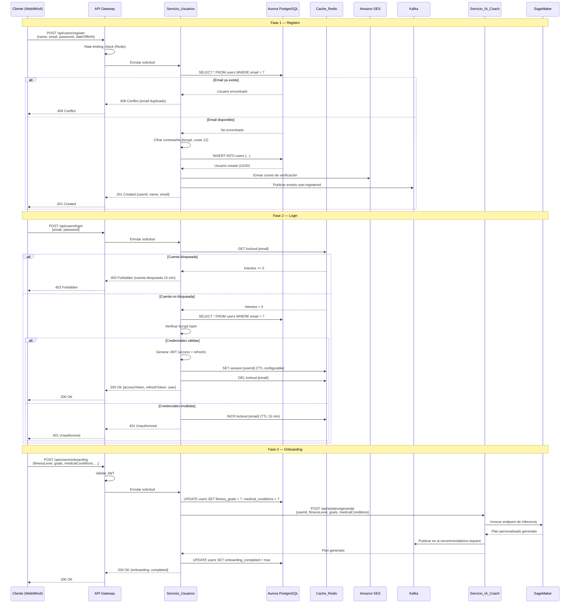

# Flujo de Registro de Usuario

## Descripción

Diagrama de secuencia que muestra el flujo completo de registro de un nuevo usuario,
incluyendo validación, creación de cuenta, envío de correo de verificación y flujo de onboarding.

## Diagrama de Secuencia

## Servicios Involucrados

| Servicio | Rol |
|---|---|
| API Gateway | Rate limiting, enrutamiento, validación JWT |
| Servicio_Usuarios | Registro, autenticación, gestión de perfil |
| Aurora PostgreSQL | Persistencia de datos de usuario |
| Cache_Redis | Sesiones JWT, bloqueo de cuentas |
| Amazon SES | Envío de correo de verificación |
| Kafka | Eventos de usuario (user.registered) |
| Servicio_IA_Coach | Generación del primer plan personalizado |
| SageMaker | Inferencia ML para plan de entrenamiento |

## Notas

- Las contraseñas se cifran con bcrypt (factor de coste 12) antes de almacenarse.
- Después de 5 intentos fallidos de login, la cuenta se bloquea 15 minutos.
- El onboarding es opcional; el usuario puede omitir pasos sin afectar la generación del plan inicial.
- El correo de verificación debe enviarse en máximo 5 segundos tras el registro.
