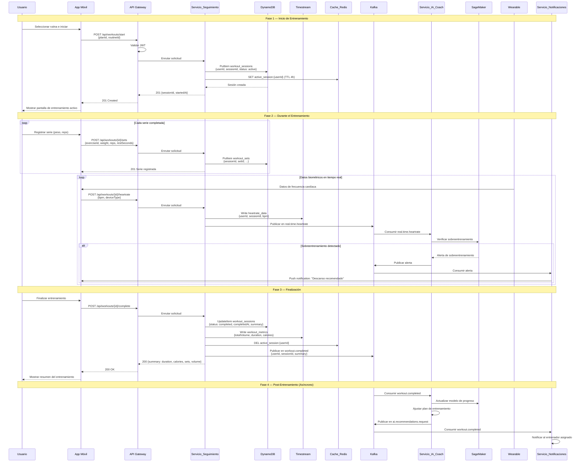

# Flujo de Entrenamiento

## Descripción

Diagrama de secuencia que muestra el flujo completo de una sesión de entrenamiento,
desde el inicio hasta la finalización, incluyendo registro de series, datos biométricos
de wearables y análisis post-entrenamiento por IA.

## Diagrama de Secuencia

## Servicios Involucrados

| Servicio | Rol |
|---|---|
| API Gateway | Validación JWT, enrutamiento |
| Servicio_Seguimiento | Gestión de sesiones, registro de series y biométricos |
| DynamoDB | Almacenamiento de sesiones y series (alta velocidad) |
| Timestream | Almacenamiento de series temporales (frecuencia cardíaca, métricas) |
| Cache_Redis | Sesiones activas en caché |
| Kafka | Eventos: real.time.heartrate, workout.completed |
| Servicio_IA_Coach | Detección de sobreentrenamiento, actualización de modelo |
| SageMaker | Inferencia ML para sobreentrenamiento |
| Servicio_Notificaciones | Alertas push al usuario y entrenador |

## Tópicos Kafka

| Tópico | Productor | Consumidores |
|---|---|---|
| real.time.heartrate | Servicio_Seguimiento | Servicio_IA_Coach |
| workout.completed | Servicio_Seguimiento | Servicio_IA_Coach, Servicio_Social, Servicio_Analiticas |
| ai.recommendations.request | Servicio_IA_Coach | Servicio_Analiticas |

## Notas

- La sesión activa se almacena en Redis con TTL de 4 horas como protección contra sesiones huérfanas.
- Los datos biométricos se publican en Kafka con latencia máxima de 2 segundos.
- Si la conexión con el wearable se interrumpe, la app almacena datos localmente y sincroniza al reconectar.
- El resumen post-entrenamiento incluye: duración, calorías, series totales y volumen total.
