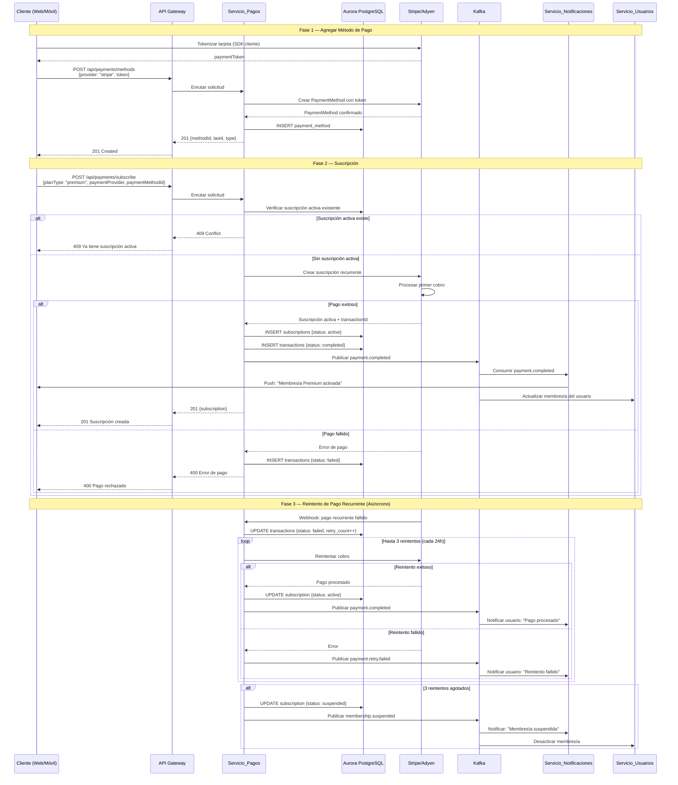
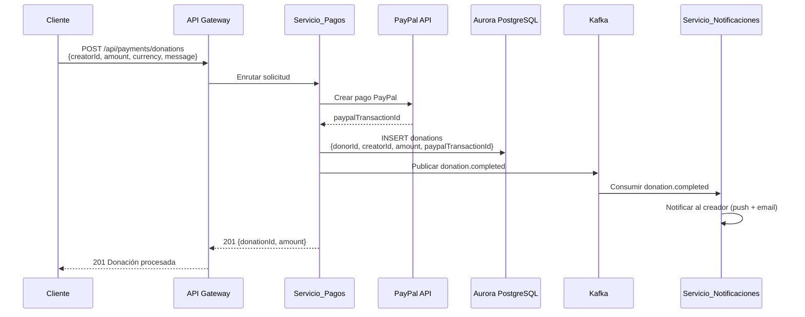

# Flujo de Pago y Suscripción

## Descripción

Diagrama de secuencia que muestra el flujo completo de suscripción a un plan,
procesamiento de pago, manejo de fallos con reintentos y flujo de donaciones vía PayPal.

## Diagrama de Secuencia — Suscripción

## Diagrama de Secuencia — Donación (PayPal)

## Servicios Involucrados

| Servicio | Rol |
|---|---|
| API Gateway | Validación JWT, enrutamiento |
| Servicio_Pagos | Procesamiento de pagos, suscripciones, reembolsos, donaciones |
| Aurora PostgreSQL | Persistencia de transacciones, suscripciones, donaciones |
| Stripe/Adyen | Pasarelas de pago para suscripciones |
| PayPal | Procesamiento de donaciones |
| Kafka | Eventos de pago |
| Servicio_Notificaciones | Notificaciones de estado de pago |
| Servicio_Usuarios | Actualización de estado de membresía |

## Notas

- Los tokens de tarjeta se generan en el cliente (SDK de Stripe/Adyen) para cumplir PCI DSS.
- Los reintentos de pago se ejecutan hasta 3 veces con intervalos de 24 horas.
- Tras 3 reintentos fallidos, la membresía se suspende automáticamente.
- Las donaciones se procesan exclusivamente vía PayPal.
- Todas las transacciones se registran en la tabla de auditoría.
