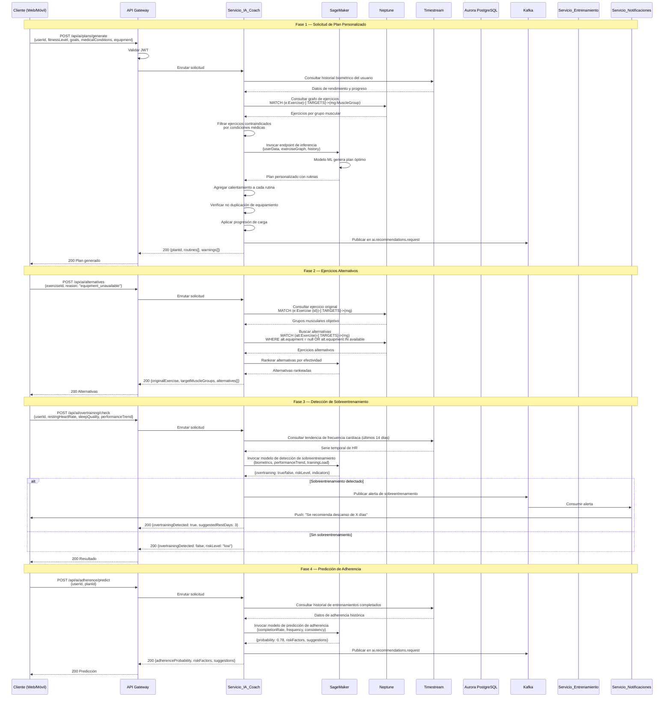

# Flujo de Recomendación IA

## Descripción

Diagrama de secuencia que muestra el flujo de generación de recomendaciones personalizadas
por el Servicio_IA_Coach, incluyendo generación de planes, ejercicios alternativos,
detección de sobreentrenamiento y predicción de adherencia.

## Diagrama de Secuencia — Generación de Plan Personalizado

## Servicios Involucrados

| Servicio | Rol |
|---|---|
| API Gateway | Validación JWT, enrutamiento |
| Servicio_IA_Coach | Orquestación de recomendaciones, filtrado por condiciones médicas |
| SageMaker | Endpoints de inferencia ML (plan, sobreentrenamiento, adherencia) |
| Neptune | Grafo de ejercicios, grupos musculares, alternativas |
| Timestream | Datos biométricos históricos, métricas de rendimiento |
| Kafka | Eventos: ai.recommendations.request |
| Servicio_Notificaciones | Alertas de sobreentrenamiento |

## Modelos ML en SageMaker

| Modelo | Función | SLA |
|---|---|---|
| Plan Generator | Genera planes personalizados | < 5s |
| Exercise Recommender | Recomienda ejercicios basado en grafo | < 500ms |
| Overtraining Detector | Detecta patrones de sobreentrenamiento | < 500ms |
| Adherence Predictor | Predice probabilidad de completar plan (>85% precisión) | < 500ms |

## Reglas de Negocio

1. Los ejercicios contraindicados por condiciones médicas se filtran antes de la inferencia ML.
2. Cada rutina generada incluye calentamiento apropiado al tipo de ejercicio.
3. Las alternativas sugeridas deben trabajar los mismos grupos musculares que el ejercicio original.
4. Si el usuario no tiene acceso a equipamiento, todos los ejercicios deben ser sin equipamiento.
5. La progresión de carga se basa en el historial de rendimiento del usuario.
6. Todas las recomendaciones se publican en Kafka para retroalimentar los modelos.
